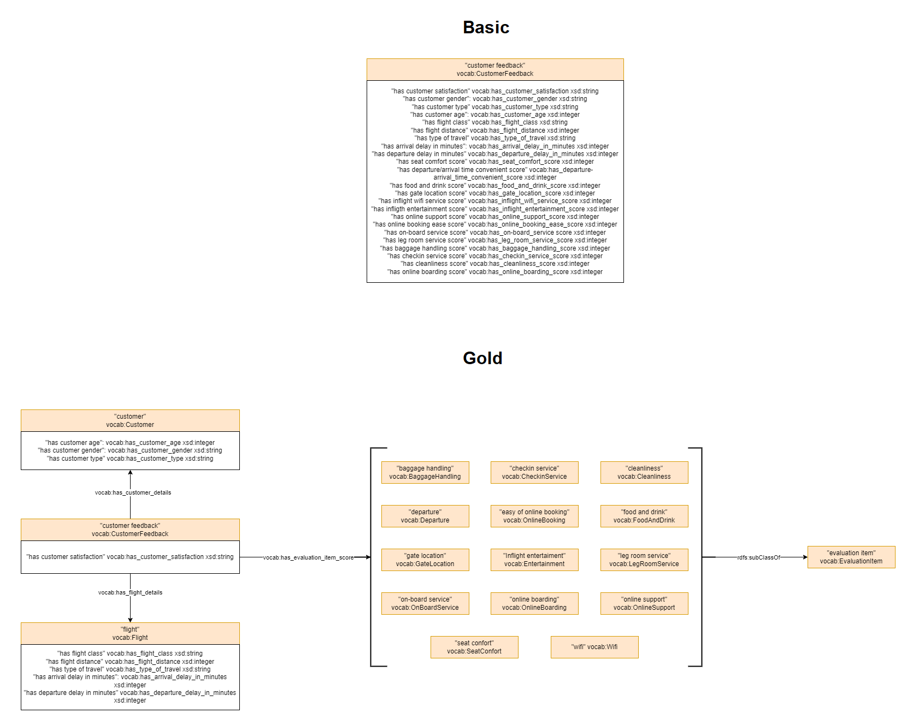
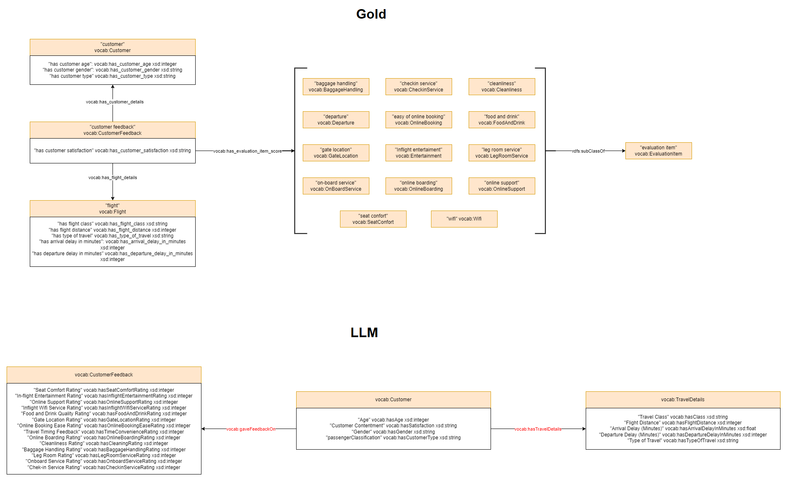

# AirlinesCustomerSatisfaction Data

* URL: <https://www.kaggle.com/datasets/sjleshrac/airlines-customer-satisfaction>
* Format: CSV
* Description: "The dataset consists of the details of customers who have already flown with them. The feedback of the customers on various context and their flight data has been consolidated".

## Ontologies

* [Basic](./Ontologies/Basic_AirlinesCustomerSatisfaction.owl)
* [LLM](./Ontologies/LLM_AirlinesCustomerSatisfaction.owl)
* [Gold](./Ontologies/Gold_AirlinesCustomerSatisfaction.owl)
* AP - Not applicable. Reference ontologies do not cover the dataset properly. 

## Mapping

|Mapping |Dataset| RDF | attr_triples | rel_triples |
|:-:|:-:|:-:|:-:|:-:|
|[Basic](./Mappings/basic_mapping.csv.ttl)|[AirlinesCustomerSatisfaction_data20k.csv](./SourceFiles/AirlinesCustomerSatisfaction_data20k.csv)|[479,923 triples](./Mappings/Basic_AirlinesCustomerSatisfaction_data20k.nt)|[459,923 triples](./EntityAlignment/Basic-Basic/Input/attr_triples_1)|[20,000 triples](./EntityAlignment/Basic-Basic/Input/rel_triples_1)|
|[Gold](./Mappings/gold_mapping.csv.ttl)|[AirlinesCustomerSatisfaction_data20k.csv](./SourceFiles/AirlinesCustomerSatisfaction_data20k.csv)|[560,000 triples](./Mappings/Gold_AirlinesCustomerSatisfaction_data20k.nt)|[179,923 triples](./EntityAlignment/Gold-Gold/Input/attr_triples_1)|[380,077 triples](./EntityAlignment/Gold-Gold/Input/rel_triples_1)|
|[LLM](./Mappings/LLM_mapping.csv.ttl)|[AirlinesCustomerSatisfaction_data20k.csv](./SourceFiles/AirlinesCustomerSatisfaction_data20k.csv)|[519,923 triples](./Mappings/LLM_AirlinesCustomerSatisfaction_data20k.nt)|[459,923 triples](./EntityAlignment/LLM-LLM/Input/attr_triples_1)|[60,000 triples](./EntityAlignment/LLM-LLM/Input/rel_triples_1)|

## [Basic - Basic](./EntityAlignment/Basic-Basic/)

### [Input](./EntityAlignment/Basic-Basic/Input/)

|ent_links| [Related Entities](./EntityAlignment/Basic-Basic/Input/ent_links)|[Split 1 Test](./EntityAlignment/Basic-Basic/Input/541_5fold/1/test_links)|
|:-:|:-:|:-:|
|<https://vocab.um.es#CustomerFeedback> - <https://vocab.um.es#CustomerFeedback>| 20,000 (100%)|8,000 (100%)|
| Total related entities |20,000|8,000|

|Split|Training (50%) | Test (40%) | Validation (10%) |
|:-:|:-:|:-:|:-:|
|[1](./EntityAlignment/Basic-Basic/Input/541_5fold/1)|10.000|8.000|2.000|

### [Output](./EntityAlignment/Basic-Basic/Output/)

|Approach|Split|Aligned Ent|H@1 (%)|H@5 (%)|H@10 (%)|MR|MRR [0,1]|Run time (s)|CustomerFeedback (%)|
|:-:|:-:|:-:|:-:|:-:|:-:|:-:|:-:|:-:|:-:|
|AlignE|[1](./EntityAlignment/Basic-Basic/Input/541_5fold/1)|[8,000](./EntityAlignment/Basic-Basic/Output/AlignE/1/nohup_aligne)|0.01|0.04|0.10|4017|0.00|6400|1 (0.01%)|
|AliNet|[1](./EntityAlignment/Basic-Basic/Input/541_5fold/1)|8,000|E|r|r|o|r||
|AttrE|[1](./EntityAlignment/Basic-Basic/Input/541_5fold/1)|[8,000](./EntityAlignment/Basic-Basic/Output/AttrE/1/nohup_attre)|98.76|99.88|99.99|1|0.99|61082|7902 (98.78%)|
|BootEA|[1](./EntityAlignment/Basic-Basic/Input/541_5fold/1)|[8,000](./EntityAlignment/Basic-Basic/Output/BootEA/1/nohup_bootea)|0.01|0.11|0.18|4027|0.00|11286|1 (0.01%)|
|BootEA_RotatE|[1](./EntityAlignment/Basic-Basic/Input/541_5fold/1)|[8,000](./EntityAlignment/Basic-Basic/Output/BootEA_RotatE/1/nohup_bootea_rotate)|0.00|0.01|0.09|3991|0.00|24338|0 (0%)|
|BootEA_TransH|[1](./EntityAlignment/Basic-Basic/Input/541_5fold/1)|8,000|E|r|r|o|r||
|Conve|[1](./EntityAlignment/Basic-Basic/Input/541_5fold/1)|8,000|E|r|r|o|r||
|GCN_Align|[1](./EntityAlignment/Basic-Basic/Input/541_5fold/1)|[8,000](./EntityAlignment/Basic-Basic/Output/GCN_Align/1/nohup_gcnalign)|0.01|0.09|0.13|4003|0.00|1403|1 (0.01%)|
|GMNN|[1](./EntityAlignment/Basic-Basic/Input/541_5fold/1)|8,000|E|r|r|o|r||
|HolE|[1](./EntityAlignment/Basic-Basic/Input/541_5fold/1)|[8,000](./EntityAlignment/Basic-Basic/Output/HolE/1/nohup_hole)|0.00|0.08|0.10|3960|0.00|12907|0 (0%)|
|IMUSE|[1](./EntityAlignment/Basic-Basic/Input/541_5fold/1)|[8,000](./EntityAlignment/Basic-Basic/Output/IMUSE/1/nohup_imuse)|46.84|46.84|46.93|2148|0.47|8790|3747 (46.84%)|
|IPTransE|[1](./EntityAlignment/Basic-Basic/Input/541_5fold/1)|8,000|E|r|r|o|r||
|JAPE|[1](./EntityAlignment/Basic-Basic/Input/541_5fold/1)|[8,000](./EntityAlignment/Basic-Basic/Output/JAPE/1/nohup_jape)|0.01|0.04|0.11|4015|0.00|25395|1 (0.01%)|
|KDCoE|[1](./EntityAlignment/Basic-Basic/Input/541_5fold/1)|8,000|E|r|r|o|r||
|MTransE|[1](./EntityAlignment/Basic-Basic/Input/541_5fold/1)|[8,000](./EntityAlignment/Basic-Basic/Output/MTransE/1/nohup_mtranse)|0.03|0.04|0.16|3969|0.00|865|2 (0.03%)|
|MultiKE|[1](./EntityAlignment/Basic-Basic/Input/541_5fold/1)|8,000|E|r|r|o|r||
|ProjE|[1](./EntityAlignment/Basic-Basic/Input/541_5fold/1)|[8,000](./EntityAlignment/Basic-Basic/Output/ProjE/1/nohup_proje)|0.05|0.11|0.15|3982|0.00|6141|4 (0.05%)|
|RDGCN|[1](./EntityAlignment/Basic-Basic/Input/541_5fold/1)|[8,000](./EntityAlignment/Basic-Basic/Output/RDGCN/1/nohup_rdgcn)|0.01|0.06|0.13|4001|0.00|7874|1 (0.01%)|
|RotatE|[1](./EntityAlignment/Basic-Basic/Input/541_5fold/1)|[8,000](./EntityAlignment/Basic-Basic/Output/RotatE/1/nohup_rotate)|0.01|0.05|0.14|3997|0.00|10530|1 (0.01%)|
|RSN4EA|[1](./EntityAlignment/Basic-Basic/Input/541_5fold/1)|8,000|E|r|r|o|r||
|SEA|[1](./EntityAlignment/Basic-Basic/Input/541_5fold/1)|[8,000](./EntityAlignment/Basic-Basic/Output/SEA/1/nohup_sea)|0.03|0.08|0.14|3959|0.00|709|2 (0.03%)|
|SimplE|[1](./EntityAlignment/Basic-Basic/Input/541_5fold/1)|[8,000](./EntityAlignment/Basic-Basic/Output/SimplE/1/nohup_simple)|0.03|0.08|0.14|3959|0.00|709|1 (0.01%)|
|TransD|[1](./EntityAlignment/Basic-Basic/Input/541_5fold/1)|[8,000](./EntityAlignment/Basic-Basic/Output/TransD/1/nohup_transd)|0.03|0.08|0.10|4047|0.00|1185|2 (0.03%)|
|TransH|[1](./EntityAlignment/Basic-Basic/Input/541_5fold/1)|[8,000](./EntityAlignment/Basic-Basic/Output/TransH/1/nohup_transh)|0.00|0.06|0.18|3978|0.00|893|0 (0%)|
|TransR|[1](./EntityAlignment/Basic-Basic/Input/541_5fold/1)|[8,000](./EntityAlignment/Basic-Basic/Output/TransR/1/nohup_transr)|0.04|0.09|0.14|3997|0.00|5543|3 (0.04%)|

## [Basic - Gold](./EntityAlignment/Basic-Gold/)

### [Input](./EntityAlignment/Basic-Gold/Input/)

|ent_links| [Related Entities](./EntityAlignment/Basic-Gold/Input/ent_links)|[Split 1 Test](./EntityAlignment/Basic-Gold/Input/541_5fold/1/test_links)|
|:-:|:-:|:-:|
|<https://vocab.um.es#CustomerFeedback> - <https://vocab.um.es#CustomerFeedback>| 20,000 (100%)|8,000 (100%)|
| Total related entities |20,000|8,000|

|Split|Training (50%) | Test (40%) | Validation (10%) |
|:-:|:-:|:-:|:-:|
|[1](./EntityAlignment/Basic-Gold/Input/541_5fold/1)|10,000|8,000|2,000|

### [Output](./EntityAlignment/Basic-Gold/Output/)

|Approach|Split|Aligned Ent|H@1 (%)|H@5 (%)|H@10 (%)|MR|MRR [0,1]|Run time (s)|CustomerFeedback (%)|
|:-:|:-:|:-:|:-:|:-:|:-:|:-:|:-:|:-:|:-:|
|AlignE|[1](./EntityAlignment/Basic-Gold/Input/541_5fold/1)|[8,000](./EntityAlignment/Basic-Gold/Output/AlignE/1/nohup_aligne)|0.00|0.01|0.09|4009|0.00|34700|0 (0%)|
|AliNet|[1](./EntityAlignment/Basic-Gold/Input/541_5fold/1)|8,000|E|r|r|o|r||
|AttrE|[1](./EntityAlignment/Basic-Gold/Input/541_5fold/1)|[8,000](./EntityAlignment/Basic-Gold/Output/AttrE/1/nohup_attre)|18.83|40.14|51.15|74|0.29|44010|1506 (18.83%)|
|BootEA|[1](./EntityAlignment/Basic-Gold/Input/541_5fold/1)|[8,000](./EntityAlignment/Basic-Gold/Output/BootEA/1/nohup_bootea)|0.01|0.11|0.18|3976|0.00|38344|1 (0.01%)|
|BootEA_RotatE|[1](./EntityAlignment/Basic-Gold/Input/541_5fold/1)|[8,000](./EntityAlignment/Basic-Gold/Output/BootEA_RotatE/1/nohup_bootea_rotate)|0.01|0.06|0.09|4004|0.00|163086|1 (0.01%)|
|BootEA_TransH|[1](./EntityAlignment/Gold-Gold/Input/541_5fold/1)|E|r|r|o|r||
|Conve|[1](./EntityAlignment/Basic-Gold/Input/541_5fold/1)|8,000|E|r|r|o|r||
|GCN_Align|[1](./EntityAlignment/Basic-Gold/Input/541_5fold/1)|[8,000](./EntityAlignment/Basic-Gold/Output/GCN_Align/1/nohup_gcnalign)|0.01|0.08|0.16|4015|0.00|2866|1 (0.01%)|
|GMNN|[1](./EntityAlignment/Basic-Gold/Input/541_5fold/1)|8,000|E|r|r|o|r||
|HolE|[1](./EntityAlignment/Basic-Gold/Input/541_5fold/1)|[8,000](./EntityAlignment/Basic-Gold/Output/HolE/1/nohup_hole)|0.00|0.05|0.13|3974|0.00|80535|0 (0%)|
|IMUSE|[1](./EntityAlignment/Basic-Gold/Input/541_5fold/1)|[8,000](./EntityAlignment/Basic-Gold/Output/IMUSE/1/nohup_imuse)|0.00|0.05|0.11|4019|0.00|10863|0 (0%)|
|IPTransE|[1](./EntityAlignment/Basic-Gold/Input/541_5fold/1)|8,000|E|r|r|o|r||
|JAPE|[1](./EntityAlignment/Basic-Gold/Input/541_5fold/1)|[8,000](./EntityAlignment/Basic-Gold/Output/JAPE/1/nohup_jape)|0.03|0.05|0.10|3979|0.00|19573|2 (0.03%)|
|KDCoE|[1](./EntityAlignment/Basic-Gold/Input/541_5fold/1)|8,000|E|r|r|o|r||
|MTransE|[1](./EntityAlignment/Basic-Gold/Input/541_5fold/1)|[8,000](./EntityAlignment/Basic-Gold/Output/MTransE/1/nohup_mtranse)|0.00|0.03|0.06|4003|0.00|9741|0 (0%)|
|MultiKE|[1](./EntityAlignment/Basic-Gold/Input/541_5fold/1)|8,000|E|r|r|o|r||
|ProjE|[1](./EntityAlignment/Basic-Gold/Input/541_5fold/1)|[8,000](./EntityAlignment/Basic-Gold/Output/ProjE/1/nohup_proje)|0.00|0.04|0.11|4018|0.00|82687|0 (0%)|
|RDGCN|[1](./EntityAlignment/Basic-Gold/Input/541_5fold/1)|[8,000](./EntityAlignment/Basic-Gold/Output/RDGCN/1/nohup_rdgcn)|0.01|0.06|0.13|4001|0.00|11735|1 (0.01%)|
|RotatE|[1](./EntityAlignment/Basic-Gold/Input/541_5fold/1)|[8,000](./EntityAlignment/Basic-Gold/Output/RotatE/1/nohup_rotate)|0.01|0.06|0.10|3990|0.00|58772|1 (0.01%)|
|RSN4EA|[1](./EntityAlignment/Basic-Gold/Input/541_5fold/1)|8,000|E|r|r|o|r||
|SEA|[1](./EntityAlignment/Basic-Gold/Input/541_5fold/1)|[8,000](./EntityAlignment/Basic-Gold/Output/SEA/1/nohup_sea)|0.04|0.10|0.26|4015|0.00|3142|3 (0.04%)|
|SimplE|[1](./EntityAlignment/Basic-Gold/Input/541_5fold/1)|[8,000](./EntityAlignment/Basic-Gold/Output/SimplE/1/nohup_simple)|0.00|0.01|0.15|4004|0.00|2568|0 (0%)|
|TransD|[1](./EntityAlignment/Basic-Gold/Input/541_5fold/1)|[8,000](./EntityAlignment/Basic-Gold/Output/TransD/1/nohup_transd)|0.04|0.09|0.18|4017|0.00|10438|3 (0.04%)|
|TransH|[1](./EntityAlignment/Basic-Gold/Input/541_5fold/1)|[8,000](./EntityAlignment/Basic-Gold/Output/TransH/1/nohup_transh)|0.01|0.09|0.11|4029|0.00|8298|1 (0.01%)|
|TransR|[1](./EntityAlignment/Basic-Gold/Input/541_5fold/1)|[8,000](./EntityAlignment/Basic-Gold/Output/TransR/1/nohup_transr)|0.00|0.05|0.13|3986|0.00|28393|0 (0%)|

## [Basic - LLM](./EntityAlignment/Basic-LLM/)

### [Input](./EntityAlignment/Basic-LLM/Input/)

|ent_links| [Related Entities](./EntityAlignment/Basic-LLM/Input/ent_links)|[Split 1 Test](./EntityAlignment/Basic-LLM/Input/541_5fold/1/test_links)|
|:-:|:-:|:-:|
|<https://vocab.um.es#CustomerFeedback> - <https://vocab.um.es#CustomerFeedback>| 20,000 (100%)|8,000 (100%)|
| Total related entities |20,000|8,000|

|Split|Training (50%) | Test (40%) | Validation (10%) |
|:-:|:-:|:-:|:-:|
|[1](./EntityAlignment/Basic-LLM/Input/541_5fold/1)|10,000|8,000|2,000|

### [Output](./EntityAlignment/Basic-LLM/Output/)

|Approach|Split|Aligned Ent|H@1 (%)|H@5 (%)|H@10 (%)|MR|MRR [0,1]|Run time (s)|CustomerFeedback (%)|
|:-:|:-:|:-:|:-:|:-:|:-:|:-:|:-:|:-:|:-:|
|AlignE|[1](./EntityAlignment/Basic-LLM/Input/541_5fold/1)|[8,000](./EntityAlignment/Basic-LLM/Output/AlignE/1/nohup_aligne)|0.01|0.10|0.14|4026|0.00|20773|1 (0.01%)|
|AliNet|[1](./EntityAlignment/Basic-LLM/Input/541_5fold/1)|8,000|E|r|r|o|r||
|AttrE|[1](./EntityAlignment/Basic-LLM/Input/541_5fold/1)|[8,000](./EntityAlignment/Basic-LLM/Output/AttrE/1/nohup_attre)|1.69|6.76|11.16|376|0.05|22344|135 (1.69%)|
|BootEA|[1](./EntityAlignment/Basic-LLM/Input/541_5fold/1)|[8,000](./EntityAlignment/Basic-LLM/Output/BootEA/1/nohup_bootea)|0.03|0.08|0.11|3988|0.00|22225|2 (0.03%)|
|BootEA_RotatE|[1](./EntityAlignment/Basic-LLM/Input/541_5fold/1)|[8,000](./EntityAlignment/Basic-LLM/Output/BootEA_RotatE/1/nohup_bootea_rotate)|0.01|0.06|0.3|4019|0.00|14121|1 (0.01%)|
|BootEA_TransH|[1](./EntityAlignment/Gold-LLM/Input/541_5fold/1)|8,000|E|r|r|o|r||
|Conve|[1](./EntityAlignment/Basic-LLM/Input/541_5fold/1)|8,000|E|r|r|o|r||
|GCN_Align|[1](./EntityAlignment/Basic-LLM/Input/541_5fold/1)|[8,000](./EntityAlignment/Basic-LLM/Output/GCN_Align/1/nohup_gcnalign)|0.01|0.08|0.11|4005|0.00|1867|1 (0.01%)|
|GMNN|[1](./EntityAlignment/Basic-LLM/Input/541_5fold/1)|8,000|E|r|r|o|r||
|HolE|[1](./EntityAlignment/Basic-LLM/Input/541_5fold/1)|[8,000](./EntityAlignment/Basic-LLM/Output/HolE/1/nohup_hole)|0.01|0.08|0.14|3996|0.00|17693|1 (0.01%)|
|IMUSE|[1](./EntityAlignment/Basic-LLM/Input/541_5fold/1)|[8,000](./EntityAlignment/Basic-LLM/Output/IMUSE/1/nohup_imuse)|0.04|0.04|0.10|4029|0.00|9956|3 (0.04%)|
|IPTransE|[1](./EntityAlignment/Basic-LLM/Input/541_5fold/1)|8,000|E|r|r|o|r||
|JAPE|[1](./EntityAlignment/Basic-LLM/Input/541_5fold/1)|[8,000](./EntityAlignment/Basic-LLM/Output/JAPE/1/nohup_jape)|0.00|0.04|0.11|4002|0.00|22804|0 (0%)|
|KDCoE|[1](./EntityAlignment/Basic-LLM/Input/541_5fold/1)|8,000|E|r|r|o|r||
|MTransE|[1](./EntityAlignment/Basic-LLM/Input/541_5fold/1)|[8,000](./EntityAlignment/Basic-LLM/Output/MTransE/1/nohup_mtranse)|0.01|0.09|0.13|4005|0.00|2308|1 (0.01%)|
|MultiKE|[1](./EntityAlignment/Basic-LLM/Input/541_5fold/1)|8,000|E|r|r|o|r||
|ProjE|[1](./EntityAlignment/Basic-LLM/Input/541_5fold/1)|[8,000](./EntityAlignment/Basic-LLM/Output/ProjE/1/nohup_proje)|0.01|0.05|0.08|3977|0.00|17911|1 (0.01%)|
|RDGCN|[1](./EntityAlignment/Basic-LLM/Input/541_5fold/1)|[8,000](./EntityAlignment/Basic-LLM/Output/RDGCN/1/nohup_rdgcn)|0.01|0.06|0.13|4001|0.00|11643|1 (0.01%)|
|RotatE|[1](./EntityAlignment/Basic-LLM/Input/541_5fold/1)|[8,000](./EntityAlignment/Basic-LLM/Output/RotatE/1/nohup_rotate)|0.03|0.06|0.16|3994|0.00|17107|2 (0.03%)|
|RSN4EA|[1](./EntityAlignment/Basic-LLM/Input/541_5fold/1)|8,000|E|r|r|o|r||
|SEA|[1](./EntityAlignment/Basic-LLM/Input/541_5fold/1)|[8,000](./EntityAlignment/Basic-LLM/Output/SEA/1/nohup_sea)|0.01|0.08|0.14|4009|0.00|1478|1 (0.01%)|
|SimplE|[1](./EntityAlignment/Basic-LLM/Input/541_5fold/1)|[8,000](./EntityAlignment/Basic-LLM/Output/SimplE/1/nohup_simple)|0.01|0.08|0.14|3995|0.00|1467|1 (0.01%)|
|TransD|[1](./EntityAlignment/Basic-LLM/Input/541_5fold/1)|[8,000](./EntityAlignment/Basic-LLM/Output/TransD/1/nohup_transd)|0.00|0.05|0.10|4046|0.00|2875|0 (0%)|
|TransH|[1](./EntityAlignment/Basic-LLM/Input/541_5fold/1)|[8,000](./EntityAlignment/Basic-LLM/Output/TransH/1/nohup_transh)|0.00|0.05|0.13|4010|0.00|2392|0 (0%)|
|TransR|[1](./EntityAlignment/Basic-LLM/Input/541_5fold/1)|[8,000](./EntityAlignment/Basic-LLM/Output/TransR/1/nohup_transr)|0.00|0.05|0.06|4018|0.00|10318|0 (0%)|

## [Gold - Gold](./EntityAlignment/Gold-Gold/)

### [Input](./EntityAlignment/Gold-Gold/Input/)

|ent_links| [Related Entities](./EntityAlignment/Gold-Gold/Input/ent_links)|[Split 1 Test](./EntityAlignment/Gold-Gold/Input/541_5fold/1/test_links)|
|:-:|:-:|:-:|
|<https://vocab.um.es#CustomerFeedback> - <https://vocab.um.es#CustomerFeedback>| 20,000 (33.29%)|7,970 (33.17%)|
|<https://vocab.um.es#Flight> - <https://vocab.um.es#Flight>| 20,000 (33.29%)|8,142 (33.88%)|
|<https://vocab.um.es#Customer> - <https://vocab.um.es#Customer>| 20,000 (33.29%)|7,888 (32.82%)|
|<https://vocab.um.es#BaggageHandling> - <https://vocab.um.es#BaggageHandling>| 5 (0.01%)| 2 (0.01%)|
|<https://vocab.um.es#CheckinService> - <https://vocab.um.es#CheckinService>| 5 (0.01%)|0 (0.00%)|
|<https://vocab.um.es#Cleanliness> - <https://vocab.um.es#Cleanliness>| 5 (0.01%)|2 (0.01%)|
|<https://vocab.um.es#Departure> - <https://vocab.um.es#Departure>| 6 (0.01%)|3 (0.01%)|
|<https://vocab.um.es#OnlineBooking> - <https://vocab.um.es#OnlineBooking>| 5 (0.01%)|1 (0.00%)|
|<https://vocab.um.es#FoodAndDrink> - <https://vocab.um.es#FoodAndDrink>| 6 (0.01%)|2 (0.01%)|
|<https://vocab.um.es#GateLocation> - <https://vocab.um.es#GateLocation>| 6 (0.01%)|3 (0.01%)|
|<https://vocab.um.es#Entertainment> - <https://vocab.um.es#Entertainment>| 6 (0.01%)|2 (0.01%)|
|<https://vocab.um.es#LegRoomService> - <https://vocab.um.es#LegRoomService>| 6 (0.01%)|4 (0.02%)|
|<https://vocab.um.es#OnBoardService> - <https://vocab.um.es#OnBoardService>| 5 (0.01%)|2 (0.01%)|
|<https://vocab.um.es#OnlineBoarding> - <https://vocab.um.es#OnlineBoarding>| 5 (0.01%)|2 (0.01%)|
|<https://vocab.um.es#OnlineSupport> - <https://vocab.um.es#OnlineSupport>| 5 (0.01%)|2 (0.01%)|
|<https://vocab.um.es#SeatConfort> - <https://vocab.um.es#SeatConfort>| 6 (0.01%)|2 (0.01%)|
|<https://vocab.um.es#Wifi> - <https://vocab.um.es#Wifi>| 6 (0.01%)|4 (0.02%)|
| Total related entities |60,077|24,031|

|Split|Training (50%) | Test (40%) | Validation (10%) |
|:-:|:-:|:-:|:-:|
|[1](./EntityAlignment/Gold-Gold/Input/541_5fold/1)|30,038|24,031|6,008|

### [Output](./EntityAlignment/Gold-Gold/Output/)

|Approach|Split|Aligned Ent|H@1 (%)|H@5 (%)|H@10 (%)|MR|MRR [0,1]|Run time (s)|CustomerFeedback (%)|Flight (%)|Customer (%)|
|:-:|:-:|:-:|:-:|:-:|:-:|:-:|:-:|:-:|:-:|
|AlignE|[1](./EntityAlignment/Gold-Gold/Input/541_5fold/1)|[24,031](./EntityAlignment/Gold-Gold/Output/AlignE/1/nohup_aligne)|90.65|95.86|97.34|3|0.93|279625|7857 (98.58%)|7060 (86.71%)|6837 (86.68%)|
|AliNet|[1](./EntityAlignment/Gold-Gold/Input/541_5fold/1)|[24,031](./EntityAlignment/Gold-Gold/Output/AliNet/1/nohup_alinet)|68.34|75.56|75.57|2184|0.72|117293|5996 (75.23%)|5320 (65.34%)|5076 (64.35%)|
|AttrE|[1](./EntityAlignment/Gold-Gold/Input/541_5fold/1)|[24,031](./EntityAlignment/Gold-Gold/Output/AttrE/1/nohup_attre)|99.61|99.98|100|1|1|167718|7960 (99.87%)|8109 (99.59%)|7836 (99.34%)|
|BootEA|[1](./EntityAlignment/Gold-Gold/Input/541_5fold/1)|[24,031](./EntityAlignment/Gold-Gold/Output/BootEA/1/nohup_bootea)|97.62|99.33|99.56|1|0.98|282035|7836 (98.32%)|7920 (97.27%)|7672 (97.26%)|
|BootEA_RotatE|[1](./EntityAlignment/Gold-Gold/Input/541_5fold/1)|[24,031](./EntityAlignment/Gold-Gold/Output/BootEA_RotatE/1/nohup_bootea_rotate)|96.65|100|100|1|0.98|283824|7682 (96.39%)|7862 (96.56%)|7651 (97.00%)|
|BootEA_TransH|[1](./EntityAlignment/Gold-Gold/Input/541_5fold/1)|24,031|E|r|r|o|r||
|Conve|[1](./EntityAlignment/Gold-Gold/Input/541_5fold/1)|24,031|E|r|r|o|r||
|GCN_Align|[1](./EntityAlignment/Gold-Gold/Input/541_5fold/1)|[24,031](./EntityAlignment/Gold-Gold/Output/GCN_Align/1/nohup_gcnalign)|75.64|75.85|76.07|175|0.76|6345|6008 (75.38%)|6188 (76.00%)|5950 (75.43%)|
|GMNN|[1](./EntityAlignment/Gold-Gold/Input/541_5fold/1)|24,031|E|r|r|o|r||
|HolE|[1](./EntityAlignment/Gold-Gold/Input/541_5fold/1)|[24,031](./EntityAlignment/Gold-Gold/Output/HolE/1/nohup_hole)|57.35|63.39|65.72|753|0.60|385797|5621 (70.53%)|4000 (49.13%)|4129 (52.35%)|
|IMUSE|[1](./EntityAlignment/Gold-Gold/Input/541_5fold/1)|[24,031](./EntityAlignment/Gold-Gold/Output/IMUSE/1/nohup_imuse)|84.50|93.05|94.21|37.17|0.89|80452|7733 (97.03%)|5496 (67.50%)|7047 (89.34%)|
|IPTransE|[1](./EntityAlignment/Gold-Gold/Input/541_5fold/1)|24,031|E|r|r|o|r||
|JAPE|[1](./EntityAlignment/Gold-Gold/Input/541_5fold/1)|[24,031](./EntityAlignment/Gold-Gold/Output/JAPE/1/nohup_jape)|2.75|3.87|4.57|32300|0.03|26920|540 (6.78%)|60 (0.74%)|60 (0.76%)|
|KDCoE|[1](./EntityAlignment/Gold-Gold/Input/541_5fold/1)|24,031|E|r|r|o|r||
|MTransE|[1](./EntityAlignment/Gold-Gold/Input/541_5fold/1)|[24,031](./EntityAlignment/Gold-Gold/Output/MTransE/1/nohup_mtranse)|11.66|13.67|14.70|2879|0.13|36362|2788 (34.98%)|7 (0.09%)|7 (0.09%)|
|MultiKE|[1](./EntityAlignment/Gold-Gold/Input/541_5fold/1)|24,031|E|r|r|o|r||
|ProjE|[1](./EntityAlignment/Gold-Gold/Input/541_5fold/1)|[24,031](./EntityAlignment/Gold-Gold/Output/ProjE/1/nohup_proje)|32.13|33.10|33.29|2654|0.33|235084|7704 (96.66%)|2 (0.02%)|1 (0.01%)|
|RDGCN|[1](./EntityAlignment/Gold-Gold/Input/541_5fold/1)|[24,031](./EntityAlignment/Gold-Gold/Output/RDGCN/1/nohup_rdgcn)|0.00|0.02|0.04|12016|0.00|38398|0 (0%)|1 (0.01%)|0 (0%)|
|RotatE|[1](./EntityAlignment/Gold-Gold/Input/541_5fold/1)|24,031|E|r|r|o|r||
|RSN4EA|[1](./EntityAlignment/Gold-Gold/Input/541_5fold/1)|24,031|E|r|r|o|r||
|SEA|[1](./EntityAlignment/Gold-Gold/Input/541_5fold/1)|[24,031](./EntityAlignment/Gold-Gold/Output/SEA/1/nohup_sea)|97.37|99.85|99.98|1|0.98|136451|7773 (97.53%)|7921 (97.29%)|7674 (97.29%)|
|SimplE|[1](./EntityAlignment/Gold-Gold/Input/541_5fold/1)|[24,031](./EntityAlignment/Gold-Gold/Output/SimplE/1/nohup_simple)|0.47|1.20|1.73|3419|0.01|21271|110 (1.38%)|0 (0%)|0 (0%)|
|TransD|[1](./EntityAlignment/Gold-Gold/Input/541_5fold/1)|[24,031](./EntityAlignment/Gold-Gold/Output/TransD/1/nohup_transd)|78.66|82.66|83.93|119|0.81|228186|6931 (86.96%)|6084 (74.72%)|5857 (74.25%)|
|TransH|[1](./EntityAlignment/Gold-Gold/Input/541_5fold/1)|[24,031](./EntityAlignment/Gold-Gold/Output/TransH/1/nohup_transh)|79.91|83.73|85.58|39|0.82|182091|6895 (86.51%)|6263 (76.92%)|6015 (76.26%)|
|TransR|[1](./EntityAlignment/Gold-Gold/Input/541_5fold/1)|[24,031](./EntityAlignment/Gold-Gold/Output/TransR/1/nohup_transr)|0.02|0.13|0.24|7794|0.00|56775|3 (0.04%)|0 (0%)|1 (0.01%)|

## [Gold - LLM](./EntityAlignment/Gold-LLM/)

### [Input](./EntityAlignment/Gold-LLM/Input/)

|ent_links| [Related Entities](./EntityAlignment/Gold-LLM/Input/ent_links)|[Split 1 Test](./EntityAlignment/Gold-LLM/Input/541_5fold/1/test_links)|
|:-:|:-:|:-:|
|<https://vocab.um.es#CustomerFeedback> - <https://vocab.um.es#CustomerFeedback>| 20,000 (33.33%)|7,976 (33.24%)|
|<https://vocab.um.es#Flight> - <https://vocab.um.es#TravelDetails>| 20,000 (33.33%)|8,047 (33.33%)|
|<https://vocab.um.es#Customer> - <https://vocab.um.es#Customer>| 20,000 (33.33%)|7,977 (33.53%)|
| Total related entities |60,000|24,000|

|Split|Training (50%) | Test (40%) | Validation (10%) |
|:-:|:-:|:-:|:-:|
|[1](./EntityAlignment/Gold-LLM/Input/541_5fold/1)|30,000|24,000|6,000|

### [Output](./EntityAlignment/Gold-LLM/Output/)

|Approach|Split|Aligned Ent|H@1 (%)|H@5 (%)|H@10 (%)|MR|MRR [0,1]|Run time (s)|CustomerFeedback (%)|Flight (%)|Customer (%)|
|:-:|:-:|:-:|:-:|:-:|:-:|:-:|:-:|:-:|:-:|
|AlignE|[1](./EntityAlignment/Gold-LLM/Input/541_5fold/1)|[24,000](./EntityAlignment/Gold-LLM/Output/AlignE/1/nohup_aligne)|0.01|0.06|0.10|3991|0.00|19918|0 (0%)|1 (0.01%)|1 (0.01%)|
|AliNet|[1](./EntityAlignment/Gold-LLM/Input/541_5fold/1)|24,000|E|r|r|o|r||
|AttrE|[1](./EntityAlignment/Gold-LLM/Input/541_5fold/1)|[24,000](./EntityAlignment/Gold-LLM/Output/AttrE/1/nohup_attre)|9.73|20.11|26.45|182|0.16|41273|152 (1.91%)|2069 (25.71%)|115 (1.44%)|
|BootEA|[1](./EntityAlignment/Gold-LLM/Input/541_5fold/1)|[24,000](./EntityAlignment/Gold-LLM/Output/BootEA/1/nohup_bootea)|0.02|0.05|0.11|4017|0.00|28900|3 (0.04%)|0 (0%)|2 (0.03%)|
|BootEA_RotatE|[1](./EntityAlignment/Gold-LLM/Input/541_5fold/1)|[24,000](./EntityAlignment/Gold-LLM/Output/BootEA_RotatE/1/nohup_bootea_rotate)|0.01|0.05|0.09|4015|0.00|96049|2 (0.03%)|1 (0.01%)|0 (0%)|
|BootEA_TransH|[1](./EntityAlignment/Gold-LLM/Input/541_5fold/1)|24,000|E|r|r|o|r||
|Conve|[1](./EntityAlignment/Gold-LLM/Input/541_5fold/1)|24,000|E|r|r|o|r||
|GCN_Align|[1](./EntityAlignment/Gold-LLM/Input/541_5fold/1)|[24,000](./EntityAlignment/Gold-LLM/Output/GCN_Align/1/nohup_gcnalign)|0.00|0.09|0.15|0.58|3992|13413|0 (0%)|1 (0.01%)|0 (0%)|
|GMNN|[1](./EntityAlignment/Gold-LLM/Input/541_5fold/1)|24,000|E|r|r|o|r||
|HolE|[1](./EntityAlignment/Gold-LLM/Input/541_5fold/1)|[24,000](./EntityAlignment/Gold-LLM/Output/HolE/1/nohup_hole)|0.02|0.08|0.12|4613|0.00|34728|0 (0%)|2 (0.02%)|3 (0.04%)|
|IMUSE|[1](./EntityAlignment/Gold-LLM/Input/541_5fold/1)|[24,000](./EntityAlignment/Gold-LLM/Output/IMUSE/1/nohup_imuse)|14.28|14.32|14.36|5356|0.14|12898|3 (0.04%)|3425 (42.56%)|0 (0%)|
|IPTransE|[1](./EntityAlignment/Gold-LLM/Input/541_5fold/1)|24,000|E|r|r|o|r||
|JAPE|[1](./EntityAlignment/Gold-LLM/Input/541_5fold/1)|[24,000](./EntityAlignment/Gold-LLM/Output/JAPE/1/nohup_jape)|0.02|0.05|0.11|3999|0.00|13611|1 (0.01%)|1 (0.01%)|2 (0.03%)|
|KDCoE|[1](./EntityAlignment/Gold-LLM/Input/541_5fold/1)|[24,000](./EntityAlignment/Gold-LLM/Output/KDCoE/1/nohup_kdcoe)|24,000|E|r|r|o|r||
|MTransE|[1](./EntityAlignment/Gold-LLM/Input/541_5fold/1)|[24,000](./EntityAlignment/Gold-LLM/Output/MTransE/1/nohup_mtranse)|0.02|0.05|0.11|4001|0.00|18252|0 (0%)|3 (0.04%)|2 (0.03%)|
|MultiKE|[1](./EntityAlignment/Gold-LLM/Input/541_5fold/1)|[24,000](./EntityAlignment/Gold-LLM/Output/MultiKE/1/nohup_multike)|24,000|E|r|r|o|r||
|ProjE|[1](./EntityAlignment/Gold-LLM/Input/541_5fold/1)|[24,000](./EntityAlignment/Gold-LLM/Output/ProjE/1/nohup_proje)|0.00|0.06|0.11|6002|0.00|44402|0 (0%)|0 (0%)|1 (0.01%)|
|RDGCN|[1](./EntityAlignment/Gold-LLM/Input/541_5fold/1)|[24,000](./EntityAlignment/Gold-LLM/Output/RDGCN/1/nohup_rdgcn)|0.00|0.02|0.04|12001|0.00|29529|0 (0%)|0 (0%)|1 (0.01%)|
|RotatE|[1](./EntityAlignment/Gold-LLM/Input/541_5fold/1)|24,000|E|r|r|o|r||
|RSN4EA|[1](./EntityAlignment/Gold-LLM/Input/541_5fold/1)|24,000|E|r|r|o|r||
|SEA|[1](./EntityAlignment/Gold-LLM/Input/541_5fold/1)|[24,000](./EntityAlignment/Gold-LLM/Output/SEA/1/nohup_sea)|0.02|0.05|0.11|4017|0.00|13163|0 (0%)|3 (0.04%)|1 (0.01%)|
|SimplE|[1](./EntityAlignment/Gold-LLM/Input/541_5fold/1)|[24,000](./EntityAlignment/Gold-LLM/Output/SimplE/1/nohup_simple)|0.02|0.05|0.11|4427|0.00|7486|2 (0.03%)|1 (0.01%)|2 (0.03%)|
|TransD|[1](./EntityAlignment/Gold-LLM/Input/541_5fold/1)|[24,000](./EntityAlignment/Gold-LLM/Output/TransD/1/nohup_transd)|0.01|0.06|0.14|5520|0.00|13416|1 (0.01%)|0 (0%)| 1 (0.01%)|
|TransH|[1](./EntityAlignment/Gold-LLM/Input/541_5fold/1)|[24,000](./EntityAlignment/Gold-LLM/Output/TransH/1/nohup_transh)|0.01|0.05|0.12|3994|0.00|13319|1 (0.01%)|2 (0.02%)|0 (0%)|
|TransR|[1](./EntityAlignment/Gold-LLM/Input/541_5fold/1)|[24,000](./EntityAlignment/Gold-LLM/Output/TransR/1/nohup_transr)|0.01|0.05|0.09|9417|0.00|15624|1 (0.01%)|1 (0.01%)|0 (0%)|

## [LLM - LLM](./EntityAlignment/LLM-LLM/)

### [Input](./EntityAlignment/LLM-LLM/Input/)

|ent_links| [Related Entities](./EntityAlignment/LLM-LLM/Input/ent_links)|[Split 1 Test](./EntityAlignment/LLM-LLM/Input/541_5fold/1/test_links)|
|:-:|:-:|:-:|
|<https://vocab.um.es#CustomerFeedback> - <https://vocab.um.es#CustomerFeedback>| 20,000 (33.33%)|8,023 (33.43%)|
|<https://vocab.um.es#TravelDetails> - <https://vocab.um.es#TravelDetails>| 20,000 (33.33%)|7,882 (32.84%)|
|<https://vocab.um.es#Customer> - <https://vocab.um.es#Customer>| 20,000 (33.33%)|8,095 (33.73%)|
| Total related entities |30,000|24,000|

|Split|Training (50%) | Test (40%) | Validation (10%) |
|:-:|:-:|:-:|:-:|
|[1](./EntityAlignment/LLM-LLM/Input/541_5fold/1)|30,000|24,000|6,000|

### [Output](./EntityAlignment/LLM-LLM/Output/)

|Approach|Split|Aligned Ent|H@1 (%)|H@5 (%)|H@10 (%)|MR|MRR [0,1]|Run time (s)|CustomerFeedback (%)|TravelDetails (%)|Customer (%)|
|:-:|:-:|:-:|:-:|:-:|:-:|:-:|:-:|:-:|:-:|
|AlignE|[1](./EntityAlignment/LLM-LLM/Input/541_5fold/1)|[24,000](./EntityAlignment/LLM-LLM/Output/AlignE/1/nohup_aligne)|0.02|0.05|0.08|3975|0.00|16203|1 (0.01%)|2 (0.03%)|1 (0.01%)|
|AliNet|[1](./EntityAlignment/LLM-LLM/Input/541_5fold/1)|24,000|E|r|r|o|r||
|AttrE|[1](./EntityAlignment/LLM-LLM/Input/541_5fold/1)|[24,000](./EntityAlignment/LLM-LLM/Output/AttrE/1/nohup_attre)|20.35|36.63|45.18|57|0.29|29317|1363 (16.99%)|3288 (41.72%)|234 (2.89%)|
|BootEA|[1](./EntityAlignment/LLM-LLM/Input/541_5fold/1)|[24,000](./EntityAlignment/LLM-LLM/Output/BootEA/1/nohup_bootea)|0.00|0.08|0.14|4018|0.00|17783|1 (0.01%)|0 (0%)|0 (0%)|
|BootEA_RotatE|[1](./EntityAlignment/LLM-LLM/Input/541_5fold/1)|[24,000](./EntityAlignment/LLM-LLM/Output/BootEA_RotatE/1/nohup_bootea_rotate)|0.01|0.05|0.10|4005|0.00|23854|2 (0.02%)|1 (0.01%)|0 (0%)|
|BootEA_TransH|[1](./EntityAlignment/LLM-LLM/Input/541_5fold/1)|24,000|E|r|r|o|r||
|Conve|[1](./EntityAlignment/LLM-LLM/Input/541_5fold/1)|24,000|E|r|r|o|r||
|GCN_Align|[1](./EntityAlignment/LLM-LLM/Input/541_5fold/1)|[24,000](./EntityAlignment/LLM-LLM/Output/GCN_Align/1/nohup_gcnalign)|0.03|0.08|0.14|3986|0.00|16717|1 (0.01%)|2 (0.03%)|3 (0.04%)|
|GMNN|[1](./EntityAlignment/LLM-LLM/Input/541_5fold/1)|24,000|E|r|r|o|r||
|HolE|[1](./EntityAlignment/LLM-LLM/Input/541_5fold/1)|[24,000](./EntityAlignment/LLM-LLM/Output/HolE/1/nohup_hole)|0.01|0.08|0.17|3995|0.00|8328|1 (0.01%)|1 (0.01%)|0 (0%)|
|IMUSE|[1](./EntityAlignment/LLM-LLM/Input/541_5fold/1)|[24,000](./EntityAlignment/LLM-LLM/Output/IMUSE/1/nohup_imuse)|13.83|13.85|13.90|7275|0.14|12177|294 (3.66%)|3024 (38.37%)|2 (0.03%)|
|IPTransE|[1](./EntityAlignment/LLM-LLM/Input/541_5fold/1)|24,000|E|r|r|o|r||
|JAPE|[1](./EntityAlignment/LLM-LLM/Input/541_5fold/1)|[24,000](./EntityAlignment/LLM-LLM/Output/JAPE/1/nohup_jape)|0.03|0.08|0.16|3996|0.00|27621|3 (0.04%)|0 (0%)|3 (0.04%)|
|KDCoE|[1](./EntityAlignment/LLM-LLM/Input/541_5fold/1)|24,000|E|r|r|o|r||
|MTransE|[1](./EntityAlignment/LLM-LLM/Input/541_5fold/1)|[24,000](./EntityAlignment/LLM-LLM/Output/MTransE/1/nohup_mtranse)|0.01|0.10|0.16|4003|0.00|8497|1 (0.01%)|0 (0%)|2 (0.02%)|
|MultiKE|[1](./EntityAlignment/LLM-LLM/Input/541_5fold/1)|24,000|E|r|r|o|r||
|ProjE|[1](./EntityAlignment/LLM-LLM/Input/541_5fold/1)|[24,000](./EntityAlignment/LLM-LLM/Output/ProjE/1/nohup_proje)|0.01|0.08|0.13|4072|0.00|11160|2 (0.02%)|0 (0%)| 1 (0.01%)|
|RDGCN|[1](./EntityAlignment/LLM-LLM/Input/541_5fold/1)|[24,000](./EntityAlignment/LLM-LLM/Output/RDGCN/1/nohup_rdgcn)|0.00|0.02|0.04|12001|0.00|59055|0 (0%)|0 (0%)|1 (0.01%)|
|RotatE|[1](./EntityAlignment/LLM-LLM/Input/541_5fold/1)|24,000|E|r|r|o|r||
|RSN4EA|[1](./EntityAlignment/LLM-LLM/Input/541_5fold/1)|24,000|E|r|r|o|r||
|SEA|[1](./EntityAlignment/LLM-LLM/Input/541_5fold/1)|[24,000](./EntityAlignment/LLM-LLM/Output/SEA/1/nohup_sea)|0.02|0.05|0.15|3994|0.00|4112|3 (0.04%)|0 (0%)|1 (0.01%)|
|SimplE|[1](./EntityAlignment/LLM-LLM/Input/541_5fold/1)|[24,000](./EntityAlignment/LLM-LLM/Output/SimplE/1/nohup_simple)|0.02|0.05|0.09|4015|0.00|2605|2 (0.02%)|1 (0.01%)|2 (0.02%)|
|TransD|[1](./EntityAlignment/LLM-LLM/Input/541_5fold/1)|[24,000](./EntityAlignment/LLM-LLM/Output/TransD/1/nohup_transd)|0.02|0.08|0.14|4694|0.00|7528|3 (0.04%)|0 (0%)|2 (0.02%)|
|TransH|[1](./EntityAlignment/LLM-LLM/Input/541_5fold/1)|[24,000](./EntityAlignment/LLM-LLM/Output/TransH/1/nohup_transh)|0.00|0.06|0.13|3980|0.00|7217|0 (0%)|1(0.01%)|0 (0%)|
|TransR|[1](./EntityAlignment/LLM-LLM/Input/541_5fold/1)|[24,000](./EntityAlignment/LLM-LLM/Output/TransR/1/nohup_transr)|0.02|0.06|0.12|9159|0.00|14648|2 (0.02%)|2 (0.03%)|0 (0%)|

## Results

## Metrics

|Alignment|Approach|Split|h@1 (%)|h@5 (%)|h@10 (%)|MR|MRR [0,1]|Run Time (s)|
|:------:|:------:|:---:|:-:|:-:|:--:|:-:|:-:|:-:|

