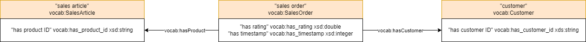
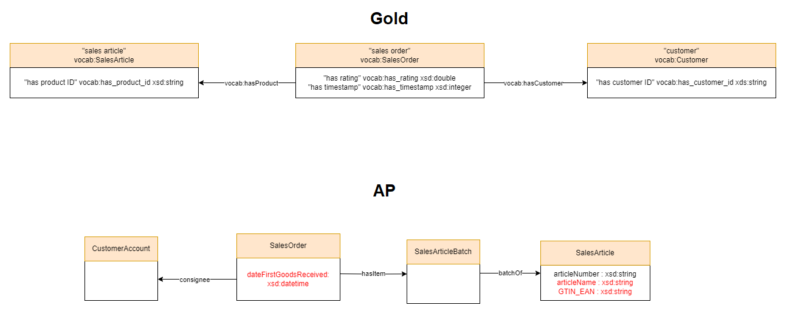

# AmazonRatings Data

* URL: <https://www.kaggle.com/datasets/skillsmuggler/amazon-ratings>
* Format: CSV
* Description: "This is a dataset related to over 2 Million customer reviews and ratings of Beauty related products sold on their website".

## Ontologies

* [Basic](./Ontologies/Basic_AmazonRatings.owl)
* [LLM](./Ontologies/LLM_AmazonRatings.owl)
* [Gold](./Ontologies/Gold_AmazonRatings.owl)
* AP

## Mapping

|Mapping |Dataset| RDF | attr_triples | rel_triples |
|:-:|:-:|:-:|:-:|:-:|
|[Basic](./Mappings/basic_mapping.csv.ttl)|[AmazonRating_data20k.csv](./SourceFiles/AmazonRating_data20k.csv)|[100,000 triples](./Mappings/Basic_AmazonRating_data20k.nt)|[80,000 triples](./EntityAlignment/Basic-Basic/Input/attr_triples_1)|[20,000 triples](./EntityAlignment/Basic-Basic/Input/rel_triples_1)|
|[Gold](./Mappings/gold_mapping.csv.ttl)|[AmazonRating_data20k.csv](./SourceFiles/AmazonRating_data20k.csv)|[140,998 triples](./Mappings/Gold_AmazonRating_data20k.nt)|[60,499 triples](./EntityAlignment/Gold-Gold/Input/attr_triples_1)|[80,499 triples](./EntityAlignment/Gold-Gold/Input/rel_triples_1)|
|[LLM](./Mappings/LLM_mapping.csv.ttl)|[AmazonRating_data20k.csv](./SourceFiles/AmazonRating_data20k.csv)|[140,998 triples](./Mappings/LLM_AmazonRating_data20k.nt)|[60,499 triples](./EntityAlignment/LLM-LLM/Input/attr_triples_1)|[60,000 triples](./EntityAlignment/LLM-LLM/Input/rel_triples_1)|
|[AP](./Mappings/AP_mapping.csv.ttl)|[AmazonRating_data20k.csv](./SourceFiles/AmazonRating_data20k.csv)|[121,897 triples](./Mappings/AP_AmazonRating_data20k.nt)|[1,398 triples](./EntityAlignment/AP-AP/Input/attr_triples_1)|[120,499 triples](./EntityAlignment/AP-AP/Input/rel_triples_1)|

## [Basic - Basic](./EntityAlignment/Basic-Basic/)

### [Input](./EntityAlignment/Basic-Basic/Input/)

|ent_links| [Related Entities](./EntityAlignment/Basic-Basic/Input/ent_links)|[Split 1 Test](./EntityAlignment/Basic-Basic/Input/541_5fold/1/test_links)|
|:-:|:-:|:-:|
|<https://vocab.um.es#SalesOrder> - <https://vocab.um.es#SalesOrder>| 20,000 (100%)|8,000 (100%)|
| Total related entities |20,000|8,000|

|Split|Training (50%) | Test (40%) | Validation (10%) |
|:-:|:-:|:-:|:-:|
|[1](./EntityAlignment/Basic-Basic/Input/541_1fold/1/)|10.000|8.000|2.000|

### [Output](./EntityAlignment/Basic-Basic/Output/)

|Approach|Split|Aligned Ent|H@1 (%)|H@5 (%)|H@10 (%)|MR|MRR [0,1]|Run time (s)|SalesOrder (%)|
|:-:|:-:|:-:|:-:|:-:|:-:|:-:|:-:|:-:|:-:|
|AlignE|[1](./EntityAlignment/Basic-Basic/Input/541_5fold/1/)|[8,000](./EntityAlignment/Basic-Basic/Output/AlignE/nohup_aligne.txt)|0.00|0.01|0.05|4012|0.00|10164|0 (0%)|
|AliNet|[1](./EntityAlignment/Basic-Basic/Input/541_5fold/1/)|8,000|E|r|r|o|r||
|AttrE|[1](./EntityAlignment/Basic-Basic/Input/541_5fold/1/)|[8,000](./EntityAlignment/Basic-Basic/Output/AttrE/nohup_attre.txt)|99.16|100|100|1|1|19520|7933 (99.16%)|
|BootEA|[1](./EntityAlignment/Basic-Basic/Input/541_5fold/1/)|[8,000](./EntityAlignment/Basic-Basic/Output/BootEA/nohup_bootea.txt)|0.00|0.04|0.06|3973|0.00|16328|0 (0%)|
|BootEA_RotatE|[1](./EntityAlignment/Basic-Basic/Input/541_5fold/1/)|[8,000](./EntityAlignment/Basic-Basic/Output/BootEA-RotatE/nohup_bootea_rotate.txt)|0.03|0.08|0.10|3993|0.00|23171|2	(0.03%)|
|BootEA_TransH|[1](./EntityAlignment/Basic-Basic/Input/541_5fold/1/)|8,000|E|r|r|o|r||
|Conve|[1](./EntityAlignment/Basic-Basic/Input/541_5fold/1/)|8,000|E|r|r|o|r||
|GCN_Align|[1](./EntityAlignment/Basic-Basic/Input/541_5fold/1/)|[8,000](./EntityAlignment/Basic-Basic/Output/GCN_Align/nohup_gcnalign.txt)|0.00|0.08|0.13|3985|0.00|2923|0 (0%)|
|GMNN|[1](./EntityAlignment/Basic-Basic/Input/541_5fold/1/)|8,000|E|r|r|o|r||
|HolE|[1](./EntityAlignment/Basic-Basic/Input/541_5fold/1/)|[8,000](./EntityAlignment/Basic-Basic/Output/HolE/nohup_hole.txt)|0.00|0.03|0.09|3992|0.00|12081|0 (0%)|
|IMUSE|[1](./EntityAlignment/Basic-Basic/Input/541_5fold/1/)|[8,000](./EntityAlignment/Basic-Basic/Output/IMUSE/nohup_imuse.txt)|43.65|43.68|43.75|2250|0.44|5615|3492 (43.65%)|
|IPTransE|[1](./EntityAlignment/Basic-Basic/Input/541_5fold/1/)|8,000|E|r|r|o|r||
|JAPE|[1](./EntityAlignment/Basic-Basic/Input/541_5fold/1/)|[8,000](./EntityAlignment/Basic-Basic/Output/JAPE/nohup_jape.txt)|0.01|0.08|0.13|4010|0.00|4407|1 (0.01%)|
|KDCoE|[1](./EntityAlignment/Basic-Basic/Input/541_5fold/1/)|8,000|E|r|r|o|r||
|MTransE|[1](./EntityAlignment/Basic-Basic/Input/541_5fold/1/)|[8,000](./EntityAlignment/Basic-Basic/Output/MTransE/nohup_mtranse.txt)|0.00|0.06|0.10|4023|0.00|1206|0 (0%)|
|MultiKE|[1](./EntityAlignment/Basic-Basic/Input/541_5fold/1/)|8,000|E|r|r|o|r||
|ProjE|[1](./EntityAlignment/Basic-Basic/Input/541_5fold/1/)|[8,000](./EntityAlignment/Basic-Basic/Output/ProjE/nohup_proje.txt)|0.00|0.06|0.13|4010|0.00|6745|0 (0%)|
|RDGCN|[1](./EntityAlignment/Basic-Basic/Input/541_5fold/1/)|[8,000](./EntityAlignment/Basic-Basic/Output/RDGCN/nohup_rdgcn.txt)|0.01|0.06|0.13|4001|0.00|3716|1 (0.01%)|
|RotatE|[1](./EntityAlignment/Basic-Basic/Input/541_5fold/1/)|[8,000](./EntityAlignment/Basic-Basic/Output/RotatE/nohup_rotate.txt)|0.04|0.09|0.11|4006|0.00|10410|3 (0.04%)|
|RSN4EA|[1](./EntityAlignment/Basic-Basic/Input/541_5fold/1/)|8,000|E|r|r|o|r||
|SEA|[1](./EntityAlignment/Basic-Basic/Input/541_5fold/1/)|[8,000](./EntityAlignment/Basic-Basic/Output/SEA/nohup_sea.txt)|0.01|0.08|0.14|4012|0.00|895|1 (0.01%)|
|SimplE|[1](./EntityAlignment/Basic-Basic/Input/541_5fold/1/)|[8,000](./EntityAlignment/Basic-Basic/Output/SimplE/nohup_simple.txt)|0.04|0.10|0.24|3995|0.00|783|3 (0.04%)|
|TransD|[1](./EntityAlignment/Basic-Basic/Input/541_5fold/1/)|[8,000](./EntityAlignment/Basic-Basic/Output/TransD/nohup_transd.txt)|0.00|0.11|0.20|4037|0.00|1841|0 (0%)|
|TransH|[1](./EntityAlignment/Basic-Basic/Input/541_5fold/1/)|[8,000](./EntityAlignment/Basic-Basic/Output/TransH/nohup_transh.txt)|0.01|0.03|0.11|4002|0.00|1928|1 (0.01%)|
|TransR|[1](./EntityAlignment/Basic-Basic/Input/541_5fold/1/)|[8,000](./EntityAlignment/Basic-Basic/Output/TransR/nohup_transr.txt)|0.00|0.04|0.13|4016|0.00|5640|0 (0%)|

## [Basic - Gold](./EntityAlignment/Basic-Gold/)

### [Input](./EntityAlignment/Basic-Gold/Input/)

|ent_links| [Related Entities](./EntityAlignment/Basic-Gold/Input/ent_links)|[Split 1 Test](./EntityAlignment/Basic-Gold/Input/541_5fold/1/test_links)|
|:-:|:-:|:-:|
|<https://vocab.um.es#SalesOrder> - <https://vocab.um.es#SalesOrder>| 20,000 (100%)|8,000 (100%)|
| Total related entities |20,000|8,000|

|Split|Training (50%) | Test (40%) | Validation (10%) |
|:-:|:-:|:-:|:-:|
|[1](./EntityAlignment/Basic-Gold/Input/541_5fold/1/)|10,000|8,000|2,000|

### [Output](./EntityAlignment/Basic-Gold/Output/)

|Approach|Split|Aligned Ent|H@1 (%)|H@5 (%)|H@10 (%)|MR|MRR [0,1]|Run time (s)|SalesOrder (%)|
|:-:|:-:|:-:|:-:|:-:|:-:|:-:|:-:|:-:|:-:|
|AlignE|[1](./EntityAlignment/Basic-Gold/Input/541_5fold/1/)|[8,000](./EntityAlignment/Basic-Gold/Output/AlignE/nohup_aligne.txt)|0.00|0.04|0.09|4016|0.00|19358|0 (0%)|
|AliNet|[1](./EntityAlignment/Basic-Gold/Input/541_5fold/1/)|8,000|E|r|r|o|r||
|AttrE|[1](./EntityAlignment/Basic-Gold/Input/541_5fold/1/)|[8,000](./EntityAlignment/Basic-Gold/Output/AttrE/nohup_attre.txt)|53.40|81.28|88.33|7|0.66|31853|4272 (53.40%)|
|BootEA|[1](./EntityAlignment/Basic-Gold/Input/541_5fold/1/)|[8,000](./EntityAlignment/Basic-Gold/Output/BootEA/nohup_bootea.txt)|0.00|0.05|0.13|3985|0.00|19819|0 (0%)|
|BootEA_RotatE|[1](./EntityAlignment/Basic-Gold/Input/541_5fold/1/)|[8,000](./EntityAlignment/Basic-Gold/Output/BootEA-RotatE/nohup_bootea_rotate.txt)|0.03|0.09|0.13|4034|0.00|63409|2 (0.03%)|
|BootEA_TransH|[1](./EntityAlignment/Basic-Gold/Input/541_5fold/1/)|8,000|E|r|r|o|r||
|Conve|[1](./EntityAlignment/Basic-Gold/Input/541_5fold/1/)|8,000|E|r|r|o|r||
|GCN_Align|[1](./EntityAlignment/Basic-Gold/Input/541_5fold/1/)|[8,000](./EntityAlignment/Basic-Gold/Output/GCN_Align/nohup_gcnalign.txt)|0.01|0.08|0.11|4019|0.00|2978|1 (0.01%)|
|GMNN|[1](./EntityAlignment/Basic-Gold/Input/541_5fold/1/)|8,000|E|r|r|o|r||
|HolE|[1](./EntityAlignment/Basic-Gold/Input/541_5fold/1/)|[8,000](./EntityAlignment/Basic-Gold/Output/HolE/nohup_hole.txt)|0.00|0.04|0.09|4022|0.00|24857|0 (0%)|
|IMUSE|[1](./EntityAlignment/Basic-Gold/Input/541_5fold/1/)|[8,000](./EntityAlignment/Basic-Gold/Output/IMUSE/nohup_imuse.txt)|22.64|24.36|24.94|2943|0.23|6890|1811 (22.64%)|
|IPTransE|[1](./EntityAlignment/Basic-Gold/Input/541_5fold/1/)|8,000|E|r|r|o|r||
|JAPE|[1](./EntityAlignment/Basic-Gold/Input/541_5fold/1/)|[8,000](./EntityAlignment/Basic-Gold/Output/JAPE/nohup_jape.txt)|0.03|0.08|0.13|3996|0.00|5890|2 (0.03%)|
|KDCoE|[1](./EntityAlignment/Basic-Gold/Input/541_5fold/1/)|8,000|E|r|r|o|r||
|MTransE|[1](./EntityAlignment/Basic-Gold/Input/541_5fold/1/)|[8,000](./EntityAlignment/Basic-Gold/Output/MTransE/nohup_mtranse.txt)|0.01|0.08|0.15|4009|0.00|2944|1 (0.01%)|
|MultiKE|[1](./EntityAlignment/Basic-Gold/Input/541_5fold/1/)|8,000|E|r|r|o|r||
|ProjE|[1](./EntityAlignment/Basic-Gold/Input/541_5fold/1/)|[8,000](./EntityAlignment/Basic-Gold/Output/ProjE/nohup_proje.txt)|0.04|0.06|0.14|3998|0.00|19554|3 (0.04%)|
|RDGCN|[1](./EntityAlignment/Basic-Gold/Input/541_5fold/1/)|[8,000](./EntityAlignment/Basic-Gold/Output/RDGCN/nohup_rdgcn.txt)|0.01|0.06|0.13|4001|0.00|5081|1 (0.01%)|
|RotatE|[1](./EntityAlignment/Basic-Gold/Input/541_5fold/1/)|[8,000](./EntityAlignment/Basic-Gold/Output/RotatE/nohup_rotate.txt)|0.01|0.06|0.13|4004|0.00|23202|1 (0.01%)|
|RSN4EA|[1](./EntityAlignment/Basic-Gold/Input/541_5fold/1/)|8,000|E|r|r|o|r||
|SEA|[1](./EntityAlignment/Basic-Gold/Input/541_5fold/1/)|[8,000](./EntityAlignment/Basic-Gold/Output/SEA/nohup_sea.txt)|0.04|0.08|0.13|4018|0.00|2279|3 (0.04%)|
|SimplE|[1](./EntityAlignment/Basic-Gold/Input/541_5fold/1/)|[8,000](./EntityAlignment/Basic-Gold/Output/SimplE/nohup_simple.txt)|0.03|0.01|0.24|4009|0.00|1279|2 (0.03%)|
|TransD|[1](./EntityAlignment/Basic-Gold/Input/541_5fold/1/)|[8,000](./EntityAlignment/Basic-Gold/Output/TransD/nohup_transd.txt)|0.00|0.01|0.08|4019|0.00|3315|0 (0%)|
|TransH|[1](./EntityAlignment/Basic-Gold/Input/541_5fold/1/)|[8,000](./EntityAlignment/Basic-Gold/Output/TransH/nohup_transh.txt)|0.00|0.05|0.09|3943|0.00|3115|0 (0%)|
|TransR|[1](./EntityAlignment/Basic-Gold/Input/541_5fold/1/)|[8,000](./EntityAlignment/Basic-Gold/Output/TransR/nohup_transr.txt)|0.01|0.06|0.14|3979|0.00|13117|1 (0.01%)|

## [Basic - LLM](./EntityAlignment/Basic-LLM/)

### [Input](./EntityAlignment/Basic-LLM/Input/)

|ent_links| [Related Entities](./EntityAlignment/Basic-LLM/Input/ent_links)|[Split 1 Test](./EntityAlignment/Basic-LLM/Input/541_5fold/1/test_links)|
|:-:|:-:|:-:|
|<https://vocab.um.es#SalesOrder> - <https://vocab.um.es#SalesOrder>| 20,000 (100%)|8,000 (100%)|
| Total related entities |20,000|8,000|

|Split|Training (50%) | Test (40%) | Validation (10%) |
|:-:|:-:|:-:|:-:|
|[1](./EntityAlignment/Basic-LLM/Input/541_5fold/1/)|10,000|8,000|2,000|

### [Output](./EntityAlignment/Basic-LLM/Output/)

|Approach|Split|Aligned Ent|H@1 (%)|H@5 (%)|H@10 (%)|MR|MRR [0,1]|Run time (s)|SalesOrder (%)|
|:-:|:-:|:-:|:-:|:-:|:-:|:-:|:-:|:-:|:-:|
|AlignE|[1](./EntityAlignment/Basic-LLM/Input/541_5fold/1/)|[8,000](./EntityAlignment/Basic-LLM/Output/AlignE/nohup_aligne.txt)|0.01|0.04|0.16|3976|0.00|18784|1 (0.01%)|
|AliNet|[1](./EntityAlignment/Basic-LLM/Input/541_5fold/1/)|8,000|E|r|r|o|r||
|AttrE|[1](./EntityAlignment/Basic-LLM/Input/541_5fold/1/)|[8,000](./EntityAlignment/Basic-LLM/Output/AttrE/nohup_attre.txt)|50.09|77.6|85.59|10|0.62|24322|4007 (50.09%)|
|BootEA|[1](./EntityAlignment/Basic-LLM/Input/541_5fold/1/)|[8,000](./EntityAlignment/Basic-LLM/Output/BootEA/nohup_bootea.txt)|0.01|0.06|0.18|3996|0.00|19492|1 (0.01%)|
|BootEA_RotatE|[1](./EntityAlignment/Basic-LLM/Input/541_5fold/1/)|[8,000](./EntityAlignment/Basic-LLM/Output/BootEA-RotatE/nohup_bootea_rotate.txt)|0.01|0.05|0.15|4000|0.00|53927|1 (0.01%)|
|BootEA_TransH|[1](./EntityAlignment/Gold-LLM/Input/541_5fold/1/)|8,000|E|r|r|o|r||
|Conve|[1](./EntityAlignment/Basic-LLM/Input/541_5fold/1/)|8,000|E|r|r|o|r||
|GCN_Align|[1](./EntityAlignment/Basic-LLM/Input/541_5fold/1/)|[8,000](./EntityAlignment/Basic-LLM/Output/GCN_Align/nohup_gcnalign.txt)|0.00|0.08|0.12|3997|0.00|3509|0 (0%)|
|GMNN|[1](./EntityAlignment/Basic-LLM/Input/541_5fold/1/)|8,000|E|r|r|o|r||
|HolE|[1](./EntityAlignment/Basic-LLM/Input/541_5fold/1/)|[8,000](./EntityAlignment/Basic-LLM/Output/HolE/nohup_hole.txt)|0.00|0.04|0.11|3992|0.00|24705|0 (0%)|
|IMUSE|[1](./EntityAlignment/Basic-LLM/Input/541_5fold/1/)|[8,000](./EntityAlignment/Basic-LLM/Output/IMUSE/nohup_imuse.txt)|24.33|25.76|26.23|2923|0.25|6740|1946 (24.33%)|
|IPTransE|[1](./EntityAlignment/Basic-LLM/Input/541_5fold/1/)|8,000|E|r|r|o|r||
|JAPE|[1](./EntityAlignment/Basic-LLM/Input/541_5fold/1/)|[8,000](./EntityAlignment/Basic-LLM/Output/JAPE/nohup_jape.txt)|0.03|0.06|0.12|4013|0.00|6350|2 (0.03%)|
|KDCoE|[1](./EntityAlignment/Basic-LLM/Input/541_5fold/1/)|8,000|E|r|r|o|r||
|MTransE|[1](./EntityAlignment/Basic-LLM/Input/541_5fold/1/)|[8,000](./EntityAlignment/Basic-LLM/Output/MTransE/nohup_mtranse.txt)|0.00|0.05|0.09|4005|0.00|2948|0 (0%)|
|MultiKE|[1](./EntityAlignment/Basic-LLM/Input/541_5fold/1/)|8,000|E|r|r|o|r||
|ProjE|[1](./EntityAlignment/Basic-LLM/Input/541_5fold/1/)|[8,000](./EntityAlignment/Basic-LLM/Output/ProjE/nohup_proje.txt)|0.00|0.06|0.18|3997|0.00|16013|0 (0%)|
|RDGCN|[1](./EntityAlignment/Basic-LLM/Input/541_5fold/1/)|[8,000](./EntityAlignment/Basic-LLM/Output/RDGCN/nohup_rdgcn.txt)|0.01|0.06|0.13|4001|0.00|4882|1 (0.01%)|
|RotatE|[1](./EntityAlignment/Basic-LLM/Input/541_5fold/1/)|[8,000](./EntityAlignment/Basic-LLM/Output/RotatE/nohup_rotate.txt)|0.03|0.08|0.15|4000|0.00|23356|2 (0.03%)|
|RSN4EA|[1](./EntityAlignment/Basic-LLM/Input/541_5fold/1/)|8,000|E|r|r|o|r||
|SEA|[1](./EntityAlignment/Basic-LLM/Input/541_5fold/1/)|[8,000](./EntityAlignment/Basic-LLM/Output/SEA/nohup_sea.txt)|0.03|0.06|0.13|4043|0.00|1540|2 (0.03%)|
|SimplE|[1](./EntityAlignment/Basic-LLM/Input/541_5fold/1/)|[8,000](./EntityAlignment/Basic-LLM/Output/SimplE/nohup_simple.txt)|0.03|0.05|0.15|3998|0.00|1294|2 (0.03%)|
|TransD|[1](./EntityAlignment/Basic-LLM/Input/541_5fold/1/)|[8,000](./EntityAlignment/Basic-LLM/Output/TransD/nohup_transd.txt)|0.01|0.09|0.15|4030|0.00|3330|1 (0.01%)|
|TransH|[1](./EntityAlignment/Basic-LLM/Input/541_5fold/1/)|[8,000](./EntityAlignment/Basic-LLM/Output/TransH/nohup_transh.txt)|0.00|0.06|0.15|4007|0.00|3001|0 (0%)|
|TransR|[1](./EntityAlignment/Basic-LLM/Input/541_5fold/1/)|[8,000](./EntityAlignment/Basic-LLM/Output/TransR/nohup_transr.txt)|0.03|0.08|0.11|4018|0.00|11359|2 (0.03%)|

## [Basic - AP](./EntityAlignment/Basic-AP/)

### [Input](./EntityAlignment/Basic-AP/Input/)

|ent_links| [Related Entities](./EntityAlignment/Basic-AP/Input/ent_links)|[Split 1 Test](./EntityAlignment/Basic-AP/Input/541_5fold/1/test_links)|
|:-:|:-:|:-:|
|<https://vocab.um.es#SalesOrder> - <https://purl.org/ontologies/T/SalesOrder>| 20,000 (100%)|8,000 (100%)|
| Total related entities |20,000|8,000|

|Split|Training (50%) | Test (40%) | Validation (10%) |
|:-:|:-:|:-:|:-:|
|[1](./EntityAlignment/Basic-AP/Input/541_5fold/1/)|10,000|8,000|2,000|

### [Output](./EntityAlignment/Basic-AP/Output/)

|Approach|Split|Aligned Ent|H@1 (%)|H@5 (%)|H@10 (%)|MR|MRR [0,1]|Run time (s)|SalesOrder (%)|
|:-:|:-:|:-:|:-:|:-:|:-:|:-:|:-:|:-:|:-:|
|AlignE|[1](./EntityAlignment/Basic-AP/Input/541_5fold/1/)|[8,000](./EntityAlignment/Basic-AP/Output/AlignE/nohup_aligne.txt)|0.01|0.03|0.15|4015|0.00|28479|1 (0.01%)|
|AliNet|[1](./EntityAlignment/Basic-AP/Input/541_5fold/1/)|8,000|E|r|r|o|r||
|AttrE|[1](./EntityAlignment/Basic-AP/Input/541_5fold/1/)|[8,000](./EntityAlignment/Basic-AP/Output/AttrE/nohup_attre.txt)|0.08|0.18|0.28|3805|0.00|10967|6 (0.08%)|
|BootEA|[1](./EntityAlignment/Basic-AP/Input/541_5fold/1/)|[8,000](./EntityAlignment/Basic-AP/Output/BootEA/nohup_bootea.txt)|0.01|0.03|0.10|3986|0.00|29515|1 (0.01%)|
|BootEA_RotatE|[1](./EntityAlignment/Basic-AP/Input/541_5fold/1/)|[8,000](./EntityAlignment/Basic-AP/Output/BootEA-RotatE/nohup_bootea_rotate.txt)|0.00|0.05|0.14|4020|0.00|78086|0 (0%)|
|BootEA_TransH|[1](./EntityAlignment/Gold-AP/Input/541_5fold/1/)|8,000|E|r|r|o|r||
|Conve|[1](./EntityAlignment/Basic-AP/Input/541_5fold/1/)|8,000|E|r|r|o|r||
|GCN_Align|[1](./EntityAlignment/Basic-AP/Input/541_5fold/1/)|[8,000](./EntityAlignment/Basic-AP/Output/GCN_Align/nohup_gcnalign.txt)|0.01|0.06|0.15|4003|0.00|4168|1 (0.01%)|
|GMNN|[1](./EntityAlignment/Basic-AP/Input/541_5fold/1/)|8,000|E|r|r|o|r||
|HolE|[1](./EntityAlignment/Basic-AP/Input/541_5fold/1/)|[8,000](./EntityAlignment/Basic-AP/Output/HolE/nohup_hole.txt)|0.03|0.05|0.06|4027|0.00|35421|2 (0.03%)|
|IMUSE|[1](./EntityAlignment/Basic-AP/Input/541_5fold/1/)|8,000|E|r|r|o|r||
|IPTransE|[1](./EntityAlignment/Basic-AP/Input/541_5fold/1/)|8,000|E|r|r|o|r||
|JAPE|[1](./EntityAlignment/Basic-AP/Input/541_5fold/1/)|8,000|E|r|r|o|r||
|KDCoE|[1](./EntityAlignment/Basic-AP/Input/541_5fold/1/)|8,000|E|r|r|o|r||
|MTransE|[1](./EntityAlignment/Basic-AP/Input/541_5fold/1/)|[8,000](./EntityAlignment/Basic-AP/Output/MTransE/nohup_mtranse.txt)|0.04|0.04|0.06|3986|0.00|4408|3 (0.04%)|
|MultiKE|[1](./EntityAlignment/Basic-AP/Input/541_5fold/1/)|8,000|E|r|r|o|r||
|ProjE|[1](./EntityAlignment/Basic-AP/Input/541_5fold/1/)|[8,000](./EntityAlignment/Basic-AP/Output/ProjE/nohup_proje.txt)|0.04|0.04|0.14|3966|0.00|23792|3 (0.04%)|
|RDGCN|[1](./EntityAlignment/Basic-AP/Input/541_5fold/1/)|[8,000](./EntityAlignment/Basic-AP/Output/RDGCN/nohup_rdgcn.txt)|0.01|0.06|0.13|0.63|4001|6437|1 (0.01%)|
|RotatE|[1](./EntityAlignment/Basic-AP/Input/541_5fold/1/)|[8,000](./EntityAlignment/Basic-AP/Output/RotatE/nohup_rotate.txt)|0.00|0.04|0.08|3993|0.00|34825|0 (0%)|
|RSN4EA|[1](./EntityAlignment/Basic-AP/Input/541_5fold/1/)|8,000|E|r|r|o|r||
|SEA|[1](./EntityAlignment/Basic-AP/Input/541_5fold/1/)|[8,000](./EntityAlignment/Basic-AP/Output/SEA/nohup_sea.txt)|0.00|0.08|0.13|4028|0.00|1980|0 (0%)|
|SimplE|[1](./EntityAlignment/Basic-AP/Input/541_5fold/1/)|[8,000](./EntityAlignment/Basic-AP/Output/SimplE/nohup_simple.txt)|0.00|0.08|0.14|4006|0.00|1701|0 (0%)|
|TransD|[1](./EntityAlignment/Basic-AP/Input/541_5fold/1/)|[8,000](./EntityAlignment/Basic-AP/Output/TransD/nohup_transd.txt)|0.04|0.09|0.13|4035|0.00|4626|3 (0.04%)|
|TransH|[1](./EntityAlignment/Basic-AP/Input/541_5fold/1/)|[8,000](./EntityAlignment/Basic-AP/Output/TransH/nohup_transh.txt)|0.00|0.08|0.13|3981|0.00|4040|0 (0%)|
|TransR|[1](./EntityAlignment/Basic-AP/Input/541_5fold/1/)|[8,000](./EntityAlignment/Basic-AP/Output/TransR/nohup_transr.txt)|0.01|0.09|0.11|3947|0.00|17030|1 (0.01%)|

## [Gold - Gold](./EntityAlignment/Gold-Gold/)

### [Input](./EntityAlignment/Gold-Gold/Input/)

|ent_links| [Related Entities](./EntityAlignment/Gold-Gold/Input/ent_links)|[Split 1 Test](./EntityAlignment/Gold-Gold/Input/541_5fold/1/test_links)|
|:-:|:-:|:-:|
|<https://vocab.um.es#SalesOrder> - <https://vocab.um.es#SalesOrder>| 20,000 (49.38%)|8,018 (49.49%)|
|<https://vocab.um.es#SalesArticle> - <https://vocab.um.es#SalesArticle>| 1,398 (3.45%)|560(3.46%)|
|<https://vocab.um.es#Customer> - <https://vocab.um.es#Customer>| 19,101 (47.16%)|7,622 (47.05%)|
| Total related entities |40,499|16,200|

|Split|Training (50%) | Test (40%) | Validation (10%) |
|:-:|:-:|:-:|:-:|
|[1](./EntityAlignment/Gold-Gold/Input/541_5fold/1/)|20,249|16,200|4,050|

### [Output](./EntityAlignment/Gold-Gold/Output/)

|Approach|Split|Aligned Ent|H@1 (%)|H@5 (%)|H@10 (%)|MR|MRR [0,1]|Run time (s)|SalesOrder (%)|SalesArticle (%)|Customer (%)|
|:-:|:-:|:-:|:-:|:-:|:-:|:-:|:-:|:-:|:-:|:-:|:-:|
|AlignE|[1](./EntityAlignment/Gold-Gold/Input/541_5fold/1/)|[16,200](./EntityAlignment/Gold-Gold/Output/AlignE/nohup_aligne.txt)|56.56|65.26|71.07|60|0.61|52505|4605 (57.43%)|494 (88.21%)|4064 (53.32%)|
|AliNet|[1](./EntityAlignment/Gold-Gold/Input/541_5fold/1/)|[16,200](./EntityAlignment/Gold-Gold/Output/AliNet/nohup_alinet.txt)|60.23|69.59|74.14|203|0.65|96679|4843 (60.40%)|510 (91.07%)|4404 (57.78%)|
|AttrE|[1](./EntityAlignment/Gold-Gold/Input/541_5fold/1/)|[16,200](./EntityAlignment/Gold-Gold/Output/AttrE/nohup_attre.txt)|99.38|99.90|99.94|1|1|43673|7961 (99.29%)|533 (95.18%)|7606 (99.79%)|
|BootEA|[1](./EntityAlignment/Gold-Gold/Input/541_5fold/1/)|[16,200](./EntityAlignment/Gold-Gold/Output/BootEA/nohup_bootea.txt)|60.54|70.23|75.97|39|0.66|98911|4837 (60.33%)|508 (90.71%)|4463 (58.55%)|
|BootEA_RotatE|[1](./EntityAlignment/Gold-Gold/Input/541_5fold/1/)|[16,200](./EntityAlignment/Gold-Gold/Output/BootEA-RotatE/nohup_bootea_rotate.txt)|59.66|71.14|77.15|30|0.65|101404|4767 (59.45%)|506 (90.36%)|4392 (57.62%)|
|BootEA_TransH|[1](./EntityAlignment/Gold-Gold/Input/541_5fold/1/)|16,200|E|r|r|o|r||
|Conve|[1](./EntityAlignment/Gold-Gold/Input/541_5fold/1/)|16,200|E|r|r|o|r||
|GCN_Align|[1](./EntityAlignment/Gold-Gold/Input/541_5fold/1/)|[16,200](./EntityAlignment/Gold-Gold/Output/GCN_Align/nohup_gcnalign.txt)|75.64|75.85|76.07|175|0.76|6345|4836 (60.31%)|508 (90.71%)|4351 (57.08%)|
|GMNN|[1](./EntityAlignment/Gold-Gold/Input/541_5fold/1/)|16,200|E|r|r|o|r||
|HolE|[1](./EntityAlignment/Gold-Gold/Input/541_5fold/1/)|[16,200](./EntityAlignment/Gold-Gold/Output/HolE/nohup_hole.txt)|52.74|54.82|56.38|572|0.54|120832|4243 (52.92%)|380 (67.86%)|3921 (51.44%)|
|IMUSE|[1](./EntityAlignment/Gold-Gold/Input/541_5fold/1/)|[16,200](./EntityAlignment/Gold-Gold/Output/IMUSE/nohup_imuse.txt)|86.33|98.85|99.19|5|0.92|10875|5960 (74.33%)|455 (81.25%)|7571 (99.33%)|
|IPTransE|[1](./EntityAlignment/Gold-Gold/Input/541_5fold/1/)|16,200|E|r|r|o|r||
|JAPE|[1](./EntityAlignment/Gold-Gold/Input/541_5fold/1/)|[16,200](./EntityAlignment/Gold-Gold/Output/JAPE/nohup_jape.txt)|54.11|56.34|57.28|1297|0.55|15173|4298 (53.60%)|489 (87.32%)|3979 (52.20%)|
|KDCoE|[1](./EntityAlignment/Gold-Gold/Input/541_5fold/1/)|16,200|E|r|r|o|r||
|MTransE|[1](./EntityAlignment/Gold-Gold/Input/541_5fold/1/)|[16,200](./EntityAlignment/Gold-Gold/Output/MTransE/nohup_mtranse.txt)|51.98|53.24|53.65|1416|0.53|5435|4144 (51.68%)|433 (77.32%)|3844 (50.43%)|
|MultiKE|[1](./EntityAlignment/Gold-Gold/Input/541_5fold/1/)|16,200|E|r|r|o|r||
|ProjE|[1](./EntityAlignment/Gold-Gold/Input/541_5fold/1/)|[16,200](./EntityAlignment/Gold-Gold/Output/ProjE/nohup_proje.txt)|27.22|30.88|33.91|1864|0.29|32293|4409 (54.99%)|1 (0.18%)|0 (0%)|
|RDGCN|[1](./EntityAlignment/Gold-Gold/Input/541_5fold/1/)|[16,200](./EntityAlignment/Gold-Gold/Output/RDGCN/nohup_rdgcn.txt)|0.01|0.03|0.06|8101|0.00|16769|1 (0.01%)|0 (0%)|0 (0%)|
|RotatE|[1](./EntityAlignment/Gold-Gold/Input/541_5fold/1/)|[16,200](./EntityAlignment/Gold-Gold/Output/RotatE/nohup_rotate.txt)|55.78|66.54|66.54|47|0.61|33529|4442 (55.40%)|508 (90.71%)|4087 (53.62%)|
|RSN4EA|[1](./EntityAlignment/Gold-Gold/Input/541_5fold/1/)|[16,200](./EntityAlignment/Gold-Gold/Output/RSN4EA/nohup_rsn4ea.txt)|57.01|63.42|66.78|528|0.60|132802|4669 (58.23%)|469 (83.75%)|4098 (53.77%)|
|SEA|[1](./EntityAlignment/Gold-Gold/Input/541_5fold/1/)|[16,200](./EntityAlignment/Gold-Gold/Output/SEA/nohup_sea.txt)|56.99|65.94|71.54|29|0.62|10538|4542 (56.65%)|505 (90.18%)|4186 (54.92%)|
|SimplE|[1](./EntityAlignment/Gold-Gold/Input/541_5fold/1/)|[16,200](./EntityAlignment/Gold-Gold/Output/SimplE/nohup_simple.txt)|45.58|55.06|59.07|171|0.50|9056|3810 (47.52%)|114 (20.36%)|3460 (45.39%)|
|TransD|[1](./EntityAlignment/Gold-Gold/Input/541_5fold/1/)|[16,200](./EntityAlignment/Gold-Gold/Output/TransD/nohup_transd.txt)|53.59|56.78|59.09|970|0.55|11507|4315 (53.82%)|443 (79.11%)|3923 (51.47%)|
|TransH|[1](./EntityAlignment/Gold-Gold/Input/541_5fold/1/)|[16,200](./EntityAlignment/Gold-Gold/Output/TransH/nohup_transh.txt)|53.77|57.30|59.33|598|0.56|10491|4333 (54.04%)|443 (79.11%)|3934 (51.61%)|
|TransR|[1](./EntityAlignment/Gold-Gold/Input/541_5fold/1/)|[16,200](./EntityAlignment/Gold-Gold/Output/TransR/nohup_transr.txt)|0.06|0.24|0.43|5283|0.00|15715|6 (0.07%)|1 (0.18%)|2 (0.03%)|

## [Gold - LLM](./EntityAlignment/Gold-LLM/)

### [Input](./EntityAlignment/Gold-LLM/Input/)

|ent_links| [Related Entities](./EntityAlignment/Gold-LLM/Input/ent_links)|[Split 1 Test](./EntityAlignment/Gold-LLM/Input/541_5fold/1/test_links)|
|:-:|:-:|:-:|
|<https://vocab.um.es#SalesOrder> - <https://vocab.um.es#SalesOrder>| 20,000 (49.38%)|7,989 (49.31%)|
|<https://vocab.um.es#SalesArticle> - <https://vocab.um.es#SalesArticle>| 1,398 (3.45%)|580 (3.58%)|
|<https://vocab.um.es#Customer> - <https://vocab.um.es#Customer>| 19,101 (47.16%)|7,631 (47.10%)|
| Total related entities |40,499|16,200|

|Split|Training (50%) | Test (40%) | Validation (10%) |
|:-:|:-:|:-:|:-:|
|[1](./EntityAlignment/Gold-LLM/Input/541_5fold/1/)|20,249|16,200|4,050|

### [Output](./EntityAlignment/Gold-LLM/Output/)

|Approach|Split|Aligned Ent|H@1 (%)|H@5 (%)|H@10 (%)|MR|MRR [0,1]|Run time (s)|SalesOrder (%)|SalesArticle (%)|Customer (%)|
|:-:|:-:|:-:|:-:|:-:|:-:|:-:|:-:|:-:|:-:|:-:|:-:|
|AlignE|[1](./EntityAlignment/Gold-LLM/Input/541_5fold/1/)|[16,200](./EntityAlignment/Gold-LLM/Output/AlignE/nohup_aligne.txt)|55.87|64.33|70.82|53|0.61|14596|4549 (56.94%)|510 (87.93%)|3992 (52.31%)|
|AliNet|[1](./EntityAlignment/Gold-LLM/Input/541_5fold/1/)|[16,200](./EntityAlignment/Gold-LLM/Output/AliNet/nohup_alinet.txt)|57.92|66.91|71.54|287|0.62|33556|4779 (59.82%)|520 (89.66%)|4084 (53.52%)|
|AttrE|[1](./EntityAlignment/Gold-LLM/Input/541_5fold/1/)|[16,200](./EntityAlignment/Gold-LLM/Output/AttrE/nohup_attre.txt)|99.37|99.91|99.95|1|0.99|14704|7929 (99.25%)|551 (95.00%)|7618 (99.83%)|
|BootEA|[1](./EntityAlignment/Gold-LLM/Input/541_5fold/1/)|[16,200](./EntityAlignment/Gold-LLM/Output/BootEA/nohup_bootea.txt)|60.54|70.02|76.00|39|0.65|20441|4841 (60.60%)|523 (90.17%)|4444 (58.24%)|
|BootEA_RotatE|[1](./EntityAlignment/Gold-LLM/Input/541_5fold/1/)|[16,200](./EntityAlignment/Gold-LLM/Output/BootEA-RotatE/nohup_bootea_rotate.txt)|58.83|70.61|76.88|32|0.65|27940|4686 (58.66%)|524 (90.34%)|4320 (56.61%)|
|BootEA_TransH|[1](./EntityAlignment/Gold-LLM/Input/541_5fold/1/)|16,200|E|r|r|o|r||
|Conve|[1](./EntityAlignment/Gold-LLM/Input/541_5fold/1/)|16,200|E|r|r|o|r||
|GCN_Align|[1](./EntityAlignment/Gold-LLM/Input/541_5fold/1/)|[16,200](./EntityAlignment/Gold-LLM/Output/GCN_Align/nohup_gcnalign.txt)|59.73|71.10|77.70|29|0.66|2479|4828 (60.43%)|526 (90.69%)|4322 (56.64%)|
|GMNN|[1](./EntityAlignment/Gold-LLM/Input/541_5fold/1/)|16,200|E|r|r|o|r||
|HolE|[1](./EntityAlignment/Gold-LLM/Input/541_5fold/1/)|[16,200](./EntityAlignment/Gold-LLM/Output/HolE/nohup_hole.txt)|44.60|49.62|52.14|527|0.47|38625|3799 (47.55%)|78 (13.45%)|3348 (43.87%)|
|IMUSE|[1](./EntityAlignment/Gold-LLM/Input/541_5fold/1/)|[16,200](./EntityAlignment/Gold-LLM/Output/IMUSE/nohup_imuse.txt)|58.70|67.50|70.85|94|0.64|2919|4290 (53.70%)|470 (81.03%)|4750 (62.25%)|
|IPTransE|[1](./EntityAlignment/Gold-LLM/Input/541_5fold/1/)|16,200|E|r|r|o|r||
|JAPE|[1](./EntityAlignment/Gold-LLM/Input/541_5fold/1/)|[16,200](./EntityAlignment/Gold-LLM/Output/JAPE/nohup_jape.txt)|53.50|55.83|56.75|1270|0.55|4816|4256 (53.27%)|503 (86.72%)|3908 (51.21%)|
|KDCoE|[1](./EntityAlignment/Gold-LLM/Input/541_5fold/1/)|16,200|E|r|r|o|r||
|MTransE|[1](./EntityAlignment/Gold-LLM/Input/541_5fold/1/)|[16,200](./EntityAlignment/Gold-LLM/Output/MTransE/nohup_mtranse.txt)|50.57|51.98|52.37|1543|0.51|2466|4053 (50.73%)|448 (77.24%)|3691 (48.37%)|
|MultiKE|[1](./EntityAlignment/Gold-LLM/Input/541_5fold/1/)|16,200|E|r|r|o|r||
|ProjE|[1](./EntityAlignment/Gold-LLM/Input/541_5fold/1/)|[16,200](./EntityAlignment/Gold-LLM/Output/ProjE/nohup_proje.txt)|27.17|30.74|33.61|1843|0.29|13568|4398 (55.05%)|3 (0.52%)|0 (0%)|
|RDGCN|[1](./EntityAlignment/Gold-LLM/Input/541_5fold/1/)|[16,200](./EntityAlignment/Gold-LLM/Output/RDGCN/nohup_rdgcn.txt)|0.01|0.03|0.06|8101|0.00|12061|0 (0%)|0 (0%)|1 (0.01%)|
|RotatE|[1](./EntityAlignment/Gold-LLM/Input/541_5fold/1/)|[16,200](./EntityAlignment/Gold-LLM/Output/RotatE/nohup_rotate.txt)|55.49|66.07|72.59|43|0.61|9916|4419 (55.31%)|523 (90.17%)|4047 (53.03%)|
|RSN4EA|[1](./EntityAlignment/Gold-LLM/Input/541_5fold/1/)|[16,200](./EntityAlignment/Gold-AP/Output/RSN4EA/nohup_rsn4ea.txt)|55.44|61.38|64.79|557|0.59|26421|4550 (56.95%)|443 (76.38%)|3989 (52.27%)|
|SEA|[1](./EntityAlignment/Gold-LLM/Input/541_5fold/1/)|[16,200](./EntityAlignment/Gold-LLM/Output/SEA/nohup_sea.txt)|56.36|65.50|71.56|26|0.61|3351|4483 (56.11%)|516 (88.97%)|4131 (54.13%)|
|SimplE|[1](./EntityAlignment/Gold-LLM/Input/541_5fold/1/)|[16,200](./EntityAlignment/Gold-LLM/Output/SimplE/nohup_simple.txt)|53.81|61.47|66.19|99|0.58|2893|4406 (55.15%)|471 (81.21%)|3840 (50.32%)|
|TransD|[1](./EntityAlignment/Gold-LLM/Input/541_5fold/1/)|[16,200](./EntityAlignment/Gold-LLM/Output/TransD/nohup_transd.txt)|52.59|55.89|58.29|899|0.54|4127|4240 (53.07%)|448 (77.24%)|3832 (50.22%)|
|TransH|[1](./EntityAlignment/Gold-LLM/Input/541_5fold/1/)|[16,200](./EntityAlignment/Gold-LLM/Output/TransH/nohup_transh.txt)|52.57|55.87|58.06|610|0.54|3546|4237 (53.04%)|444 (76.55%)|3836 (50.27%)|
|TransR|[1](./EntityAlignment/Gold-LLM/Input/541_5fold/1/)|[16,200](./EntityAlignment/Gold-LLM/Output/TransR/nohup_transr.txt)|0.06|0.32|0.52|5153|0.00|4623|3 (0.04%)|2 (0.34%)|4 (0.05%)|

## [Gold - AP](./EntityAlignment/Gold-AP/)

### [Input](./EntityAlignment/Gold-AP/Input/)

|ent_links| [Related Entities](./EntityAlignment/Gold-AP/Input/ent_links)|[Split 1 Test](./EntityAlignment/Gold-AP/Input/541_5fold/1/test_links)|
|:-:|:-:|:-:|
|<https://vocab.um.es#SalesOrder> - <https://purl.org/ontologies/T/SalesOrder>| 20,000 (49.38%)|7,917 (48.87%)|
|<https://vocab.um.es#SalesArticle> - <https://purl.org/ontologies/MT/SalesArticle>| 1,398 (3.45%)|559 (3.45%)|
|<https://vocab.um.es#Customer> - <https://purl.org/ontologies/T/CustomerAccount>| 19,101 (47.16%)|7,724 (47.68%)|
| Total related entities |40,499|16,200|

|Split|Training (50%) | Test (40%) | Validation (10%) |
|:-:|:-:|:-:|:-:|
|[1](./EntityAlignment/Gold-AP/Input/541_5fold/1/)|20,249|16,200|4,050|

### [Output](./EntityAlignment/Gold-AP/Output/)

|Approach|Split|Aligned Ent|H@1 (%)|H@5 (%)|H@10 (%)|MR|MRR [0,1]|Run time (s)|SalesOrder (%)|SalesArticle (%)|Customer (%)|
|:-:|:-:|:-:|:-:|:-:|:-:|:-:|:-:|:-:|:-:|:-:|:-:|
|AlignE|[1](./EntityAlignment/Gold-AP/Input/541_5fold/1/)|[16,200](./EntityAlignment/Gold-AP/Output/AlignE/nohup_aligne.txt)|53.83|58.11|61.51|264|0.56|97163|4220 (53.30%)|446 (79.79%)|4054 (52.49%)|
|AliNet|[1](./EntityAlignment/Gold-AP/Input/541_5fold/1/)|[16,200](./EntityAlignment/Gold-AP/Output/AliNet/nohup_alinet.txt)|49.09|49.82|49.92|1834|0.49|52965|4009 (50.64%)|0 (0%)|3944 (51.06%)|
|AttrE|[1](./EntityAlignment/Gold-AP/Input/541_5fold/1/)|[16,200](./EntityAlignment/Gold-AP/Output/AttrE/nohup_attre.txt)|51.85|53.14|53.94|982|0.53|30233|4028 (50.88%)|429 (76.74%)|3942 (51.04%)|
|BootEA|[1](./EntityAlignment/Gold-AP/Input/541_5fold/1/)|[16,200](./EntityAlignment/Gold-AP/Output/BootEA/nohup_bootea.txt)|58.78|64.59|67.59|61|0.62|210376|4625 (58.42%)|499 (89.27%)|4398 (56.94%)|
|BootEA_RotatE|[1](./EntityAlignment/Gold-AP/Input/541_5fold/1/)|[16,200](./EntityAlignment/Gold-AP/Output/BootEA-RotatE/nohup_bootea_rotate.txt)|56.10|65.31|71.32|54|0.61|139188|4397 (55.54%)|500 (89.45%)|4191 (54.26%)|
|BootEA_TransH|[1](./EntityAlignment/Gold-AP/Input/541_5fold/1/)|16,200|E|r|r|o|r||
|Conve|[1](./EntityAlignment/Gold-AP/Input/541_5fold/1/)|16,200|E|r|r|o|r||
|GCN_Align|[1](./EntityAlignment/Gold-AP/Input/541_5fold/1/)|[16,200](./EntityAlignment/Gold-AP/Output/GCN_Align/nohup_gcnalign.txt)|52.82|54.00|54.24|2417|0.53|8970|4121 (52.05%)|444 (79.43%)|3992 (51.68%)|
|GMNN|[1](./EntityAlignment/Gold-AP/Input/541_5fold/1/)|16,200|E|r|r|o|r||
|HolE|[1](./EntityAlignment/Gold-AP/Input/541_5fold/1/)|[16,200](./EntityAlignment/Gold-AP/Output/HolE/nohup_hole.txt)|49.79|51.91|52.62|1521|0.51|90001|3978 (50.25%)|177 (31.66%)|3911 (50.63%)|
|IMUSE|[1](./EntityAlignment/Gold-AP/Input/541_5fold/1/)|16,200|E|r|r|o|r||
|IPTransE|[1](./EntityAlignment/Gold-AP/Input/541_5fold/1/)|16,200|E|r|r|o|r||
|JAPE|[1](./EntityAlignment/Gold-AP/Input/541_5fold/1/)|16,200|E|r|r|o|r||
|KDCoE|[1](./EntityAlignment/Gold-AP/Input/541_5fold/1/)|16,200|E|r|r|o|r||
|MTransE|[1](./EntityAlignment/Gold-AP/Input/541_5fold/1/)|[16,200](./EntityAlignment/Gold-AP/Output/MTransE/nohup_mtranse.txt)|48.01|49.91|50.33|1933|0.49|11980|3680 (46.48%)|197 (35.24%)|3901 (50.50%)|
|MultiKE|[1](./EntityAlignment/Gold-AP/Input/541_5fold/1/)|16,200|E|r|r|o|r||
|ProjE|[1](./EntityAlignment/Gold-AP/Input/541_5fold/1/)|[16,200](./EntityAlignment/Gold-AP/Output/ProjE/nohup_proje.txt)|24.06|24.91|25.11|3367|0.25|42102|3895 (49.20%)|1 (0.18%)|1 (0.01%)|
|RDGCN|[1](./EntityAlignment/Gold-AP/Input/541_5fold/1/)|[16,200](./EntityAlignment/Gold-AP/Output/RDGCN/nohup_rdgcn.txt)|0.01|0.03|0.06|8101|0.00|15103|1 (0.01%)|0 (0%)|0 (0%)|
|RotatE|[1](./EntityAlignment/Gold-AP/Input/541_5fold/1/)|[16,200](./EntityAlignment/Gold-AP/Output/RotatE/nohup_rotate.txt)|53.61|62.65|68.53|55|0.59|54030|4161 (52.56%)|501 (89.62%)|4022 (52.07%)|
|RSN4EA|[1](./EntityAlignment/Gold-AP/Input/541_5fold/1/)|[16,200](./EntityAlignment/Gold-AP/Output/RSN4EA/nohup_rsn4ea.txt)|48.32|49.09|49.20|3852|0.49|133587|3883 (49.05%)|0 (0%)|3945 (51.07%)|
|SEA|[1](./EntityAlignment/Gold-AP/Input/541_5fold/1/)|[16,200](./EntityAlignment/Gold-AP/Output/SEA/nohup_sea.txt)|55.40|62.36|67.86|38|0.59|30649|4329 (54.68%)|500 (89.45%)|4145 (53.66%)|
|SimplE|[1](./EntityAlignment/Gold-AP/Input/541_5fold/1/)|[16,200](./EntityAlignment/Gold-AP/Output/SimplE/nohup_simple.txt)|38.10|45.72|47.40|2069|0.42|14775|2772 (35.01%)|1 (0.18%)|3399 (44.01%)|
|TransD|[1](./EntityAlignment/Gold-AP/Input/541_5fold/1/)|[16,200](./EntityAlignment/Gold-AP/Output/TransD/nohup_transd.txt)|51.85|53.46|54.35|1185|0.53|32643|4240 (53.07%)|448 (77.24%)|3832 (50.22%)|
|TransH|[1](./EntityAlignment/Gold-AP/Input/541_5fold/1/)|[16,200](./EntityAlignment/Gold-AP/Output/TransH/nohup_transh.txt)|50.92|52.14|52.67|1269|0.52|16550|4237 (53.04%)|444 (76.55%)|3836 (50.27%)|
|TransR|[1](./EntityAlignment/Gold-AP/Input/541_5fold/1/)|[16,200](./EntityAlignment/Gold-AP/Output/TransR/nohup_transr.txt)|0.03|0.12|0.24|5992|0.00|23526|1 (0.01%)|1 (0.18%)|2 (0.03%)|

## [LLM - LLM](./EntityAlignment/LLM-LLM/)

### [Input](./EntityAlignment/LLM-LLM/Input/)

|ent_links| [Related Entities](./EntityAlignment/LLM-LLM/Input/ent_links)|[Split 1 Test](./EntityAlignment/LLM-LLM/Input/541_5fold/1/test_links)|
|:-:|:-:|:-:|
|<https://vocab.um.es#SalesOrder> - <https://vocab.um.es#SalesOrder>| 20,000 (49.38%)|7,938 (49.00%)|
|<https://vocab.um.es#SalesArticle> - <https://vocab.um.es#SalesArticle>| 1,398 (3.45%)|568 (3.51%)|
|<https://vocab.um.es#Customer> - <https://vocab.um.es#Customer>| 19,101 (47.16%)|7,694 (47.49%)
| Total related entities |40,499|16,200|

|Split|Training (50%) | Test (40%) | Validation (10%) |
|:-:|:-:|:-:|:-:|
|[1](./EntityAlignment/LLM-LLM/Input/541_5fold/1/)|20,249|16,200|4,050|

### [Output](./EntityAlignment/LLM-LLM/Output/)

|Approach|Split|Aligned Ent|H@1 (%)|H@5 (%)|H@10 (%)|MR|MRR [0,1]|Run time (s)|SalesOrder (%)|SalesArticle (%)|Customer (%)|
|:-:|:-:|:-:|:-:|:-:|:-:|:-:|:-:|:-:|:-:|:-:|:-:|
|AlignE|[1](./EntityAlignment/LLM-LLM/Input/541_5fold/1/)|[16,200](./EntityAlignment/LLM-LLM/Output/AlignE/nohup_aligne.txt)|56.59|65.19|71.11|54|0.61|54905|4545 (57.26%)|506 (89.08%)|4116 (53.50%)|
|AliNet|[1](./EntityAlignment/LLM-LLM/Input/541_5fold/1/)|[16,200](./EntityAlignment/LLM-LLM/Output/AliNet/nohup_alinet.txt)|59.02|66.33|68.70|384|0.62|69205|4751 (59.85%)|504 (88.73%)|4306 (55.97%)|
|AttrE|[1](./EntityAlignment/LLM-LLM/Input/541_5fold/1/)|[16,200](./EntityAlignment/LLM-LLM/Output/AttrE/nohup_attre.txt)|98.82|99.82|99.92|1|0.99|46804|7826 (98.59%)|531 (93.49%)|7651 (99.44%)|
|BootEA|[1](./EntityAlignment/LLM-LLM/Input/541_5fold/1/)|[16,200](./EntityAlignment/LLM-LLM/Output/BootEA/nohup_bootea.txt)|61.06|70.36|75.83|39|0.66|105545|4825 (60.78%)|515 (90.67%)|4552 (59.16%)|
|BootEA_RotatE|[1](./EntityAlignment/LLM-LLM/Input/541_5fold/1/)|[16,200](./EntityAlignment/LLM-LLM/Output/BootEA-RotatE/nohup_bootea_rotate.txt)|59.11|70.41|76.51|31|0.65|120509|4669 (58.82%)|517 (91.02%)|4390 (57.06%)|
|BootEA_TransH|[1](./EntityAlignment/LLM-LLM/Input/541_5fold/1/)|16,200|E|r|r|o|r||
|Conve|[1](./EntityAlignment/LLM-LLM/Input/541_5fold/1/)|16,200|E|r|r|o|r||
|GCN_Align|[1](./EntityAlignment/LLM-LLM/Input/541_5fold/1/)|[16,200](./EntityAlignment/LLM-LLM/Output/GCN_Align/nohup_gcnalign.txt)|60.09|71.03|77.36|35|0.66|9137|4811 (60.61%)|517 (91.02%)|4407 (57.28%)|
|GMNN|[1](./EntityAlignment/LLM-LLM/Input/541_5fold/1/)|16,200|E|r|r|o|r||
|HolE|[1](./EntityAlignment/LLM-LLM/Input/541_5fold/1/)|[16,200](./EntityAlignment/LLM-LLM/Output/HolE/nohup_hole.txt)|51.73|55.06|56.87|605|0.54|116878|4136 (52.10%)|395 (69.54%)|3849 (50.03%)|
|IMUSE|[1](./EntityAlignment/LLM-LLM/Input/541_5fold/1/)|[16,200](./EntityAlignment/LLM-LLM/Output/IMUSE/nohup_imuse.txt)|86.59|98.86|99.15|7|0.92|10695|5921 (74.59%)|455 (80.11%)|7652 (99.45%)|
|IPTransE|[1](./EntityAlignment/LLM-LLM/Input/541_5fold/1/)|16,200|E|r|r|o|r||
|JAPE|[1](./EntityAlignment/LLM-LLM/Input/541_5fold/1/)|[16,200](./EntityAlignment/LLM-LLM/Output/JAPE/nohup_jape.txt)|54.06|56.51|57.52|1270|0.55|22363|4227 (53.25%)|494 (86.44%)|4040 (52.51%)|
|KDCoE|[1](./EntityAlignment/LLM-LLM/Input/541_5fold/1/)|16,200|E|r|r|o|r||
|MTransE|[1](./EntityAlignment/LLM-LLM/Input/541_5fold/1/)|[16,200](./EntityAlignment/LLM-LLM/Output/MTransE/nohup_mtranse.txt)|51.49|52.88|53.25|1539|0.52|6377|4072 (51.30%)|440 (77.46%)|3830 (49.78%)|
|MultiKE|[1](./EntityAlignment/LLM-LLM/Input/541_5fold/1/)|16,200|E|r|r|o|r||
|ProjE|[1](./EntityAlignment/LLM-LLM/Input/541_5fold/1/)|[16,200](./EntityAlignment/LLM-LLM/Output/ProjE/nohup_proje.txt)|26.85|30.63|33.63|1872|0.29|37559|4348 (54.77%)|0 (0%)|1 (0.01%)|
|RDGCN|[1](./EntityAlignment/LLM-LLM/Input/541_5fold/1/)|[16,200](./EntityAlignment/LLM-LLM/Output/RDGCN/nohup_rdgcn.txt)|0.01|0.03|0.06|8101|0.00|16600|0 (0%)|0 (0%)|1 (0.01%)|
|RotatE|[1](./EntityAlignment/LLM-LLM/Input/541_5fold/1/)|[16,200](./EntityAlignment/LLM-LLM/Output/RotatE/nohup_rotate.txt)|55.36|66.59|73.01|40|0.61|32095|4349 (54.79%)|517 (91.02%)|4102 (53.31%)|
|RSN4EA|[1](./EntityAlignment/LLM-LLM/Input/541_5fold/1/)|[16,200](./EntityAlignment/LLM-LLM/Output/RSN4EA/nohup_rsn4ea.txt)|56.35|62.69|66.03|607|0.60|151624|4581 (57.71%)|447 (78.70%)|4100 (53.29%)|
|SEA|[1](./EntityAlignment/LLM-LLM/Input/541_5fold/1/)|[16,200](./EntityAlignment/LLM-LLM/Output/SEA/nohup_sea.txt)|56.92|65.79|71.73|33|0.62|6471|4461 (56.20%)|509 (89.61%)|4251 (55.25%)|
|SimplE|[1](./EntityAlignment/LLM-LLM/Input/541_5fold/1/)|[16,200](./EntityAlignment/LLM-LLM/Output/SimplE/nohup_simple.txt)|46.40|55.09|58.78|262|0.51|5083|3860 (48.63%)|313 (55.11%)|3344 (43.46%)|
|TransD|[1](./EntityAlignment/LLM-LLM/Input/541_5fold/1/)|[16,200](./EntityAlignment/LLM-LLM/Output/TransD/nohup_transd.txt)|53.30|56.25|58.15|1047|0.55|10991|4240 (53.41%)|440 (77.46%)|3948 (51.31%)|
|TransH|[1](./EntityAlignment/LLM-LLM/Input/541_5fold/1/)|[16,200](./EntityAlignment/LLM-LLM/Output/TransH/nohup_transh.txt)|54.06|57.67|60.44|424|0.56|16842|4317 (54.38%)|460 (80.99%)|3980 (51.73%)|
|TransR|[1](./EntityAlignment/LLM-LLM/Input/541_5fold/1/)|[16,200](./EntityAlignment/LLM-LLM/Output/TransR/nohup_transr.txt)|0.07|0.25|0.44|5371|0.00|15202|8 (0.10%)|2 (0.35%)|1 (0.01%)|

## [LLM - AP](./EntityAlignment/LLM-AP/)

### [Input](./EntityAlignment/LLM-AP/Input/)

|ent_links| [Related Entities](./EntityAlignment/LLM-AP/Input/ent_links)|[Split 1 Test](./EntityAlignment/LLM-AP/Input/541_5fold/1/test_links)|
|:-:|:-:|:-:|
|<https://vocab.um.es#SalesOrder> - <https://purl.org/ontologies/T/SalesOrder>| 20,000 (49.38%)|8,019 (49.50%)|
|<https://vocab.um.es#SalesArticle> - <https://purl.org/ontologies/MT/SalesArticle>| 1,398 (3.45%)|548 (3.38%)|
|<https://vocab.um.es#Customer> - <https://purl.org/ontologies/T/CustomerAccount>| 19,101 (47.16%)|7,633 (47.12%)
| Total related entities |40,499|16,200|

|Split|Training (50%) | Test (40%) | Validation (10%) |
|:-:|:-:|:-:|:-:|
|[1](./EntityAlignment/LLM-AP/Input/541_5fold/1/)|20,249|16,200|4,050|

### [Output](./EntityAlignment/LLM-AP/Output/)

|Approach|Split|Aligned Ent|H@1 (%)|H@5 (%)|H@10 (%)|MR|MRR [0,1]|Run time (s)|SalesOrder (%)|SalesArticle (%)|Customer (%)|
|:-:|:-:|:-:|:-:|:-:|:-:|:-:|:-:|:-:|:-:|:-:|:-:|
|AlignE|[1](./EntityAlignment/LLM-AP/Input/541_5fold/1/)|[16,200](./EntityAlignment/LLM-AP/Output/AlignE/nohup_aligne.txt)|53.98|58.32|61.57|253|0.57|27773|4323 (53.91%)|451 (82.30%)|3970 (52.01%)|
|AliNet|[1](./EntityAlignment/LLM-AP/Input/541_5fold/1/)|[16,200](./EntityAlignment/LLM-AP/Output/AliNet/nohup_alinet.txt)|49.21|49.90|49.94|2419|0.50|6602|4120 (51.38%)|0 (0%)|3852 (50.47%)|
|AttrE|[1](./EntityAlignment/LLM-AP/Input/541_5fold/1/)|[16,200](./EntityAlignment/LLM-AP/Output/AttrE/nohup_attre.txt)|52.29|53.77|54.91|801|0.53|10713|4172 (52.03%)|445 (81.20%)|3854 (50.49%)|
|BootEA|[1](./EntityAlignment/LLM-AP/Input/541_5fold/1/)|[16,200](./EntityAlignment/LLM-AP/Output/BootEA/nohup_bootea.txt)|57.04|62.02|66.21|67|0.60|48646|4571 (57.00%)|495 (90.33%)|4175 (54.70%)|
|BootEA_RotatE|[1](./EntityAlignment/LLM-AP/Input/541_5fold/1/)|[16,200](./EntityAlignment/LLM-AP/Output/BootEA-RotatE/nohup_bootea_rotate.txt)|57.25|66.91|72.85|45|0.62|40344|4576 (57.06%)|496 (90.51%)|4203 (55.06%)|
|BootEA_TransH|[1](./EntityAlignment/LLM-AP/Input/541_5fold/1/)|16,200|E|r|r|o|r||
|Conve|[1](./EntityAlignment/LLM-AP/Input/541_5fold/1/)|16,200|E|r|r|o|r||
|GCN_Align|[1](./EntityAlignment/LLM-AP/Input/541_5fold/1/)|[16,200](./EntityAlignment/LLM-AP/Output/GCN_Align/nohup_gcnalign.txt)|52.83|54.07|54.25|2381|0.53|2965|4222 (52.65%)|439 (80.11%)|3897 (51.05%)|
|GMNN|[1](./EntityAlignment/LLM-AP/Input/541_5fold/1/)|16,200|E|r|r|o|r||
|HolE|[1](./EntityAlignment/LLM-AP/Input/541_5fold/1/)|[16,200](./EntityAlignment/LLM-AP/Output/HolE/nohup_hole.txt)|50.72|52.05|52.74|1516|0.52|53736|4145 (51.69%)|230 (41.97%)|3841 (50.32%)|
|IMUSE|[1](./EntityAlignment/LLM-AP/Input/541_5fold/1/)|16,200|E|r|r|o|r||
|IPTransE|[1](./EntityAlignment/LLM-AP/Input/541_5fold/1/)|16,200|E|r|r|o|r||
|JAPE|[1](./EntityAlignment/LLM-AP/Input/541_5fold/1/)|[16,200](./EntityAlignment/LLM-AP/Output/JAPE/nohup_jape.txt)|E|r|r|o|r||
|KDCoE|[1](./EntityAlignment/LLM-AP/Input/541_5fold/1/)|16,200|E|r|r|o|r||
|MTransE|[1](./EntityAlignment/LLM-AP/Input/541_5fold/1/)|[16,200](./EntityAlignment/LLM-AP/Output/MTransE/nohup_mtranse.txt)|48.04|49.85|50.30|1937|0.49|4694|3794 (47.31%)|177 (32.30%)|3812 (49.94%)|
|MultiKE|[1](./EntityAlignment/LLM-AP/Input/541_5fold/1/)|16,200|E|r|r|o|r||
|ProjE|[1](./EntityAlignment/LLM-AP/Input/541_5fold/1/)|[16,200](./EntityAlignment/LLM-AP/Output/ProjE/nohup_proje.txt)|24.78|25.51|25.73|3463|0.25|21899|4012 (50.03%)|1 (0.18%)|2 (0.03%)|
|RDGCN|[1](./EntityAlignment/LLM-AP/Input/541_5fold/1/)|[16,200](./EntityAlignment/LLM-AP/Output/RDGCN/nohup_rdgcn.txt)|0.01|0.03|0.06|8101|0.00|15378|1 (0.01%)|0 (0%)|0 (0%)|
|RotatE|[1](./EntityAlignment/LLM-AP/Input/541_5fold/1/)|[16,200](./EntityAlignment/LLM-AP/Output/RotatE/nohup_rotate.txt)|54.00|63.07|68.73|54|0.59|22625|4269 (53.24%)|495 (90.33%)|3984 (52.19%)|
|RSN4EA|[1](./EntityAlignment/LLM-AP/Input/541_5fold/1/)|[16,200](./EntityAlignment/LLM-AP/Output/RSN4EA/nohup_rsn4ea.txt)|48.39|49.18|49.32|3845|0.49|30617|3987 (49.72%)|0 (0%)|3852 (50.47%)|
|SEA|[1](./EntityAlignment/LLM-AP/Input/541_5fold/1/)|[16,200](./EntityAlignment/LLM-AP/Output/SEA/nohup_sea.txt)|54.75|60.89|66.03|40|0.59|6929|4382 (54.65%)|488 (89.05%)|3999 (52.39%)|
|SimplE|[1](./EntityAlignment/LLM-AP/Input/541_5fold/1/)|[16,200](./EntityAlignment/LLM-AP/Output/SimplE/nohup_simple.txt)|25.59|33.50|36.44|2278|0.29|3422|1138 (14.19%)|1 (0.18%)|3007 (39.39%)|
|TransD|[1](./EntityAlignment/LLM-AP/Input/541_5fold/1/)|[16,200](./EntityAlignment/LLM-AP/Output/TransD/nohup_transd.txt)|50.30|51.30|51.76|1686|0.51|9205|4039 (50.37%)|259 (47.26%)|3851 (50.45%)|
|TransH|[1](./EntityAlignment/LLM-AP/Input/541_5fold/1/)|[16,200](./EntityAlignment/LLM-AP/Output/TransH/nohup_transh.txt)|50.69|51.86|52.43|1342|0.51|8240|4073 (50.79%)|285 (52.01%)|3853 (50.48%)|
|TransR|[1](./EntityAlignment/LLM-AP/Input/541_5fold/1/)|[16,200](./EntityAlignment/LLM-AP/Output/TransR/nohup_transr.txt)|0.05|0.19|0.31|5955|0.00|8406|4 (0.05%)|0 (0%)|4 (0.05%)|

## [AP - AP](./EntityAlignment/AP-AP/)

### [Input](./EntityAlignment/AP-AP/Input/)

|ent_links| [Related Entities](./EntityAlignment/AP-AP/Input/ent_links)|[Split 1 Test](./EntityAlignment/AP-AP/Input/541_5fold/1/test_links)|
|:-:|:-:|:-:|
|<https://purl.org/ontologies/T/SalesOrder> - <https://purl.org/ontologies/T/SalesOrder>| 20,000 (33.06%)|7,863 (100%)|
|<https://purl.org/ontologies/T/SalesArticleBatch> - <https://purl.org/ontologies/T/SalesArticleBatch>| 20,000 (33.06%)|7,991 (100%)|
|<https://purl.org/ontologies/MT/SalesArticle> - <https://purl.org/ontologies/MT/SalesArticle>| 1,398 (2.31%)|565 (100%)|
|<https://purl.org/ontologies/T/CustomerAccount> - <https://purl.org/ontologies/T/CustomerAccount>| 19,101 (31.57%)|7,781 (100%)|
| Total related entities |60,499|24,200|

|Split|Training (50%) | Test (40%) | Validation (10%) |
|:-:|:-:|:-:|:-:|
|[1](./EntityAlignment/AP-AP/Input/541_5fold/1/)|30,249|24,200|6,050|

### [Output](./EntityAlignment/AP-AP/Output/)

|Approach|Split|Aligned Ent|H@1 (%)|H@5 (%)|H@10 (%)|MR|MRR [0,1]|Run time (s)|SalesOrder (%)|SalesArticleBatch (%)|SalesArticle (%)|CustomerAccount(%)|
|:-:|:-:|:-:|:-:|:-:|:-:|:-:|:-:|:-:|:-:|:-:|:-:|:-:|
|AlignE|[1](./EntityAlignment/AP-AP/Input/541_5fold/1/)|[24,200](./EntityAlignment/AP-AP/Output/AlignE/nohup_aligne.txt)|77.12|80.86|83.29|81|0.79|157117|5940 (75.54%)|6303 (78.88%)|529 (93.63%)|5891 (75.71%)|
|AliNet|[1](./EntityAlignment/AP-AP/Input/541_5fold/1/)|[24,200](./EntityAlignment/AP-AP/Output/AliNet/nohup_alinet.txt)|78.88|82.71|84.13|221|0.81|56331|6186 (78.67%)|6458 (80.82%)|537 (95.04%)|5909 (75.94%)|
|AttrE|[1](./EntityAlignment/AP-AP/Input/541_5fold/1/)|[24,200](./EntityAlignment/AP-AP/Output/AttrE/nohup_attre.txt)|75.73|77.84|79.35|220|0.77|68160|5903 (75.07%)|6091 (76.22%)|512 (90.62%)|5821 (74.81%)|
|BootEA|[1](./EntityAlignment/v-AP/Input/541_5fold/1/)|[24,200](./EntityAlignment/AP-AP/Output/BootEA/nohup_bootea.txt)|80.86|84.92|87.84|26|0.83|57728|6301 (80.13%)|6511 (81.48%)|541 (95.75%)|6214 (79.86%)|
|BootEA_RotatE|[1](./EntityAlignment/AP-AP/Input/541_5fold/1/)|[24,200](./EntityAlignment/AP-AP/Output/BootEA-RotatE/nohup_bootea_rotate.txt)|79.47|85.59|88.75|15|0.82|215420|6183 (78.63%)|6386 (79.91%)|539 (95.40%)|6123 (78.69%)|
|BootEA_TransH|[1](./EntityAlignment/AP-AP/Input/541_5fold/1/)|24,200|E|r|r|o|r||
|Conve|[1](./EntityAlignment/AP-AP/Input/541_5fold/1/)|24,200|E|r|r|o|r||
|GCN_Align|[1](./EntityAlignment/AP-AP/Input/541_5fold/1/)|[24,200](./EntityAlignment/AP-AP/Output/GCN_Align/nohup_gcnalign.txt)|77.26|80.10|81.64|217|0.79|16045|5952 (75.70%)|6367 (79.68%)|536 (94.87%)|5841 (75.07%)|
|GMNN|[1](./EntityAlignment/AP-AP/Input/541_5fold/1/)|24,200|E|r|r|o|r||
|HolE|[1](./EntityAlignment/AP-AP/Input/541_5fold/1/)|[24,200](./EntityAlignment/AP-AP/Output/HolE/nohup_hole.txt)|64.63|69.26|71.07|1026|0.67|60474|5715 (72.68%)|5348 (66.93%)|331 (58.58%)|4247 (54.58%)|
|IMUSE|[1](./EntityAlignment/AP-AP/Input/541_5fold/1/)|[24,200](./EntityAlignment/AP-AP/Output/IMUSE/nohup_imuse.txt)|75.53|77.74|79.20|232|0.77|16817|5885 (74.84%)|6110 (76.46%)|483 (85.49%)|5800 (74.54%)|
|IPTransE|[1](./EntityAlignment/AP-AP/Input/541_5fold/1/)|24,200|E|r|r|o|r||
|JAPE|[1](./EntityAlignment/AP-AP/Input/541_5fold/1/)|24,200|E|r|r|o|r||
|KDCoE|[1](./EntityAlignment/AP-AP/Input/541_5fold/1/)|24,200|E|r|r|o|r||
|MTransE|[1](./EntityAlignment/AP-AP/Input/541_5fold/1/)|[24,200](./EntityAlignment/AP-AP/Output/MTransE/nohup_mtranse.txt)|62.86|65.91|66.94|1080|0.64|22029|5042 (64.12%)|5477 (68.54%)|456 (80.71%)|4237 (54.45%)|
|MultiKE|[1](./EntityAlignment/AP-AP/Input/541_5fold/1/)|24,200|E|r|r|o|r||
|ProjE|[1](./EntityAlignment/AP-AP/Input/541_5fold/1/)|[24,200](./EntityAlignment/AP-AP/Output/ProjE/nohup_proje.txt)|27.16|34.08|38.24|2231|0.31|114887|5727 (72.83%)|843 (10.55%)|1 (0.18%)|1 (0.01%)|
|RDGCN|[1](./EntityAlignment/AP-AP/Input/541_5fold/1/)|[24,200](./EntityAlignment/AP-AP/Output/RDGCN/nohup_rdgcn.txt)|0.00|0.02|0.04|12101|0.00|31343|0 (0%)|0 (0%)|0 (0%)|1 (0.01%)|
|RotatE|[1](./EntityAlignment/AP-AP/Input/541_5fold/1/)|24,200|E|r|r|o|r||
|RSN4EA|[1](./EntityAlignment/AP-AP/Input/541_5fold/1/)|[24,200](./EntityAlignment/AP-AP/Output/RSN4EA/nohup_rsn4ea.txt)|71.09|77.95|79.25|677|0.74|243442|5844 (74.32%)|5909 (73.95%)|481 (85.13%)|4969 (63.86%)|
|SEA|[1](./EntityAlignment/AP-AP/Input/541_5fold/1/)|[24,200](./EntityAlignment/AP-AP/Output/SEA/nohup_sea.txt)|76.57|80.71|83.65|25|0.79|20827|5982 (76.08%)|6118 (76.56%)|527 (93.27%)|5903 (75.86%)|
|SimplE|[1](./EntityAlignment/AP-AP/Input/541_5fold/1/)|[24,200](./EntityAlignment/AP-AP/Output/SimplE/nohup_simple.txt)|67.74|71.54|72.43|927|0.69|28769|5679 (72.22%)|5407 (67.66%)|103 (18.23%)|5204 (66.88%)|
|TransD|[1](./EntityAlignment/AP-AP/Input/541_5fold/1/)|[24,200](./EntityAlignment/AP-AP/Output/TransD/nohup_transd.txt)|74.53|76.94|78.36|387|0.76|130800|5855 (74.46%)|6031 (75.47%)|499 (88.32%)|5652 (72.64%)|
|TransH|[1](./EntityAlignment/AP-AP/Input/541_5fold/1/)|[24,200](./EntityAlignment/AP-AP/Output/TransH/nohup_transh.txt)|75.00|76.70|77.98|349|0.76|71447|5837 (74.23%)|6045 (75.65%)|501 (88.67%)|5767 (74.12%)|
|TransR|[1](./EntityAlignment/AP-AP/Input/541_5fold/1/)|[24,200](./EntityAlignment/AP-AP/Output/TransR/nohup_transr.txt)|0.04|0.18|0.33|7537|0.00|23670|2 (0.03%)|2 (0.03%)|3 (0.53%)|2 (0.03%)|

## Results

## Metrics

|Alignment|Approach|Split|h@1 (%)|h@5 (%)|h@10 (%)|MR|MRR [0,1]|Run Time (s)|
|:------:|:------:|:---:|:-:|:-:|:--:|:-:|:-:|:-:|

