# BigBasket Products

* URL: <https://www.kaggle.com/datasets/chinmayshanbhag/big-basket-products>
* Format: CSV
* Description: Dataset containing the products listed on the website of online grocery store Big Basket.

## Datasets

* [data.csv](./SourceFiles/data.csv)
  * 8208 rows x 9 columns
* [processed_data20K.csv](./SourceFiles/processed_data.csv)
  * 8208 rows x 19 columns
  * Processing of identifiers for five classes
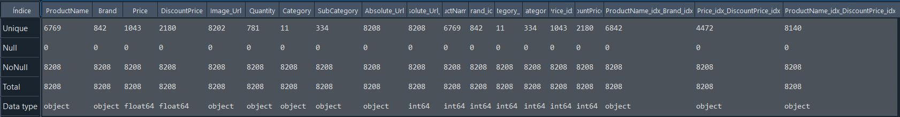

* No field has null values
* "Absolute_Url" is the only field that has all unique values

* (0,0) No relationship between values in the row and column fields
* (0,1) One value in the row field is related to at most one value in the column field
* (0,2) One value in the row field can be related to none, one or several values in the column field
* (1,1) One value in the row filed is only related to one value in the column field
* (1,2) One value in the row field can be related to one or several values in the column field
* Inconsistencies:

## Ontologies

* [Basic](./Ontologies/)
* [LLM](./Ontologies)
* [Gold standard](./Ontologies/BigBasketProductsOntologyGold.owl)
* [Materials](../)

## Mapping

|Mapping |Dataset| RDF | attr_triples | rel_triples |
|:-:|:-:|:-:|:-:|:-:|
|[Basic](./Mappings/mappingBasic.csv.yml)|processed_data.csv|[82080 triples](./Mappings/bigbasketproductsBasic.nt)|[73872 triples](./Experiments/EntityAlignment/Basic-Basic/Input/attr_triples_1)|[8208 triples](./Experiments/EntityAlignment/Basic-Basic/Input/rel_triples_1)|
|[Gold](./Mappings/mappingGold.csv.yml)|processed_data.csv|[92422 triples](./Mappings/bigbasketproductsGold.nt)|[47597 triples](./Experiments/EntityAlignment/Gold-Gold/Input/attr_triples_1)|[44825 triples](./Experiments/EntityAlignment/Gold-Gold/Input/rel_triples_1)|
|[LLM](./Mappings/mappingLLM.csv.ttl)|processed_data20K.csv|[69428 triples](./Mappings/bigbasketproductsLLM.nt)|[61288 triples](./Experiments/EntityAlignment/LLM-LLM/Input/attr_triples_1)|[8140 triples](./Experiments/EntityAlignment/LLM-LLM/Input/rel_triples_1)|
|[Materials](./Mappings/mappingMaterials.csv.yml)|processed_data20K.csv|[45150 triples](./Mappings/bigbasketproductsMaterials.nt)|[21892 triples](./Experiments/EntityAlignment/Materials-Materials/Input/attr_triples_1)|[23258 triples](./Experiments/EntityAlignment/Materials-Materials/Input/rel_triples_1)|

## [Gold - Gold](./Experiments/EntityAlignment/Gold-Gold/)

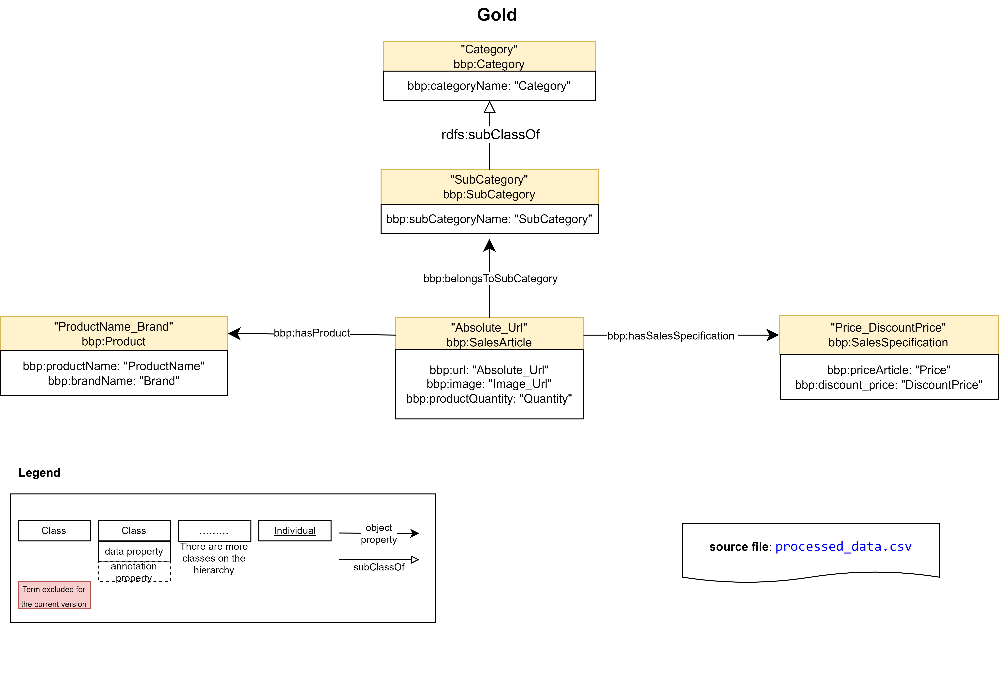

### [Input](./Experiments/EntityAlignment/Gold-Gold/Input/)

|ent_links| [Related Entities](./Experiments/EntityAlignment/Gold-Gold/Input/ent_links)|Split 1 Test|
|:-:|:-:|:-:|
|<https://vocab.um.es/ontology/bbp/SalesArticle> <https://vocab.um.es/ontology/bbp/SalesArticle>| 8208 (41.31%)|3311 (41.66%)
|<https://vocab.um.es/ontology/bbp/Product> <https://vocab.um.es/ontology/bbp/Product>|6842 (34.44%)| 2703 (34.01%)|
|<https://vocab.um.es/ontology/bbp/Category> <https://vocab.um.es/ontology/bbp/Category>| 11 (0.06%)| 3 (0.04%)|
|<https://vocab.um.es/ontology/bbp/SubCategory> <https://vocab.um.es/ontology/bbp/SubCategory>| 334 (1.68%)| 124 (1.56%)|
|<https://vocab.um.es/ontology/bbp/SalesSpecification> <https://vocab.um.es/ontology/bbp/SalesSpecification>| 4472 (22.51%)| 1806 (22.73%)|
| Total related entities |19867|7947

|Split|Training (50%) | Test (40%) | Validation (10%) |
|:-:|:-:|:-:|:-:|
|[1](./Experiments/EntityAlignment/Gold-Gold/Input/451_1fold/1/)|9933|7947|1987|

### [Output](./Experiments/EntityAlignment/Gold-Gold/Output/)

|Approach|Split|Aligned Ent|H@1 (%)|H@5 (%)|H@10 (%)|MR|MRR [0,1]|Run time | SalesArticle (#/%) | Product (#/%) | Category (#/%) | SubCategory (#/%) | SalesSpecification (#/%) |
|:-:|:-:|:-:|:-:|:-:|:-:|:-:|:-:|:-:|:-:|:-:|:-:|:-:|:-:|
|AlignE|1|[7947](./Experiments/EntityAlignment/Gold-Gold/Output/AlignE/1/nohup_gold-gold_aligne.txt)|80.86|90.90|93.63|8|0.85|8714|2744 (82.88%)|2100 (77.69%)|3 (100%)|124 (100%)|1455 (80.56%)|
|AliNet|1|[7947](./Experiments/EntityAlignment/Gold-Gold/Output/AliNet/1/nohup_gold-gold_alinet.txt)|84.25|92.01|93.09|26|0.88|10335|2970 (89.70%)|2149 (79.50%)|3 (100%)|124 (100%)|1449 (80.23%)|
|AttrE|1|[7947](./Experiments/EntityAlignment/Gold-Gold/Output/AttrE/1/nohup_gold-gold_attre.txt)|94.56|99.64|99.99|1|0.97|7575|3058 (92.36%)|2548 (94.27%)|3 (100%)|124 (100%)|1782 (98.67%)|
|BootEA|1|[7947](./Experiments/EntityAlignment/Gold-Gold/Output/BootEA/1/nohup_gold-gold_bootea.txt)|89.67|95.36|96.82|4|0.92|13386|2973 (89.79%)|2418 (89.46%)|3 (100%)|124 (100%)|1608 (89.04%)|
|BootEA_RotatE|1|[7947](./Experiments/EntityAlignment/Gold-Gold/Output/BootEA_RotatE/1/nohup_gold-gold_bootea_rotate.txt)|86.30|95.45|97.09|3|0.91|17748|2839 (85.74%)|2348 (86.87%)|3 (100%)|124 (100%)|1544 (85.49%)|
|BootEA_TransH|1|[7947](./Experiments/EntityAlignment/Gold-Gold/Output/BootEA_TransH/1/error_output_gold-gold_bootea_transh.txt)|E|r|r|o|r|||
|Conve|1|[7947](./Experiments/EntityAlignment/Gold-Gold/Output/ConvE/1/error_output_gold-gold_conve.txt)|E|r|r|o|r|||
|GCN_Align|1|[7947](./Experiments/EntityAlignment/Gold-Gold/Output/GCN_Align/1/nohup_gold-gold_gcnalign.txt)|85.53|93.14|94.56|13|0.89|1023|2932 (88.55%)|2197 (81.28%)|3 (100%)|124 (100%)|1541 (85.33%)|
|GMNN|1|[7947](./Experiments/EntityAlignment/Gold-Gold/Output/GMNN/1/nohup_gold-gold_gmnn.txt)|100|100|100|1|1.00|64433|2932 (88.55%)|2197 (81.28%)|3 (100%)|124 (100%)|1541 (85.33%)|
|HolE|1|[7947](./Experiments/EntityAlignment/Gold-Gold/Output/HolE/1/nohup_gold-gold_hole.txt)|67.01|75.22|78.06|145|0.71|26733|2507 (75.72%)|1559 (57.68%)|3 (100%)|87 (70.16%)|3 (100%)|87 (70.16%)|1169 (64.73%)|
|IMUSE|1|[7947](./Experiments/EntityAlignment/Gold-Gold/Output/IMUSE/1/nohup_gold-gold_imuse.txt)|68.10|91.47|93.90|13|0.79|2007|2169 (65.51%)|1837 (67.96%)|3 (100%)|121 (97.58%)|1282 (70.99%)|
|IPTransE|1|[7947](./Experiments/EntityAlignment/Gold-Gold/Output/IPTransE/1/error_output_gold-gold_iptranse.txt)|E|r|r|o|r|||
|JAPE|1|[7947](./Experiments/EntityAlignment/Gold-Gold/Output/JAPE/1/nohup_gold-gold_jape.txt)|67.56|76.14|77.98|200|0.71|2945|2288 (69.10%)|1690 (62.52%)|3 (100%)|120 (96.77%)|1268 (70.21%)|
|KDCoE|1|[7947](./Experiments/EntityAlignment/Gold-Gold/Output/KDCoE/1/error_output_gold-gold_kdcoe.txt)|E|r|r|o|r|||
|MTransE|1|[7947](./Experiments/EntityAlignment/Gold-Gold/Output/MTransE/1/nohup_gold-gold_mtranse.txt)|58.76|64.91 |66.57|305|0.62|1560|2045 (61.76%)|1437 (53.16%)|3 (100%)|116 (93.55%)|1069 (59.19%)|
|MultiKE|1|[7947](./Experiments/EntityAlignment/Gold-Gold/Output/MultiKE/1/error_output_gold-gold_multike.txt)|E|r|r|o|r|||
|ProjE|1|[7947](./Experiments/EntityAlignment/Gold-Gold/Output/ProjE/1/nohup_gold-gold_proje.txt)|32.78|38.14|39.65|686|0.35|11090|2592 (78.48%)|1 (0.04%)|1 (33.33%)|8 (6.45%)|3 (0.17%)|
|RDGCN|1|[7947](./Experiments/EntityAlignment/Gold-Gold/Output/RDGCN/1/nohup_gold-gold_rdgcn.txt)|99.85|99.91|99.94|1|1.00|13264|3311 (100%)|2692 (99.59%)|3 (100%)|124 (100%)|1805 (99.94%)|
|RotatE|1|[7947](./Experiments/EntityAlignment/Gold-Gold/Output/RotatE/1/nohup_gold-gold_rotate.txt)|82.02|93.91 |96.00|4|0.87|3800|2669 (80.61%)|2250 (83.24%)|3 (100%)|124 (100%)|1472 (81.51%)|
|RSN4EA|1|[7947](./Experiments/EntityAlignment/Gold-Gold/Output/RSN4EA/1/nohup_gold-gold_rsn4ea.txt)|76.14|85.01|86.90|92|0.80|23671|2738 (82.69%)|1862 (68.89%)|3 (100%)|122 (98.39%)|1326 (73.42%)|
|SEA|1|[7947](./Experiments/EntityAlignment/Gold-Gold/Output/SEA/1/nohup_gold-gold_sea.txt)|82.28|93.00 |95.60|3|0.87|2866|2668 (80.58%)|2260 (83.61%)|3 (100%)|123 (99.19%)|1485 (82.23%)|
|SimplE|1|[7947](./Experiments/EntityAlignment/Gold-Gold/Output/SimplE/1/nohup_gold-gold_simple.txt)|61.19|77.69|82.43|34|0.69|1469|2386 (72.06%)|1253 (46.36%)|1 (33.33%)|95 (76.61%)|1128 (62.46%)|
|TransD|1|[7947](./Experiments/EntityAlignment/Gold-Gold/Output/TransD/1/nohup_gold-gold_transd.txt)|65.47|72.13|74.93|120|0.69|4137|2464 (74.42%)|1509 (55.83%)|3 (100%)|119 (95.97%)|1108 (61.35%)|
|TransH|1|[7947](./Experiments/EntityAlignment/Gold-Gold/Output/TransH/1/nohup_gold-gold_transh.txt)|63.58|69.02|70.76|155|0.66|2403|2362 (71.34%)|1497 (55.38%)|3 (100%)|117 (94.35%)|1074 (59.47%)|
|TransR|1|[7947](./Experiments/EntityAlignment/Gold-Gold/Output/TransR/1/nohup_gold-gold_transr.txt)|0.09|0.58|1.02|2453|0.01|3722|5 (0.15%)|0 (0.0%)|0 (0.0%)|1 (0.81%)|1 (0.06%)|

## [Basic - Basic](./Experiments/EntityAlignment/Basic-Basic/)

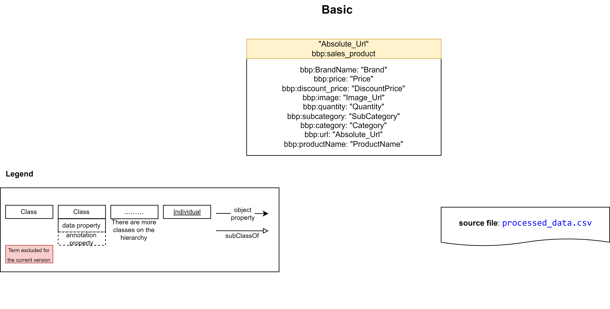

### [Input](./Experiments/EntityAlignment/Basic-Basic/Input/)

|ent_links| [Related Entities](./Experiments/EntityAlignment/Basic-Basic/Input/ent_links)|Split 1 Test|
|:-:|:-:|:-:|
|<https://vocab.um.es/ontology/bbp/SalesProduct> <https://vocab.um.es/ontology/bbp/SalesProduct>| 8208 (100%)|3283 (100%)
| Total related entities |8208|3283

|Split|Training (50%) | Test (40%) | Validation (10%) |
|:-:|:-:|:-:|:-:|
|[1](./Experiments/EntityAlignment/Basic-Basic/Input/451_1fold/1/)|4104|3283|821|

### [Output](./Experiments/EntityAlignment/Basic-Basic/Output/)

|Approach|Split|Aligned Ent|H@1 (%)|H@5 (%)|H@10 (%)|MR|MRR [0,1]|Run time | SalesProduct (#/%) |
|:-:|:-:|:-:|:-:|:-:|:-:|:-:|:-:|:-:|:-:|
|AlignE|1|[3283](./Experiments/EntityAlignment/Basic-Basic/Output/AlignE/1/nohup_basic-basic_aligne.txt)|0.00|0.18 |0.34 |1665|0.01|726|0 (0.0%)|
|AliNet|1|[3283](./Experiments/EntityAlignment/Basic-Basic/Output/AliNet/1/error_output_basic-basic_alinet.txt)|E|r|r|o|r|||
|AttrE|1|[3283](./Experiments/EntityAlignment/Basic-Basic/Output/AttrE/1/nohup_basic-basic_attre.txt)|94.94|99.85|100|1|0.97|2027|3117 (94.94%)|
|BootEA|1|[3283](./Experiments/EntityAlignment/Basic-Basic/Output/BootEA/1/nohup_basic-basic_bootea.txt)|0.03|0.21 |0.52 |1656|0.01|1059|1 (0.03%)|
|BootEA_RotatE|1|[3283](./Experiments/EntityAlignment/Basic-Basic/Output/BootEA_RotatE/1/nohup_basic-basic_bootea_rotate.txt)|0.00|0.15|0.27 |1647|0.01|2232|0 (0.0%)|
|BootEA_TransH|1|[3283](./Experiments/EntityAlignment/Basic-Basic/Output/BootEA_TransH/1/error_output_basic-basic_bootea_transh.txt)|E|r|r|o|r|||
|Conve|1|[3283](./Experiments/EntityAlignment/Basic-Basic/Output/ConvE/1/error_output_basic-basic_conve.txt)|E|r|r|o|r|||
|GCN_Align|1|[3283](./Experiments/EntityAlignment/Basic-Basic/Output/GCN_Align/1/nohup_basic-basic_gcnalign.txt)|0.06|0.18 |0.34|1639|0.01|197|2 (0.06%)|
|GMNN|1|[3283](./Experiments/EntityAlignment/Basic-Basic/Output/GMNN/1/nohup_basic-basic_gmnn.txt)|100|100 |100|1|1.00|22147|3283 (100%)|
|HolE|1|[3283](./Experiments/EntityAlignment/Basic-Basic/Output/HolE/1/nohup_basic-basic_hole.txt)|0.03|0.09 |0.15|1654|0.01|1171|1 (0.03%)|
|IMUSE|1|[3283](./Experiments/EntityAlignment/Basic-Basic/Output/IMUSE/1/nohup_basic-basic_imuse.txt)|43.98|43.98 |44.14|918|0.44|505|1444 (43.98%)|
|IPTransE|1|[3283](./Experiments/EntityAlignment/Basic-Basic/Output/IPTransE/1/error_output_basic-basic_iptranse.txt)|E|r|r|o|r|||
|JAPE|1|[3283](./Experiments/EntityAlignment/Basic-Basic/Output/JAPE/1/nohup_basic-basic_jape.txt)|0.03|0.24 |0.31|1640|0.01|793|1 (0.03%)|
|KDCoE|1|[3283](./Experiments/EntityAlignment/Basic-Basic/Output/KDCoE/1/error_output_basic-basic_kdcoe.txt)|E|r|r|o|r|||
|MTransE|1|[3283](./Experiments/EntityAlignment/Basic-Basic/Output/MTransE/1/nohup_basic-basic_mtranse.txt)|0.03|0.09 |0.21|1659|0.01|202|1 (0.03%)|
|MultiKE|1|[3283](./Experiments/EntityAlignment/Basic-Basic/Output/MultiKE/1/error_output_basic-basic_multike.txt)|E|r|r|o|r|||
|ProjE|1|[3283](./Experiments/EntityAlignment/Basic-Basic/Output/ProjE/1/nohup_basic-basic_proje.txt)|0.03|0.15 |0.31|1643|0.01|980|1 (0.03%)|
|RDGCN|1|[3283](./Experiments/EntityAlignment/Basic-Basic/Output/RDGCN/1/nohup_basic-basic_rdgcn.txt)|100|100 |100|1|1.00|2350|3283 (100%)|
|RotatE|1|[3283](./Experiments/EntityAlignment/Basic-Basic/Output/RotatE/1/nohup_basic-basic_rotate.txt)|0.00|0.12 |0.27|1652|0.01|1227|0 (0.0%)|
|RSN4EA|1|[3283](./Experiments/EntityAlignment/Basic-Basic/Output/RSN4EA/1/error_output_basic-basic_rsn4ea.txt)|E|r|r|o|r|||
|SEA|1|[3283](./Experiments/EntityAlignment/Basic-Basic/Output/SEA/1/nohup_basic-basic_sea.txt)|0.00|0.31 |0.34|1627|0.01|115|0 (0.0%)|
|SimplE|1|[3283](./Experiments/EntityAlignment/Basic-Basic/Output/SimplE/1/nohup_basic-basic_simple.txt)|0.00|0.06|0.15|1643|0.01|112|0 (0.0%)|
|TransD|1|[3283](./Experiments/EntityAlignment/Basic-Basic/Output/TransD/1/nohup_basic-basic_transd.txt)|0.03|0.12|0.31|1683|0.01|252|1 (0.03%)|
|TransH|1|[3283](./Experiments/EntityAlignment/Basic-Basic/Output/TransH/1/nohup_basic-basic_transh.txt)|0.00|0.18|0.46|1642|0.01|213|0 (0.0%)|
|TransR|1|[3283](./Experiments/EntityAlignment/Basic-Basic/Output/TransR/1/nohup_basic-basic_transr.txt)|0.03|0.27|0.46|1633|0.01|572|1 (0.03%)|

## [LLM - LLM](./Experiments/EntityAlignment/LLM-LLM/)

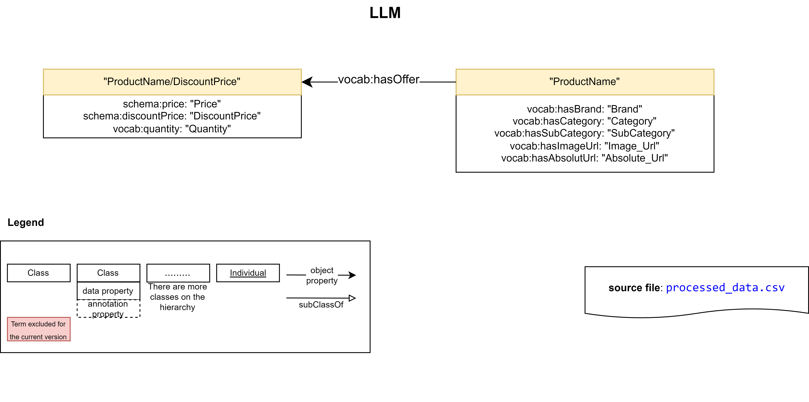

### [Input](./Experiments/EntityAlignment/LLM-LLM/Input/)

|ent_links| [Related Entities](./Experiments/EntityAlignment/LLM-LLM/Input/ent_links)|Split 1 Test|
|:-:|:-:|:-:|
|<https://vocab.um.es/sales_product/> <https://vocab.um.es/sales_product/>| 6769 (45.40%)|2724 (45.67%)
|<http://schema.org/Offer/> <http://schema.org/Offer/>| 8140 (54.60%)| 3240 (54.33%)
| Total related entities |14909|5964

|Split|Training (50%) | Test (40%) | Validation (10%) |
|:-:|:-:|:-:|:-:|
|[1](./Experiments/EntityAlignment/LLM-LLM/Input/451_1fold/1/)|7454|5964|1491|

### [Output](./Experiments/EntityAlignment/LLM-LLM/Output/)

|Approach|Split|Aligned Ent|H@1 (%)|H@5 (%)|H@10 (%)|MR|MRR [0,1]|Run time | sales_product (#/%) | Offer (#/%) |
|:-:|:-:|:-:|:-:|:-:|:-:|:-:|:-:|:-:|:-:|:-:|
|AlignE|1|[5964](./Experiments/EntityAlignment/LLM-LLM/Output/AlignE/1/nohup_llm-llm_aligne.txt)|54.44|58.08|58.13|1030|0.56|3292|1517 (55.69%)|1730 (53.40%)|
|AliNet|1|[5964](./Experiments/EntityAlignment/LLM-LLM/Output/AliNet/1/nohup_llm-llm_alinet.txt)|54.51|58.13|58.32|472|0.56|2772||
|AttrE|1|[5964](./Experiments/EntityAlignment/LLM-LLM/Output/AttrE/1/nohup_llm-llm_attre.txt)|88.87|98.31|99.60|1|0.93|4696|2302 (84.51%)|2998 (92.53%)|
|BootEA|1|[5964](./Experiments/EntityAlignment/LLM-LLM/Output/BootEA/1/nohup_llm-llm_bootea.txt)|54.54|58.05|58.18|1070|0.56|3177|1517 (55.69%)|1736 (53.58%)|
|BootEA_RotatE|1|[5964](./Experiments/EntityAlignment/LLM-LLM/Output/BootEA_RotatE/1/nohup_llm-llm_bootea_rotate.txt)|54.49|57.98|58.00 |1399|0.56|4888||
|BootEA_TransH|1|[5964](./Experiments/EntityAlignment/LLM-LLM/Output/BootEA_TransH/1/error_output_llm-llm_bootea_transh.txt)|E|r|r|o|r|||
|Conve|1|[5964](./Experiments/EntityAlignment/LLM-LLM/Output/ConvE/1/error_output_llm-llm_conve.txt)|E|r|r|o|r|||
|GCN_Align|1|[5964](./Experiments/EntityAlignment/LLM-LLM/Output/GCN_Align/1/nohup_llm-llm_gcnalign.txt)|54.38|58.03|58.10|1288|0.56|491||
|GMNN|1|[5964](./Experiments/EntityAlignment/LLM-LLM/Output/GMNN/1/error_output_llm-llm_gmnn.txt)|E|r|r|o|r|||
|HolE|1|[5964](./Experiments/EntityAlignment/LLM-LLM/Output/HolE/1/nohup_llm-llm_hole.txt)|30.15|41.06|44.01|1278|0.35|6404||
|IMUSE|1|[5964](./Experiments/EntityAlignment/LLM-LLM/Output/IMUSE/1/nohup_llm-llm_imuse.txt)|49.30|75.89|80.35|371|0.60|787||
|IPTransE|1|[5964](./Experiments/EntityAlignment/LLM-LLM/Output/IPTransE/1/error_output_llm-llm_iptranse.txt)|E|r|r|o|r|||
|JAPE|1|[5964](./Experiments/EntityAlignment/LLM-LLM/Output/JAPE/1/nohup_llm-llm_jape.txt)|54.39|58.05|58.08|593|0.56|806||
|KDCoE|1|[5964](./Experiments/EntityAlignment/LLM-LLM/Output/KDCoE/1/error_output_llm-llm_kdcoe.txt)|E|r|r|o|r|||
|MTransE|1|[5964](./Experiments/EntityAlignment/LLM-LLM/Output/MTransE/1/nohup_llm-llm_mtranse.txt)|54.44|58.05|58.15|615|0.56|556||
|MultiKE|1|[5964](./Experiments/EntityAlignment/LLM-LLM/Output/MultiKE/1/error_output_llm-llm_multike.txt)|E|r|r|o|r|||
|ProjE|1|[5964](./Experiments/EntityAlignment/LLM-LLM/Output/ProjE/1/nohup_llm-llm_proje.txt)|0.05|0.18|0.34|3015|0.01|1550||
|RDGCN|1|[5964](./Experiments/EntityAlignment/LLM-LLM/Output/RDGCN/1/nohup_llm-llm_rdgcn.txt)|65.43|70.96|71.51|382|0.68|11675||
|RotatE|1|[5964](./Experiments/EntityAlignment/LLM-LLM/Output/RotatE/1/nohup_llm-llm_rotate.txt)|54.36|58.00|58.05|1239|0.56|3472||
|RSN4EA|1|[5964](./Experiments/EntityAlignment/LLM-LLM/Output/RSN4EA/1/nohup_llm-llm_rsn4ea.txt)|53.39|57.45|57.88|1207|0.55|5440||
|SEA|1|[5964](./Experiments/EntityAlignment/LLM-LLM/Output/SEA/1/nohup_llm-llm_sea.txt)|51.19|56.69|57.16|1187|0.54|347|1517 (55.69%)|1536 (47.41%)|
|SimplE|1|[5964](./Experiments/EntityAlignment/LLM-LLM/Output/SimplE/1/nohup_llm-llm_simple.txt)|30.03|41.10|44.25|1265|0.35|677||
|TransD|1|[5964](./Experiments/EntityAlignment/LLM-LLM/Output/TransD/1/nohup_llm-llm_transd.txt)|50.62|52.93|53.10|1286|0.52|814||
|TransH|1|[5964](./Experiments/EntityAlignment/LLM-LLM/Output/TransH/1/nohup_llm-llm_transh.txt)|50.07|52.77|52.93|1272|0.51|436||
|TransR|1|[5964](./Experiments/EntityAlignment/LLM-LLM/Output/TransR/1/nohup_llm-llm_transr.txt)|0.03|0.34|0.59|2362|0.01|890||

## [Materials - Materials](./Experiments/EntityAlignment/Materials-Materials/)

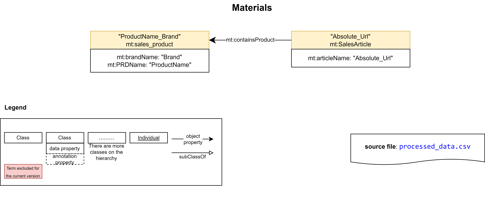

### [Input](./Experiments/EntityAlignment/Materials-Materials/Input/)

|ent_links| [Related Entities](./Experiments/EntityAlignment/Materials-Materials/Input/ent_links)|Split 1 Test|
|:-:|:-:|:-:|
|<https://purl.org/ontologies/MT/SalesArticle> <https://purl.org/ontologies/MT/SalesArticle>| 8208 (54.54%)|3355 (55.73%)
|<https://purl.org/ontologies/MT/sales_product> <https://purl.org/ontologies/MT/sales_product>| 6842 (45.46%)| 2665 (44.27%)
| Total related entities |15050|6020

|Split|Training (50%) | Test (40%) | Validation (10%) |
|:-:|:-:|:-:|:-:|
|[1](./Experiments/EntityAlignment/Materials-Materials/Input/451_1fold/1/)|7525|6020|1505|

### [Output](./Experiments/EntityAlignment/Materials-Materials/Output/)

|Approach|Split|Aligned Ent|H@1 (%)|H@5 (%)|H@10 (%)|MR|MRR [0,1]|Run time |SalesArticle (#/%)| sales_product (#/%) | 
|:-:|:-:|:-:|:-:|:-:|:-:|:-:|:-:|:-:|:-:|:-:|
|AlignE|1|[6020](./Experiments/EntityAlignment/Materials-Materials/Output/AlignE/1/nohup_materials-materials_aligne.txt)|53.95|57.39|57.46|549|0.56|3062|1829 (54.52%)|1419 (53.25%)|
|AliNet|1|[6020](./Experiments/EntityAlignment/Materials-Materials/Output/AliNet/1/nohup_materials-materials_alinet.txt)|53.61|57.31|57.44|539|0.56|2697|1809 (53.92%)|1418 (53.21%)|
|AttrE|1|[6020](./Experiments/EntityAlignment/Materials-Materials/Output/AttrE/1/nohup_materials-materials_attre.txt)|61.40|74.10|77.71|50|0.67|3355|1871 (55.77%)|1825 (68.48%)|
|BootEA|1|[6020](./Experiments/EntityAlignment/Materials-Materials/Output/BootEA/1/nohup_materials-materials_bootea.txt)|53.80|57.21|57.33|575|0.56|2615|1823 (54.34%)|1416 (53.13%)|
|BootEA_RotatE|1|[6020](./Experiments/EntityAlignment/Materials-Materials/Output/BootEA_RotatE/1/nohup_materials-materials_bootea_rotate.txt)|53.87|57.23|57.28|619|0.56|6685|1827 (54.46%)|1416 (53.13%)|
|BootEA_TransH|1|[6020](./Experiments/EntityAlignment/Materials-Materials/Output/BootEA_TransH/1/error_output_materials-materials_bootea_transh.txt)|E|r|r|o|r|||
|Conve|1|[6020](./Experiments/EntityAlignment/Materials-Materials/Output/ConvE/1/error_output_materials-materials_conve.txt)|E|r|r|o|r|||
|GCN_Align|1|[6020](./Experiments/EntityAlignment/Materials-Materials/Output/GCN_Align/1/nohup_materials-materials_gcnalign.txt)|53.80|57.39 |57.48|426|0.56|737|1820 (54.25%)|1419 (53.25%)|
|GMNN|1|[6020](./Experiments/EntityAlignment/Materials-Materials/Output/GMNN/1/nohup_materials-materials_gmnn.txt)|100|100|100|1|1.00|31870|3355 (100%)|2665 (100%)|
|HolE|1|[6020](./Experiments/EntityAlignment/Materials-Materials/Output/HolE/1/nohup_materials-materials_hole.txt)|33.07|43.24|45.86|977|0.38|9180|1218 (36.30%)|773 (29.01%)|
|IMUSE|1|[6020](./Experiments/EntityAlignment/Materials-Materials/Output/IMUSE/1/nohup_materials-materials_imuse.txt)|64.68|88.12|88.94|152|0.75|888|2051 (61.13%)|1843 (69.16%)|
|IPTransE|1|[6020](./Experiments/EntityAlignment/Materials-Materials/Output/IPTransE/1/error_output_materials-materials_iptranse.txt)|E|r|r|o|r|||
|JAPE|1|[6020](./Experiments/EntityAlignment/Materials-Materials/Output/JAPE/1/error_output_materials-materials_jape.txt)|E|r|r|o|r|||
|KDCoE|1|[6020](./Experiments/EntityAlignment/Materials-Materials/Output/KDCoE/1/error_output_materials-materials_kdcoe.txt)|E|r|r|o|r|||
|MTransE|1|[6020](./Experiments/EntityAlignment/Materials-Materials/Output/MTransE/1/nohup_materials-materials_mtranse.txt)|51.15|54.45|54.72|791|0.53|855|1683 (50.16%)|1396 (52.38%)|
|MultiKE|1|[6020](./Experiments/EntityAlignment/Materials-Materials/Output/MultiKE/1/error_output_materials-materials_multike.txt)|E|r|r|o|r|||
|ProjE|1|[6020](./Experiments/EntityAlignment/Materials-Materials/Output/ProjE/1/nohup_materials-materials_proje.txt)|30.13|33.84 |33.92|1193|0.32|4605|1814 (54.07%)|0 (0.0%)|
|RDGCN|1|[6020](./Experiments/EntityAlignment/Materials-Materials/Output/RDGCN/1/nohup_materials-materials_rdgcn.txt)|100|100|100|1|1|5688|3355 (100%)|2665 (100%)|
|RotatE|1|[6020](./Experiments/EntityAlignment/Materials-Materials/Output/RotatE/1/nohup_materials-materials_rotate.txt)|53.80|57.18|57.19|868|0.55|3823|1823 (54.34%)|1416 (53.13%)|
|RSN4EA|1|[6020](./Experiments/EntityAlignment/Materials-Materials/Output/RSN4EA/1/nohup_materials-materials_rsn4ea.txt)|50.86|55.12|55.76|1244|0.53|4964|1645 (49.03%)|1417 (53.17%)|
|SEA|1|[6020](./Experiments/EntityAlignment/Materials-Materials/Output/SEA/1/nohup_materials-materials_sea.txt)|53.90|57.28|57.36|639|0.56|1336|1829 (54.52%)|1416 (53.13%)|
|SimplE|1|[6020](./Experiments/EntityAlignment/Materials-Materials/Output/SimplE/1/nohup_materials-materials_simple.txt)|47.77|54.50|55.33|647|0.51|757|1631 (48.61%)|1245 (46.72%)|
|TransD|1|[6020](./Experiments/EntityAlignment/Materials-Materials/Output/TransD/1/nohup_materials-materials_transd.txt)|49.80|52.41|52.51|1007|0.51|1258|1595 (47.54%)|1403 (52.65%)|
|TransH|1|[6020](./Experiments/EntityAlignment/Materials-Materials/Output/TransH/1/nohup_materials-materials_transh.txt)|50.81|53.94|54.24|631|0.52|1007|1643 (48.97%)|1416 (53.13%)|
|TransR|1|[6020](./Experiments/EntityAlignment/Materials-Materials/Output/TransR/1/nohup_materials-materials_transr.txt)|0.07|0.40|0.58|2301|0.01|1685|3 (0.09%)|1 (0.04%)|

## [Gold - Basic](./Experiments/EntityAlignment/Gold-Basic/)

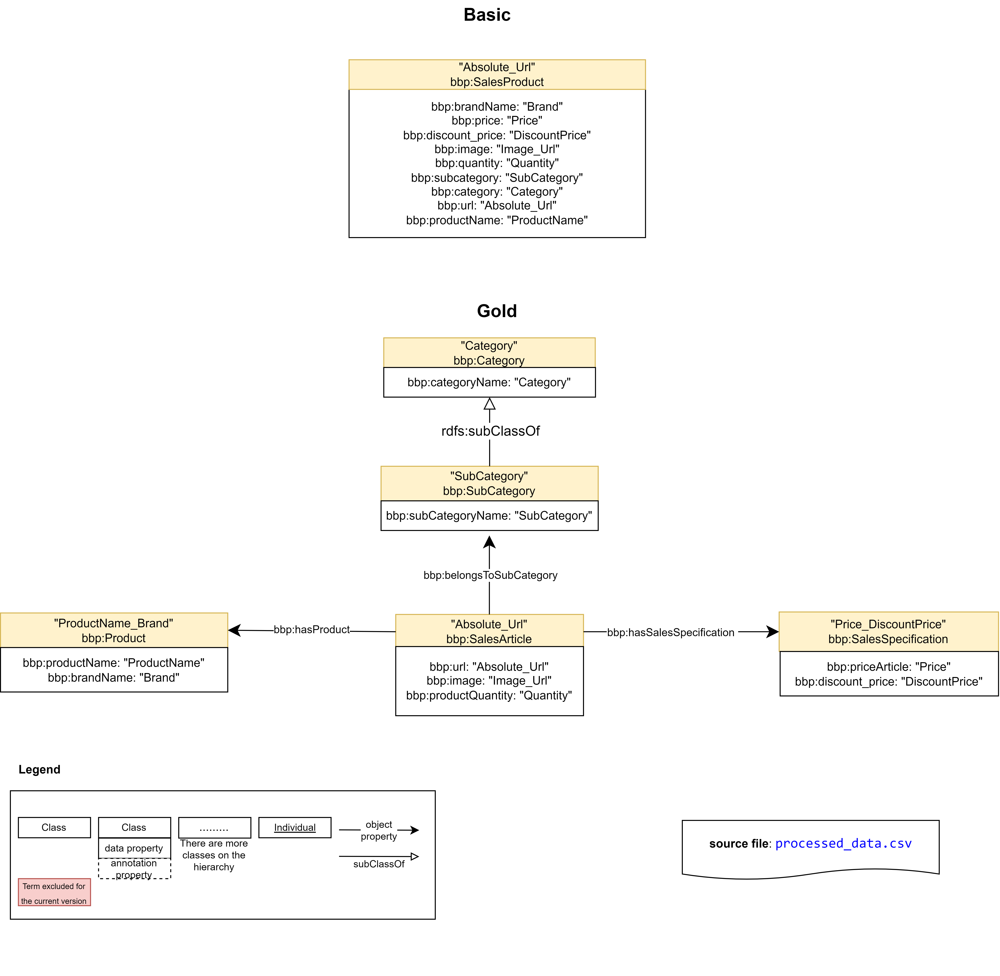

### [Input](./Experiments/EntityAlignment/Gold-Basic/Input/)

|ent_links| [Related Entities](./Experiments/EntityAlignment/Gold-Basic/Input/ent_links)|Split 1 Test|
|:-:|:-:|:-:|
|<https://vocab.um.es/ontology/bbp/SalesArticle> <https://vocab.um.es/ontology/bbp/SalesProduct>| 8208 (100%)|3283 (100%)
| Total related entities |8208|3283

|Split|Training (50%) | Test (40%) | Validation (10%) |
|:-:|:-:|:-:|:-:|
|[1](./Experiments/EntityAlignment/Gold-Basic/Input/451_1fold/1/)|4104|3283|821|

### [Output](./Experiments/EntityAlignment/Gold-Basic/Output/)

|Approach|Split|Aligned Ent|H@1 (%)|H@5 (%)|H@10 (%)|MR|MRR [0,1]|Run time | SalesArticle (#/%) |
|:-:|:-:|:-:|:-:|:-:|:-:|:-:|:-:|:-:|:-:|
|AlignE|1|[3283](./Experiments/EntityAlignment/Gold-Basic/Output/AlignE/1/nohup_gold-basic_aligne.txt)|0.06|0.15 |0.27 |1665|0.00|2139|2 (0.06%)|
|AliNet|1|[3283](./Experiments/EntityAlignment/Gold-Basic/Output/AliNet/1/error_output_gold-basic_alinet.txt)|E|r|r|o|r|||
|AttrE|1|[3283](./Experiments/EntityAlignment/Gold-Basic/Output/AttrE/1/nohup_gold-basic_attre.txt)|86.05|99.30|99.97|1|0.92|5238|2825 (86.05%)|
|BootEA|1|[3283](./Experiments/EntityAlignment/Gold-Basic/Output/BootEA/1/nohup_gold-basic_bootea.txt)|0.00|0.09 |0.18 |1638|0.00|2160|0 (0.0%)|
|BootEA_RotatE|1|[3283](./Experiments/EntityAlignment/Gold-Basic/Output/BootEA_RotatE/1/nohup_gold-basic_bootea_rotate.txt)|0.03|0.18|0.37 |1653|0.00|5720|1 (0.03%)|
|BootEA_TransH|1|[3283](./Experiments/EntityAlignment/Gold-Basic/Output/BootEA_TransH/1/error_output_gold-basic_bootea_transh.txt)|E|r|r|o|r|||
|Conve|1|[3283](./Experiments/EntityAlignment/Gold-Basic/Output/ConvE/1/error_output_gold-basic_conve.txt)|E|r|r|o|r|||
|GCN_Align|1|[3283](./Experiments/EntityAlignment/Gold-Basic/Output/GCN_Align/1/nohup_gold-basic_gcnalign.txt)|0.00|0.09 |0.21|1647|0.00|269|0 (0.0%)|
|GMNN|1|[3283](./Experiments/EntityAlignment/Gold-Basic/Output/GMNN/1/nohup_gold-basic_gmnn.txt)|100|100 |100|1|1.00|19927|3283 (100%)|
|HolE|1|[3283](./Experiments/EntityAlignment/Gold-Basic/Output/HolE/1/nohup_gold-basic_hole.txt)|0.03|0.06 |0.18|1631|0.00|3975|1 (0.03%)|
|IMUSE|1|[3283](./Experiments/EntityAlignment/Gold-Basic/Output/IMUSE/1/nohup_gold-basic_imuse.txt)|50.26|57.14 |59.52|466|0.54|609|1650 (50.26%)|
|IPTransE|1|[3283](./Experiments/EntityAlignment/Gold-Basic/Output/IPTransE/1/error_output_gold-basic_iptranse.txt)|E|r|r|o|r|||
|JAPE|1|[3283](./Experiments/EntityAlignment/Gold-Basic/Output/JAPE/1/nohup_gold-basic_jape.txt)|0.03|0.12 |0.24|1646|0.00|1057|1 (0.03%)|
|KDCoE|1|[3283](./Experiments/EntityAlignment/Gold-Basic/Output/KDCoE/1/error_output_gold-basic_kdcoe.txt)|E|r|r|o|r|||
|MTransE|1|[3283](./Experiments/EntityAlignment/Gold-Basic/Output/MTransE/1/nohup_gold-basic_mtranse.txt)|0.03|0.34 |0.43|1642|0.00|471|1 (0.03%)|
|MultiKE|1|[3283](./Experiments/EntityAlignment/Gold-Basic/Output/MultiKE/1/error_output_gold-basic_multike.txt)|E|r|r|o|r|||
|ProjE|1|[3283](./Experiments/EntityAlignment/Gold-Basic/Output/ProjE/1/nohup_gold-basic_proje.txt)|0.00|0.09 |0.27|1637|0.00|3045|0 (0.0%)|
|RDGCN|1|[3283](./Experiments/EntityAlignment/Gold-Basic/Output/RDGCN/1/nohup_gold-basic_rdgcn.txt)|100|100 |100|1|1.00|4100|3283 (100%)|
|RotatE|1|[3283](./Experiments/EntityAlignment/Gold-Basic/Output/RotatE/1/nohup_gold-basic_rotate.txt)|0.00|0.12 |0.21|1615|0.00|1227|0 (0.0%)|
|RSN4EA|1|[3283](./Experiments/EntityAlignment/Gold-Basic/Output/RSN4EA/1/error_output_gold-basic_rsn4ea.txt)|E|r|r|o|r|||
|SEA|1|[3283](./Experiments/EntityAlignment/Gold-Basic/Output/SEA/1/nohup_gold-basic_sea.txt)|0.12|0.27 |0.37|1641|0.00|218|4 (0.12%)|
|SimplE|1|[3283](./Experiments/EntityAlignment/Gold-Basic/Output/SimplE/1/nohup_gold-basic_simple.txt)|0.12|0.21|0.31|1646|0.00|199|4 (0.12%)|
|TransD|1|[3283](./Experiments/EntityAlignment/Gold-Basic/Output/TransD/1/nohup_gold-basic_transd.txt)|0.06|0.27|0.61|1597|0.00|552|2 (0.06%)|
|TransH|1|[3283](./Experiments/EntityAlignment/Gold-Basic/Output/TransH/1/nohup_gold-basic_transh.txt)|0.09|0.18|0.31|1612|0.00|488|3 (0.09%)|
|TransR|1|[3283](./Experiments/EntityAlignment/Gold-Basic/Output/TransR/1/nohup_gold-basic_transr.txt)|0.12|0.21|0.31|1639|0.00|1899|4 (0.12%)|

## [Gold - LLM](./Experiments/EntityAlignment/Gold-LLM/)

### [Input](./Experiments/EntityAlignment/Gold-LLM/Input/)

|ent_links| [Related Entities](./Experiments/EntityAlignment/Gold-LLM/Input/ent_links)|Split 1 Test|
|:-:|:-:|:-:|
|<https://vocab.um.es/ontology/bbp/SalesArticle> - <https://vocab.um.es/sales_product/>| 8208 (50.18%)|3282 (50.17%)
|<https://vocab.um.es/ontology/bbp/SalesSpecification> - <http://schema.org/Offer/>| 8148 (49.82%)|3260 (49.83%)
| Total related entities |16356|6542

|Split|Training (50%) | Test (40%) | Validation (10%) |
|:-:|:-:|:-:|:-:|
|[1](./Experiments/EntityAlignment/Gold-LLM/Input/451_1fold/1/)|8178|6542|1636|

### [Output](./Experiments/EntityAlignment/Gold-LLM/Output/)

|Approach|Split|Aligned Ent|H@1 (%)|H@5 (%)|H@10 (%)|MR|MRR [0,1]|Run time | SalesArticle (#/%) |SalesSpecification (#/%) |
|:-:|:-:|:-:|:-:|:-:|:-:|:-:|:-:|:-:|:-:|:-:|
|AlignE|1|[6542](./Experiments/EntityAlignment/Gold-LLM/Output/AlignE/1/nohup_gold-llm_aligne.txt)|38.96|57.63 |60.07 |1045|0.47|5252|1959 (60.09%)|1517 (46.22%)|
|AliNet|1|[6542](./Experiments/EntityAlignment/Gold-LLM/Output/AliNet/1/nohup_gold-llm_alinet.txt)|31.31|45.55|46.73|1412|0.37|2247|1201 (36.59%)|1279 (39.23%)|
|AttrE|1|[6542](./Experiments/EntityAlignment/Gold-LLM/Output/AttrE/1/nohup_gold-llm_attre.txt)|48.88|70.18|76.93|28|0.59|4867|1760 (53.63%)|2380 (73.01%)|
|BootEA|1|[6542](./Experiments/EntityAlignment/Gold-LLM/Output/BootEA/1/nohup_gold-llm_bootea.txt)|39.94|57.93 |60.33 |1026|0.48|4895|1525 (46.47%)|2085 (63.96%)|
|BootEA_RotatE|1|[6542](./Experiments/EntityAlignment/Gold-LLM/Output/BootEA_RotatE/1/nohup_gold-llm_bootea_rotate.txt)|36.46|57.87|60.59|1496|0.46|8585|1289 (39.27%)|1991 (61.07%)|
|BootEA_TransH|1|[6542](./Experiments/EntityAlignment/Gold-LLM/Output/BootEA_TransH/1/error_output_gold-llm_bootea_transh.txt)|E|r|r|o|r|||
|Conve|1|[6542](./Experiments/EntityAlignment/Gold-LLM/Output/ConvE/1/error_output_gold-llm_conve.txt)|E|r|r|o|r|||
|GCN_Align|1|[6542](./Experiments/EntityAlignment/Gold-LLM/Output/GCN_Align/1/nohup_gold-llm_gcnalign.txt)|24.21|40.31|44.25|2170|0.31|771|672 (20.48%)|1229 (37.70%)|
|GMNN|1|[6542](./Experiments/EntityAlignment/Gold-LLM/Output/GMNN/1/error_output_gold-llm_gmnn.txt)|E|r|r|o|r|||
|HolE|1|[6542](./Experiments/EntityAlignment/Gold-LLM/Output/HolE/1/nohup_gold-llm_hole.txt)|22.64|39.03 |44.42|1337|0.30|13156|994 (30.29%)|1021 (31.32%)|
|IMUSE|1|[6542](./Experiments/EntityAlignment/Gold-LLM/Output/IMUSE/1/nohup_gold-llm_imuse.txt)|33.78|55.06 |59.46|818|0.43|1184|1593 (48.54%)|1128 (34.60%)|
|IPTransE|1|[6542](./Experiments/EntityAlignment/Gold-LLM/Output/IPTransE/1/error_output_gold-llm_iptranse.txt)|E|r|r|o|r|||
|JAPE|1|[6542](./Experiments/EntityAlignment/Gold-LLM/Output/JAPE/1/nohup_gold-llm_jape.txt)|24.20|37.62 |41.49|1082|0.30|1182|721 (21.97%)|1561 (47.88%)|
|KDCoE|1|[6542](./Experiments/EntityAlignment/Gold-LLM/Output/KDCoE/1/error_output_gold-llm_kdcoe.txt)|E|r|r|o|r|||
|MTransE|1|[6542](./Experiments/EntityAlignment/Gold-LLM/Output/MTransE/1/nohup_gold-llm_mtranse.txt)|23.53|33.57 |36.76|609|0.28|802|791 (24.10%)|1222 (37.48%)|
|MultiKE|1|[6542](./Experiments/EntityAlignment/Gold-LLM/Output/MultiKE/1/error_output_gold-llm_multike.txt)|E|r|r|o|r|||
|ProjE|1|[6542](./Experiments/EntityAlignment/Gold-LLM/Output/ProjE/1/nohup_gold-llm_proje.txt)|21.92|30.14 |30.85|2747|0.26|4979|1619 (49.33%)|1 (0.03%)|
|RDGCN|1|[6542](./Experiments/EntityAlignment//Gold-LLM/Output/RDGCN/1/nohup_gold-llm_rdgcn.txt)|14.34|20.99 |23.39|1898|0.18|14291|1027 (31.29%)|88 (2.70%)|
|RotatE|1|[6542](./Experiments/EntityAlignment/Gold-LLM/Output/RotatE/1/nohup_gold-llm_rotate.txt)|30.66|53.30 |58.19|1969|0.40|5016|983 (29.95%)|1827 (56.04%)|
|RSN4EA|1|[6542](./Experiments/EntityAlignment/Gold-LLM/Output/RSN4EA/1/error_output_gold-llm_rsn4ea.txt)|E|r|r|o|r|||
|SEA|1|[6542](./Experiments/EntityAlignment/Gold-LLM/Output/SEA/1/nohup_gold-llm_sea.txt)|35.60|54.66 |58.67|1166|0.44|921|1612 (49.12%)|1179 (36.17%)|
|SimplE|1|[6542](./Experiments/EntityAlignment/Gold-LLM/Output/SimplE/1/nohup_gold-llm_simple.txt)|19.66|36.52|41.35|1299|0.27|982|748 (22.79%)|1153 (35.37%)|
|TransD|1|[6542](./Experiments/EntityAlignment/Gold-LLM/Output/TransD/1/nohup_gold-llm_transd.txt)|33.23|48.88|51.73|1360|0.40|2184|1569 (47.81%)|987 (30.28%)|
|TransH|1|[6542](./Experiments/EntityAlignment/Gold-LLM/Output/TransH/1/nohup_gold-llm_transh.txt)|33.02|50.44|53.63|1078|0.41|2262|1515 (46.16%)|1084 (33.25%)|
|TransR|1|[6542](./Experiments/EntityAlignment/Gold-LLM/Output/TransR/1/nohup_gold-llm_transr.txt)|0.18|0.70|1.10|2454|0.01|2231|11 (0.34%)|11 (0.34%)|

## [Gold - Materials](./Experiments/EntityAlignment/Gold-Materials/)

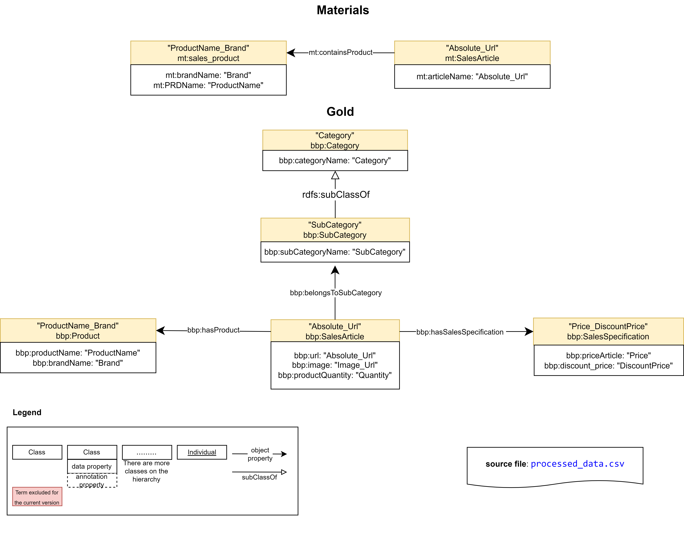

### [Input](./Experiments/EntityAlignment/Gold-Materials/Input/)

|ent_links| [Related Entities](./Experiments/EntityAlignment/Gold-Materials/Input/ent_links)|Split 1 Test|
|:-:|:-:|:-:|
|<https://vocab.um.es/ontology/bbp/SalesArticle> - <https://purl.org/ontologies/MT/SalesArticle>| 8208 (54.54%)|3276 (54.42%)
|<https://vocab.um.es/ontology/bbp/Product> - <https://purl.org/ontologies/MT/sales_product>| 6842 (45.46%)|2744 (45.58%)
| Total related entities |15050|6020

|Split|Training (50%) | Test (40%) | Validation (10%) |
|:-:|:-:|:-:|:-:|
|[1](./Experiments/EntityAlignment/Gold-Materials/Input/451_1fold/1/)|7525|6020|1505|

### [Output](./Experiments/EntityAlignment/Gold-Materials/Output/)

|Approach|Split|Aligned Ent|H@1 (%)|H@5 (%)|H@10 (%)|MR|MRR [0,1]|Run time | SalesArticle (#/%) |Product (#/%) |
|:-:|:-:|:-:|:-:|:-:|:-:|:-:|:-:|:-:|:-:|:-:|
|AlignE|1|[6020](./Experiments/EntityAlignment/Gold-Materials/Output/AlignE/1/nohup_gold-materials_aligne.txt)|53.31|56.66|57.03|573|0.55|5237|1701 (51.92%)|1508 (54.96%)|
|AliNet|1|[6020](./Experiments/EntityAlignment/Gold-Materials/Output/AliNet/1/nohup_gold-materials_alinet.txt)|53.92|57.06|57.28|445|0.56|5172|1738 (53.05%)|1508 (54.96%)|
|AttrE|1|[6020](./Experiments/EntityAlignment/Gold-Materials/Output/AttrE/1/nohup_gold-materials_attre.txt)|52.82|59.02|62.03|287|0.56|2788|1543 (47.10%)|1637 (59.66%)|
|BootEA|1|[6020](./Experiments/EntityAlignment/Gold-Materials/Output/BootEA/1/nohup_gold-materials_bootea.txt)|53.79|56.89 |57.03 |638|0.55|5297|1729 (52.78%)|1509 (54.99%)|
|BootEA_RotatE|1|[6020](./Experiments/EntityAlignment/Gold-Materials/Output/BootEA_RotatE/1/nohup_gold-materials_bootea_rotate.txt)|53.69|56.94|57.03 |651|0.55|10599|1726 (52.69%)|1506 (54.88%)|
|BootEA_TransH|1|[6020](./Experiments/EntityAlignment/Gold-Materials/Output/BootEA_TransH/1/error_output_gold-materials_bootea_transh.txt)|E|r|r|o|r|||
|Conve|1|[6020](./Experiments/EntityAlignment/Gold-Materials/Output/ConvE/1/error_output_gold-materials_conve.txt)|E|r|r|o|r|||
|GCN_Align|1|[6020](./Experiments/EntityAlignment/Gold-Materials/Output/GCN_Align/1/nohup_gold-materials_gcnalign.txt)|53.87|57.04|57.16|655|0.55|677|1744 (53.24%)|1499 (54.63%)
|GMNN|1|[6020](./Experiments/EntityAlignment/Gold-Materials/Output/GMNN/1/nohup_gold-materials_gmnn.txt)|100|100|100|1|1.00|42545|3276 (100%)|2744 (100%)|
|HolE|1|[6020](./Experiments/EntityAlignment/Gold-Materials/Output/HolE/1/nohup_gold-materials_hole.txt)|51.55|55.43|55.83|984|0.53|18212|1600 (48.84%)|1503 (54.77%)|
|IMUSE|1|[6020](./Experiments/EntityAlignment/Gold-Materials/Output/IMUSE/1/nohup_gold-materials_imuse.txt)|52.43|60.52 |60.98|659|0.56|1412|1755 (53.57%)|1401 (51.06%)|
|IPTransE|1|[6020](./Experiments/EntityAlignment/Gold-Materials/Output/IPTransE/1/error_output_gold-materials_iptranse.txt)|E|r|r|o|r|||
|JAPE|1|[6020](./Experiments/EntityAlignment/Gold-Materials/Output/JAPE/1/nohup_gold-materials_jape.txt)|50.57|53.70 |54.14|901|0.52|1315|1564 (47.74%)|1480 (53.94%)|
|KDCoE|1|[6020](./Experiments/EntityAlignment/Gold-Materials/Output/KDCoE/1/error_output_gold-materials_kdcoe.txt)|E|r|r|o|r|||
|MTransE|1|[6020](./Experiments/EntityAlignment/Gold-Materials/Output/MTransE/1/nohup_gold-materials_mtranse.txt)|46.11|50.52 |51.41|846|0.48|1025|1373 (41.91%)|1403 (51.13%)|
|MultiKE|1|[6020](./Experiments/EntityAlignment/Gold-Materials/Output/MultiKE/1/error_output_gold-materials_multike.txt)|E|r|r|o|r|||
|ProjE|1|[6020](./Experiments/EntityAlignment/Gold-Materials/Output/ProjE/1/nohup_gold-materials_proje.txt)|28.21|31.43 |31.65|1401|0.30|5533|1697 (51.80%)|1 (0.04%)|
|RDGCN|1|[6020](./Experiments/EntityAlignment/Gold-Materials/Output/RDGCN/1/nohup_gold-materials_rdgcn.txt)|73.42|75.60 |77.11|101|0.75|8926|3267 (99.73%)|1153 (42.02%)|
|RotatE|1|[6020](./Experiments/EntityAlignment/Gold-Materials/Output/RotatE/1/nohup_gold-materials_rotate.txt)|52.64|56.89 |56.99|745|0.55|7471|1682 (51.34%)|1487 (54.19%)|
|RSN4EA|1|[6020](./Experiments/EntityAlignment/Gold-Materials/Output/RSN4EA/1/nohup_gold-materials_rsn4ea.txt)|51.96|55.32|55.93|1306|0.54|7380|1620 (49.45%)|1508 (54.96%)|
|SEA|1|[6020](./Experiments/EntityAlignment/Gold-Materials/Output/SEA/1/nohup_gold-materials_sea.txt)|53.49|56.78 |57.01|649|0.55|1036|1714 (52.32%)|1506 (54.88%)|
|SimplE|1|[6020](./Experiments/EntityAlignment/Gold-Materials/Output/SimplE/1/nohup_gold-materials_simple.txt)|49.49|56.10|56.53|817|0.53|2971|1657 (50.58%)|1322 (48.18%)|
|TransD|1|[6020](./Experiments/EntityAlignment/Gold-Materials/Output/TransD/1/nohup_gold-materials_transd.txt)|50.53|52.97|53.37|606|0.52|2536|1536 (46.89%)|1506 (54.88%)|
|TransH|1|[6020](./Experiments/EntityAlignment//Gold-Materials/Output/TransH/1/nohup_gold-materials_transh.txt)|50.68|53.14|53.44|695|0.52|1677|1549 (47.28%)|1502 (54.74%)|
|TransR|1|[6020](./Experiments/EntityAlignment/Gold-Materials/Output/TransR/1/nohup_gold-materials_transr.txt)|0.10|0.30|0.52|2311|0.00|2934|2 (0.06%)|4 (0.15%)|

## [Basic - LLM](./Experiments/EntityAlignment/Basic-LLM/)

### [Input](./Experiments/EntityAlignment/Basic-LLM/Input/)

|ent_links| [Related Entities](./Experiments/EntityAlignment/Basic-LLM/Input/ent_links)|Split 1 Test|
|:-:|:-:|:-:|
|<https://vocab.um.es/ontology/bbp/SalesProduct> <https://vocab.um.es/sales_product/>| 8208 (100%)|3283 (100%)
| Total related entities |8208|3283

|Split|Training (50%) | Test (40%) | Validation (10%) |
|:-:|:-:|:-:|:-:|
|[1](./Experiments/EntityAlignment/Basic-LLM/Input/451_1fold/1/)|4104|3283|821|

### [Output](./Experiments/EntityAlignment/Basic-LLM/Output/)

|Approach|Split|Aligned Ent|H@1 (%)|H@5 (%)|H@10 (%)|MR|MRR [0,1]|Run time | SalesProduct (#/%) |
|:-:|:-:|:-:|:-:|:-:|:-:|:-:|:-:|:-:|:-:|
|AlignE|1|[3283](./Experiments/EntityAlignment/Basic-LLM/Output/AlignE/1/nohup_basic-llm_aligne.txt)|0.00|0.15 |0.21 |1615|0.00|1440|0 (0%)|
|AliNet|1|[3283](./Experiments/EntityAlignment/Basic-LLM/Output/AliNet/1/error_output_basic-llm_alinet.txt)|E|r|r|o|r|||
|AttrE|1|[3283](./Experiments/EntityAlignment/Basic-LLM/Output/AttrE/1/nohup_basic-llm_attre.txt)|65.58|91.44|96.01|3|0.77|7274|2258 (68.78%)|
|BootEA|1|[3283](./Experiments/EntityAlignment/Basic-LLM/Output/BootEA/1/nohup_basic-llm_bootea.txt)|0.06|0.09 |0.27 |1626|0.00|1542|2 (0.06%)|
|BootEA_RotatE|1|[3283](./Experiments/EntityAlignment/Basic-LLM/Output/BootEA_RotatE/1/nohup_basic-llm_bootea_rotate.txt)|0.09|0.15|0.21 |1634|0.00|4240|3 (0.09%)|
|BootEA_TransH|1|[3283](./Experiments/EntityAlignment/Basic-LLM/Output/BootEA_TransH/1/error_output_basic-llm_bootea_transh.txt)|E|r|r|o|r|||
|Conve|1|[3283](./Experiments/EntityAlignment/Basic-LLM/Output/ConvE/1/error_output_basic-llm_conve.txt)|E|r|r|o|r|||
|GCN_Align|1|[3283](./Experiments/EntityAlignment/Basic-LLM/Output/GCN_Align/1/nohup_basic-llm_gcnalign.txt)|0.03|0.15 |0.21|1645|0.00|227|2 (0.06%)|
|GMNN|1|[3283](./Experiments/EntityAlignment/Basic-LLM/Output/GMNN/1/nohup_basic-llm_gmnn.txt)|4.87|14.41 |23.61|36|0.12|44822||
|HolE|1|[3283](./Experiments/EntityAlignment/Basic-LLM/Output/HolE/1/nohup_basic-llm_hole.txt)|0.00|0.12 |0.27|1646|0.00|2135|1 (0.03%)|
|IMUSE|1|[3283](./Experiments/EntityAlignment/Basic-LLM/Output/IMUSE/1/nohup_basic-llm_imuse.txt)|28.30|32.38 |32.59|1112|0.30|393|1026 (31.25%)|
|IPTransE|1|[3283](./Experiments/EntityAlignment/Basic-LLM/Output/IPTransE/1/error_output_basic-llm_iptranse.txt)|E|r|r|o|r|||
|JAPE|1|[3283](./Experiments/EntityAlignment/Basic-LLM/Output/JAPE/1/nohup_basic-llm_jape.txt)|0.06|0.21 |0.40|1651|0.00|1089|3 (0.09%)|
|KDCoE|1|[3283](./Experiments/EntityAlignment/Basic-LLM/Output/KDCoE/1/error_output_basic-llm_kdcoe.txt)|E|r|r|o|r|||
|MTransE|1|[3283](./Experiments/EntityAlignment/Basic-LLM/Output/MTransE/1/nohup_basic-llm_mtranse.txt)|0.06|0.18 |0.27|1642|0.00|295|3 (0.09%)|
|MultiKE|1|[3283](./Experiments/EntityAlignment/Basic-LLM/Output/MultiKE/1/error_output_basic-llm_multike.txt)|E|r|r|o|r|||
|ProjE|1|[3283](./Experiments/EntityAlignment/Basic-LLM/Output/ProjE/1/nohup_basic-llm_proje.txt)|0.00|0.12 |0.18|1668|0.00|1765|0 (0%)|
|RDGCN|1|[3283](./Experiments/EntityAlignment/Basic-LLM/Output/RDGCN/1/nohup_basic-llm_rdgcn.txt)|2.44|5.51|7.22|1448|0.04|6480|110 (3.35%)|
|RotatE|1|[3283](./Experiments/EntityAlignment/Basic-LLM/Output/RotatE/1/nohup_basic-llm_rotate.txt)|0.06|0.21 |0.31|1650|0.00|2083|2 (0.06%)|
|RSN4EA|1|[3283](./Experiments/EntityAlignment/Basic-LLM/Output/RSN4EA/1/error_output_basic-llm_rsn4ea.txt)|E|r|r|o|r|||
|SEA|1|[3283](./Experiments/EntityAlignment/Basic-LLM/Output/SEA/1/nohup_basic-llm_sea.txt)|0.00|0.09 |0.34|1612|0.00|132|0 (0%)|
|SimplE|1|[3283](./Experiments/EntityAlignment/Basic-LLM/Output/SimplE/1/nohup_basic-llm_simple.txt)|0.00|0.09|0.31|1643|0.00|154|0 (0%)|
|TransD|1|[3283](./Experiments/EntityAlignment/Basic-LLM/Output/TransD/1/nohup_basic-llm_transd.txt)|0.00|0.15|0.24|1658|0.00|332|1 (0.03%)|
|TransH|1|[3283](./Experiments/EntityAlignment/Basic-LLM/Output/TransH/1/nohup_basic-llm_transh.txt)|0.00|0.27|0.43|1638|0.00|330|0 (0%)|
|TransR|1|[3283](./Experiments/EntityAlignment/Basic-LLM/Output/TransR/1/nohup_basic-llm_transr.txt)|0.00|0.03|0.24|1642|0.00|1026|0 (0%)|

## [Basic - Materials](./Experiments/EntityAlignment/Basic-Materials/)

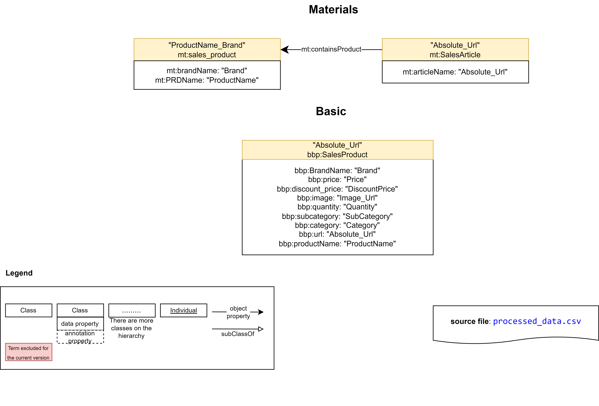

### [Input](./Experiments/EntityAlignment/Basic-Materials/)

|ent_links| [Related Entities](./Experiments/EntityAlignment/Basic-Materials/Input/ent_links)|Split 1 Test|
|:-:|:-:|:-:|
|<https://vocab.um.es/ontology/bbp/SalesProduct> <https://purl.org/ontologies/MT/SalesArticle>| 8208 (100%)|3283 (100%)
| Total related entities |8208|3283

|Split|Training (50%) | Test (40%) | Validation (10%) |
|:-:|:-:|:-:|:-:|
|[1](./Experiments/EntityAlignment/Basic-Materials/Input/451_1fold/1/)|4104|3283|821|

### [Output](./Experiments/EntityAlignment/Basic-Materials/Output/)

|Approach|Split|Aligned Ent|H@1 (%)|H@5 (%)|H@10 (%)|MR|MRR [0,1]|Run time | SalesProduct (#/%) |
|:-:|:-:|:-:|:-:|:-:|:-:|:-:|:-:|:-:|:-:|
|AlignE|1|[3283](./Experiments/EntityAlignment/Basic-Materials/Output/AlignE/1/nohup_basic-materials_aligne.txt)|0.00|0.18 |0.46 |1651|0.00|1014|0 (0%)|
|AliNet|1|[3283](./Experiments/EntityAlignment/Basic-Materials/Output/AliNet/1/error_output_basic-materials_alinet.txt)|E|r|r|o|r|||
|AttrE|1|[3283](./Experiments/EntityAlignment/Basic-Materials/Output/AttrE/1/nohup_basic-materials_attre.txt)|2.28|7.04|11.36|372|0.05|1259|75 (2.28%)|
|BootEA|1|[3283](./Experiments/EntityAlignment/Basic-Materials/Output/BootEA/1/nohup_basic-materials_bootea.txt)|0.03|0.18 |0.40 |1645|0.00|1098|1 (0.03%)|
|BootEA_RotatE|1|[3283](./Experiments/EntityAlignment/Basic-Materials/Output/BootEA_RotatE/1/nohup_basic-materials_bootea_rotate.txt)|0.03|0.21|0.31 |1644|0.00|2625|1 (0.03%)|
|BootEA_TransH|1|[3283](./Experiments/EntityAlignment/Basic-Materials/Output/BootEA_TransH/1/error_output_basic-materials_bootea_transh.txt)|E|r|r|o|r|||
|Conve|1|[3283](./Experiments/EntityAlignment/Basic-Materials/Output/ConvE/1/error_output_basic-materials_conve.txt)|E|r|r|o|r|||
|GCN_Align|1|[3283](./Experiments/EntityAlignment/Basic-Materials/Output/GCN_Align/1/nohup_basic-materials_gcnalign.txt)|0.00|0.12 |0.27|1629|0.00|188|0 (0%)|
|GMNN|1|[3283](./Experiments/EntityAlignment/Basic-Materials/Output/GMNN/1/nohup_basic-materials_gmnn.txt)|100|100 |100|1|1.00|44609|3283 (100%)|
|HolE|1|[3283](./Experiments/EntityAlignment/Basic-Materials/Output/HolE/1/nohup_basic-materials_hole.txt)|0.00|0.12 |0.18|1625|0.00|1614|0 (0%)|
|IMUSE|1|[3283](./Experiments/EntityAlignment/Basic-Materials/Output/IMUSE/1/)|8.22|9.72 |9.96|1443|0.09|341|270 (8.22%)|
|IPTransE|1|[3283](./Experiments/EntityAlignment/Basic-Materials/Output/IPTransE/1/error_output_basic-materials_iptranse.txt)|E|r|r|o|r|||
|JAPE|1|[3283](./Experiments/EntityAlignment/Basic-Materials/Output/JAPE/1/nohup_basic-materials_jape.txt)|0.03|0.12 |0.37|1647|0.00|1089|1 (0.03%)|
|KDCoE|1|[3283](./Experiments/EntityAlignment/Basic-Materials/Output/KDCoE/1/error_output_basic-materials_kdcoe.txt)|E|r|r|o|r|||
|MTransE|1|[3283](./Experiments/EntityAlignment/Basic-Materials/Output/MTransE/1/nohup_basic-materials_mtranse.txt)|0.00|0.06 |0.12|1657|0.00|270|0 (0%)|
|MultiKE|1|[3283](./Experiments/EntityAlignment/Basic-Materials/Output/MultiKE/1/error_output_basic-materials_multike.txt)|E|r|r|o|r|||
|ProjE|1|[3283](./Experiments/EntityAlignment/Basic-Materials/Output/ProjE/1/nohup_basic-materials_proje.txt)|0.18|0.27 |0.34|1659|0.00|1343|6 (0.18%)|
|RDGCN|1|[3283](./Experiments/EntityAlignment/Basic-Materials/Output/RDGCN/1/nohup_basic-materials_rdgcn.txt)|99.94|99.94|99.94|1|1.00|2248|3281 (99.94%)|
|RotatE|1|[3283](./Experiments/EntityAlignment/Basic-Materials/Output/RotatE/1/nohup_basic-materials_rotate.txt)|0.09|0.27 |0.43|1638|0.00|1532|3 (0.09%)|
|RSN4EA|1|[3283](./Experiments/EntityAlignment/Basic-Materials/Output/RSN4EA/1/error_output_basic-materials_rsn4ea.txt)|E|r|r|o|r|||
|SEA|1|[3283](./Experiments/EntityAlignment/Basic-Materials/Output/SEA/1/nohup_basic-materials_sea.txt)|0.00|0.15 |0.31|1653|0.00|143|0 (0.0%)|
|SimplE|1|[3283](./Experiments/EntityAlignment/Basic-Materials/Output/SimplE/1/nohup_basic-materials_simple.txt)|0.00|0.12|0.31|1635|0.00|129|0 (0.0%)|
|TransD|1|[3283](./Experiments/EntityAlignment/Basic-Materials/Output/TransD/1/nohup_basic-materials_transd.txt)|0.03|0.12|0.34|1663|0.00|334|1 (0.03%)|
|TransH|1|[3283](./Experiments/EntityAlignment/Basic-Materials/Output/TransH/1/nohup_basic-materials_transh.txt)|0.00|0.15|0.27|1642|0.00|291|0 (0.0%)|
|TransR|1|[3283](./Experiments/EntityAlignment/Basic-Materials/Output/TransR/1/nohup_basic-materials_transr.txt)|0.03|0.12|0.24|1655|0.00|822|1 (0.03%)|

## [Materials - LLM](./Experiments/EntityAlignment/Materials-LLM/)

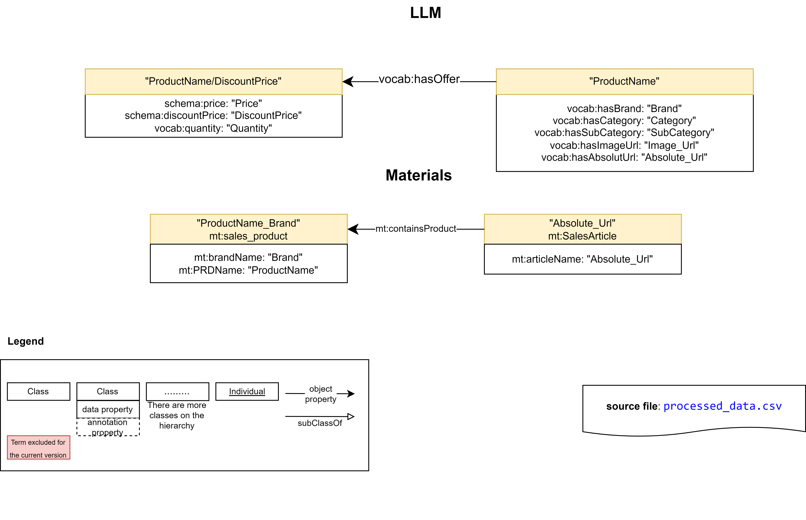

### [Input](./Experiments/EntityAlignment/Materials-LLM/Input/)

|ent_links| [Related Entities](./Experiments/EntityAlignment/Materials-LLM/Input/ent_links)|Split 1 Test|
|:-:|:-:|:-:|
|<https://purl.org/ontologies/MT/SalesArticle> <https://vocab.um.es/sales_product/>| 8208 (100%)|3283 (100%)
| Total related entities |8208|3283

|Split|Training (50%) | Test (40%) | Validation (10%) |
|:-:|:-:|:-:|:-:|
|[1](./Experiments/EntityAlignment/Materials-LLM/Input/451_1fold/1/)|4104|3283|821|

### [Output](./Experiments/EntityAlignment/Materials-LLM/)

|Approach|Split|Aligned Ent|H@1 (%)|H@5 (%)|H@10 (%)|MR|MRR [0,1]|Run time | SalesArticle (#/%) |
|:-:|:-:|:-:|:-:|:-:|:-:|:-:|:-:|:-:|:-:|
|AlignE|1|[3283](./Experiments/EntityAlignment/Materials-LLM/Output/AlignE/1/nohup_materials-llm_aligne.txt)|14.10|18.28|18.37|1444|0.16|6060|253 (7.71%)|
|AliNet|1|[3283](./Experiments/EntityAlignment/Materials-LLM/Output/AliNet/1/error_output_materials-llm_alinet.txt)|E|r|r|o|r|||
|AttrE|1|[3283](./Experiments/EntityAlignment/Materials-LLM/Output/AttrE/1/nohup_materials-llm_attre.txt)|13.89|18.31|18.86|818|0.16|5578|243 (7.40%)|
|BootEA|1|[3283](./Experiments/EntityAlignment/Materials-LLM/Output/BootEA/1/nohup_materials-llm_bootea.txt)|14.23|18.25|18.31|1500|0.16|6573|253 (7.71%)|
|BootEA_RotatE|1|[3283](./Experiments/EntityAlignment/Materials-LLM/Output/BootEA_RotatE/1/nohup_materials-llm_bootea_rotate.txt)|13.98|18.22|18.34 |1583|0.16|16927|253 (7.71%)|
|BootEA_TransH|1|[3283](./Experiments/EntityAlignment/Materials-LLM/Output/BootEA_TransH/1/error_output_materials-llm_bootea_transh.txt)|E|r|r|o|r|||
|Conve|1|[3283](./Experiments/EntityAlignment/Materials-LLM/Output/ConvE/1/error_output_materials-llm_conve.txt)|E|r|r|o|r|||
|GCN_Align|1|[3283](./Experiments/EntityAlignment/Materials-LLM/Output/GCN_Align/1/nohup_materials-llm_gcnalign.txt)|14.38|18.31|18.37|1575|0.16|845|253 (7.71%)|
|GMNN|1|[3283](./Experiments/EntityAlignment/Materials-LLM/Output/GMNN/1/error_output_materials-llm_gmnn.txt)|E|r|r|o|r|||
|HolE|1|[3283](./Experiments/EntityAlignment/Materials-LLM/Output/HolE/1/nohup_materials-llm_hole.txt)|14.01|17.70|17.70|1453|0.16|11157|243 (7.40%)|
|IMUSE|1|[3283](./Experiments/EntityAlignment/Materials-LLM/Output/IMUSE/1/error_output_materials-llm_imuse.txt)|E|r|r|o|r|||
|IPTransE|1|[3283](./Experiments/EntityAlignment/Materials-LLM/Output/IPTransE/1/error_output_materials-llm_iptranse.txt)|E|r|r|o|r|||
|JAPE|1|[3283](./Experiments/EntityAlignment/Materials-LLM/Output/JAPE/1/nohup_materials-llm_jape.txt)|14.16|17.70|17.70|1597|0.16|1723|243 (7.40%)|
|KDCoE|1|[3283](./Experiments/EntityAlignment/Materials-LLM/Output/KDCoE/1/error_output_materials-llm_kdcoe.txt)|E|r|r|o|r|||
|MTransE|1|[3283](./Experiments/EntityAlignment/Materials-LLM/Output/MTransE/1/)|14.38|18.25|18.28|1552|0.16|832|252 (7.68%)|
|MultiKE|1|[3283](./Experiments/EntityAlignment/Materials-LLM/Output/MultiKE/1/error_output_materials-llm_multike.txt)|E|r|r|o|r|||
|ProjE|1|[3283](./Experiments/EntityAlignment/Materials-LLM/Output/ProjE/1/nohup_materials-llm_proje.txt)|13.92|17.76|17.85|1384|0.16|5475|243 (7.40%)|
|RDGCN|1|[3283](./Experiments/EntityAlignment/Materials-LLM/Output/RDGCN/1/error_output_materials-llm_rdgcn.txt)|E|r|r|o|r|||
|RotatE|1|[3283](./Experiments/EntityAlignment/Materials-LLM/Output/RotatE/1/nohup_materials-llm_rotate.txt)|14.38|17.70|17.70|1586|0.16|7099|243 (7.40%)|
|RSN4EA|1|[3283](./Experiments/EntityAlignment/Materials-LLM/Output/RSN4EA/1/error_output_materials-llm_rsn4ea.txt)|E|r|r|o|r|||
|SEA|1|[3283](./Experiments/EntityAlignment/Materials-LLM/Output/SEA/1/nohup_materials-llm_sea.txt)|14.01|18.34|18.49|1364|0.16|651|253 (7.71%)|
|SimplE|1|[3283](./Experiments/EntityAlignment/Materials-LLM/Output/SimplE/1/nohup_materials-llm_simple.txt)|13.83|17.70|17.73|1587|0.16|1127|240 (7.31%)|
|TransD|1|[3283](./Experiments/EntityAlignment/Materials-LLM/Output/TransD/1/nohup_materials-llm_transd.txt)|13.83|17.64|17.73|1457|0.16|2426|239 (7.28%)|
|TransH|1|[3283](./Experiments/EntityAlignment/Materials-LLM/Output/TransH/1/nohup_materials-llm_transh.txt)|13.86|17.61|17.73|1551|0.16|1518|240 (7.31%)|
|TransR|1|[3283](./Experiments/EntityAlignment/Materials-LLM/Output/TransR/1/nohup_materials-llm_transr.txt)|0.15|0.58|0.85|1509|0.1|4549|4 (0.12%)|

## Results

<figcaption><strong>Figure Methods Boxplot.</strong> Boxplot of the OpenEA methods according to the Hits@1 metric of the 10 pairwise comparisons of the KGs generated from the Bigbasket Products dataset. The orange solid line represents the median and the red diamond the mean of the experiments that did not lead to an error. The number of experiments without error is shown in brackets next to the name of the method. BootEA-TransH, ConvE, KDCoE and MultiKE are not shown because their error rate is equal to 1 for all datasets.</figcaption>

<figcaption><strong>Figure Methods Clustering.</strong> Hierarchical clustering (Ward algorithm) of 25 OpenEA methods according to the 5 metrics for the 10 pairwise comparisons of the KGs generated from the Bigbasket Products dataset.</figcaption>

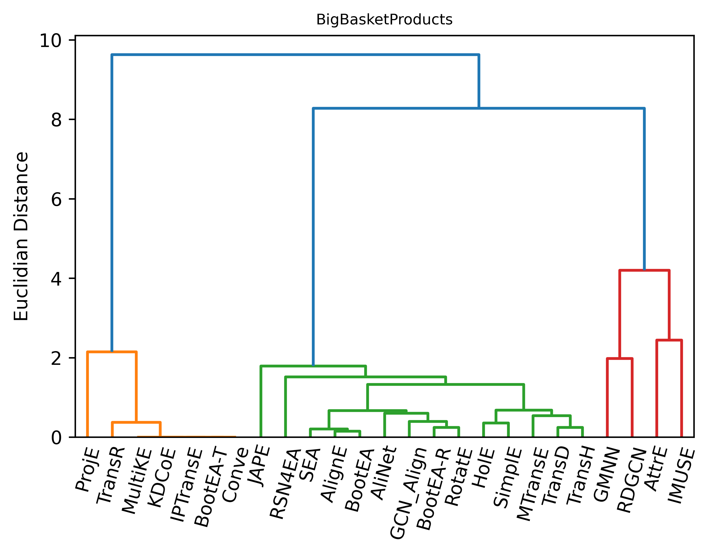

<figcaption><strong>Figure Experiments Boxplot.</strong> Boxplot of the 10 types of pairwise comparison experiments of KGs based on the Hits@1 score obtained by the 25 methods carried out in the Bigbasket Products dataset. The orange solid line represents the median and the red diamond the mean of the experiments that did not lead to an error. The number of modules that did not generate an error is shown in brackets under the name of the experiment represented.</figcaption>

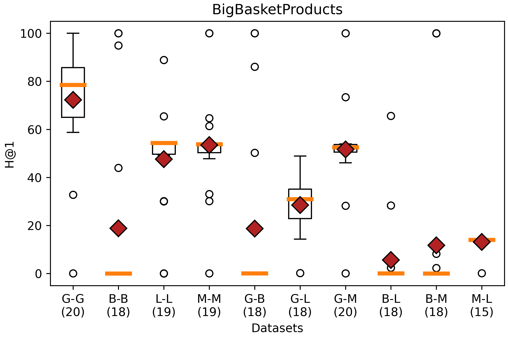

<figcaption><strong>Figure Experiments Clustering.</strong> Hierarchical clustering, with method Ward, of the 10 types of pairwise comparison experiments of KG, according to the 5 metrics, with all the values scaled to the range [0,1], of the 25 (at most) OpenEA modules carried out in the Bigbasket Products dataset.</figcaption>

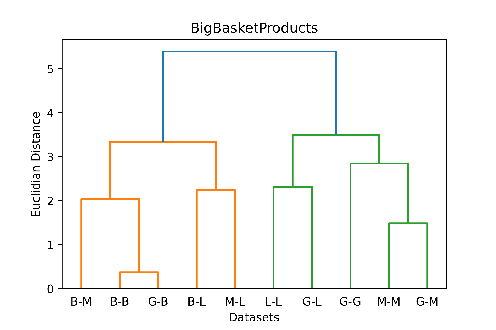

## Merged methods

|Pair|Approach|SalesArticle (#/%) | Product (#/%) | Category (#/%) | SubCategory (#/%) | SalesSpecification (#/%) |
|:-:|:-:|:-:|:-:|:-:|:-:|:-:|
|Basic-Basic|AttrE|3117 (94.94%)| - | - | - | - |
|Basic-Basic|BootEA|1 (0.03%)| - | - | - | - |
|Basic-Basic|AlignE|0 (0%)| - | - | - | - |
|Basic-Basic|SEA|0 (0%)| - | - | - | - |
|Basic-Basic|AttrE-BootEA|3117 (94.94%)| - | - | - | - |
|Basic-Basic|AttrE-AlignE|3117 (94.94%)| - | - | - | - |
|Basic-Basic|AttrE-SEA|3117 (94.94%)| - | - | - | - |
|Basic-Gold|AttrE|2825 (86.05%)| - | - | - | - |
|Basic-Gold|BootEA|0 (0%)| - | - | - | - |
|Basic-Gold|AlignE|2 (0.06%)| - | - | - | - |
|Basic-Gold|SEA|4 (0.12%)| - | - | - | - |
|Basic-Gold|AttrE-BootEA|2825 (86.05%)| - | - | - | - |
|Basic-Gold|AttrE-AlignE|2825 (86.05%)| - | - | - | - |
|Basic-Gold|AttrE-SEA|2825 (86.05%)| - | - | - | - |
|Basic-LLM|AttrE|2258 (68.78%)| - | - | - | - |
|Basic-LLM|BootEA|2 (0.06%)| - | - | - | - |
|Basic-LLM|AlignE|0 (0%)| - | - | - | - |
|Basic-LLM|SEA|0 (0%)| - | - | - | - |
|Basic-LLM|AttrE-BootEA|2259 (68.81%)| - | - | - | - |
|Basic-LLM|AttrE-AlignE|2258 (68.78%)| - | - | - | - |
|Basic-LLM|AttrE-SEA|2258 (68.78%)| - | - | - | - |
|Basic-Materials|AttrE|75 (2.28%)| - | - | - | - |
|Basic-Materials|BootEA|1 (0.03%)| - | - | - | - |
|Basic-Materials|AlignE|0 (0%)| - | - | - | - |
|Basic-Materials|SEA|0 (0%)| - | - | - | - |
|Basic-Materials|AttrE-BootEA|76 (2.31%)| - | - | - | - |
|Basic-Materials|AttrE-AlignE|75 (2.28%)| - | - | - | - |
|Basic-Materials|AttrE-SEA|75 (2.28%)| - | - | - | - |
|Gold-Gold|AttrE|3058 (92.36%)|2548 (94.27%)|3 (100%)|124 (100%)|1782 (98.67%)|
|Gold-Gold|BootEA|2973 (89.79%)|2418 (89.46%)|3 (100%)|124 (100%)|1608 (89.04%)|
|Gold-Gold|AlignE|2744 (82.88%)|2100 (77.69%)|3 (100%)|124 (100%)|1455 (80.56%)|
|Gold-Gold|SEA|2668 (80.58%)|2260 (83.61%)|3 (100%)|123 (99.19%)|1485 (82.23%)|
|Gold-Gold|AttrE-BootEA|3195 (96.50%)|2633 (97.41%)|3 (100%)|124 (100%)|1794 (99.34%)|
|Gold-Gold|AttrE-AlignE|3117 (94.14%)|2562 (94.78%)|3 (100%)|124 (100%)|1782 (98.67%)|
|Gold-Gold|AttrE-SEA|3122 (94.29%)|2596 (96.04%)|3 (100%)|124 (100%)|1785 (98.84%)|
|Gold-LLM|AttrE|1760 (53.63%)| - | - | - |2380 (73.01%)|
|Gold-LLM|BootEA|1525 (46.47%)| - | - | - |2085 (63.96%)|
|Gold-LLM|AlignE|1517 (46.22%)| - | - | - |1959 (60.09%)|
|Gold-LLM|SEA|1612 (49.12%)| - | - | - |1179 (36.17%)|
|Gold-LLM|AttrE-BootEA|1920 (58.50%)| - | - | - |1833 (81.83%)|
|Gold-LLM|AttrE-AlignE|1905 (58.04%)| - | - | - |1796 (80.18%)|
|Gold-LLM|AttrE-SEA|1904 (58.01%)| - | - | - |1694 (75.63%)|
|Gold-Materials|AttrE|1543 (47.10%)|1637 (59.66%)| - | - | - |
|Gold-Materials|BootEA|1729 (52.78%)|1509 (54.99%)| - | - | - |
|Gold-Materials|AlignE|1701 (51.92%)|1508 (54.96%)| - | - | - |
|Gold-Materials|SEA|1714 (52.32%)|1506 (54.88%)| - | - | - |
|Gold-Materials|AttrE-BootEA|1789 (54.61%)|1641 (59.80%)| - | - | - |
|Gold-Materials|AttrE-AlignE|1754 (53.54%)|1640 (59.77%)| - | - | - |
|Gold-Materials|AttrE-SEA|1775 (54.18%)|1638 (59.69%)| - | - | - |
|Materials-LLM|AttrE|243 (7.40%)| - | - | - | - |
|Materials-LLM|BootEA|253 (7.71%)| - | - | - | - |
|Materials-LLM|AlignE|253 (7.71%)| - | - | - | - |
|Materials-LLM|SEA|253 (7.71%)| - | - | - | - |
|Materials-LLM|AttrE-BootEA|255 (7.77%)| - | - | - | - |
|Materials-LLM|AttrE-AlignE|255 (7.77%)| - | - | - | - |
|Materials-LLM|AttrE-SEA|255 (7.77%)| - | - | - | - |
|Materials-Materials|AttrE|1871 (55.77%)|1825 (68.48%)| - | - | - |
|Materials-Materials|BootEA|1823 (54.34%)|1416 (53.13%)| - | - | - |
|Materials-Materials|AlignE|1829 (54.52%)|1419 (53.25%)| - | - | - |
|Materials-Materials|SEA|1829 (54.52%)|1416 (53.13%)| - | - | - |
|Materials-Materials|AttrE-BootEA|1968 (58.66%)|1825 (68.48%)| - | - | - |
|Materials-Materials|AttrE-AlignE|1968 (58.66%)|1827 (68.56%)| - | - | - |
|Materials-Materials|AttrE-SEA|1962 (58.48%)|1825 (68.48%)| - | - | - |
|LLM-LLM|AttrE|2302 (84.51%)| - | - | - |2998 (92.53%)|
|LLM-LLM|BootEA|1517 (55.69%)| - | - | - |1736 (53.58%)|
|LLM-LLM|AlignE|1517 (55.69%)| - | - | - |1730 (53.40%)|
|LLM-LLM|SEA|1517 (55.69%)| - | - | - |1536 (47.41%)|
|LLM-LLM|AttrE-BootEA|2303 (84.54%)| - | - | - |3001 (92.62%)|
|LLM-LLM|AttrE-AlignE|2302 (84.51%)| - | - | - |3002 (92.65%)|
|LLM-LLM|AttrE-SEA|2303 (84.54%)| - | - | - |2998 (92.53%)|

