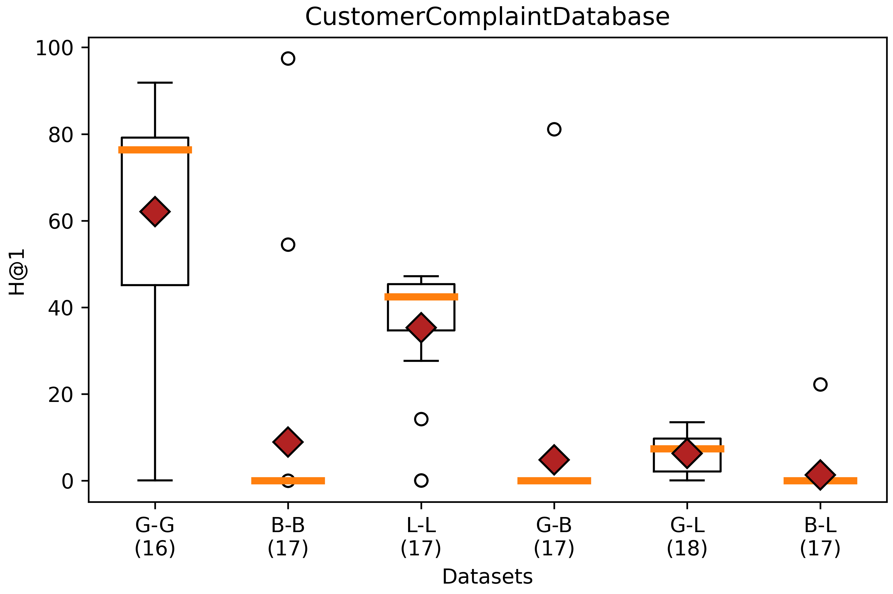

# CustomerComplaintDatabase Data

* URL: <https://www.kaggle.com/datasets/sjleshrac/airlines-customer-satisfaction>
* Format: CSV
* Description: "The Consumer Complaint Database is a collection of complaints about consumer financial products and services that we sent to companies for response".

## Ontologies

* [Basic](./Ontologies/Basic_CustomerComplaint.owl)
* [LLM](./Ontologies/LLM_CustomerComplaint.owl)
* [Gold](./Ontologies/Gold_CustomerComplaint.owl)
* AP - Not applicable. Reference ontologies do not cover the dataset properly. 

## Mapping

|Mapping |Dataset| RDF | attr_triples | rel_triples |
|:-:|:-:|:-:|:-:|:-:|
|[Basic](./Mappings/basic_mapping.csv.ttl)|[CustomerComplaint_data20k.csv](./SourceFiles/CustomerComplaint_data20k.csv)|[289,356 triples](./Mappings/Basic_CustomerComplaint_data20k.nt)|[269,362 triples](./EntityAlignment/Basic-Basic/Input/attr_triples_1)|[20,000 triples](./EntityAlignment/Basic-Basic/Input/rel_triples_1)|
|[Gold](./Mappings/gold_mapping.csv.ttl)|[CustomerComplaint_data20k.csv](./SourceFiles/CustomerComplaint_data20k.csv)|[331,542 triples](./Mappings/Gold_CustomerComplaint_data20k.nt)|[171,043 triples](./EntityAlignment/Gold-Gold/Input/attr_triples_1)|[160,505 triples](./EntityAlignment/Gold-Gold/Input/rel_triples_1)|
|[LLM](./Mappings/LLM_mapping.csv.ttl)|[CustomerComplaint_data20k.csv](./SourceFiles/CustomerComplaint_data20k.csv)|[242,263 triples](./Mappings/LLM_CustomerComplaint_data20k.nt)|[61,724 triples](./EntityAlignment/LLM-LLM/Input/attr_triples_1)|[180,545 triples](./EntityAlignment/LLM-LLM/Input/rel_triples_1)|

## [Basic - Basic](./EntityAlignment/Basic-Basic/)

### [Input](./EntityAlignment/Basic-Basic/Input/)

|ent_links| [Related Entities](./EntityAlignment/Basic-Basic/Input/ent_links)|[Split 1 Test](./EntityAlignment/Basic-Basic/Input/541_5fold/1/test_links)|
|:-:|:-:|:-:|
|<https://vocab.um.es#CustomerComplaint> - <https://vocab.um.es#CustomerComplaint>| 20,000 (100%)|8,000 (100%)|
|Total related entities|20,000|8,000|

|Split|Training (50%) | Test (40%) | Validation (10%) |
|:-:|:-:|:-:|:-:|
|[1](./EntityAlignment/Basic-Basic/Input/541_5fold/1)|10.000|8.000|2.000|

### [Output](./EntityAlignment/Basic-Basic/Output/)

|Approach|Split|Aligned Ent|H@1 (%)|H@5 (%)|H@10 (%)|MR|MRR [0,1]|Run time (s)|CustomerComplaint (%)|
|:-:|:-:|:-:|:-:|:-:|:-:|:-:|:-:|:-:|:-:|
|AlignE|[1](./EntityAlignment/Basic-Basic/Input/541_5fold/1)|[8,000](./EntityAlignment/Basic-Basic/Output/AlignE/nohup_aligne.txt)|0.00|0.11|0.18|4021|0.00|2564|0 (0%)|
|AliNet|[1](./EntityAlignment/Basic-Basic/Input/541_5fold/1)|8,000|E|r|r|o|r||
|AttrE|[1](./EntityAlignment/Basic-Basic/Input/541_5fold/1)|[8,000](./EntityAlignment/Basic-Basic/Output/AttrE/nohup_attre.txt)|97.44|100|100|1|0.99|8517|7795 (97.44%)|
|BootEA|[1](./EntityAlignment/Basic-Basic/Input/541_5fold/1)|[8,000](./EntityAlignment/Basic-Basic/Output/BootEA/nohup_bootea.txt)|0.00|0.04|0.14|4012|0.00|3646|0 (0%)|
|BootEA_RotatE|[1](./EntityAlignment/Basic-Basic/Input/541_5fold/1)|[8,000](./EntityAlignment/Basic-Basic/Output/BootEA-RotatE/nohup_bootea_rotate.txt)|0.01|0.06|0.14|4024|0.00|5760|1 (0.01%)|
|BootEA_TransH|[1](./EntityAlignment/Basic-Basic/Input/541_5fold/1)|8,000|E|r|r|o|r||
|Conve|[1](./EntityAlignment/Basic-Basic/Input/541_5fold/1)|8,000|E|r|r|o|r||
|GCN_Align|[1](./EntityAlignment/Basic-Basic/Input/541_5fold/1)|[8,000](./EntityAlignment/Basic-Basic/Output/GCN_Align/nohup_gcnalign.txt)|0.00|0.11|0.20|4014|0.00|784|0 (0%)|
|GMNN|[1](./EntityAlignment/Basic-Basic/Input/541_5fold/1)|8,000|E|r|r|o|r||
|HolE|[1](./EntityAlignment/Basic-Basic/Input/541_5fold/1)|[8,000](./EntityAlignment/Basic-Basic/Output/HolE/nohup_hole.txt)|0.03|0.08|0.16|3983|0.00|3274|2 (0.03%)|
|IMUSE|[1](./EntityAlignment/Basic-Basic/Input/541_5fold/1)|[8,000](./EntityAlignment/Basic-Basic/Output/IMUSE/nohup_imuse.txt)|54.48|54.49|54.51|1831|0.55|2565|4358 (54.47%)|
|IPTransE|[1](./EntityAlignment/Basic-Basic/Input/541_5fold/1)|8,000|E|r|r|o|r||
|JAPE|[1](./EntityAlignment/Basic-Basic/Input/541_5fold/1)|[8,000](./EntityAlignment/Basic-Basic/Output/JAPE/nohup_jape.txt)|0.00|0.13|0.21|3998|0.00|4743|0 (0%)|
|KDCoE|[1](./EntityAlignment/Basic-Basic/Input/541_5fold/1)|8,000|E|r|r|o|r||
|MTransE|[1](./EntityAlignment/Basic-Basic/Input/541_5fold/1)|[8,000](./EntityAlignment/Basic-Basic/Output/MTransE/nohup_mtranse.txt)|0.01|0.08|0.11|3992|0.00|595|1 (0.01%)|
|MultiKE|[1](./EntityAlignment/Basic-Basic/Input/541_5fold/1)|8,000|E|r|r|o|r||
|ProjE|[1](./EntityAlignment/Basic-Basic/Input/541_5fold/1)|[8,000](./EntityAlignment/Basic-Basic/Output/ProjE/nohup_proje.txt)|0.03|0.09|0.13|3985|0.00|3034|2 (0.03%)|
|RDGCN|[1](./EntityAlignment/Basic-Basic/Input/541_5fold/1)|[8,000](./EntityAlignment/Basic-Basic/Output/RDGCN/nohup_rdgcn.txt)|0.01|0.06|0.13|4001|0.00|8604|1 (0.01%)|
|RotatE|[1](./EntityAlignment/Basic-Basic/Input/541_5fold/1)|[8,000](./EntityAlignment/Basic-Basic/Output/RotatE/nohup_rotate.txt)|0.00|0.05|0.10|4006|0.00|3097|0 (0%)|
|RSN4EA|[1](./EntityAlignment/Basic-Basic/Input/541_5fold/1)|8,000|E|r|r|o|r||
|SEA|[1](./EntityAlignment/Basic-Basic/Input/541_5fold/1)|[8,000](./EntityAlignment/Basic-Basic/Output/SEA/nohup_sea.txt)|0.00|0.08|0.11|4002|0.00|334|0 (0%)|
|SimplE|[1](./EntityAlignment/Basic-Basic/Input/541_5fold/1)|[8,000](./EntityAlignment/Basic-Basic/Output/SimplE/nohup_simple.txt)|0.01|0.05|0.11|3959|0.00|353|1 (0.01%)|
|TransD|[1](./EntityAlignment/Basic-Basic/Input/541_5fold/1)|[8,000](./EntityAlignment/Basic-Basic/Output/TransD/nohup_transd.txt)|0.01|0.04|0.08|4043|0.00|600|1 (0.01%)|
|TransH|[1](./EntityAlignment/Basic-Basic/Input/541_5fold/1)|[8,000](./EntityAlignment/Basic-Basic/Output/TransH/nohup_transh.txt)|0.00|0.03|0.08|4047|0.00|551|0 (0%)|
|TransR|[1](./EntityAlignment/Basic-Basic/Input/541_5fold/1)|[8,000](./EntityAlignment/Basic-Basic/Output/TransR/nohup_transr.txt)|0.01|0.08|0.16|4006|0.00|1425|1 (0.01%)|

## [Basic - Gold](./EntityAlignment/Basic-Gold/)

### [Input](./EntityAlignment/Basic-Gold/Input/)

|ent_links| [Related Entities](./EntityAlignment/Basic-Gold/Input/ent_links)|[Split 1 Test](./EntityAlignment/Basic-Gold/Input/541_5fold/1/test_links)|
|:-:|:-:|:-:|
|<https://vocab.um.es#CustomerComplaint> - <https://vocab.um.es#CustomerComplaint>| 20,000 (100%)|8,000 (100%)|
| Total related entities |20,000|8,000|

|Split|Training (50%) | Test (40%) | Validation (10%) |
|:-:|:-:|:-:|:-:|
|[1](./EntityAlignment/Basic-Gold/Input/541_5fold/1)|10,000|8,000|2,000|

### [Output](./EntityAlignment/Basic-Gold/Output/)

|Approach|Split|Aligned Ent|H@1 (%)|H@5 (%)|H@10 (%)|MR|MRR [0,1]|Run time (s)|CustomerComplaint (%)|
|:-:|:-:|:-:|:-:|:-:|:-:|:-:|:-:|:-:|:-:|
|AlignE|[1](./EntityAlignment/Basic-Gold/Input/541_5fold/1)|[8,000](./EntityAlignment/Basic-Gold/Output/AlignE/nohup_aligne.txt)|0.00|0.05|0.09|4001|0.00|5116|0 (0%)|
|AliNet|[1](./EntityAlignment/Basic-Gold/Input/541_5fold/1)|8,000|E|r|r|o|r||
|AttrE|[1](./EntityAlignment/Basic-Gold/Input/541_5fold/1)|[8,000](./EntityAlignment/Basic-Gold/Output/AttrE/nohup_attre.txt)|81.13|97.76|99.29|1|0.88|19063|6490 (81.13%)|
|BootEA|[1](./EntityAlignment/Basic-Gold/Input/541_5fold/1)|[8,000](./EntityAlignment/Basic-Gold/Output/BootEA/nohup_bootea.txt)|0.01|0.09|0.19|4017|0.00|5307|1 (0.01%)|
|BootEA_RotatE|[1](./EntityAlignment/Basic-Gold/Input/541_5fold/1)|[8,000](./EntityAlignment/Basic-Gold/Output/BootEA-RotatE/nohup_bootea_rotate.txt)|0.01|0.05|0.14|4014|0.00|16392|1 (0.01%)|
|BootEA_TransH|[1](./EntityAlignment/Basic-Gold/Input/541_5fold/1)|8,000|E|r|r|o|r||
|Conve|[1](./EntityAlignment/Basic-Gold/Input/541_5fold/1)|8,000|E|r|r|o|r||
|GCN_Align|[1](./EntityAlignment/Basic-Gold/Input/541_5fold/1)|[8,000](./EntityAlignment/Basic-Gold/Output/GCN_Align/nohup_gcnalign.txt)|0.03|0.06|0.08|3998|0.00|497|2 (0.03%)|
|GMNN|[1](./EntityAlignment/Basic-Gold/Input/541_5fold/1)|8,000|E|r|r|o|r||
|HolE|[1](./EntityAlignment/Basic-Gold/Input/541_5fold/1)|[8,000](./EntityAlignment/Basic-Gold/Output/HolE/nohup_hole.txt)|0.01|0.04|0.08|3989|0.00|7220|1 (0.01%)|
|IMUSE|[1](./EntityAlignment/Basic-Gold/Input/541_5fold/1)|[8,000](./EntityAlignment/Basic-Gold/Output/IMUSE/nohup_imuse.txt)|0.01|0.06|0.15|3990|0.00|1336|1 (0.01%)|
|IPTransE|[1](./EntityAlignment/Basic-Gold/Input/541_5fold/1)|8,000|E|r|r|o|r||
|JAPE|[1](./EntityAlignment/Basic-Gold/Input/541_5fold/1)|[8,000](./EntityAlignment/Basic-Gold/Output/JAPE/nohup_jape.txt)|0.01|0.05|0.09|4009|0.00|2917|1 (0.01%)|
|KDCoE|[1](./EntityAlignment/Basic-Gold/Input/541_5fold/1)|8,000|E|r|r|o|r||
|MTransE|[1](./EntityAlignment/Basic-Gold/Input/541_5fold/1)|[8,000](./EntityAlignment/Basic-Gold/Output/MTransE/nohup_mtranse.txt)|0.05|0.05|0.13|3999|0.00|1845|4 (0.05%)|
|MultiKE|[1](./EntityAlignment/Basic-Gold/Input/541_5fold/1)|8,000|E|r|r|o|r||
|ProjE|[1](./EntityAlignment/Basic-Gold/Input/541_5fold/1)|[8,000](./EntityAlignment/Basic-Gold/Output/ProjE/nohup_proje.txt)|0.00|0.03|0.09|4038|0.00|5735|0 (0%)|
|RDGCN|[1](./EntityAlignment/Basic-Gold/Input/541_5fold/1)|[8,000](./EntityAlignment/Basic-Gold/Output/RDGCN/nohup_rdgcn.txt)|0.03|0.05|0.13|3994|0.00|21775|2 (0.03%)|
|RotatE|[1](./EntityAlignment/Basic-Gold/Input/541_5fold/1)|[8,000](./EntityAlignment/Basic-Gold/Output/RotatE/nohup_rotate.txt)|0.01|0.04|0.11|4008|0.00|9815|1 (0.01%)|
|RSN4EA|[1](./EntityAlignment/Basic-Gold/Input/541_5fold/1)|8,000|E|r|r|o|r||
|SEA|[1](./EntityAlignment/Basic-Gold/Input/541_5fold/1)|[8,000](./EntityAlignment/Basic-Gold/Output/SEA/nohup_sea.txt)|0.00|0.04|0.08|4010|0.00|854|0 (0%)|
|SimplE|[1](./EntityAlignment/Basic-Gold/Input/541_5fold/1)|[8,000](./EntityAlignment/Basic-Gold/Output/SimplE/nohup_simple.txt)|0.04|0.04|0.11|4014|0.00|478|3 (0.04%)|
|TransD|[1](./EntityAlignment/Basic-Gold/Input/541_5fold/1)|[8,000](./EntityAlignment/Basic-Gold/Output/TransD/nohup_transd.txt)|0.01|0.11|0.21|4005|0.00|1799|1 (0.01%)|
|TransH|[1](./EntityAlignment/Basic-Gold/Input/541_5fold/1)|[8,000](./EntityAlignment/Basic-Gold/Output/TransH/nohup_transh.txt)|0.01|0.06|0.13|4004|0.00|1296|1 (0.01%)|
|TransR|[1](./EntityAlignment/Basic-Gold/Input/541_5fold/1)|[8,000](./EntityAlignment/Basic-Gold/Output/TransR/nohup_transr.txt)|0.04|0.06|0.13|3971|0.00|4232|3 (0.04%)|

## [Basic - LLM](./EntityAlignment/Basic-LLM/)

### [Input](./EntityAlignment/Basic-LLM/Input/)

|ent_links| [Related Entities](./EntityAlignment/Basic-LLM/Input/ent_links)|[Split 1 Test](./EntityAlignment/Basic-LLM/Input/541_5fold/1/test_links)|
|:-:|:-:|:-:|
|<https://vocab.um.es#CustomerComplaint> - <https://vocab.um.es#CustomerComplaint>| 20,000 (100%)|8,000 (100%)|
| Total related entities |20,000|8,000|

|Split|Training (50%) | Test (40%) | Validation (10%) |
|:-:|:-:|:-:|:-:|
|[1](./EntityAlignment/Basic-LLM/Input/541_5fold/1)|10,000|8,000|2,000|

### [Output](./EntityAlignment/Basic-LLM/Output/)

|Approach|Split|Aligned Ent|H@1 (%)|H@5 (%)|H@10 (%)|MR|MRR [0,1]|Run time (s)|CustomerComplaint (%)|
|:-:|:-:|:-:|:-:|:-:|:-:|:-:|:-:|:-:|:-:|
|AlignE|[1](./EntityAlignment/Basic-LLM/Input/541_5fold/1)|[8,000](./EntityAlignment/Basic-LLM/Output/AlignE/nohup_aligne.txt)|0.03|0.10|0.18|4005|0.00|11714|2 (0.03%)|
|AliNet|[1](./EntityAlignment/Basic-LLM/Input/541_5fold/1)|8,000|E|r|r|o|r||
|AttrE|[1](./EntityAlignment/Basic-LLM/Input/541_5fold/1)|[8,000](./EntityAlignment/Basic-LLM/Output/AttrE/nohup_attre.txt)|22.26|48.30|62.98|15|0.35|14702|1781 (22.26%)|
|BootEA|[1](./EntityAlignment/Basic-LLM/Input/541_5fold/1)|[8,000](./EntityAlignment/Basic-LLM/Output/BootEA/nohup_bootea.txt)|0.00|0.03|0.06|4009|0.00|10966|0 (0%)|
|BootEA_RotatE|[1](./EntityAlignment/Basic-LLM/Input/541_5fold/1)|[8,000](./EntityAlignment/Basic-LLM/Output/BootEA-RotatE/nohup_bootea_rotate.txt)|0.03|0.06|0.13|3975|0.00|22872|2 (0.03%)|
|BootEA_TransH|[1](./EntityAlignment/Gold-LLM/Input/541_5fold/1)|8,000|E|r|r|o|r||
|Conve|[1](./EntityAlignment/Basic-LLM/Input/541_5fold/1)|8,000|E|r|r|o|r||
|GCN_Align|[1](./EntityAlignment/Basic-LLM/Input/541_5fold/1)|[8,000](./EntityAlignment/Basic-LLM/Output/GCN_Align/nohup_gcnalign.txt)|0.00|0.05|0.10|4019|0.00|1360|0 (0%)|
|GMNN|[1](./EntityAlignment/Basic-LLM/Input/541_5fold/1)|8,000|E|r|r|o|r||
|HolE|[1](./EntityAlignment/Basic-LLM/Input/541_5fold/1)|[8,000](./EntityAlignment/Basic-LLM/Output/HolE/nohup_hole.txt)|0.03|0.05|0.10|4040|0.00|13178|2 (0.03%)|
|IMUSE|[1](./EntityAlignment/Basic-LLM/Input/541_5fold/1)|[8,000](./EntityAlignment/Basic-LLM/Output/IMUSE/nohup_imuse.txt)|0.33|0.40|0.43|4006|0.00|2166|26 (0.33%)|
|IPTransE|[1](./EntityAlignment/Basic-LLM/Input/541_5fold/1)|8,000|E|r|r|o|r||
|JAPE|[1](./EntityAlignment/Basic-LLM/Input/541_5fold/1)|[8,000](./EntityAlignment/Basic-LLM/Output/JAPE/nohup_jape.txt)|0.03|0.09|0.18|4031|0.00|5523|2 (0.03%)|
|KDCoE|[1](./EntityAlignment/Basic-LLM/Input/541_5fold/1)|8,000|E|r|r|o|r||
|MTransE|[1](./EntityAlignment/Basic-LLM/Input/541_5fold/1)|[8,000](./EntityAlignment/Basic-LLM/Output/MTransE/nohup_mtranse.txt)|0.03|0.10|0.21|3970|0.00|3055|2 (0.03%)|
|MultiKE|[1](./EntityAlignment/Basic-LLM/Input/541_5fold/1)|8,000|E|r|r|o|r||
|ProjE|[1](./EntityAlignment/Basic-LLM/Input/541_5fold/1)|[8,000](./EntityAlignment/Basic-LLM/Output/ProjE/nohup_proje.txt)|0.00|0.03|0.09|4018|0.00|14641|0 (0%)|
|RDGCN|[1](./EntityAlignment/Basic-LLM/Input/541_5fold/1)|[8,000](./EntityAlignment/Basic-LLM/Output/RDGCN/nohup_rdgcn.txt)|0.01|0.06|0.13|4001|0.00|17275|1 (0.01%)|
|RotatE|[1](./EntityAlignment/Basic-LLM/Input/541_5fold/1)|[8,000](./EntityAlignment/Basic-LLM/Output/RotatE/nohup_rotate.txt)|0.01|0.08|0.10|4004|0.00|14444|1 (0.01%)|
|RSN4EA|[1](./EntityAlignment/Basic-LLM/Input/541_5fold/1)|8,000|E|r|r|o|r||
|SEA|[1](./EntityAlignment/Basic-LLM/Input/541_5fold/1)|[8,000](./EntityAlignment/Basic-LLM/Output/SEA/nohup_sea.txt)|0.03|0.09|0.23|3988|0.00|1174|2 (0.03%)|
|SimplE|[1](./EntityAlignment/Basic-LLM/Input/541_5fold/1)|[8,000](./EntityAlignment/Basic-LLM/Output/SimplE/nohup_simple.txt)|0.01|0.06|0.10|4019|0.00|910|1 (0.01%)|
|TransD|[1](./EntityAlignment/Basic-LLM/Input/541_5fold/1)|[8,000](./EntityAlignment/Basic-LLM/Output/TransD/nohup_transd.txt)|0.01|0.06|0.18|3995|0.00|2611|1 (0.01%)|
|TransH|[1](./EntityAlignment/Basic-LLM/Input/541_5fold/1)|[8,000](./EntityAlignment/Basic-LLM/Output/TransH/nohup_transh.txt)|0.01|0.05|0.06|3990|0.00|2235|1 (0.01%)|
|TransR|[1](./EntityAlignment/Basic-LLM/Input/541_5fold/1)|[8,000](./EntityAlignment/Basic-LLM/Output/TransR/nohup_transr.txt)|0.04|0.06|0.11|3990|0.00|7164|3 (0.04%)|

## [Gold - Gold](./EntityAlignment/Gold-Gold/)

### [Input](./EntityAlignment/Gold-Gold/Input/)

|ent_links| [Related Entities](./EntityAlignment/Gold-Gold/Input/ent_links)|[Split 1 Test](./EntityAlignment/Gold-Gold/Input/541_5fold/1/test_links)|
|:-:|:-:|:-:|
|<https://vocab.um.es#CustomerComplaint> - <https://vocab.um.es#CustomerComplaint>|20,000 (32.79%)|7,912 (32.43%)|
|<https://vocab.um.es#Customer> - <https://vocab.um.es#Customer>|20,000 (32.79%)|8,057 (33.02%)|
|<https://vocab.um.es#Product> - <https://vocab.um.es#Product>|46 (0.08%)|16 (0.07%)|
|<https://vocab.um.es#SubProduct> - <https://vocab.um.es#SubProduct>|46 (0.08%)|23 (0.09%)|
|<https://vocab.um.es#CompanyResponse> - <https://vocab.um.es#CompanyResponse>|20,000 (32.79%)|8,051 (33.00%)|
|<https://vocab.um.es#Company> - <https://vocab.um.es#Company>|606 (0.99%)|228 (0.93%)|
|<https://vocab.um.es#ProblemOfComplaint> - <https://vocab.um.es#ProblemOfComplaint>|154 (0.25%)|60 (0.25%)|
|<https://vocab.um.es#ProblemSubCategory> - <https://vocab.um.es#ProblemSubCategory>|141 (0.23%)|50 (0.20%)|
| Total related entities |60,993|24,397|

|Split|Training (50%) | Test (40%) | Validation (10%) |
|:-:|:-:|:-:|:-:|
|[1](./EntityAlignment/Gold-Gold/Input/541_5fold/1)|30,496|24,397|6,100|

### [Output](./EntityAlignment/Gold-Gold/Output/)

|Approach|Split|Aligned Ent|H@1 (%)|H@5 (%)|H@10 (%)|MR|MRR [0,1]|Run time (s)|CustomerComplaint (%)|Customer (%)|Product (%)|SubProduct (%)|CompanyResponse (%)|Company (%)|ProblemOfComplaint (%)|ProblemSubCategory (%)|
|:-:|:-:|:-:|:-:|:-:|:-:|:-:|:-:|:-:|:-:|:-:|:-:|:-:|:-:|:-:|:-:|:-:|
|AlignE|[1](./EntityAlignment/Gold-Gold/Input/541_5fold/1)|[24,397](./EntityAlignment/Gold-Gold/Output/AlignE/nohup_aligne.txt)|79.15|81.10|81.74|181|0.80|85048|6266 (79.20%)|6273 (77.86%)|16 (100%)|23 (100%)|6404 (79.54%)|218 (95.61%)|60 (100%)|50 (100%)|
|AliNet|[1](./EntityAlignment/Gold-Gold/Input/541_5fold/1)|[24,397](./EntityAlignment/Gold-Gold/Output/AliNet/nohup_alinet.txt)|77.84|79.07|79.42|761|0.78|70667|6175 (78.05%)|6165 (76.52%)|16 (100%)|23 (100%)|6303 (78.29%)|198 (86.84%)|60 (100%)|50 (100%)|
|AttrE|[1](./EntityAlignment/Gold-Gold/Input/541_5fold/1)|[24,397](./EntityAlignment/Gold-Gold/Output/AttrE/nohup_attre.txt)|91.85|97.09|98.41|2|0.94|89985|7405 (93.59%)|7459 (92.58%)|16 (100%)|23 (100%)|7167 (89.02%)|228 (100%)|60 (100%)|50 (100%)|
|BootEA|[1](./EntityAlignment/Gold-Gold/Input/541_5fold/1)|[24,397](./EntityAlignment/Gold-Gold/Output/BootEA/nohup_bootea.txt)|80.32|81.81|82.31|155|0.81|79161|6327 (79.97%)|6415 (79.62%)|16 (100%)|23 (100%)|6482 (80.51%)|223 (97.81%)|60 (100%)|50 (100%)|
|BootEA_RotatE|[1](./EntityAlignment/Gold-Gold/Input/541_5fold/1)|[24,397](./EntityAlignment/Gold-Gold/Output/BootEA-RotatE/nohup_bootea_rotate.txt)|79.89|82.24|82.91|41|0.81|82532|6293 (79.54%)|6406 (79.51%)|16 (100%)|23 (100%)|6419 (79.73%)|223 (97.81%)|60 (100%)|50 (100%)|
|BootEA_TransH|[1](./EntityAlignment/Gold-Gold/Input/541_5fold/1)|24,397|E|r|r|o|r||
|Conve|[1](./EntityAlignment/Gold-Gold/Input/541_5fold/1)|24,397|E|r|r|o|r||
|GCN_Align|[1](./EntityAlignment/Gold-Gold/Input/541_5fold/1)|[24,397](./EntityAlignment/Gold-Gold/Output/GCN_Align/nohup_gcnalign.txt)|79.32|81.69|82.71|69|0.81|10601|6308 (79.73%)|6310 (78.32%)|16 (100%)|23 (100%)|6367 (79.08%)|218 (95.61%)|60 (100%)|50 (100%)|
|GMNN|[1](./EntityAlignment/Gold-Gold/Input/541_5fold/1)|24,397|E|r|r|o|r||
|HolE|[1](./EntityAlignment/Gold-Gold/Input/541_5fold/1)|[24,397](./EntityAlignment/Gold-Gold/Output/HolE/nohup_hole.txt)|63.73|70.20|72.66|481|0.67|147111|5678 (71.76%)|4533 (56.26%)|15 (93.75%)|3 (13.04%)|5146 (63.92%)|155 (67.98%)|10 (16.67%)|8 (16.00%)|
|IMUSE|[1](./EntityAlignment/Gold-Gold/Input/541_5fold/1)|[24,397](./EntityAlignment/Gold-Gold/Output/IMUSE/nohup_imuse.txt)|76.67|91.25|92.01|142|0.83|16321|6163 (77.89%)|5153 (63.96%)|16 (100%)|22 (95.65%)|7031 (87.33%)|211 (92.54%)|60 (100%)|49 (98.00%)|
|IPTransE|[1](./EntityAlignment/Gold-Gold/Input/541_5fold/1)|24,397|E|r|r|o|r||
|JAPE|[1](./EntityAlignment/Gold-Gold/Input/541_5fold/1)|[24,397](./EntityAlignment/Gold-Gold/Output/JAPE/nohup_jape.txt)|47.99|51.10|52.39|1687|0.50|26777|4202 (53.11%)|3601 (44.69%)|16 (100%)|11 (47.83%)|3647 (45.30%)|154 (67.54%)|58 (96.67%)|20 (40.00%)|
|KDCoE|[1](./EntityAlignment/Gold-Gold/Input/541_5fold/1)|24,397|E|r|r|o|r||
|MTransE|[1](./EntityAlignment/Gold-Gold/Input/541_5fold/1)|[24,397](./EntityAlignment/Gold-Gold/Output/MTransE/nohup_mtranse.txt)|36.69|41.62|43.55|1737|0.39|12798|4009 (50.67%)|2152 (26.71%)|12 (75.00%)|5 (21.74%)|2569 (31.91%)|142 (62.28%)|53 (88.33%)|9 (18.00%)|
|MultiKE|[1](./EntityAlignment/Gold-Gold/Input/541_5fold/1)|24,397|E|r|r|o|r||
|ProjE|[1](./EntityAlignment/Gold-Gold/Input/541_5fold/1)|[24,397](./EntityAlignment/Gold-Gold/Output/ProjE/nohup_proje.txt)|34.84|36.07|36.65|2808|0.36|52074|4177 (52.79%)|4083 (50.68%)|6 (37.50%)|2 (8.70%)|1 (0.01%)|196 (85.96%)|36 (60.00%)|0 (0%)|
|RDGCN|[1](./EntityAlignment/Gold-Gold/Input/541_5fold/1)|24,397|E|r|r|o|r||
|RotatE|[1](./EntityAlignment/Gold-Gold/Input/541_5fold/1)|24,397|E|r|r|o|r||
|RSN4EA|[1](./EntityAlignment/Gold-Gold/Input/541_5fold/1)|24,397|E|r|r|o|r||
|SEA|[1](./EntityAlignment/Gold-Gold/Input/541_5fold/1)|[24,397](./EntityAlignment/Gold-Gold/Output/SEA/nohup_sea.txt)|77.46|80.72|81.79|82|0.79|16147|6167 (77.94%)|6234 (77.37%)|16 (100%)|19 (82.61%)|6161 (76.52%)|209 (91.67%)|57 (95.00%)|35 (70.00%)|
|SimplE|[1](./EntityAlignment/Gold-Gold/Input/541_5fold/1)|[24,397](./EntityAlignment/Gold-Gold/Output/SimplE/nohup_simple.txt)|15.70|22.48|26.09|1168|0.19|7006|1782 (22.52%)|849 (10.54%)|4 (25.00%)|1 (4.35%)|1071 (13.30%)|113 (49.56%)|7 (11.67%)|4 (8.00%)|
|TransD|[1](./EntityAlignment/Gold-Gold/Input/541_5fold/1)|[24,397](./EntityAlignment/Gold-Gold/Output/TransD/nohup_transd.txt)|76.07|77.82|78.65|335|0.77|70741|6035 (76.28%)|6038 (74.94%)|16 (100%)|20 (86.96%)|6149 (76.38%)|194 (85.09%)|60 (100%)|47 (94.00%)|
|TransH|[1](./EntityAlignment/Gold-Gold/Input/541_5fold/1)|[24,397](./EntityAlignment/Gold-Gold/Output/TransH/nohup_transh.txt)|75.80|77.82|78.68|315|0.77|49420|6029 (76.20%)|5950 (73.85%)|16 (100%)|20 (86.96%)|6182 (76.79%)|191 (83.77%)|59 (98.33%)|46 (92.00%)|
|TransR|[1](./EntityAlignment/Gold-Gold/Input/541_5fold/1)|[24,397](./EntityAlignment/Gold-Gold/Output/TransR/nohup_transr.txt)|0.05|0.12|0.29|7970|0.00|15341|1 (0.01%)|5 (0.06%)|0 (0%)|0 (0%)|5 (0.06%)|0 (0%)|2 (3.33%)|0 (0%)|

## [Gold - LLM](./EntityAlignment/Gold-LLM/)

### [Input](./EntityAlignment/Gold-LLM/Input/)

|ent_links| [Related Entities](./EntityAlignment/Gold-LLM/Input/ent_links)|[Split 1 Test](./EntityAlignment/Gold-LLM/Input/541_5fold/1/test_links)|
|:-:|:-:|:-:|
|<https://vocab.um.es#CustomerComplaint> - <https://vocab.um.es#CustomerComplaint>|20,000 (48.79%)|8,072 (49.23%)|
|<https://vocab.um.es#Product> - <https://vocab.um.es#Product>|46 (0.11%)|17 (0.10%)|
|<https://vocab.um.es#SubProduct> - <https://vocab.um.es#SubProduct>|46 (0.11%)|14 (0.09%)|
|<https://vocab.um.es#CompanyResponse> - <https://vocab.um.es#CompanyResponse>|20,000 (48.79%)|7,929 (48.36%)|
|<https://vocab.um.es#Company> - <https://vocab.um.es#Company>|606 (1.48%)|244 (1.49%)|
|<https://vocab.um.es#ProblemOfComplaint> - <https://vocab.um.es#ProblemOfComplaint>|154 (0.38%)|61 (0.37%)|
|<https://vocab.um.es#ProblemSubCategory> - <https://vocab.um.es#ProblemSubCategory>|141 (0.34%)|60 (0.37%)|
| Total related entities |40,993|16,397|

|Split|Training (50%) | Test (40%) | Validation (10%) |
|:-:|:-:|:-:|:-:|
|[1](./EntityAlignment/Gold-LLM/Input/541_5fold/1)|20,496|16,397|4,100|

### [Output](./EntityAlignment/Gold-LLM/Output/)

|Approach|Split|Aligned Ent|H@1 (%)|H@5 (%)|H@10 (%)|MR|MRR [0,1]|Run time (s)|CustomerComplaint (%)|Product (%)|SubProduct (%)|CompanyResponse (%)|Company (%)|ProblemOfComplaint (%)|ProblemSubCategory (%)|
|:-:|:-:|:-:|:-:|:-:|:-:|:-:|:-:|:-:|:-:|:-:|:-:|:-:|:-:|:-:|:-:|
|AlignE|[1](./EntityAlignment/Gold-LLM/Input/541_5fold/1)|[16,397](./EntityAlignment/Gold-LLM/Output/AlignE/nohup_aligne.txt)|11.55|18.44|21.39|565|0.15|61536|1164 (14.42%)|17 (100%)|14 (100%)|350 (4.41%)|227 (93.03%)|61 (100%)|60 (100%)|
|AliNet|[1](./EntityAlignment/Gold-LLM/Input/541_5fold/1)|[16,397](./EntityAlignment/Gold-LLM/Output/AliNet/nohup_alinet.txt)|5.76|11.01|12.43|6462|0.08|39975|388 (4.81%)|17 (100%)|14 (100%)|203 (2.56%)|204 (83.61%)|60 (98.36%)|58 (96.67%)|
|AttrE|[1](./EntityAlignment/Gold-LLM/Input/541_5fold/1)|[16,397](./EntityAlignment/Gold-LLM/Output/AttrE/nohup_attre.txt)|13.49|22.93|27.62|401|0.18|43591|1476 (18.29%)|17 (100%)|14 (100%)|384 (4.84%)|216 (88.52%)|60 (98.36%)|45 (75.00%)|
|BootEA|[1](./EntityAlignment/Gold-LLM/Input/541_5fold/1)|[16,397](./EntityAlignment/Gold-LLM/Output/BootEA/nohup_bootea.txt)|11.92|18.78|21.74|524|0.16|54303|1237 (15.32%)|17 (100%)|14 (100%)|342 (4.31%)|223 (91.39%)|61 (100%)|60 (100%)|
|BootEA_RotatE|[1](./EntityAlignment/Gold-LLM/Input/541_5fold/1)|[16,397](./EntityAlignment/Gold-LLM/Output/BootEA-RotatE/nohup_bootea_rotate.txt)|9.58|17.00|20.65|506|0.13|65424|831 (10.29%)|17 (100%)|14 (100%)|365 (4.60%)|223 (91.39%)|61 (100%)|59 (98.33%)|
|BootEA_TransH|[1](./EntityAlignment/Gold-LLM/Input/541_5fold/1)|16,397|E|r|r|o|r||
|Conve|[1](./EntityAlignment/Gold-LLM/Input/541_5fold/1)|16,397|E|r|r|o|r||
|GCN_Align|[1](./EntityAlignment/Gold-LLM/Input/541_5fold/1)|[16,397](./EntityAlignment/Gold-LLM/Output/GCN_Align/nohup_gcnalign.txt)|9.74|17.36|21.14|583|0.14|6371|937 (11.61%)|11 (64.71%)|14 (100%)|346 (4.36%)|196 (80.33%)|38 (62.30%)|55 (91.67%)|
|GMNN|[1](./EntityAlignment/Gold-LLM/Input/541_5fold/1)|16,397|E|r|r|o|r||
|HolE|[1](./EntityAlignment/Gold-LLM/Input/541_5fold/1)|[16,397](./EntityAlignment/Gold-LLM/Output/HolE/nohup_hole.txt)|1.10|2.68|4.36|994|0.02|32721|86 (1.07%)|3 (17.65%)|3 (21.43%)|21 (0.26%)|34 (13.93%)|30 (49.18%)|3 (5.00%)|
|IMUSE|[1](./EntityAlignment/Gold-LLM/Input/541_5fold/1)|[16,397](./EntityAlignment/Gold-LLM/Output/IMUSE/nohup_imuse.txt)|10.00|17.18|20.63|502|0.14|14604|954 (11.82%)|17 (100%)|14 (100%)|325 (4.10%)|220 (90.16%)|60 (98.36%)|50 (83.33%)|
|IPTransE|[1](./EntityAlignment/Gold-LLM/Input/541_5fold/1)|16,397|E|r|r|o|r||
|JAPE|[1](./EntityAlignment/Gold-LLM/Input/541_5fold/1)|[16,397](./EntityAlignment/Gold-LLM/Output/JAPE/nohup_jape.txt)|1.92|2.91|3.54|3638|0.03|34506|244 (3.02%)|4 (23.53%)|4 (28.57%)|1 (0.01%)|3 (1.23%)|43 (70.49%)|16 (26.67%)|
|KDCoE|[1](./EntityAlignment/Gold-LLM/Input/541_5fold/1)|16,397|E|r|r|o|r||
|MTransE|[1](./EntityAlignment/Gold-LLM/Input/541_5fold/1)|[16,397](./EntityAlignment/Gold-LLM/Output/MTransE/nohup_mtranse.txt)|2.64|4.20|5.01|3262|0.04|15108|318 (3.94%)|9 (52.94%)|1 (7.14%)|2 (0.03%)|66 (27.05%)|31 (50.82%)|6 (10.00%)|
|MultiKE|[1](./EntityAlignment/Gold-LLM/Input/541_5fold/1)|16,397|E|r|r|o|r||
|ProjE|[1](./EntityAlignment/Gold-LLM/Input/541_5fold/1)|[16,397](./EntityAlignment/Gold-LLM/Output/ProjE/nohup_proje.txt)|4.20|7.93|9.79|3582|0.06|44721|472 (5.85%)|11 (64.71%)|2 (14.29%)|1 (0.01%)|170 (69.67%)|30 (49.18%)|2 (3.33%)|
|RDGCN|[1](./EntityAlignment/Gold-LLM/Input/541_5fold/1)|[16,397](./EntityAlignment/Gold-LLM/Output/RDGCN/nohup_rdgcn.txt)|0.07|0.29|0.49|6755|0.00|74259|0 (0%)|3 (17.65%)|3 (21.43%)|1 (0.01%)|1 (0.41%)|4 (6.56%)|0 (0%)|
|RotatE|[1](./EntityAlignment/Gold-LLM/Input/541_5fold/1)|[16,397](./EntityAlignment/Gold-LLM/Output/RotatE/nohup_rotate.txt)|8.09|15.22|19.13|514|0.12|34234|641 (7.94%)|17 (100%)|13 (92.86%)|318 (4.01%)|222 (90.98%)|60 (98.36%)|55 (91.67%)|
|RSN4EA|[1](./EntityAlignment/Gold-LLM/Input/541_5fold/1)|16,397|E|r|r|o|r||
|SEA|[1](./EntityAlignment/Gold-LLM/Input/541_5fold/1)|[16,397](./EntityAlignment/Gold-LLM/Output/SEA/nohup_sea.txt)|8.73|16.28|20.00|515|0.13|8955|774 (9.59%)|17 (100%)|13 (92.86%)|336 (4.24%)|200 (81.97%)|59 (96.72%)|32 (53.33%)|
|SimplE|[1](./EntityAlignment/Gold-LLM/Input/541_5fold/1)|[16,397](./EntityAlignment/Gold-LLM/Output/SimplE/nohup_simple.txt)|0.16|0.66|1.10|3312|0.00|5274|3 (0.04%)|2 (11.76%)|0 (0%)|7 (0.09%)|4 (1.64%)|8 (13.11%)|2 (3.33%)|
|TransD|[1](./EntityAlignment/Gold-LLM/Input/541_5fold/1)|[16,397](./EntityAlignment/Gold-LLM/Output/TransD/nohup_transd.txt)|7.13|12.20|14.64|2291|0.10|35828|574 (7.11%)|17 (100%)|12 (85.71%)|269 (3.39%)|202 (82.79%)|57 (93.44%)|38 (63.33%)|
|TransH|[1](./EntityAlignment/Gold-LLM/Input/541_5fold/1)|[16,397](./EntityAlignment/Gold-LLM/Output/TransH/nohup_transh.txt)|7.58|13.77|16.82|1033|0.11|28564|634 (7.85%)|17 (100%)|11 (78.57%)|270 (3.41%)|213 (87.30%)|58 (95.08%)|40 (66.67%)|
|TransR|[1](./EntityAlignment/Gold-LLM/Input/541_5fold/1)|[16,397](./EntityAlignment/Gold-LLM/Output/TransR/nohup_transr.txt)|0.08|0.18|0.30|6136|0.00|15501|4 (0.05%)|0 (0%)|0 (0%)|3 (0.04%)|2 (0.82%)|4 (6.56%)|0 (0%)|

## [LLM - LLM](./EntityAlignment/LLM-LLM/)

### [Input](./EntityAlignment/LLM-LLM/Input/)

|ent_links| [Related Entities](./EntityAlignment/LLM-LLM/Input/ent_links)|[Split 1 Test](./EntityAlignment/LLM-LLM/Input/541_5fold/1/test_links)|
|:-:|:-:|:-:|
|<https://vocab.um.es#CustomerComplaint> - <https://vocab.um.es#CustomerComplaint>|20,000 (32.76%)|7,994 (32.74%)|
|<https://vocab.um.es#Product> - <https://vocab.um.es#Product>|46 (0.08%)|20 (0.08%)|
|<https://vocab.um.es#SubProduct> - <https://vocab.um.es#SubProduct>|46 (0.08%)|16 (0.07%)|
|<https://vocab.um.es#CompanyResponse> - <https://vocab.um.es#CompanyResponse>|20,000 (32.76%)|8,018 (32.83%)|
|<https://vocab.um.es#Company> - <https://vocab.um.es#Company>|606 (0.99%)|227 (0.93%)|
|<https://vocab.um.es#ProblemOfComplaint> - <https://vocab.um.es#ProblemOfComplaint>|154 (0.25%)|62 (0.25%)|
|<https://vocab.um.es#ProblemSubCategory> - <https://vocab.um.es#ProblemSubCategory>|141 (0.23%)|52 (0.21%)|
|<https://vocab.um.es#State> - <https://vocab.um.es#State>|56 (0.09%)|29 (0.12%)|
|<https://vocab.um.es#Resolution> - <https://vocab.um.es#Resolution>|20,000 (32.76%)|8002 (32.77%)|
| Total related entities |61,049|24,420|

|Split|Training (50%) | Test (40%) | Validation (10%) |
|:-:|:-:|:-:|:-:|
|[1](./EntityAlignment/LLM-LLM/Input/541_5fold/1)|30,524|24,420|6,105|

### [Output](./EntityAlignment/LLM-LLM/Output/)

|Approach|Split|Aligned Ent|H@1 (%)|H@5 (%)|H@10 (%)|MR|MRR [0,1]|Run time (s)|CustomerComplaint (%)|Product (%)|SubProduct (%)|CompanyResponse (%)|Company (%)|ProblemOfComplaint (%)|ProblemSubCategory (%)|State (%)|Resolution (%)|
|:-:|:-:|:-:|:-:|:-:|:-:|:-:|:-:|:-:|:-:|:-:|:-:|:-:|:-:|:-:|:-:|:-:|:-:|
|AlignE|[1](./EntityAlignment/LLM-LLM/Input/541_5fold/1)|[24,420](./EntityAlignment/LLM-LLM/Output/AlignE/nohup_aligne.txt)|46.09|55.26|60.70|539|0.51|21743|2593 (32.44%)|20 (100%)|16 (100%)|4161 (51.90%)|212 (93.39%)|60 (96.77%)|46 (88.46%)|29 (100%)|4119 (51.47%)|
|AliNet|[1](./EntityAlignment/LLM-LLM/Input/541_5fold/1)|[24,420](./EntityAlignment/LLM-LLM/Output/AliNet/nohup_alinet.txt)|38.69|44.80|46.93|3445|0.42|59194|833 (10.42%)|19 (95.00%)|15 (93.75%)|4108 (51.23%)|207 (91.19%)|58 (93.55%)|48 (92.31%)|28 (96.55%)|4132 (51.64%)|
|AttrE|[1](./EntityAlignment/LLM-LLM/Input/541_5fold/1)|[24,420](./EntityAlignment/LLM-LLM/Output/AttrE/nohup_attre.txt)|47.15|56.44|61.61|416|0.52|16551|2870 (35.90%)|20 (100%)|14 (87.50%)|4132 (51.53%)|211 (92.95%)|62 (100%)|43 (82.69%)|28 (96.55%)|4135 (51.67%)|
|BootEA|[1](./EntityAlignment/LLM-LLM/Input/541_5fold/1)|[24,420](./EntityAlignment/LLM-LLM/Output/BootEA/nohup_bootea.txt)|47.19|56.11|61.49|527|0.52|25621|2633 (32.94%)|20 (100%)|16 (100%)|4234 (52.81%)|226 (99.56%)|62 (100%)|52 (100%)|29 (100%)|4252 (53.14%)|
|BootEA_RotatE|[1](./EntityAlignment/LLM-LLM/Input/541_5fold/1)|[24,420](./EntityAlignment/LLM-LLM/Output/BootEA-RotatE/nohup_bootea_rotate.txt)|46.84|56.52|62.11|235|0.52|70337|2595 (32.46%)|20 (100%)|16 (100%)|4191 (52.27%)|223 (98.24%)|62 (100%)|52 (100%)|29 (100%)|4249 (53.10%)|
|BootEA_TransH|[1](./EntityAlignment/LLM-LLM/Input/541_5fold/1)|24,420|E|r|r|o|r||
|Conve|[1](./EntityAlignment/LLM-LLM/Input/541_5fold/1)|24,420|E|r|r|o|r||
|GCN_Align|[1](./EntityAlignment/LLM-LLM/Input/541_5fold/1)|[24,420](./EntityAlignment/LLM-LLM/Output/GCN_Align/nohup_gcnalign.txt)|42.48|47.60|50.05|364|0.45|5654|1506 (18.84%)|20 (100%)|16 (100%)|4233 (52.79%)|212 (93.39%)|62 (100%)|48 (92.31%)|29 (100%)|4248 (53.09%)|
|GMNN|[1](./EntityAlignment/LLM-LLM/Input/541_5fold/1)|24,420|E|r|r|o|r||
|HolE|[1](./EntityAlignment/LLM-LLM/Input/541_5fold/1)|[24,420](./EntityAlignment/LLM-LLM/Output/HolE/nohup_hole.txt)|39.82|48.13|52.96|1538|0.44|102826|1579 (19.75%)|13 (65.00%)|2 (12.50%)|3992 (49.79%)|61 (26.87%)|8 (12.90%)|6 (11.54%)|22 (75.86%)|4042 (50.51%)|
|IMUSE|[1](./EntityAlignment/LLM-LLM/Input/541_5fold/1)|[24,420](./EntityAlignment/LLM-LLM/Output/IMUSE/nohup_imuse.txt)|45.34|54.26|59.44|560|0.50|5049|2499 (31.26%)|20 (100%)|14 (87.50%)|4101 (51.15%)|206 (90.75%)|60 (96.77%)|43 (82.69%)|28 (96.55%)|4101 (51.25%)|
|IPTransE|[1](./EntityAlignment/LLM-LLM/Input/541_5fold/1)|24,420|E|r|r|o|r||
|JAPE|[1](./EntityAlignment/LLM-LLM/Input/541_5fold/1)|[24,420](./EntityAlignment/LLM-LLM/Output/JAPE/nohup_jape.txt)|35.86|37.15|37.57|2625|0.37|12720|513 (6.42%)|19 (95.00%)|5 (31.25%)|4016 (50.09%)|171 (75.33%)|45 (72.58%)|12 (23.08%)|20 (68.97%)|3957 (49.45%)|
|KDCoE|[1](./EntityAlignment/LLM-LLM/Input/541_5fold/1)|24,420|E|r|r|o|r||
|MTransE|[1](./EntityAlignment/LLM-LLM/Input/541_5fold/1)|[24,420](./EntityAlignment/LLM-LLM/Output/MTransE/nohup_mtranse.txt)|34.69|36.94|37.80|2232|0.36|5941|420 (5.25%)|9 (45.00%)|2 (12.50%)|4001 (49.90%)|149 (65.64%)|19 (30.65%)|4 (7.69%)|1 (3.45%)|3865 (48.30%)|
|MultiKE|[1](./EntityAlignment/LLM-LLM/Input/541_5fold/1)|24,420|E|r|r|o|r||
|ProjE|[1](./EntityAlignment/LLM-LLM/Input/541_5fold/1)|[24,420](./EntityAlignment/LLM-LLM/Output/ProjE/nohup_proje.txt)|27.65|34.96|39.08|2370|0.31|35662|2569 (32.14%)|11 (55.00%)|2 (12.50%)|3990 (49.76%)|144 (63.44%)|33 (53.23%)|1 (1.92%)|2 (6.90%)|1 (0.01%)|
|RDGCN|[1](./EntityAlignment/LLM-LLM/Input/541_5fold/1)|[24,420](./EntityAlignment/LLM-LLM/Output/RDGCN/nohup_rdgcn.txt)|0.05|0.22|0.41|9895|0.00|86838|10 (0.13%)|0 (0%)|0 (0%)|0 (0%)|0 (0%)|0 (0%)|0 (0%)|0 (0%)|1 (0.01%)|
|RotatE|[1](./EntityAlignment/LLM-LLM/Input/541_5fold/1)|24,420|E|r|r|o|r||
|RSN4EA|[1](./EntityAlignment/LLM-LLM/Input/541_5fold/1)|24,420|E|r|r|o|r||
|SEA|[1](./EntityAlignment/LLM-LLM/Input/541_5fold/1)|[24,420](./EntityAlignment/LLM-LLM/Output/SEA/nohup_sea.txt)|45.13|55.25|61.04|367|0.50|7459|2398 (30.00%)|20 (100%)|12 (75.00%)|4108 (51.23%)|209 (92.07%)|62 (100%)|26 (50.00%)|29 (100%)|4157 (51.95%)|
|SimplE|[1](./EntityAlignment/LLM-LLM/Input/541_5fold/1)|[24,420](./EntityAlignment/LLM-LLM/Output/SimplE/nohup_simple.txt)|14.23|19.76|22.28|2058|0.17|5687|48 (0.60%)|11 (55.00%)|2 (12.50%)|2605 (32.49%)|53 (23.35%)|5 (8.06%)|8 (15.38%)|4 (13.79%)|740 (9.25%)|
|TransD|[1](./EntityAlignment/LLM-LLM/Input/541_5fold/1)|[24,420](./EntityAlignment/LLM-LLM/Output/TransD/nohup_transd.txt)|43.73|50.32|54.10|874|0.47|21258|2201 (27.53%)|19 (95.00%)|5 (31.25%)|4100 (51.13%)|190 (83.70%)|57 (91.94%)|30 (57.69%)|28 (96.55%)|4048 (50.59%)|
|TransH|[1](./EntityAlignment/LLM-LLM/Input/541_5fold/1)|[24,420](./EntityAlignment/LLM-LLM/Output/TransH/nohup_transh.txt)|45.00|53.31|58.08|655|0.49|18929|2489 (31.14%)|19 (95.00%)|13 (81.25%)|4090 (51.01%)|196 (86.34%)|58 (93.55%)|33 (63.46%)|28 (96.55%)|4064 (50.79%)|
|TransR|[1](./EntityAlignment/LLM-LLM/Input/541_5fold/1)|[24,420](./EntityAlignment/LLM-LLM/Output/TransR/nohup_transr.txt)|0.06|0.23|0.51|7734|0.00|11530|3 (0.04%)|1 (5.00%)|0 (0%)|2 (0.02%)|6 (2.64%)|0 (0%)|0 (0%)|1 (3.45%)|1 (0.01%)|

## Results

## Merged methods

|Pair|Approach|CustomerComplaint (%)|Customer (%)|Product (%)|SubProduct (%)|CompanyResponse (%)|Company (%)|ProblemOfComplaint (%)|ProblemSubCategory (%)|State (%)|Resolution (%)|
|:-:|:-:|:-:|:-:|:-:|:-:|:-:|:-:|:-:|:-:|:-:|:-:|
|Basic-Basic|AttrE|7795 (97.44%)| - | - | - | - | - | - | - | - | - |
|Basic-Basic|BootEA|0 (0%)| - | - | - | - | - | - | - | - | - |
|Basic-Basic|AlignE|0 (0%)| - | - | - | - | - | - | - | - | - |
|Basic-Basic|SEA|0 (0%) - | - | - | - | - | - | - | - | - |
|Basic-Basic|AttrE-BootEA|7795 (97.44%)| - | - | - | - | - | - | - | - | - |
|Basic-Basic|AttrE-AlignE|7795 (97.44%)| - | - | - | - | - | - | - | - | - |
|Basic-Basic|AttrE-SEA|7795 (97.44%)| - | - | - | - | - | - | - | - | - |
|Basic-Gold|AttrE|6490 (81.13%)| - | - | - | - | - | - | - | - | - |
|Basic-Gold|BootEA|1 (0.01%)| - | - | - | - | - | - | - | - | - |
|Basic-Gold|AlignE|0 (0%)| - | - | - | - | - | - | - | - | - |
|Basic-Gold|SEA|0 (0%)| - | - | - | - | - | - | - | - | - |
|Basic-Gold|AttrE-BootEA|6491 (81.14%)| - | - | - | - | - | - | - | - | - |
|Basic-Gold|AttrE-AlignE|6490 (81.13%)| - | - | - | - | - | - | - | - | - |
|Basic-Gold|AttrE-SEA|6490 (81.13%)| - | - | - | - | - | - | - | - | - |
|Basic-LLM|AttrE|1781 (22.26%)| - | - | - | - | - | - | - | - | - |
|Basic-LLM|BootEA|0 (0%)| - | - | - | - | - | - | - | - | - |
|Basic-LLM|AlignE|2 (0.03%)| - | - | - | - | - | - | - | - | - |
|Basic-LLM|SEA|2 (0.03%)| - | - | - | - | - | - | - | - | - |
|Basic-LLM|AttrE-BootEA|1781 (22.26%)| - | - | - | - | - | - | - | - | - |
|Basic-LLM|AttrE-AlignE|1783 (22.29%)| - | - | - | - | - | - | - | - | - |
|Basic-LLM|AttrE-SEA|1782 (22.28%)| - | - | - | - | - | - | - | - | - |
|Gold-Gold|AttrE|7405 (93.59%)|7459 (92.58%)|16 (100%)|23 (100%)|7167 (89.02%)|228 (100%)|60 (100%)|50 (100%)| - | - |
|Gold-Gold|BootEA|79161|6327 (79.97%)|6415 (79.62%)|16 (100%)|23 (100%)|6482 (80.51%)|223 (97.81%)|60 (100%)|50 (100%)| - | - |
|Gold-Gold|AlignE|6266 (79.20%)|6273 (77.86%)|16 (100%)|23 (100%)|6404 (79.54%)|218 (95.61%)|60 (100%)|50 (100%)| - | - |
|Gold-Gold|SEA|6167 (77.94%)|6234 (77.37%)|16 (100%)|19 (82.61%)|6161 (76.52%)|209 (91.67%)|57 (95.00%)|35 (70.00%)| - | - |
|Gold-Gold|AttrE-BootEA|7410 (93.66%)|7464 (92.64%)|16 (100%)|23 (100%)|7180 (89.18%)|228 (100%)|60 (100%)|50 (100%)| - | - |
|Gold-Gold|AttrE-AlignE|7406 (93.60%)|7460 (92.59%)|16 (100%)|23 (100%)|7169 (89.04%)|228 (100%)|60 (100%)|50 (100%)| - | - |
|Gold-Gold|AttrE-SEA|7408 (93.63%)|7460 (92.59%)|16 (100%)|23 (100%)|7173 (89.09%)|228 (100%)|60 (100%)|50 (100%)| - | - |
|Gold-LLM|AttrE|1476 (18.29%)| - |17 (100%)|14 (100%)|384 (4.84%)|216 (88.52%)|60 (98.36%)|45 (75.00%)| - | - |
|Gold-LLM|BootEA|1237 (15.32%)| - |17 (100%)|14 (100%)|342 (4.31%)|223 (91.39%)|61 (100%)|60 (100%)| - | - |
|Gold-LLM|AlignE|1164 (14.42%)| - |17 (100%)|14 (100%)|350 (4.41%)|227 (93.03%)|61 (100%)|60 (100%)| - | - |
|Gold-LLM|SEA|774 (9.59%)| - |17 (100%)|13 (92.86%)|336 (4.24%)|200 (81.97%)|59 (96.72%)|32 (53.33%)| - | - |
|Gold-LLM|AttrE-BootEA|1857 (23.01%)| - |17 (100%)|14 (100%)|528 (6.66%)|224 (91.80%)|61 (100%)|60 (100%)| - | - |
|Gold-LLM|AttrE-AlignE|1820 (22.55%)| - |17 (100%)|14 (100%)|544 (6.86%)|227 (93.03%)|61 (100%)|60 (100%)| - | - |
|Gold-LLM|AttrE-SEA|1671 (20.70%)| - |17 (100%)|14 (100%)|513 (6.47%)|219 (89.75%)|61 (100%)|51 (85.00%)| - | - |
|LLM-LLM|AttrE|2870 (35.90%)| - |20 (100%)|14 (87.50%)|4132 (51.53%)|211 (92.95%)|62 (100%)|43 (82.69%)|28 (96.55%)|4135 (51.67%)|
|LLM-LLM|BootEA|2633 (32.94%)| - |20 (100%)|16 (100%)|4234 (52.81%)|226 (99.56%)|62 (100%)|52 (100%)|29 (100%)|4252 (53.14%)|
|LLM-LLM|AlignE|2593 (32.44%)| - |20 (100%)|16 (100%)|4161 (51.90%)|212 (93.39%)|60 (96.77%)|46 (88.46%)|29 (100%)|4119 (51.47%)|
|LLM-LLM|SEA|2398 (30.00%)| - |20 (100%)|12 (75.00%)|4108 (51.23%)|209 (92.07%)|62 (100%)|26 (50.00%)|29 (100%)|4157 (51.95%)|
|LLM-LLM|AttrE-BootEA|3392 (42.43%)| - |20 (100%)|16 (100%)|4279 (53.37%)|227 (100%)|62 (100%)|52 (100%)|29 (100%)|4280 (53.49%)|
|LLM-LLM|AttrE-AlignE|3379 (42.27%)| - |20 (100%)|16 (100%)|4214 (52.56%)|216 (95.15%)|62 (100%)|47 (90.38%)|29 (100%)|4160 (51.99%)| - |
|LLM-LLM|AttrE-SEA|3334 (41.71%)| - |20 (100%)|15 (93.75%)|4195 (52.32%)|213 (93.83%)|62 (100%)|46 (88.46%)|29 (100%)|4204 (52.54%)|

