# E-Commerce Data

* URL: <https://www.kaggle.com/datasets/carrie1/ecommerce-data>
* Format: CSV
* Description: This is a transnational data set which contains all the transactions occurring between 01/12/2010 and 09/12/2011 for a UK-based and registered non-store online retail.The company mainly sells unique all-occasion gifts. Many customers of the company are wholesalers.

## Datasets

* [data.csv](./SourceFiles/data.csv)
  * 541909 rows x 8 columns

* [processed_data20K.csv](./SourceFiles/processed_data20K.csv)
  * 20000 rows x 13 columns
  * From above, selection of the first 20000 rows
  * Processing of identifiers for four classes
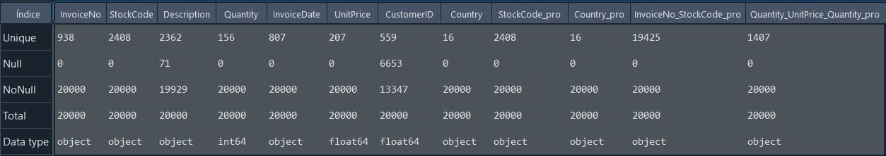

* The "Description" and "CustomerID" fields are the only fields that have null values
* No field has only unique values

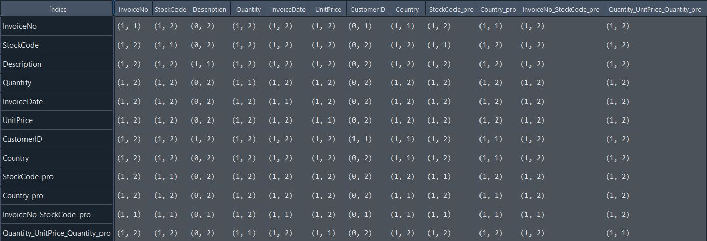

* (0,0) No relationship between values in the row and column fields
* (0,1) One value in the row field is related to at most one value in the column field
* (0,2) One value in the row field can be related to none, one or several values in the column field
* (1,1) One value in the row filed is only related to one value in the column field
* (1,2) One value in the row field can be related to one or several values in the column field
* Inconsistencies:
  * The "InvoiceNo" field should have a 1 to 1 relationship with the "InvoiceDate" field.
  * The "StockCode" field should have a 1 to 1 relationship with the "Description" field and vice versa

## Ontologies

* [Basic](./Ontologies/eCommerceOntology.owl)
  * One class
  * Zero object properties
  * Eight data properties
* [LLM](./Ontologies/eCommerceOntologyLLM.owl)
  * Three classes
  * Two object properties
  * Six data properties
* [Gold standard](./Ontologies/eCommerceOntologyII.owl)
  * Six classes
  * Six object properties
  * Eight data properties
* [Materials](./Ontology/materials_anony_v2.owl)
  * Two classes
  * One object property
  * Two data properties

## Mapping

|Mapping |Dataset| RDF | attr_triples | rel_triples |
|:-:|:-:|:-:|:-:|:-:|
|[Basic](./Mappings/mappingBasic.csv.yml)|processed_data20K.csv|[54553 triples](./Mappings/ecommercedataBasic.nt)|[53615 triples](./Experiments/EntityAlignment/Basic-Basic/Input/attr_triples_1)|[938 triples](./Experiments/EntityAlignment/Basic-Basic/Input/rel_triples_1)|
|[Gold](./Mappings/mappingGold.csv.yml)|processed_data20K.csv|[95666 triples](./Mappings/ecommercedataGold.nt)|[10081 triples](./Experiments/EntityAlignment/Gold-Gold/Input/attr_triples_1)|[85585 triples](./Experiments/EntityAlignment/Gold-Gold/Input/rel_triples_1)|
|[LLM](./Mappings/mappingLLM.csv.ttl)|processed_data20K.csv|[43164 triples](./Mappings/ecommercedataLLM.nt)|[15798 triples](./Experiments/EntityAlignment/LLM-LLM/Input/attr_triples_1)|[27366 triples](./Experiments/EntityAlignment/LLM-LLM/Input/rel_triples_1)|
|[Materials](./Mappings/mappingMaterials.csv.yml)|processed_data20K.csv|[46073 triples](./Mappings/ecommercedataMaterials.nt)|[4815 triples](./Experiments/EntityAlignment/Materials-Materials/Input/attr_triples_1)|[41258 triples](./Experiments/EntityAlignment/Materials-Materials/Input/rel_triples_1)|

## [Gold - Gold](./Experiments/EntityAlignment/Gold-Gold/)

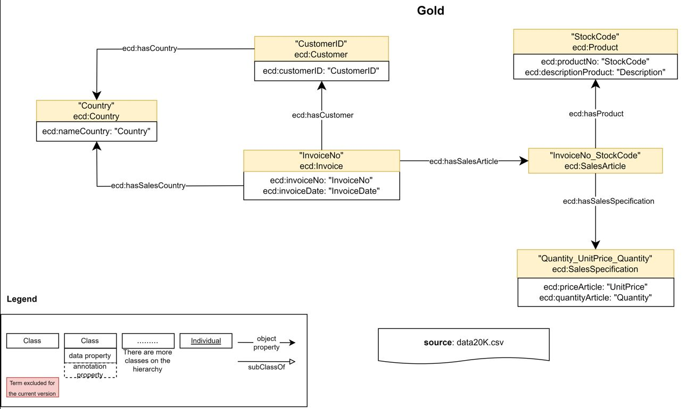

### [Input](./Experiments/EntityAlignment/Gold-Gold/Input/)

|ent_links| [Related Entities](./Experiments/EntityAlignment/Gold-Gold/Input/ent_links)|Split 1 Test|
|:-:|:-:|:-:|
|<https://vocab.um.es/ontology/ecd/Invoice> - <https://vocab.um.es/ontology/ecd/Invoice>| 938 (3.79%)|377 (3.81%)
|<https://vocab.um.es/ontology/ecd/salesArticle> - <https://vocab.um.es/ontology/ecd/salesArticle>| 19425 (78.47%)|7817 (78.95%)
|<https://vocab.um.es/ontology/ecd/SalesSpecification> - <https://vocab.um.es/ontology/ecd/SalesSpecification>| 1407 (5.68%)|561 (5.67%)
|<https://vocab.um.es/ontology/ecd/Product> - <https://vocab.um.es/ontology/ecd/Product>| 2408 (9.73%)|947 (9.56%)
|<https://vocab.um.es/ontology/ecd/Customer> - <https://vocab.um.es/ontology/ecd/Customer>| 560 (2.26%)|192 (1.94%)
|<https://vocab.um.es/ontology/ecd/Country> - <https://vocab.um.es/ontology/ecd/Country>| 16 (0.07%)|7 (0.07%)
| Total related entities |24754|9901

|Split|Training (50%) | Test (40%) | Validation (10%) |
|:-:|:-:|:-:|:-:|
|[1](./Experiments/EntityAlignment/Gold-Gold/Input/451_1fold/1/)|12377|9901|2476|

### [Output](./Experiments/EntityAlignment/Gold-Gold/Output/)

|Approach|Split|Aligned Ent|H@1 (%)|H@5 (%)|H@10 (%)|MR|MRR [0,1]|Run time |Invoice (#/%)|salesArticle (#/%)|SalesSpecification (#/%)|Product (#/%)|Customer (#/%)|Country (#/%)|
|:-:|:-:|:-:|:-:|:-:|:-:|:-:|:-:|:-:|:-:|:-:|:-:|:-:|:-:|:-:|
|AlignE|1|[9901](./Experiments/EntityAlignment/Gold-Gold/Output/AlignE/1/nohup_gold-gold_aligne.txt)|98.47|99.66 |99.88 |1|0.99|21406|365 (96.82%)|7750 (99.14%)|547 (97.50%)|890 (93.98%)|190 (98.96%)|7 (100%)
|AliNet|1|[9901](./Experiments/EntityAlignment/Gold-Gold/Output/AliNet/1/nohup_gold-gold_alinet.txt)|94.46|97.57|97.87|23|0.96|8656|-|-|-|-|-|-|
|AttrE|1|[9901](./Experiments/EntityAlignment/Gold-Gold/Output/AttrE/1/nohup_gold-gold_attre.txt)|99.52|99.97|100|1|1.00|9264|372 (98.67%)|7783 (99.57%)|555 (98.93%)|945 (99.79%)|191 (99.48%)|7 (100%)
|BootEA|1|[9901](./Experiments/EntityAlignment/Gold-Gold/Output/BootEA/1/nohup_gold-gold_bootea.txt)|99.63|99.90 |99.95 |1|1.00|21594|375 (99.47%)|7804 (98.83%)|558 (99.47%)|928 (97.99%)|192 (100%)|7 (100%)
|BootEA_RotatE|1|[9901](./Experiments/EntityAlignment/Gold-Gold/Output/BootEA_RotatE/1/nohup_gold-gold_bootea_rotate.txt)|99.61|100|100 |1|1.00|35040|-|-|-|-|-|-|
|BootEA_TransH|1|[9901](./Experiments/EntityAlignment/Gold-Gold/Output/BootEA_TransH/1/nohup_gold-gold_bootea_transh.txt)|E|r|r|o|r|||
|Conve|1|[9901](./Experiments/EntityAlignment/Gold-Gold/Output/ConvE/1/nohup_gold-gold_conve.txt)|E|r|r|o|r|||
|GCN_Align|1|[9901](./Experiments/EntityAlignment/Gold-Gold/Output/GCN_Align/1/nohup_gold-gold_gcnalign.txt)|94.71|99.68 |99.74|1|0.97|1700|375	(99.47%)|7336	(93.85%)|555 (98.93%)|912	(96.30%)|192	(100%)|7	(100%)|
|GMNN|1|[9901](./Experiments/EntityAlignment/Gold-Gold/Output/GMNN/1/nohup_gold-gold_gmnn.txt)|E|r|r|o|r|||
|HolE|1|[9901](./Experiments/EntityAlignment/Gold-Gold/Output/HolE/1/nohup_gold-gold_hole.txt)|89.33|93.50 |94.38|37|0.91|36516|-|-|-|-|-|-|
|IMUSE|1|[9901](./Experiments/EntityAlignment/Gold-Gold/Output/IMUSE/1/nohup_gold-gold_imuse.txt)|94.62|98.76|99.16|2|0.97|2603|-|-|-|-|-|-|
|IPTransE|1|[9901](./Experiments/EntityAlignment/Gold-Gold/Output/IPTransE/1/nohup_gold-gold_iptranse.txt)|96.39|98.83 |99.27|1|0.97|9568|-|-|-|-|-|-|
|JAPE|1|[9901](./Experiments/EntityAlignment/Gold-Gold/Output/JAPE/1/nohup_gold-gold_jape.txt)|67.11|82.33 |85.10|255|0.74|4321|-|-|-|-|-|-|
|KDCoE|1|[9901](./Experiments/EntityAlignment/Gold-Basic/Output/KDCoE/1/error_output_gold-basic_kdcoe.txt)|E|r|r|o|r|||
|MTransE|1|[9901](./Experiments/EntityAlignment/Gold-Gold/Output/MTransE/1/nohup_gold-gold_mtranse.txt)|40.85|55.10 |58.17|898|0.47|2974|-|-|-|-|-|-|
|MultiKE|1|[9901](./Experiments/EntityAlignment/Gold-Gold/Output/MultiKE/1/nohup_gold-gold_multike.txt)|E|r|r|o|r|||
|ProjE|1|[9901](./Experiments/EntityAlignment/Gold-Gold/Output/ProjE/1/nohup_gold-gold_proje.txt)|55.53|78.99 |80.86|76|0.66|15925|-|-|-|-|-|-|
|RDGCN|1|[9901](./Experiments/EntityAlignment/Gold-Gold/Output/RDGCN/1/nohup_gold-gold_rdgcn.txt)|76.25|90.33 |92.55|10|0.83|77837|-|-|-|-|-|-|
|RotatE|1|[9901](./Experiments/EntityAlignment/Gold-Gold/Output/RotatE/1/nohup_gold-gold_rotate.txt)|99.40|100 |100|1|1.00|16049|-|-|-|-|-|-|
|RSN4EA|1|[9901](./Experiments/EntityAlignment/Gold-Gold/Output/RSN4EA/1/nohup_gold-gold_rsn4ea.txt)|95.79|98.73|99.07|5|0.97|54845|-|-|-|-|-|-|
|SEA|1|[9901](./Experiments/EntityAlignment/Gold-Gold/Output/SEA/1/nohup_gold-gold_sea.txt)|97.58|99.85 |99.98|1|0.99|3143|367 (97.35%)|7623 (97.52%)|554 (98.75%)|930 (98.20%)|180 (93.75%)|7 (100%)
|SimplE|1|[9901](./Experiments/EntityAlignment/Gold-Gold/Output/SimplE/1/nohup_gold-gold_simple.txt)|91.89|95.16|96.19|3|0.94|2760|-|-|-|-|-|-|
|TransD|1|[9901](./Experiments/EntityAlignment/Gold-Gold/Output/TransD/1/nohup_gold-gold_transd.txt)|94.45|96.79|97.44|5|0.96|10276|-|-|-|-|-|-|
|TransH|1|[9901](./Experiments/EntityAlignment/Gold-Gold/Output/TransH/1/nohup_gold-gold_transh.txt)|95.90|98.26|98.88|2|0.97|8940|-|-|-|-|-|-|
|TransR|1|[9901](./Experiments/EntityAlignment/Gold-Gold/Output/TransR/1/nohup_gold-gold_transr.txt)|0.32|1.33|2.35|2082|0.01|8775|-|-|-|-|-|-|

## [Basic - Basic](./Experiments/EntityAlignment/Basic-Basic/)

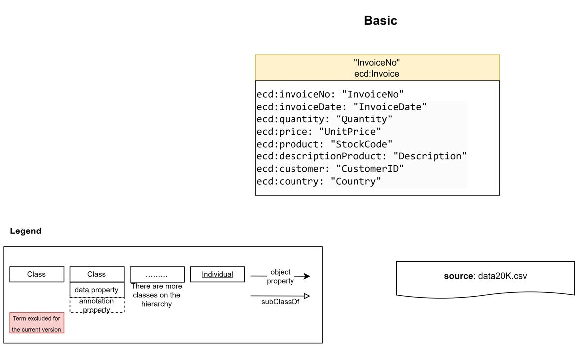

### [Input](./Experiments/EntityAlignment/Basic-Basic/Input/)

|ent_links| [Related Entities](./Experiments/EntityAlignment/Basic-Basic/Input/ent_links)|Split 1 Test|
|:-:|:-:|:-:|
|<https://vocab.um.es/ontology/ecd/Invoice> - <https://vocab.um.es/ontology/ecd/Invoice>| 938 (100%)|375 (100%)
| Total related entities |938|375

|Split|Training (50%) | Test (40%) | Validation (10%) |
|:-:|:-:|:-:|:-:|
|[1](./Experiments/EntityAlignment/Basic-Basic/Input/451_1fold/1/)|469|375|94|

### [Output](./Experiments/EntityAlignment/Basic-Basic/Output/)

|Approach|Split|Aligned Ent|H@1 (%)|H@5 (%)|H@10 (%)|MR|MRR [0,1]|Run time |Invoice (#/%)|
|:-:|:-:|:-:|:-:|:-:|:-:|:-:|:-:|:-:|:-:|
|AlignE|1|[375](./Experiments/EntityAlignment/Basic-Basic/Output/AlignE/1/nohup_basic-basic_aligne.txt)|0.27|0.80 |1.87 |191|0.02|110|1 (0.27%)|
|AliNet|1|[375](./Experiments/EntityAlignment/Basic-Basic/Output/AliNet/1/nohup_basic-basic_alinet.txt)|E|r|r|o|r|||
|AttrE|1|[375](./Experiments/EntityAlignment/Basic-Basic/Output/AttrE/1/nohup_basic-basic_attre.txt)|91.20|97.6|100|1|0.94|495|342 (91.20%)|
|BootEA|1|[375](./Experiments/EntityAlignment/Basic-Basic/Output/BootEA/1/nohup_basic-basic_bootea.txt)|0.80|2.67 |4.53|191|0.03|121|3 (0.80%)|
|BootEA_RotatE|1|[375](./Experiments/EntityAlignment/Basic-Basic/Output/BootEA_RotatE/1/nohup_basic-basic_bootea_rotate.txt)|0.53|2.13|3.73 |185|0.02|454|-|
|BootEA_TransH|1|[375](./Experiments/EntityAlignment/Basic-Basic/Output/BootEA_TransH/1/nohup_basic-basic_bootea_transh.txt)|E|r|r|o|r|||
|Conve|1|[375](./Experiments/EntityAlignment/Basic-Basic/Output/ConvE/1/nohup_basic-basic_conve.txt)|E|r|r|o|r|||
|GCN_Align|1|[375](./Experiments/EntityAlignment/Basic-Basic/Output/GCN_Align/1/nohup_basic-basic_gcnalign.txt)|0.00|0.27 |1.60|189|0.01|18|0 (0.00%)|
|GMNN|1|[375](./Experiments/EntityAlignment/Basic-Basic/Output/GMNN/1/nohup_basic-basic_gmnn.txt)|100|100|100|1|1.00|2997|-|
|HolE|1|[375](./Experiments/EntityAlignment/Basic-Basic/Output/HolE/1/nohup_basic-basic_hole.txt)|0.53|1.07 |2.40|191|0.02|158|-|
|IMUSE|1|[375](./Experiments/EntityAlignment/Basic-Basic/Output/IMUSE/1/nohup_basic-basic_imuse.txt)|27.47|28.27|28.53|140|0.29|25|-|
|IPTransE|1|[375](./Experiments/EntityAlignment/Basic-Basic/Output/IPTransE/1/nohup_basic-basic_iptranse.txt)|E|r|r|o|r|||
|JAPE|1|[375](./Experiments/EntityAlignment/Basic-Basic/Output/JAPE/1/nohup_basic-basic_jape.txt)|0.80|1.07 |3.20|191|0.02|91|-|
|KDCoE|1|[375](./Experiments/EntityAlignment/Basic-Basic/Output/KDCoE/1/nohup_basic-basic_kdcoe.txt)|E|r|r|o|r|||
|MTransE|1|[375](./Experiments/EntityAlignment/Basic-Basic/Output/MTransE/1/nohup_basic-basic_mtranse.txt)|0.53|1.33 |2.13|194|0.02|29|-|
|MultiKE|1|[375](./Experiments/EntityAlignment/Basic-Basic/Output/MultiKE/1/nohup_basic-basic_multike.txt)|E|r|r|o|r|||
|ProjE|1|[375](./Experiments/EntityAlignment/Basic-Basic/Output/ProjE/1/nohup_basic-basic_proje.txt)|E|r|r|o|r|||
|RDGCN|1|[375](./Experiments/EntityAlignment/Basic-Basic/Output/RDGCN/1/nohup_basic-basic_rdgcn.txt)|0.27|1.33 |2.67|188|0.02|814|-|
|RotatE|1|[375](./Experiments/EntityAlignment/Basic-Basic/Output/RotatE/1/nohup_basic-basic_rotate.txt)|0.27|1.87 |3.73|193|0.02|175|-|
|RSN4EA|1|[375](./Experiments/EntityAlignment/Basic-Basic/Output/RSN4EA/1/nohup_basic-basic_rsn4ea.txt)|E|r|r|o|r|||
|SEA|1|[375](./Experiments/EntityAlignment/Basic-Basic/Output/SEA/1/nohup_basic-basic_sea.txt)|0.00|1.33|1.87|190|0.01|24|0 (0.0%)|
|SimplE|1|[375](./Experiments/EntityAlignment/Basic-Basic/Output/SimplE/1/nohup_basic-basic_simple.txt)|0.00|0.53|1.33|189|0.01|43|-|
|TransD|1|[375](./Experiments/EntityAlignment/Basic-Basic/Output/TransD/1/nohup_basic-basic_transd.txt)|0.00|1.07|1.07|195|0.01|47|-|
|TransH|1|[375](./Experiments/EntityAlignment/Basic-Basic/Output/TransH/1/nohup_basic-basic_transh.txt)|0.27|1.60|3.47|189|0.02|48|-|
|TransR|1|[375](./Experiments/EntityAlignment/Basic-Basic/Output/TransR/1/nohup_basic-basic_transr.txt)|0.27|1.33|2.67|188|0.02|80|-|

## [LLM - LLM](./Experiments/EntityAlignment/LLM-LLM/)

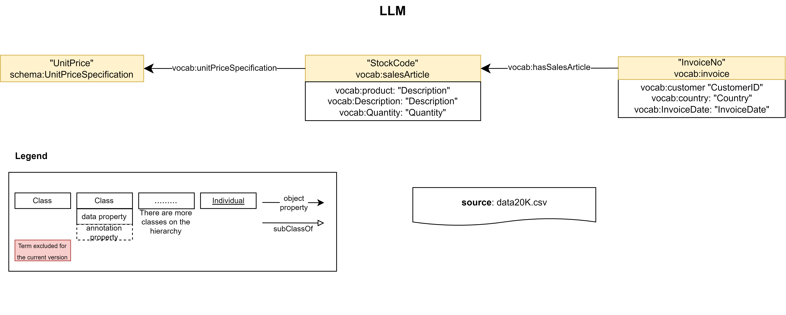

### [Input](./Experiments/EntityAlignment/LLM-LLM/Input/)

|ent_links| [Related Entities](./Experiments/EntityAlignment/LLM-LLM/Input/ent_links)|Split 1 Test|
|:-:|:-:|:-:|
|<https://vocab.um.es#invoice> - <https://vocab.um.es#invoice>| 938 (26.40%)|383 (26.95%)
|<https://vocab.um.es#salesArticle> - <https://vocab.um.es#salesArticle>| 2408 (67.77%)|952 (67.00%)
|<http://schema.org/UnitPriceSpecification> - <http://schema.org/UnitPriceSpecification>| 207 (5.83%)|86 (6.05%)
| Total related entities |3553|1421

|Split|Training (50%) | Test (40%) | Validation (10%) |
|:-:|:-:|:-:|:-:|
|[1](./Experiments/EntityAlignment/LLM-LLM/Input/451_1fold/1/)|1776|1421|356|

### [Output](./Experiments/EntityAlignment/LLM-LLM/Output/)

|Approach|Split|Aligned Ent|H@1 (%)|H@5 (%)|H@10 (%)|MR|MRR [0,1]|Run time | Invoice (#/%) |salesArticle (#/%)|UnitPriceSpecification (#/%)|
|:-:|:-:|:-:|:-:|:-:|:-:|:-:|:-:|:-:|:-:|:-:|:-:|
|AlignE|1|[1421](./Experiments/EntityAlignment/LLM-LLM/Output/AlignE/1/nohup_llm-llm_aligne.txt)|94.93|98.45 |98.80 |2|0.97|2597|351 (91.64%)|921 (96.74%)|77 (89.53%)
|AliNet|1|[1421](./Experiments/EntityAlignment/LLM-LLM/Output/AliNet/1/nohup_llm-llm_alinet.txt)|86.98|94.23|95.71|4|0.90|1278|-|-|-
|AttrE|1|[1421](./Experiments/EntityAlignment/LLM-LLM/Output/AttrE/1/nohup_llm-llm_attre.txt)|96.34|99.51|99.65|1|0.98|1370|360 (93.99%)|937 (98.42%)|72 (83.72%)
|BootEA|1|[1421](./Experiments/EntityAlignment/LLM-LLM/Output/BootEA/1/nohup_llm-llm_bootea.txt)|95.22|98.94 |99.51 |1|0.97|2167|358 (93.47%)|921 (96.74%)|74 (86.05%)
|BootEA_RotatE|1|[1421](./Experiments/EntityAlignment/LLM-LLM/Output/BootEA_RotatE/1/nohup_llm-llm_bootea_rotate.txt)|96.13|99.23|99.79 |1|0.98|9076|-|-|-
|BootEA_TransH|1|[1421](./Experiments/EntityAlignment/LLM-LLM/Output/BootEA_TransH/1/nohup_llm-llm_bootea_transh.txt)|E|r|r|o|r|||
|Conve|1|[1421](./Experiments/EntityAlignment/LLM-LLM/Output/ConvE/1/error_output_llm-llm_conve.txt)|E|r|r|o|r|||
|GCN_Align|1|[1421](./Experiments/EntityAlignment/LLM-LLM/Output/GCN_Align/1/nohup_llm-llm_gcnalign.txt)|88.46|94.23 |95.43|4|0.91|102|340	(88.77%)|841	(88.34%)|76	(88.37%)
|GMNN|1|[1421](./Experiments/EntityAlignment/LLM-LLM/Output/GMNN/1/nohup_llm-llm_gmnn.txt)|100|100 |100|1|1.00|13676|-|-|-
|HolE|1|[1421](./Experiments/EntityAlignment/LLM-LLM/Output/HolE/1/nohup_llm-llm_hole.txt)|88.74|96.06 |97.61|4|0.92|13609|-|-|-
|IMUSE|1|[1421](./Experiments/EntityAlignment/LLM-LLM/Output/IMUSE/1/nohup_llm-llm_imuse.txt)|87.26|96.76 |98.38|2|0.92|738|-|-|-
|IPTransE|1|[1421](./Experiments/EntityAlignment/LLM-LLM/Output/IPTransE/1/nohup_llm-llm_iptranse.txt)|E|r|r|o|r|||
|JAPE|1|[1421](./Experiments/EntityAlignment/LLM-LLM/Output/JAPE/1/nohup_llm-llm_jape.txt)|21.46|37.65 |46.38|59|0.30|541|-|-|-
|KDCoE|1|[1421](./Experiments/EntityAlignment/LLM-LLM/Output/KDCoE/1/nohup_llm-llm_kdcoe.txt)|E|r|r|o|r|||
|MTransE|1|[1421](./Experiments/EntityAlignment/LLM-LLM/Output/MTransE/1/nohup_llm-llm_mtranse.txt)|13.02|19.07 |22.24|294|0.16|449|-|-|-
|MultiKE|1|[1421](./Experiments/EntityAlignment/LLM-LLM/Output/MultiKE/1/nohup_llm-llm_multike.txt)|E|r|r|o|r|||
|ProjE|1|[1421](./Experiments/EntityAlignment/LLM-LLM/Output/ProjE/1/nohup_llm-llm_proje.txt)|37.23|56.02 |66.08|22.57|0.47|4402|-|-|-
|RDGCN|1|[1421](./Experiments/EntityAlignment/LLM-LLM/Output/RDGCN/1/nohup_llm-llm_rdgcn.txt)|71.22|87.61 |93.60|3|0.79|2869|-|-|-
|RotatE|1|[1421](./Experiments/EntityAlignment/LLM-LLM/Output/RotatE/1/nohup_llm-llm_rotate.txt)|96.48|99.16 |99.93|1|0.98|3208|-|-|-
|RSN4EA|1|[1421](./Experiments/EntityAlignment/LLM-LLM/Output/RSN4EA/1/nohup_llm-llm_rsn4ea.txt)|91.13|97.47|98.03|3|0.94|13963|-|-|-
|SEA|1|[1421](./Experiments/EntityAlignment/LLM-LLM/Output/SEA/1/nohup_llm-llm_sea.txt)|95.43|99.16 |99.93|1|0.97|459|355 (92.69%)|924 (97.06%)|77 (89.53%)
|SimplE|1|[1421](./Experiments/EntityAlignment/LLM-LLM/Output/SimplE/1/nohup_llm-llm_simple.txt)|40.46|68.33|80.08|8|0.53|413|-|-|-
|TransD|1|[1421](./Experiments/EntityAlignment/LLM-LLM/Output/TransD/1/nohup_llm-llm_transd.txt)|82.83|91.84|94.16|5|0.87|1319|-|-|-
|TransH|1|[1421](./Experiments/EntityAlignment/LLM-LLM/Output/TransH/1/nohup_llm-llm_transh.txt)|88.04|95.36|97.04|2|0.91|1596|-|-|-
|TransR|1|[1421](./Experiments/EntityAlignment/LLM-LLM/Output/TransR/1/nohup_llm-llm_transr.txt)|1.9|5.98|7.74|308|0.05|1942|-|-|-

## [Materials - Materials](./Experiments/EntityAlignment/Materials-Materials/)

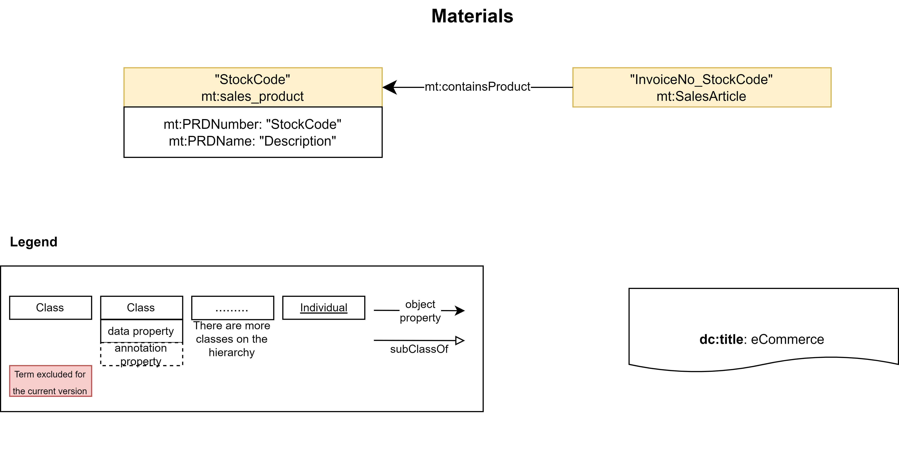

### [Input](./Experiments/EntityAlignment/Materials-Materials/Input/)

|ent_links| [Related Entities](./Experiments/EntityAlignment/Materials-Materials/Input/ent_links)|Split 1 Test|
|:-:|:-:|:-:|
|<https://purl.org/ontologies/MT/SalesArticle> - <https://purl.org/ontologies/MT/SalesArticle>| 19425 (88.97%)|7780 (89.09%)
|<https://purl.org/ontologies/MT/sales_product> - <https://purl.org/ontologies/MT/sales_product>| 2408 (11.03%)|953 (10.91%)
| Total related entities |21833|8733

|Split|Training (50%) | Test (40%) | Validation (10%) |
|:-:|:-:|:-:|:-:|
|[1](./Experiments/EntityAlignment/Materials-Materials/Input/451_1fold/1/)|10916|8733|2184|

### [Output](./Experiments/EntityAlignment/Materials-Materials/Output/)

|Approach|Split|Aligned Ent|H@1 (%)|H@5 (%)|H@10 (%)|MR|MRR [0,1]|Run time |salesArticle (#/%)|Product (#/%)|
|:-:|:-:|:-:|:-:|:-:|:-:|:-:|:-:|:-:|:-:|:-:|
|AlignE|1|[8733](./Experiments/EntityAlignment/Materials-Materials/Output/AlignE/1/nohup_materials-materials_aligne.txt)|29.03|68.75 |86.00 |103|0.46|7044|1722 (22.13%)|813 (85.31%)
|AliNet|1|[8733](./Experiments/EntityAlignment/Materials-Materials/Output/AliNet/1/nohup_materials-materials_alinet.txt)|29.60|68.95|85.48|176|0.46|5316|-|-
|AttrE|1|[8733](./Experiments/EntityAlignment/Materials-Materials/Output/AttrE/1/nohup_materials-materials_attre.txt)|27.91|66.19|83.39|79|0.44|3134|1599 (20.55%)| 838 (87.93%)|
|BootEA|1|[8733](./Experiments/EntityAlignment/Materials-Materials/Output/BootEA/1/nohup_materials-materials_bootea.txt)|29.11|68.72 |86.15 |109|0.46|9055|1728 (22.21%)|814 (85.41%)
|BootEA_RotatE|1|[8733](./Experiments/EntityAlignment/Materials-Materials/Output/BootEA_RotatE/1/nohup_materials-materials_bootea_rotate.txt)|29.21|69.44|86.43 |39|0.46|14761|-|-
|BootEA_TransH|1|[8733](./Experiments/EntityAlignment/Materials-Materials/Output/BootEA_TransH/1/nohup_materials-materials_bootea_transh.txt)|E|r|r|o|r|||
|Conve|1|[8733](./Experiments/EntityAlignment/Materials-Materials/Output/ConvE/1/nohup_materials-materials_conve.txt)|E|r|r|o|r|||
|GCN_Align|1|[8733](./Experiments/EntityAlignment/Materials-Materials/Output/GCN_Align/1/nohup_materials-materials_gcnalign.txt)|29.73|69.19 |86.79|8|0.47|1474|1779	(22.87%)|817	(85.73%)
|GMNN|1|[8733](./Experiments/EntityAlignment/Materials-Materials/Output/GMNN/1/nohup_materials-materials_gmnn.txt)|100|100|100|1|1.00|11541||
|HolE|1|[8733](./Experiments/EntityAlignment/Materials-Materials/Output/HolE/1/nohup_materials-materials_hole.txt)|25.20|58.75 |75.42|139|0.40|12896|-|-
|IMUSE|1|[8733](./Experiments/EntityAlignment/Materials-Materials/Output/IMUSE/1/nohup_materials-materials_imuse.txt)|28.43|67.37|84.46|58|0.45|969|-|-
|IPTransE|1|[8733](./Experiments/EntityAlignment/Materials-Materials/Output/IPTransE/1/nohup_materials-materials_iptranse.txt)|E|r|r|o|r||
|JAPE|1|[8733](./Experiments/EntityAlignment/Materials-Materials/Output/JAPE/1/error_output_materials-materials_jape.txt)|E|r|r|o|r||
|KDCoE|1|[8733](./Experiments/EntityAlignment/Materials-Materials/Output/KDCoE/1/error_output_materials-materials_kdcoe.txt)|E|r|r|o|r|||
|MTransE|1|[8733](./Experiments/EntityAlignment/Materials-Materials/Output/MTransE/1/nohup_materials-materials_mtranse.txt)|24.92|58.47 |73.56|361|0.40|1494|-|-
|MultiKE|1|[8733](./Experiments/EntityAlignment/Materials-Materials/Output/MultiKE/1/error_output_materials-materials_multike.txt)|E|r|r|o|r|||
|ProjE|1|[8733](./Experiments/EntityAlignment/Materials-Materials/Output/ProjE/1/nohup_materials-materials_proje.txt)|20.26|59.90 |77.01|120|0.37|7861|-|-
|RDGCN|1|[8733](./Experiments/EntityAlignment/Materials-Materials/Output/RDGCN/1/nohup_materials-materials_rdgcn.txt)|14.62|36.46 |49.14|712|0.25|13482|-|-
|RotatE|1|[8733](./Experiments/EntityAlignment/Materials-Materials/Output/RotatE/1/nohup_materials-materials_rotate.txt)|29.65|68.67 |86.15|96|0.46|6673|-|-
|RSN4EA|1|[8733](./Experiments/EntityAlignment/Materials-Materials/Output/RSN4EA/1/nohup_materials-materials_rsn4ea.txt)|29.70|68.69|85.70|143|0.46|19243|-|-
|SEA|1|[8733](./Experiments/EntityAlignment/Materials-Materials/Output/SEA/1/nohup_materials-materials_sea.txt)|29.88|68.87 |86.13|98|0.47|1180|1796 (23.08%)|813 (85.31%)
|SimplE|1|[8733](./Experiments/EntityAlignment/Materials-Materials/Output/SimplE/1/nohup_materials-materials_simple.txt)|28.24|67.23|85.23|57|0.45|970|-|-
|TransD|1|[8733](./Experiments/EntityAlignment/Materials-Materials/Output/TransD/1/nohup_materials-materials_transd.txt)|22.67|49.61|64.29|245|0.35|2317|-|-
|TransH|1|[8733](./Experiments/EntityAlignment/Materials-Materials/Output/TransH/1/nohup_materials-materials_transh.txt)|26.44|61.61|78.08|140|0.42|2834|-|-
|TransR|1|[8733](./Experiments/EntityAlignment/Materials-Materials/Output/TransR/1/nohup_materials-materials_transr.txt)|0.08|0.40|0.76|2939|0.01|4534|-|-

## [Gold - Basic](./Experiments/EntityAlignment/Gold-Basic/)

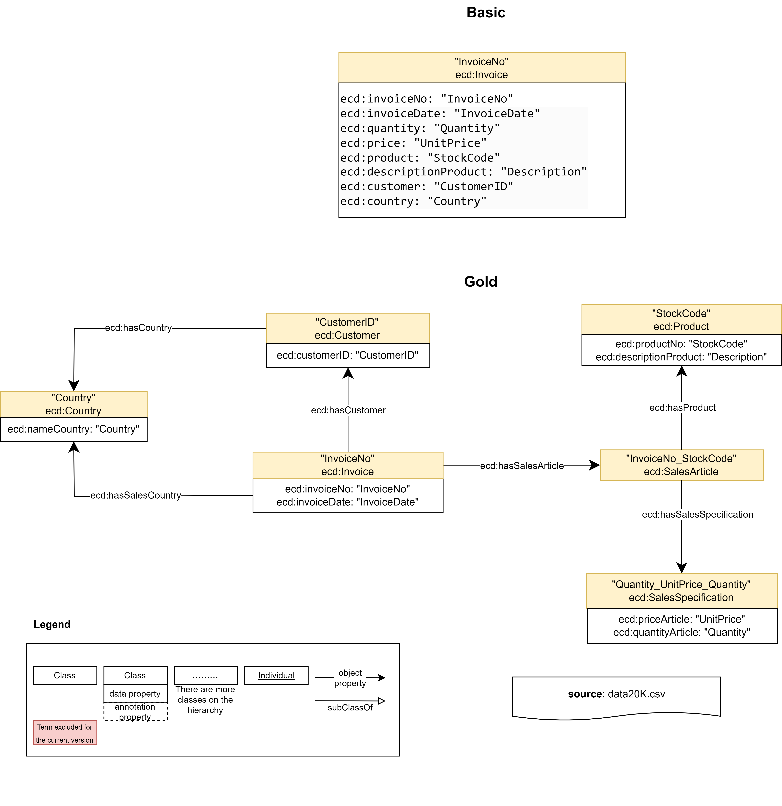

### [Input](./Experiments/EntityAlignment/Gold-Basic/Input/)

|ent_links| [Related Entities](./Experiments/EntityAlignment/Gold-Basic/Input/ent_links)|Split 1 Test|
|:-:|:-:|:-:|
|<https://vocab.um.es/ontology/ecd/Invoice> - <https://vocab.um.es/ontology/ecd/Invoice>| 938 (100%)|375 (100%)
| Total related entities |938|375

|Split|Training (50%) | Test (40%) | Validation (10%) |
|:-:|:-:|:-:|:-:|
|[1](./Experiments/EntityAlignment/Gold-Basic/Input/451_5fold/1/)|469|375|94|

### [Output](./Experiments/EntityAlignment/Gold-Basic/Output/)

|Approach|Split|Aligned Ent|H@1 (%)|H@5 (%)|H@10 (%)|MR|MRR [0,1]|Run time | Invoice (#/%) |
|:-:|:-:|:-:|:-:|:-:|:-:|:-:|:-:|:-:|:-:|
|AlignE|1|[375](./Experiments/EntityAlignment/Gold-Basic/Output/AlignE/1/nohup_gold-basic_aligne.txt)|0.8|1.33 |2.40 |180|0.02|2123|3 (0.80%)|
|AliNet|1|[375](./Experiments/EntityAlignment/Gold-Basic/Output/AliNet/1/error_output_gold-basic_alinet.txt)|E|r|r|o|r|||
|AttrE|1|[375](./Experiments/EntityAlignment/Gold-Basic/Output/AttrE/1/nohup_gold-basic_attre.txt)|1.33|5.33|11.2|132|0.05|1254|5 (1.33)|
|BootEA|1|[375](./Experiments/EntityAlignment/Gold-Basic/Output/BootEA/1/nohup_gold-basic_bootea.txt)|0.0|1.07 |1.60 |193|0.01|2117|0 (0.00%)|
|BootEA_RotatE|1|[375](./Experiments/EntityAlignment/Gold-Basic/Output/BootEA_RotatE/1/nohup_gold-basic_bootea_rotate.txt)|0.8|2.13|3.20 |188|0.02|6864|-|
|BootEA_TransH|1|[375](./Experiments/EntityAlignment/Gold-Basic/Output/BootEA_TransH/1/nohup_gold-basic_bootea_transh.txt)|E|r|r|o|r|||
|Conve|1|[375](./Experiments/EntityAlignment/Gold-Basic/Output/ConvE/1/error_output_gold-basic_conve.txt)|E|r|r|o|r|||
|GCN_Align|1|[375](./Experiments/EntityAlignment/Gold-Basic/Output/GCN_Align/1/nohup_gold-basic_gcnalign.txt)|0.0|1.60 |3.20|188|0.02|215|0 (0.00%)|
|GMNN|1|[375](./Experiments/EntityAlignment/Gold-Basic/Output/GMNN/1/nohup_gold-basic_gmnn.txt)|98.67|100 |100|1|0.99|20177|-|
|HolE|1|[375](./Experiments/EntityAlignment/Gold-Basic/Output/HolE/1/nohup_gold-basic_hole.txt)|0.27|1.60 |3.20|187|0.02|4278|-|
|IMUSE|1|[375](./Experiments/EntityAlignment/Gold-Basic/Output/IMUSE/1/nohup_gold-basic_imuse.txt)|52.27|60.53 |64.53|60|0.56|449|-|
|IPTransE|1|[375](./Experiments/EntityAlignment/Gold-Basic/Output/IPTransE/1/nohup_gold-basic_iptranse.txt)|0.0|1.01 |1.87|187|0.01|731|-|
|JAPE|1|[375](./Experiments/EntityAlignment/Gold-Basic/Output/JAPE/1/nohup_gold-basic_jape.txt)|0.53|1.33 |2.93|187|0.02|747|-|
|KDCoE|1|[375](./Experiments/EntityAlignment/Gold-Basic/Output/KDCoE/1/error_output_gold-basic_kdcoe.txt)|E|r|r|o|r|||
|MTransE|1|[375](./Experiments/EntityAlignment/Gold-Basic/Output/MTransE/1/nohup_gold-basic_mtranse.txt)|0.53|1.33 |2.40|190|0.02|659|-|
|MultiKE|1|[375](./Experiments/EntityAlignment/Gold-Basic/Output/MultiKE/1/error_output_gold-basic_multike.txt)|E|r|r|o|r|||
|ProjE|1|[375](./Experiments/EntityAlignment/Gold-Basic/Output/ProjE/1/nohup_gold-basic_proje.txt)|0.27|1.60 |1.87|181|0.02|3128|-|
|RDGCN|1|[375](./Experiments/EntityAlignment/Gold-Basic/Output/RDGCN/1/nohup_gold-basic_rdgcn.txt)|0.27|1.33 |3.47|166|0.02|1847|-|
|RotatE|1|[375](./Experiments/EntityAlignment/Gold-Basic/Output/RotatE/1/nohup_gold-basic_rotate.txt)|0.27|1.33 |2.40|184|0.02|3800|-|
|RSN4EA|1|[375](./Experiments/EntityAlignment/Gold-Basic/Output/RSN4EA/1/error_output_gold-basic_rsn4ea.txt)|E|r|r|o|r|||
|SEA|1|[375](./Experiments/EntityAlignment/Gold-Basic/Output/SEA/1/nohup_gold-basic_sea.txt)|0.27|0.53 |1.87|184|0.02|266|1 (0.27%)|
|SimplE|1|[375](./Experiments/EntityAlignment/Gold-Basic/Output/SimplE/1/nohup_gold-basic_simple.txt)|0.0|2.13|4.0|187|0.02|237|-|
|TransD|1|[375](./Experiments/EntityAlignment/Gold-Basic/Output/TransD/1/nohup_gold-basic_transd.txt)|0.53|1.60|2.40|187|0.02|796|-|
|TransH|1|[375](./Experiments/EntityAlignment/Gold-Basic/Output/TransH/1/nohup_gold-basic_transh.txt)|0.0|1.07|2.13|186|0.01|696|-|
|TransR|1|[375](./Experiments/EntityAlignment/Gold-Basic/Output/TransR/1/nohup_gold-basic_transr.txt)|0.53|2.40|3.47|194|0.02|2197|-|

## [Gold - LLM](./Experiments/EntityAlignment/Gold-LLM/)

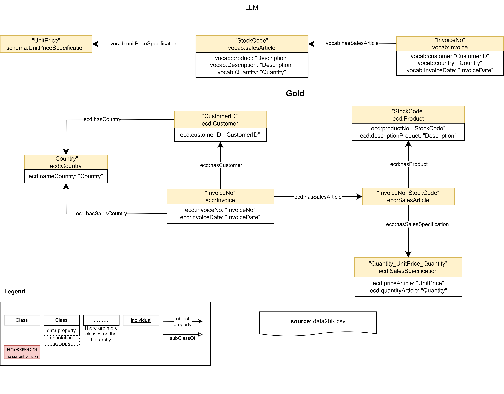

### [Input](./Experiments/EntityAlignment/Gold-LLM/Input/)

|ent_links| [Related Entities](./Experiments/EntityAlignment/Gold-LLM/Input/ent_links)|Split 1 Test|
|:-:|:-:|:-:|
|<https://vocab.um.es/ontology/ecd/Invoice> - <https://vocab.um.es#invoice>| 938 (4.31%)|364 (4.18%)
|<https://vocab.um.es/ontology/ecd/salesArticle> - <https://vocab.um.es#salesArticle>| 19425 (89.23%)|7802 (89.60%)
|<https://vocab.um.es/ontology/ecd/SalesSpecification> - <http://schema.org/UnitPriceSpecification>| 1407 (6.46%)|542 (6.22%)
| Total related entities |21770|8708

|Split|Training (50%) | Test (40%) | Validation (10%) |
|:-:|:-:|:-:|:-:|
|[1](./Experiments/EntityAlignment/Gold-LLM/Input/451_1fold/1/)|10885|8708|2177|

### [Output](./Experiments/EntityAlignment/Gold-LLM/Output/)

|Approach|Split|Aligned Ent|H@1 (%)|H@5 (%)|H@10 (%)|MR|MRR [0,1]|Run time | Invoice (#/%) | salesArticle (#/%)|SalesSpecification (#/%)|
|:-:|:-:|:-:|:-:|:-:|:-:|:-:|:-:|:-:|:-:|:-:|:-:|
|AlignE|1|[8708](./Experiments/EntityAlignment/Gold-LLM/Output/AlignE/1/nohup_gold-LLM_aligne.txt)|15.81|42.43 |59.75 |27|0.29|19146|296 (81.32%)|4449 (57.02%)|161 (29.70%)
|AliNet|1|[8708](./Experiments/EntityAlignment/Gold-LLM/Output/AliNet/1/error_output_gold-LLM_alinet.txt)|E|r|r|o|r|||
|AttrE|1|[8708](./Experiments/EntityAlignment/Gold-LLM/Output/AttrE/1/nohup_gold-LLM_attre.txt)|17.33|45.90|60.85|31|0.31|3640|308 (84.62%)|3673 (47.08%)|172 (31.73%)
|BootEA|1|[8708](./Experiments/EntityAlignment/Gold-LLM/Output/BootEA/1/nohup_gold-LLM_bootea.txt)|14.23|39.62 |55.71 |30|0.27|18663|291 (79.95%)|4214 (54.01%)|160 (29.52%)
|BootEA_RotatE|1|[8708](./Experiments/EntityAlignment/Gold-LLM/Output/BootEA_RotatE/1/nohup_gold-LLM_bootea_rotate.txt)|16.74|47.20|65.41 |25|0.31|33143|-|-|-
|BootEA_TransH|1|[8708](./Experiments/EntityAlignment/Gold-LLM/Output/BootEA_TransH/1/error_output_gold-LLM_bootea_transh.txt)|E|r|r|o|r|||
|Conve|1|[8708](./Experiments/EntityAlignment/Gold-LLM/Output/ConvE/1/error_output_gold-LLM_conve.txt)|E|r|r|o|r|||
|GCN_Align|1|[8708](./Experiments/EntityAlignment/Gold-LLM/Output/GCN_Align/1/nohup_gold-LLM_gcnalign.txt)|10.57|33.34 |48.51|186|0.22|888|106	(29.12%)|3776	(48.40%)|127	(23.43%)
|GMNN|1|[8708](./Experiments/EntityAlignment/Gold-LLM/Output/GMNN/1/error_output_gold-LLM_gmnn.txt)|E|r|r|o|r|||
|HolE|1|[8708](./Experiments/EntityAlignment/Gold-LLM/Output/HolE/1/nohup_gold-LLM_hole.txt)|4.42|13.56 |20.42|432|0.10|14042|-|-|-
|IMUSE|1|[8708](./Experiments/EntityAlignment/Gold-LLM/Output/IMUSE/1/error_output_gold-LLM_imuse.txt)|52.27|60.53 |64.53|60|0.56|449|-|-|-
|IPTransE|1|[8708](./Experiments/EntityAlignment/Gold-LLM/Output/IPTransE/1/nohup_gold-LLM_iptranse.txt)|11.77|32.40 |42.80|193|0.22|2372|-|-|-
|JAPE|1|[8708](./Experiments/EntityAlignment/Gold-LLM/Output/JAPE/1/nohup_gold-LLM_jape.txt)|11.02|23.79 |27.40|1835|0.17|2055|-|-|-
|KDCoE|1|[8708](./Experiments/EntityAlignment/Gold-LLM/Output/KDCoE/1/error_output_gold-LLM_kdcoe.txt)|E|r|r|o|r|||
|MTransE|1|[8708](./Experiments/EntityAlignment/Gold-LLM/Output/MTransE/1/nohup_gold-LLM_mtranse.txt)|19.36|55.11 |70.36|263|0.35|973|-|-|-
|MultiKE|1|[8708](./Experiments/EntityAlignment/Gold-LLM/Output/MultiKE/1/error_output_gold-LLM_multike.txt)|E|r|r|o|r|||
|ProjE|1|[8708](./Experiments/EntityAlignment/Gold-LLM/Output/ProjE/1/nohup_gold-LLM_proje.txt)|19.07|56.75 |72.38|133|0.35|9444|-|-|-
|RDGCN|1|[8708](./Experiments/EntityAlignment/Gold-LLM/Output/RDGCN/1/nohup_gold-LLM_rdgcn.txt)|5.87|25.32 |40.65|789|0.16|14299|-|-|-
|RotatE|1|[8708](./Experiments/EntityAlignment/Gold-LLM/Output/RotatE/1/nohup_gold-LLM_rotate.txt)|12.02|31.73 |44.41|72|0.22|7652|-|-|-
|RSN4EA|1|[8708](./Experiments/EntityAlignment/Gold-LLM/Output/RSN4EA/1/error_output_gold-LLM_rsn4ea.txt)|E|r|r|o|r|||
|SEA|1|[8708](./Experiments/EntityAlignment/Gold-LLM/Output/SEA/1/nohup_gold-LLM_sea.txt)|19.40|52.10 |69.87|18|0.34|1046|327 (89.84%)|4920 (63.06%)|225 (41.51%)
|SimplE|1|[8708](./Experiments/EntityAlignment/Gold-LLM/Output/SimplE/1/nohup_gold-LLM_simple.txt)|8.00|29.18|42.43|347|0.18|1246|-|-|-
|TransD|1|[8708](./Experiments/EntityAlignment/Gold-LLM/Output/TransD/1/)|E|r|r|o|r|||
|TransH|1|[8708](./Experiments/EntityAlignment/Gold-LLM/Output/TransH/1/nohup_gold-LLM_transh.txt)|12.72|35.45|47.67|118|0.24|3732|-|-|-
|TransR|1|[8708](./Experiments/EntityAlignment/Gold-LLM/Output/TransR/1/nohup_gold-LLM_transr.txt)|0.21|0.77|1.32|2451|0.01|4278|-|-|-

## [Gold - Materials](./Experiments/EntityAlignment/Gold-Materials/)

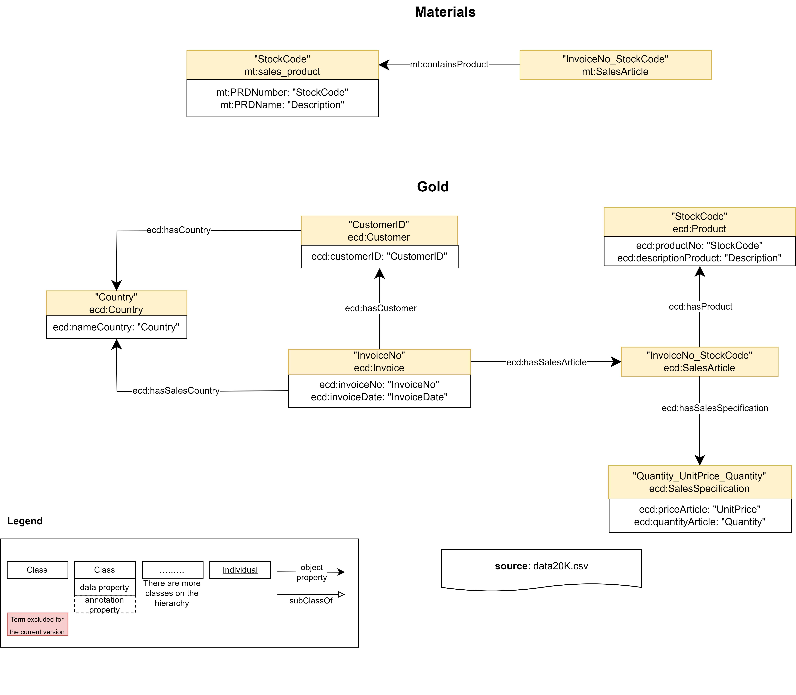

### [Input](./Experiments/EntityAlignment/Gold-Materials/Input/)

|ent_links| [Related Entities](./Experiments/EntityAlignment/Gold-Materials/Input/ent_links)|Split 1 Test|
|:-:|:-:|:-:|
|<https://vocab.um.es/ontology/ecd/salesArticle> - <https://purl.org/ontologies/MT/SalesArticle>| 19425 (88.97%)|7785 (89.14%)
|<https://vocab.um.es/ontology/ecd/Product> - <https://purl.org/ontologies/MT/sales_product>| 2408 (11.03%)|948 (10.86%)
| Total related entities |21833|8733

|Split|Training (50%) | Test (40%) | Validation (10%) |
|:-:|:-:|:-:|:-:|
|[1](./Experiments/EntityAlignment/Gold-LLM/Input/451_1fold/1/)|10916|8733|2184|

### [Output](./Experiments/EntityAlignment/Gold-Materials/Output/)

|Approach|Split|Aligned Ent|H@1 (%)|H@5 (%)|H@10 (%)|MR|MRR [0,1]|Run time | salesArticle (#/%)|Product (#/%)|
|:-:|:-:|:-:|:-:|:-:|:-:|:-:|:-:|:-:|:-:|:-:|
|AlignE|1|[8733](./Experiments/EntityAlignment/Gold-Materials/Output/AlignE/1/nohup_gold-materials_aligne.txt)|27.43|66.07 |82.87 |149|0.44|16219|1598 (20.53%)|797 (84.07%)
|AliNet|1|[8733](./Experiments/EntityAlignment/Gold-Materials/Output/AliNet/1/nohup_gold-materials_alinet.txt)|29.01|68.63|84.15|140|0.46|11314|-|-|
|AttrE|1|[8733](./Experiments/EntityAlignment/Gold-Materials/Output/AttrE/1/nohup_gold-materials_attre.txt)|23.62|55.90|72.24|153|0.38|4462|1269 (16.30)|794 (83.76%)
|BootEA|1|[8733](./Experiments/EntityAlignment/Gold-Materials/Output/BootEA/1/nohup_gold-materials_bootea.txt)|27.78|67.84 |83.88 |153|0.45|13993|1628 (20.91%)|798 (84.18%)
|BootEA_RotatE|1|[8733](./Experiments/EntityAlignment/Gold-Materials/Output/BootEA_RotatE/1/nohup_gold-materials_bootea_rotate.txt)|26.80|65.03|82.60 |112|0.43|31140|-|-|
|BootEA_TransH|1|[8733](./Experiments/EntityAlignment/Gold-Materials/Output/BootEA_TransH/1/error_output_gold-materials_bootea_transh.txt)|E|r|r|o|r|||
|Conve|1|[8733](./Experiments/EntityAlignment/Gold-Materials/Output/ConvE/1/error_output_gold-materials_conve.txt)|E|r|r|o|r|||
|GCN_Align|1|[8733](./Experiments/EntityAlignment/Gold-Materials/Output/GCN_Align/1/nohup_gold-materials_gcnalign.txt)|27.04|66.13 |82.88|146|0.44|1059|1588	(20.40%)|773	(81.54%)|
|GMNN|1|[8733](./Experiments/EntityAlignment/Gold-Materials/Output/GMNN/1/nohup_gold-materials_gmnn.txt)|100|100|100|1|1.00|20826|-|-|
|HolE|1|[8733](./Experiments/EntityAlignment/Gold-Materials/Output/HolE/1/nohup_gold-materials_hole.txt)|11.44|28.83 |39.90|291|0.20|19268|-|-|
|IMUSE|1|[8733](./Experiments/EntityAlignment/Gold-Materials/Output/IMUSE/1/error_output_gold-materials_imuse.txt)|E|r|r|o|r|||
|IPTransE|1|[8733](./Experiments/EntityAlignment/Gold-Materials/Output/IPTransE/1/nohup_gold-materials_iptranse.txt)|23.98|55.30 |70.25|276|0.38|4063|-|-|
|JAPE|1|[8733](./Experiments/EntityAlignment/Gold-Materials/Output/JAPE/1/nohup_gold-materials_jape.txt)|12.54|23.33 |28.96|1367|0.18|2048|-|-|
|KDCoE|1|[8733](./Experiments/EntityAlignment/Gold-Materials/Output/KDCoE/1/error_output_gold-materials_kdcoe.txt)|E|r|r|o|r|||
|MTransE|1|[8733](./Experiments/EntityAlignment/Gold-Materials/Output/MTransE/1/nohup_gold-materials_mtranse.txt)|6.79|9.88 |11.92|1775|0.09|1489|-|-|
|MultiKE|1|[8733](./Experiments/EntityAlignment/Gold-Materials/Output/MultiKE/1/error_output_gold-materials_multike.txt)|E|r|r|o|r|||
|ProjE|1|[8733](./Experiments/EntityAlignment/Gold-Materials/Output/ProjE/1/nohup_gold-materials_proje.txt)|19.32|58.95 |74.79|167|0.36|21328|-|-|
|RDGCN|1|[8733](./Experiments/EntityAlignment/Gold-Materials/Output/RDGCN/1/nohup_gold-materials_rdgcn.txt)|7.97|25.76 |36.28|1271|0.16|36333|-|-|
|RotatE|1|[8733](./Experiments/EntityAlignment/Gold-Materials/Output/RotatE/1/nohup_gold-materials_rotate.txt)|26.13|63.86 |81.12|139|0.43|16412|-|-|
|RSN4EA|1|[8733](./Experiments/EntityAlignment/Gold-Materials/Output/RSN4EA/1/nohup_gold-materials_rsn4ea.txt)|28.35|68.30|84.32|169|0.45|30261|-|-|
|SEA|1|[8733](./Experiments/EntityAlignment/Gold-Materials/Output/SEA/1/nohup_gold-materials_sea.txt)|27.23|64.59 |81.26|140|0.43|3639|1584 (20.35%)|794 (83.76%)
|SimplE|1|[8733](./Experiments/EntityAlignment/Gold-Materials/Output/SimplE/1/nohup_gold-materials_simple.txt)|24.26|63.30|80.27|52|0.41|2217|-|-|
|TransD|1|[8733](./Experiments/EntityAlignment/Gold-Materials/Output/TransD/1/nohup_gold-materials_transd.txt)|20.88|46.33|58.38|357|0.32|4032|-|-|
|TransH|1|[8733](./Experiments/EntityAlignment/Gold-Materials/Output/TransH/1/nohup_gold-materials_transh.txt)|23.52|53.99|68.79|222|0.37|5718|-|-|
|TransR|1|[8733](./Experiments/EntityAlignment/Gold-Materials/Output/TransR/1/nohup_gold-materials_transr.txt)|0.10|0.32|0.54|3223|0.01|6244|-|-|

## [Basic - LLM](./Experiments/EntityAlignment/Basic-LLM/)

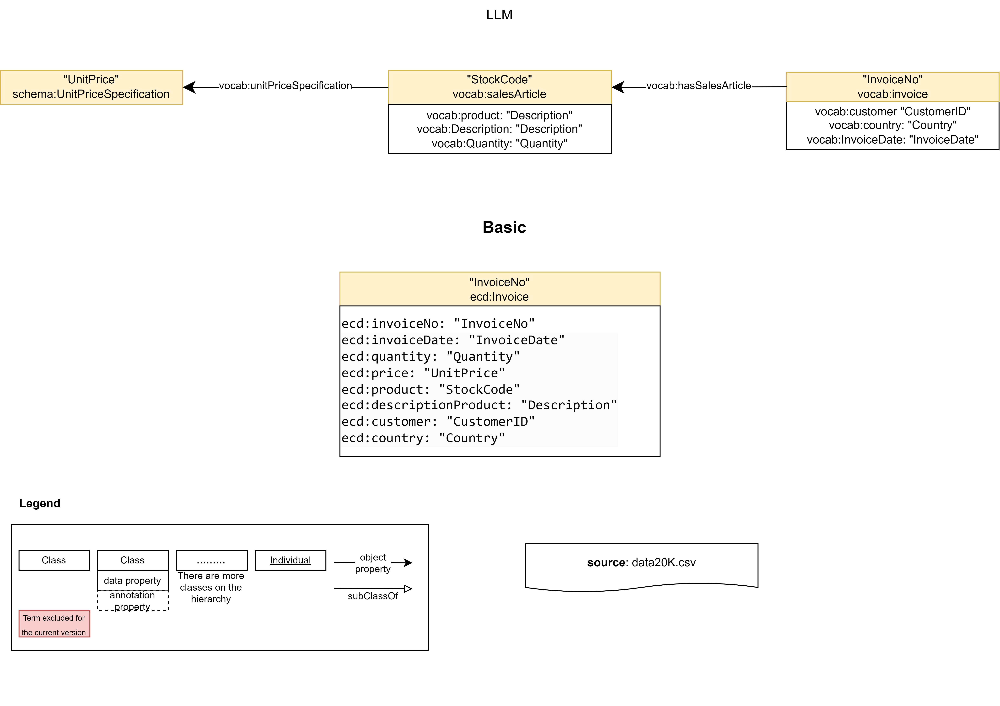

### [Input](./Experiments/EntityAlignment/Basic-LLM/Input/)

|ent_links| [Related Entities](./Experiments/EntityAlignment/Basic-LLM/Input/ent_links)|Split 1 Test|
|:-:|:-:|:-:|
|<https://vocab.um.es/ontology/ecd/Invoice> - <https://vocab.um.es#invoice>| 938 (100%)|375 (100%)
| Total related entities |938|375

|Split|Training (50%) | Test (40%) | Validation (10%) |
|:-:|:-:|:-:|:-:|
|[1](./Experiments/EntityAlignment/Basic-LLM/Input/451_1fold/1/)|469|375|94|

### [Output](./Experiments/EntityAlignment/Basic-LLM/Output/)

|Approach|Split|Aligned Ent|H@1 (%)|H@5 (%)|H@10 (%)|MR|MRR [0,1]|Run time |Invoice (#/%)|
|:-:|:-:|:-:|:-:|:-:|:-:|:-:|:-:|:-:|:-:|
|AlignE|1|[375](./Experiments/EntityAlignment/Basic-LLM/Output/AlignE/1/nohup_basic-LLM_aligne.txt)|0.00|0.53 |2.13 |177|0.01|617|0 (0.00%)|
|AliNet|1|[375](./Experiments/EntityAlignment/Basic-LLM/Output/AliNet/1/nohup_basic-LLM_alinet.txt)|E|r|r|o|r|||
|AttrE|1|[375](./Experiments/EntityAlignment/Basic-LLM/Output/AttrE/1/nohup_basic-LLM_attre.txt)|8.00|22.93|35.73|44|0.17|761|30 (8.00%)|
|BootEA|1|[375](./Experiments/EntityAlignment/Basic-LLM/Output/BootEA/1/nohup_basic-LLM_bootea.txt)|0.27|2.13 |3.73|182|0.02|641|1 (0.27%)|
|BootEA_RotatE|1|[375](./Experiments/EntityAlignment/Basic-LLM/Output/BootEA_RotatE/1/nohup_basic-LLM_bootea_rotate.txt)|0.27|1.33|3.20 |188|0.02|2926|-|
|BootEA_TransH|1|[375](./Experiments/EntityAlignment/Basic-LLM/Output/BootEA_TransH/1/nohup_basic-LLM_bootea_transh.txt)|E|r|r|o|r|||
|Conve|1|[375](./Experiments/EntityAlignment/Basic-LLM/Output/ConvE/1/error_output_basic-LLM_conve.txt)|E|r|r|o|r|||
|GCN_Align|1|[375](./Experiments/EntityAlignment/Basic-LLM/Output/GCN_Align/1/nohup_basic-LLM_gcnalign.txt)|0.53|1.33 |3.47|182|0.02|55|2 (0.53%)|
|GMNN|1|[375](./Experiments/EntityAlignment/Basic-LLM/Output/GMNN/1/nohup_basic-LLM_gmnn.txt)|100|100|100|1|1.00|5211|-|
|HolE|1|[375](./Experiments/EntityAlignment/Basic-LLM/Output/HolE/1/nohup_basic-LLM_hole.txt)|0.80|2.13 |3.20|189|0.02|1534|-|
|IMUSE|1|[375](./Experiments/EntityAlignment/Basic-LLM/Output/IMUSE/1/error_output_basic-LLM_imuse.txt)|E|r|r|o|r|||
|IPTransE|1|[375](./Experiments/EntityAlignment/Basic-LLM/Output/IPTransE/1/error_output_basic-LLM_iptranse.txt)|E|r|r|o|r|||
|JAPE|1|[375](./Experiments/EntityAlignment/Basic-LLM/Output/JAPE/1/nohup_basic-LLM_jape.txt)|0.00|1.60 |2.13|191|0.02|212|-|
|KDCoE|1|[375](./Experiments/EntityAlignment/Basic-LLM/Output/KDCoE/1/error_output_basic-LLM_kdcoe.txt)|E|r|r|o|r|||
|MTransE|1|[375](./Experiments/EntityAlignment/Basic-LLM/Output/MTransE/1/nohup_basic-LLM_mtranse.txt)|0.27|1.87 |3.47|188|0.02|133|-|
|MultiKE|1|[375](./Experiments/EntityAlignment/Basic-LLM/Output/MultiKE/1/error_output_basic-LLM_multike.txt)|E|r|r|o|r|||
|ProjE|1|[375](./Experiments/EntityAlignment/Basic-LLM/Output/ProjE/1/error_output_basic-LLM_proje.txt)|E|r|r|o|r|||
|RDGCN|1|[375](./Experiments/EntityAlignment/Basic-LLM/Output/RDGCN/1/nohup_basic-LLM_rdgcn.txt)|0.53|2.13 |2.93|190|0.02|1115|-|
|RotatE|1|[375](./Experiments/EntityAlignment/Basic-LLM/Output/RotatE/1/nohup_basic-LLM_rotate.txt)|0.00|0.53 |2.13|189|0.01|1289|-|
|RSN4EA|1|[375](./Experiments/EntityAlignment/Basic-LLM/Output/RSN4EA/1/error_output_basic-LLM_rsn4ea.txt)|E|r|r|o|r|||
|SEA|1|[375](./Experiments/EntityAlignment/Basic-LLM/Output/SEA/1/nohup_basic-LLM_sea.txt)|0.00|1.60|3.47|194|0.02|75|0 (0.0%)|
|SimplE|1|[375](./Experiments/EntityAlignment/Basic-LLM/Output/SimplE/1/nohup_basic-LLM_simple.txt)|0.27|0.80|2.40|187|0.02|110|-|
|TransD|1|[375](./Experiments/EntityAlignment/Basic-LLM/Output/TransD/1/nohup_basic-LLM_transd.txt)|0.27|0.80|1.60|189|0.01|223|-|
|TransH|1|[375](./Experiments/EntityAlignment/Basic-LLM/Output/TransH/1/nohup_basic-LLM_transh.txt)|0.00|2.13|3.20|195|0.02|212|-|
|TransR|1|[375](./Experiments/EntityAlignment/Basic-LLM/Output/TransR/1/nohup_basic-LLM_transr.txt)|0.00|0.80|1.87|194|0.01|756|-|

## [Materials - LLM](./Experiments/EntityAlignment/Materials-LLM/)

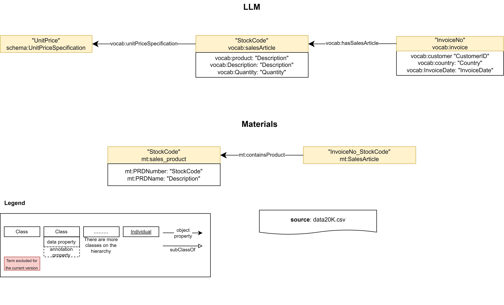

### [Input](./Experiments/EntityAlignment/Materials-LLM/Input/)

|ent_links| [Related Entities](./Experiments/EntityAlignment/Materials-LLM/Input/ent_links)|Split 1 Test|
|:-:|:-:|:-:|
|<https://purl.org/ontologies/MT/SalesArticle> - <https://vocab.um.es#salesArticle>| 19425 (100%)|7770 (100%)
| Total related entities |19425|7770

|Split|Training (50%) | Test (40%) | Validation (10%) |
|:-:|:-:|:-:|:-:|
|[1](./Experiments/EntityAlignment/Materials-LLM/Input/451_1fold/1/)|9712|7770|1943|

### [Output](./Experiments/EntityAlignment/Materials-LLM/Output/)

|Approach|Split|Aligned Ent|H@1 (%)|H@5 (%)|H@10 (%)|MR|MRR [0,1]|Run time |salesArticle (#/%)|
|:-:|:-:|:-:|:-:|:-:|:-:|:-:|:-:|:-:|:-:|
|AlignE|1|[7770](./Experiments/EntityAlignment/Materials-LLM/Output/AlignE/1/nohup_materials-llm_aligne.txt)|19.99|63.36 |82.23 |288|0.39|13961|7295 (93.89%)|
|AliNet|1|[7770](./Experiments/EntityAlignment/Materials-LLM/Output/AliNet/1/error_output_materials-llm_alinet.txt)|E|r|r|o|r||
|AttrE|1|[7770](./Experiments/EntityAlignment/Materials-LLM/Output/AttrE/1/nohup_materials-llm_attre.txt)|18.65|60.95|77.21|125|0.37|11907|6344 (81.65%)|
|BootEA|1|[7770](./Experiments/EntityAlignment/Materials-LLM/Output/BootEA/1/nohup_materials-llm_bootea.txt)|19.50|61.78 |80.56 |300|0.38|12074|7226 (93.00%)|
|BootEA_RotatE|1|[7770](./Experiments/EntityAlignment/Materials-LLM/Output/BootEA_RotatE/1/nohup_materials-llm_bootea_rotate.txt)|19.46|63.10|82.06 |391|0.38|2982|-|
|BootEA_TransH|1|[7770](./Experiments/EntityAlignment/Materials-LLM/Output/BootEA_TransH/1/error_output_materials-llm_bootea_transh.txt)|E|r|r|o|r||
|Conve|1|[7770](./Experiments/EntityAlignment/Materials-LLM/Output/ConvE/1/error_output_materials-llm_conve.txt)|E|r|r|o|r|||
|GCN_Align|1|[7770](./Experiments/EntityAlignment/Materials-LLM/Output/GCN_Align/1/nohup_materials-llm_gcnalign.txt)|16.72|52.97 |71.88|218|0.33|1388|1326	(70.16%)|
|GMNN|1|[7770](./Experiments/EntityAlignment/Materials-LLM/Output/GMNN/1/error_output_materials-llm_gmnn.txt)|E|r|r|o|r|||
|HolE|1|[7770](./Experiments/EntityAlignment/Materials-LLM/Output/HolE/1/nohup_materials-llm_hole.txt)|12.69|37.22 |48.26|263|0.24|17829|-|
|IMUSE|1|[7770](./Experiments/EntityAlignment/Materials-LLM/Output/IMUSE/1/error_output_materials-llm_imuse.txt)|E|r|r|o|r||
|IPTransE|1|[7770](./Experiments/EntityAlignment/Materials-LLM/Output/IPTransE/1/error_output_materials-llm_iptranse.txt)|E|r|r|o|r||
|JAPE|1|[7770](./Experiments/EntityAlignment/Materials-LLM/Output/JAPE/1/nohup_materials-llm_jape.txt)|14.72|40.14|46.78|1225|0.25|2247|-
|KDCoE|1|[7770](./Experiments/EntityAlignment/Materials-LLM/Output/KDCoE/1/error_output_materials-llm_kdcoe.txt)|E|r|r|o|r|||
|MTransE|1|[7770](./Experiments/EntityAlignment/Materials-LLM/Output/MTransE/1/nohup_materials-llm_mtranse.txt)|19.37|63.23 |82.07|205|0.38|916|-|
|MultiKE|1|[7770](./Experiments/EntityAlignment/Materials-LLM/Output/MultiKE/1/error_output_materials-llm_multike.txt)|E|r|r|o|r|||
|ProjE|1|[7770](./Experiments/EntityAlignment/Materials-LLM/Output/ProjE/1/nohup_materials-llm_proje.txt)|20.12|63.02 |81.60|244|0.39|7503|-|
|RDGCN|1|[7770](./Experiments/EntityAlignment/Materials-LLM/Output/RDGCN/1/nohup_materials-llm_rdgcn.txt)|0.01|0.06 |0.14|3653|0.01|13335|-|
|RotatE|1|[7770](./Experiments/EntityAlignment/Materials-LLM/Output/RotatE/1/nohup_materials-llm_rotate.txt)|18.70|58.92 |76.78|219|0.36|8735|-|
|RSN4EA|1|[7770](./Experiments/EntityAlignment/Materials-LLM/Output/RSN4EA/1/error_output_materials-llm_rsn4ea.txt)|E|r|r|o|r|||
|SEA|1|[7770](./Experiments/EntityAlignment/Materials-LLM/Output/SEA/1/nohup_materials-llm_sea.txt)|20.06|63.00 |82.15|283|0.39|2778|7299 (93.94%)|
|SimplE|1|[7770](./Experiments/EntityAlignment/Materials-LLM/Output/SimplE/1/nohup_materials-llm_simple.txt)|17.79|61.15|80.04|354|0.36|2128|-|
|TransD|1|[7770](./Experiments/EntityAlignment/Materials-LLM/Output/TransD/1/nohup_materials-llm_transd.txt)|15.86|47.58|59.83|432|0.30|5643|-|
|TransH|1|[7770](./Experiments/EntityAlignment/Materials-LLM/Output/TransH/1/nohup_materials-llm_transh.txt)|16.62|45.48|56.81|455|0.29|4411|-|
|TransR|1|[7770](./Experiments/EntityAlignment/Materials-LLM/Output/TransR/1/nohup_materials-llm_transr.txt)|0.10|0.44|0.80|2359|0.01|4226|-|

## Results

<figcaption><strong>Figure Methods Boxplot.</strong> Boxplot of the OpenEA methods according to the Hits@1 metric of the 9 pairwise comparisons of the KGs generated from the E-Commerce Data dataset. The orange solid line represents the median and the red diamond the mean of the experiments that did not lead to an error. The number of experiments without error is shown in brackets next to the name of the method. BootEA-TransH, ConvE, KDCoE and MultiKE are not shown because their error rate is equal to 1 for all datasets.</figcaption>

<figcaption><strong>Figure Methods Clustering.</strong> Hierarchical clustering (Ward algorithm) of 25 OpenEA methods according to the 5 metrics for the 9 pairwise comparisons of the KGs generated from the E-Commerce Data dataset.</figcaption>

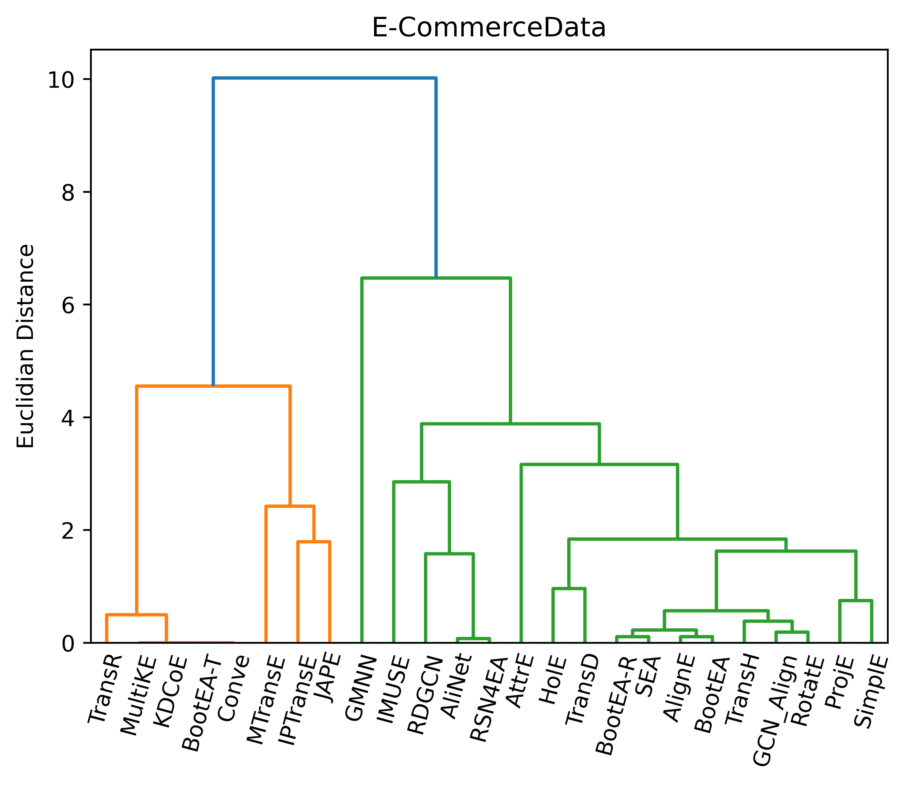

<figcaption><strong>Figure Experiments Boxplot.</strong> Boxplot of the 9 types of pairwise comparison experiments of KGs based on the Hits@1 score obtained by the 25 methods carried out in the E-Commerce Data dataset. The orange solid line represents the median and the red diamond the mean of the experiments that did not lead to an error. The number of modules that did not generate an error is shown in brackets under the name of the experiment represented.</figcaption>

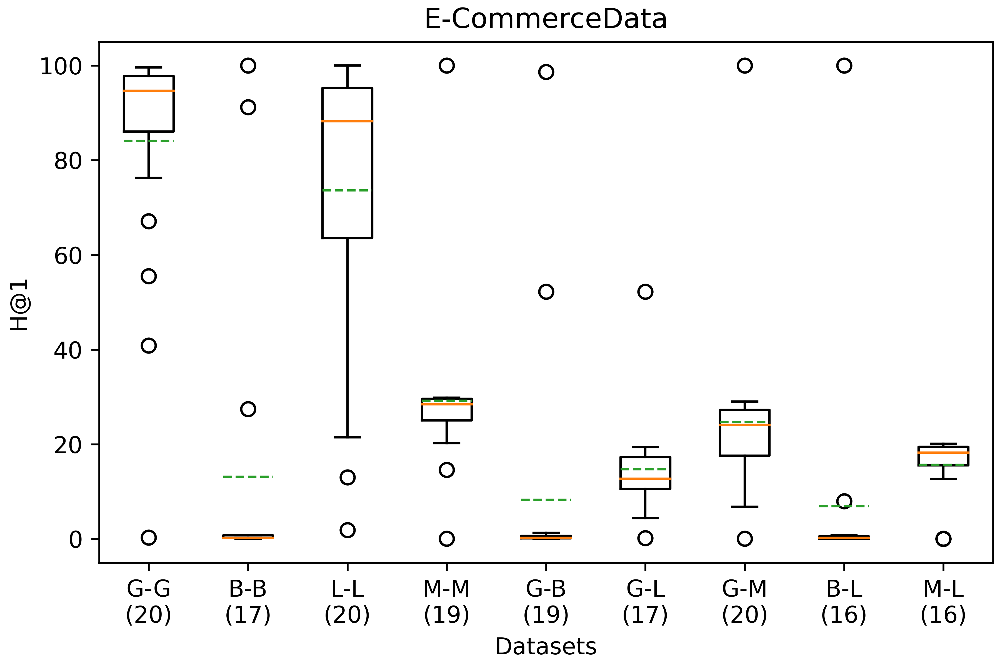

<figcaption><strong>Figure Experiments Clustering.</strong> Hierarchical clustering, with method Ward, of the 9 types of pairwise comparison experiments of KG, according to the 5 metrics, with all the values scaled to the range [0,1], of the 25 (at most) OpenEA modules carried out in the E-Commerce Data dataset.</figcaption>

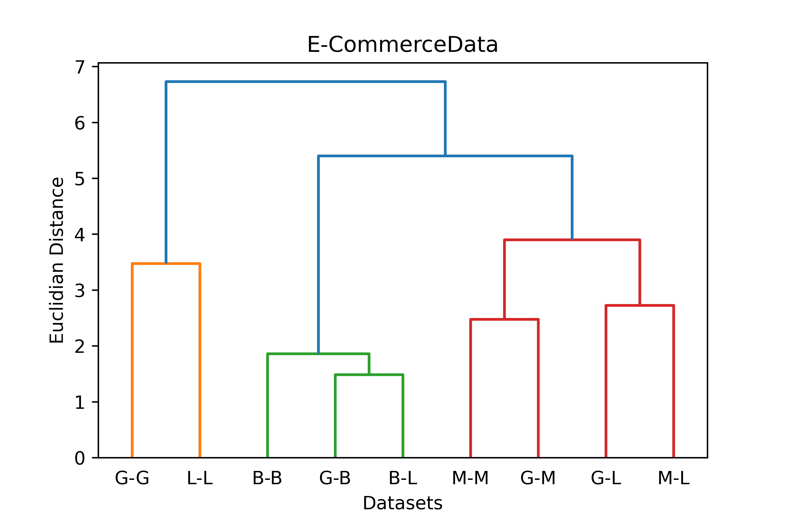

## Merged methods

|Pair|Approach|Invoice (#/%)|salesArticle (#/%)|SalesSpecification (#/%)|Product (#/%)|Customer (#/%)|Country (#/%)|
|:-:|:-:|:-:|:-:|:-:|:-:|:-:|:-:|
|Basic-Basic|AttrE|342 (91.20%)| - | - | - | - | - |
|Basic-Basic|BootEA|3 (0.80%)| - | - | - | - | - |
|Basic-Basic|AlignE|1 (0.27%)| - | - | - | - | - |
|Basic-Basic|SEA|0 (0.0%)| - | - | - | - | - |
|Basic-Basic|AttrE-BootEA|342 (91.20%)| - | - | - | - | - |
|Basic-Basic|AttrE-AlignE|342 (91.20%)| - | - | - | - | - |
|Basic-Basic|AttrE-SEA|342 (91.20%)| - | - | - | - | - |
|Basic-Gold|AttrE|5 (1.33%)| - | - | - | - | - |
|Basic-Gold|BootEA|0 (0.00%)| - | - | - | - | - |
|Basic-Gold|AlignE|3 (0.80%)| - | - | - | - | - |
|Basic-Gold|SEA|1 (0.27%)| - | - | - | - | - |
|Basic-Gold|AttrE-BootEA|5 (1.33%)| - | - | - | - | - |
|Basic-Gold|AttrE-AlignE|8 (2.13%)| - | - | - | - | - |
|Basic-Gold|AttrE-SEA|6 (1.60%)| - | - | - | - | - |
|Basic-LLM|AttrE|30 (8.00%)| - | - | - | - | - |
|Basic-LLM|BootEA|1 (0.27%)| - | - | - | - | - |
|Basic-LLM|AlignE|0 (0.00%)| - | - | - | - | - |
|Basic-LLM|SEA|0 (0.0%)| - | - | - | - | - |
|Basic-LLM|AttrE-BootEA|31 (8.27%)| - | - | - | - | - |
|Basic-LLM|AttrE-AlignE|30 (8.00%)| - | - | - | - | - |
|Basic-LLM|AttrE-SEA|30 (8.00%)| - | - | - | - | - |
|Gold-Gold|AttrE|372 (98.67%)|7783 (99.57%)|555 (98.93%)|945 (99.79%)|191 (99.48%)|7 (100%)|
|Gold-Gold|BootEA|375 (99.47%)|7804 (98.83%)|558 (99.47%)|928 (97.99%)|192 (100%)|7 (100%)|
|Gold-Gold|AlignE|365 (96.82%)|7750 (99.14%)|547 (97.50%)|890 (93.98%)|190 (98.96%)|7 (100%)|
|Gold-Gold|SEA|367 (97.35%)|7623 (97.52%)|554 (98.75%)|930 (98.20%)|180 (93.75%)|7 (100%)|
|Gold-Gold|AttrE-BootEA|375 (99.47%)|7810 (99.91%)|558 (99.47%)|945 (99.79%)|192 (100%)|7 (100%)|
|Gold-Gold|AttrE-AlignE|374 (99.20%)|7796 (99.73%)|557 (99.29%)|945 (99.79%)|191 (99.48%)|7 (100%)|
|Gold-Gold|AttrE-SEA|373 (98.94%)|7801 (99.80%)|557 (99.29%)|945 (99.79%)|192 (100%)|7 (100%)|
|Gold-LLM|AttrE|308 (84.62%)|3673 (47.08%)|172 (31.73%)| - | - | - |
|Gold-LLM|BootEA|291 (79.95%)|4214 (54.01%)|160 (29.52%)| - | - | - |
|Gold-LLM|AlignE|296 (81.32%)|4449 (57.02%)|161 (29.70%)| - | - | - |
|Gold-LLM|SEA|327 (89.84%)|4920 (63.06%)|225 (41.51%)| - | - | - |
|Gold-LLM|AttrE-BootEA|308 (84.62%)|3673 (47.08%)|172 (31.73%)| - | - | - |
|Gold-LLM|AttrE-AlignE|308 (84.62%)|3673 (47.08%)|172 (31.73%)| - | - | - |
|Gold-LLM|AttrE-SEA|343 (94.23%)|5721 (73.33%)|253 (46.68%)| - | - | - |
|Gold-Materials|AttrE| - |1269 (16.30%)| - |794 (83.76%)| - | - |
|Gold-Materials|BootEA| - |1628 (20.91%)| - |798 (84.18%)| - | - |
|Gold-Materials|AlignE| - |1598 (20.53%)| - |797 (84.07%)| - | - |
|Gold-Materials|SEA| - |1584 (20.35%)| - |794 (83.76%)| - | - |
|Gold-Materials|AttrE-BootEA| - |2276 (29.24%)| - |802 (84.60%)| - | - |
|Gold-Materials|AttrE-AlignE| - |2276 (29.24%)| - |802 (84.60%)| - | - |
|Gold-Materials|AttrE-SEA| - |2293 (29.45%)| - |799 (84.28%)| - | - |
|LLM-LLM|AttrE|360 (93.99%)|937 (98.42%)|72 (83.72%)| - | - | - |
|LLM-LLM|BootEA|358 (93.47%)|921 (96.74%)|74 (86.05%)| - | - | - |
|LLM-LLM|AlignE|351 (91.64%)|921 (96.74%)|77 (89.53%)| - | - | - |
|LLM-LLM|SEA|355 (92.69%)|924 (97.06%)|77 (89.53%)| - | - | - |
|LLM-LLM|AttrE-BootEA|365 (95.30%)|943 (99.05%)|78 (90.70%)| - | - | - |
|LLM-LLM|AttrE-AlignE|365 (95.30%)|943 (99.05%)|78 (90.70%)| - | - | - |
|LLM-LLM|AttrE-SEA|366 (95.56%)|945 (99.26%)|77 (89.53%)| - | - | - |
|Materials-LLM|AttrE| - |6344 (81.65%)| - | - | - | - |
|Materials-LLM|BootEA| - |7226 (93.00%)| - | - | - | - |
|Materials-LLM|AlignE| - |7295 (93.89%)| - | - | - | - |
|Materials-LLM|SEA| - |7299 (93.94%)| - | - | - | - |
|Materials-LLM|AttrE-BootEA| - |7310 (94.08%)| - | - | - | - |
|Materials-LLM|AttrE-AlignE| - |7310 (94.08%)| - | - | - | - |
|Materials-LLM|AttrE-SEA| - |7311 (94.09%)| - | - | - | - |
|Materials-Materials|AttrE| - |1599 (20.55%)| - |838 (87.93%)| - | - |
|Materials-Materials|BootEA| - |1728 (22.21%)| - |814 (85.41%)| - | - |
|Materials-Materials|AlignE| - |1722 (22.13%)| - |813 (85.31%)| - | - |
|Materials-Materials|SEA| - |1796 (23.08%)| - |813 (85.31%)| - | - |
|Materials-Materials|AttrE-BootEA| - |2572 (33.06%)| - |839 (88.04%)| - | - |
|Materials-Materials|AttrE-AlignE| - |2572 (33.06%)| - |839 (88.04%)| - | - |
|Materials-Materials|AttrE-SEA| - |2633 (33.84%)| - |839 (88.04%)| - | - |
