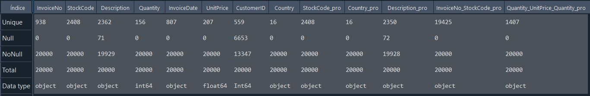

# E-Commerce Data

* URL: <https://www.kaggle.com/datasets/carrie1/ecommerce-data>
* Format: CSV
* Description: This is a transnational data set which contains all the transactions occurring between 01/12/2010 and 09/12/2011 for a UK-based and registered non-store online retail.The company mainly sells unique all-occasion gifts. Many customers of the company are wholesalers.

## Datasets

* [data.csv](./SourceFiles/data.csv)
  * 541909 rows x 8 columns

* [processed_data20K.csv](./SourceFiles/processed_data20K.csv)
  * 20000 rows x 13 columns
  * From above, selection of the first 20000 rows
  * Processing of identifiers for four classes

* The "Description" and "CustomerID" fields are the only fields that have null values
* No field has only unique values

* (0,0) No relationship between values in the row and column fields
* (0,1) One value in the row field is related to at most one value in the column field
* (0,2) One value in the row field can be related to none, one or several values in the column field
* (1,1) One value in the row filed is only related to one value in the column field
* (1,2) One value in the row field can be related to one or several values in the column field
* Inconsistencies:
  * The "InvoiceNo" field should have a 1 to 1 relationship with the "InvoiceDate" field.
  * The "StockCode" field should have a 1 to 1 relationship with the "Description" field and vice versa

## Ontologies

* [Basic](./Ontologies/eCommerceOntology.owl)
* [LLM](./Ontologies/eCommerceOntologyLLM.owl)
* [Gold standard](./Ontologies/eCommerceOntologyII.owl)
* [Materials](./Ontology/materials_anony_v2.owl)

## Mapping

|Mapping |Dataset| RDF | attr_triples | rel_triples |
|:-:|:-:|:-:|:-:|:-:|
|[Basic](./Mappings/mappingBasic.csv.yml)|20K|[54553 triples](./Mappings/ecommercedataBasic.nt)|[53615 triples](./Experiments/EntityAlignment/Gold-Basic/Input/attr_triples_2)|[938 triples](./Experiments/EntityAlignment/Gold-Basic/Input/rel_triples_2)|
|[Gold](./Mappings/mappingGold.csv.yml)|20K|[95666 triples](./Mappings/ecommercedataGold.nt)|[10081 triples](./Experiments/EntityAlignment/Gold-Basic/Input/attr_triples_1)|[85585 triples](./Experiments/EntityAlignment/Gold-Basic/Input/rel_triples_1)|

## [Gold - Basic](./Experiments/EntityAlignment/Gold-Basic/)

### [Input](./Experiments/EntityAlignment/Gold-Basic/Input/)

|ent_links| [Related Entities 20K](./Experiments/EntityAlignment/Gold-Basic/Input/ent_links)|Split 1 - 20K Test|
|:-:|:-:|:-:|
|<https://vocab.um.es/ontology/ecd/Invoice> - <https://vocab.um.es/ontology/ecd/Invoice>| 938 (100%)|375 (100%)
| Total related entities |938|375

|Split|Training (50%) | Test (40%) | Validation (10%) |
|:-:|:-:|:-:|:-:|
|[1 - 20K](./Experiments/EntityAlignment/Gold-Basic/Input/451_5fold/1/)|469|375|94|

### [Output](./Experiments/EntityAlignment/Gold-Basic/Output/)

|Approach|Split|Aligned Ent|H@1 (%)|H@5 (%)|H@10 (%)|MR|MRR [0,1]|Run time | Invoice (#/%) |
|:-:|:-:|:-:|:-:|:-:|:-:|:-:|:-:|:-:|:-:|
|BootEA|1|[375](./Experiments/EntityAlignment/Gold-Basic/Output/BootEA/1/alignment_results_12)|0.0|1.60 |2.67 |188|0.02|759|0 (0.0%)|
|AttrE|1|[375](./Experiments/EntityAlignment/Gold-Basic/Output/AttrE/1/alignment_results_12)|1.60|4.80|9.60|136|0.05|352|6 (1.60)|

## [Gold - LLM](./Experiments/EntityAlignment/Gold-LLM/)

## [Basic - LLM](./Experiments/EntityAlignment/Basic-LLM/)

## Metrics

|Alignment|Approach|Split|h@1 (%)|h@5 (%)|h@10 (%)|MR|MRR [0,1]|Run Time (s)|
|:------:|:------:|:---:|:-:|:-:|:--:|:-:|:-:|:-:|
|Gold-Basic|BootEA|1|0.0|1.60|2.67|188|0.02|759|
|Gold-Basic|AttrE|1|1.60|4.80|9.60|136|0.05|352|

### Discussion

1. LLM mapping uses only the "StockCode" as identifier. It is not suitable for modulating n-ary relationships (price, quantity, sales item).
2. "Materials" has only two classes and one object property between them.
3. Increasing attributes in Materials II and Gold II.
4. BottEA and RSN4EA show similar results for Basic and Gold versus LLM. However, AttrE shows much better results in these cases, being even better with Gold than with Basic.
5. In general, the best result is between Bacic and Gold, generating the worst result RSN4EA
6. In general, the worst result is between LLM and Materials. Bootea and RSN4EA show similar results for LLM versus Materials. With AttrE showing a slight improvement, but still slightly better with LLM-MaterialsII.
7. Bottea and RSN4EA show similar results for Basic and Gold versus Materials, even for GoldII-MaterialsII, showing that increasing the number of attributes (data properties) by both Gold and Materials does not affect the performance of these algorithms.
the  However, AttrE shows much better results in these cases, being even better with Gold than with Basic.
8. However, for AttrE, while it performs worse in Basic-Materials than the other two algorithms, it improves substantially in Gold-Materials. The results for GoldII-MaterialsII are even better. Demostrating that this algorithm is indeed susceptible to the number of attributes present in the KGs.
9. According to the results obtained between the different datasets and alignment methods used, which take into account both the structure of relationships between classes and the attributes that describe the elements of each of them, it is observed that there is a greater similarity between the semantic schemas of Basic and Gold with LLM than with Materials or even MaterialsII.
10. According to the classes to which the aligned entities belong:
    1. Basic-LLM and Gold-LLM. The Invoice class with 75% achieves the most alignments, while the second one is around 5% for the BootEA and RSN4EA methods. However, AttrE maintains this percentage with Invoice but improves the salesArticle class to 67% and 76% for Basic and Gold respectively.
    2. While for the other methods there is no difference between the different LLM-Materials formats, AttrE does manage to increase the alignment between the one representing the LLM salesArticle class (um:Product) and the one representing the Materials Product class (mt:sales_product). Although these two classes should not be aligned according to the general pattern followed in this dataset. This indicates a lack of semantic expressiveness.
    3. In Basic-Materials, the Product class is the one that gets the most alignment in all methods with respect to the salesArticle. The same is true for Gold. Although in the latter, the alignment improvements for AttrE occur with the salesArticle class.

### Conclusions

1. To improve the alignment of entities between knowledge graphs, it is important to identify the underlying patterns and sub-patterns between both graphs. One objective would be the development of reference patterns on which the developed ontologies are based.
2. These algorithms are not based on the text of entities, relationships or attributes.
Bootea, Bootea Rotate and RSN4EA are based on the structure of the relationships between nodes, especially those corresponding to object properties.
3. AttrE is more influenced by data properties than the object properties
4. In the case of dealing with simple ontologies, whith few object properties and data properties AttrE presents worse results, but as the number of data properties increases, they improve significantly.
5. In the absence of more in-depth studies, the results of both Bootea (object properties) and AttrE (data properties) could be used to determine the structural similarity between two KGs by means of entity alignment analysis for a given dataset.  
6. Among the semantic schemes of LLM, Basic and Gold, the last two are the ones with which AttrE and BootEA achieve the best alignment, very close to the optimum, due to the great similarity in the structure of these schemas.
    * In both Basic-LLM and Gold-LLM pairs, the improvement of the results of AttrE over BootEA is due to the "salesArticle" class, as the other two classes to be aligned maintain their results in both methods. Mainly due to the high number of attributes that this class presents.
7. The Materials semantic schema has been reduced to the two classes whose entities can be aligned according to the CSV file. The results are not very good when comparing this schema with LLM or Basic, but do well with Gold, as these classes lack a clear structure both in terms of attributes and relationships between classes.
    * It is only when we enrich classes with attributes, not with relationships between classes, that we see an improvement in the percentage of aligned entities for AttrE
    * Looking at the LLM-Materials pair, it can be concluded that in the face of poor or too simple schemes, both AttrE and BootEA are not able to align entities.
