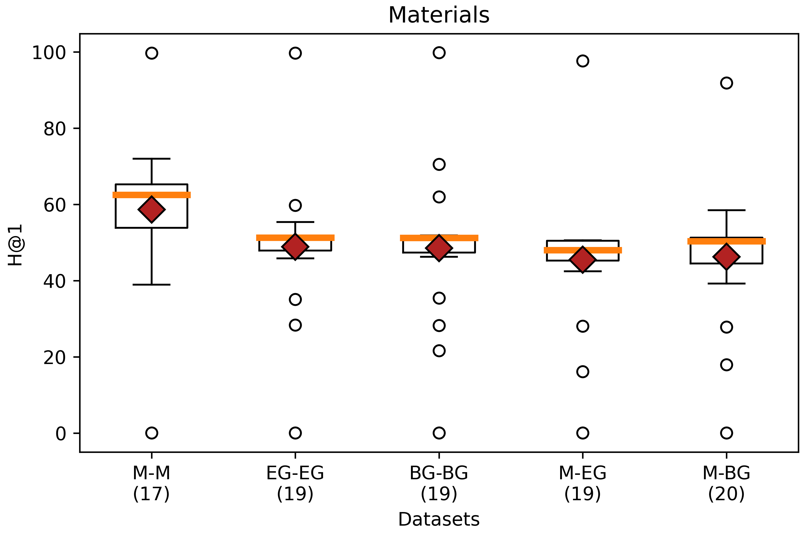
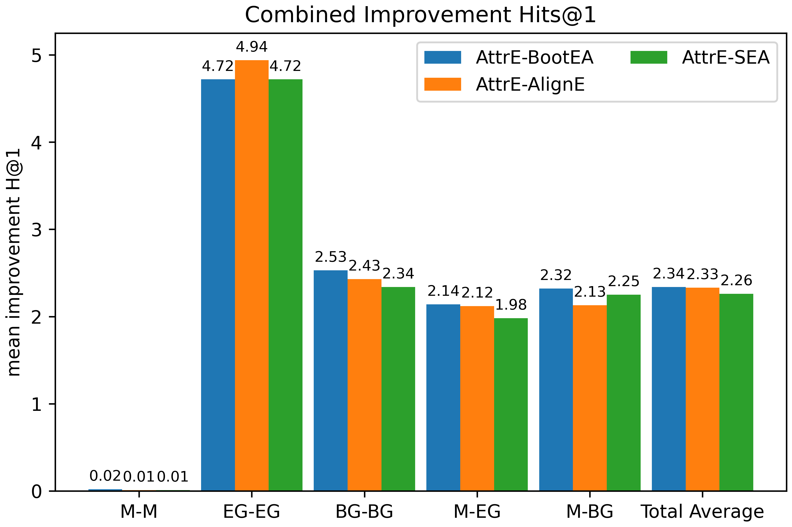

# Materials

* URL: 
* Format: CSV
* Description: 

## Datasets

* [materials_data.csv](./SourceFiles)
  * 139505 rows x 12 columns

* [processed_Materials_hive_20K.csv](./SourceFiles)
  * 20000 rows x 12 columns
  * From above, selection of the first 20000 rows
  * Processing of identifiers for four classes

## Ontologies

* [Materials](./Ontology)
  * Four classes
  * Three object properties
  * Twelve data properties
* [E-CommerceGold](./Ontologies)
  * Two classes
  * One object property
  * Two data properties
* [BigBasketGold](./Ontologies)
  * Two classes
  * One object property
  * Two data properties

## Mapping

|Mapping |RDF | attr_triples | rel_triples |
|:-:|:-:|:-:|:-:|
|[Materials](./Mappings/mappingMaterials.csv.yml)|[200300 triples](./Mappings/materialsMaterials.nt)|[122767 triples](./Experiments/EntityAlignment/Materials-Materials/Input/attr_triples_1)|[77533 triples](./Experiments/EntityAlignment/Materials-Materials/Input/rel_triples_1)|
|[E-CommerceGold](./Mappings/mappingeCommerceGold.csv.yml)|[78836 triples](./Mappings/materialsEcommerceGold.nt)|[26730 triples](./Experiments/EntityAlignment/EcommerceGold-EcommerceGold/Input/attr_triples_1)|[52106 triples](./Experiments/EntityAlignment/EcommerceGold-EcommerceGold/Input/rel_triples_1)|
|[BigBasketGold](./Mappings/mappingBigBasketGold.csv.yml)|[78836 triples](./Mappings/materialsBigBasketGold.nt)|[26730 triples](./Experiments/EntityAlignment/BigBasketGold-BigBasketGold/Input/attr_triples_1)|[52106 triples](./Experiments/EntityAlignment/BigBasketGold-BigBasketGold/Input/rel_triples_1)|

## [Materials - Materials](./Experiments/EntityAlignment/Materials-Materials/)

### [Input](./Experiments/EntityAlignment/Materials-Materials/Input/)

|ent_links| [Related Entities](./Experiments/EntityAlignment/Materials-Materials/Input/ent_links)|Split 1 Test|
|:-:|:-:|:-:|
|<https://purl.org/ontologies/MT/SalesArticle> - <https://purl.org/ontologies/MT/SalesArticle>| 19719 (51.95%)|7980 (52.57%)
|<https://purl.org/ontologies/MT/sales_product> - <https://purl.org/ontologies/MT/sales_product>| 13366 (35.22%)|5308 (34.96%)
|<https://purl.org/ontologies/MT/material> - <https://purl.org/ontologies/MT/material>| 4861 (12.81%)|1888 (12.44%)
|<https://purl.org/ontologies/MT/Indication> - <https://purl.org/ontologies/MT/Indication>| 8 (0.02%)| 5 (0.03%)
| Total related entities |37954|15181

|Split|Training (50%) | Test (40%) | Validation (10%) |
|:-:|:-:|:-:|:-:|
|[1](./Experiments/EntityAlignment/Materials-Materials/Input/451_1fold/1/)|18977|15181|3796|

### [Output](./Experiments/EntityAlignment/Materials-Materials/Output/)

|Approach|Split|Aligned Ent|H@1 (%)|H@5 (%)|H@10 (%)|MR|MRR [0,1]|Run time |SalesArticle (#/%)|sales_product (#/%)|material (#/%)|Indication (#/%)|
|:-:|:-:|:-:|:-:|:-:|:-:|:-:|:-:|:-:|:-:|:-:|:-:|:-:|
|AlignE|1|[15181](./Experiments/EntityAlignment/Materials-Materials/Output/AlignE/1/nohup_materials-materials_aligne.txt)|63.23|77.97|81.25|219|0.70|16801|4305 (53.95%)|3724 (70.16%)|1565 (82.89%)|5 (100%)|
|AliNet|1|[15181](./Experiments/EntityAlignment/Materials-Materials/Output/AliNet/1/nohup_materials-materials_alinet.txt)|64.36|79.55|81.21|529|0.71|21304|-|-|-|-
|AttrE|1|[15181](./Experiments/EntityAlignment/Materials-Materials/Output/AttrE/1/nohup_materials-materials_attre.txt)|99.72|99.99|100|1|1.00|13362|7954 (99.67%)| 5292 (99.70%)|1887 (99.95%)|5 (100%)|
|BootEA|1|[15181](./Experiments/EntityAlignment/Materials-Materials/Output/BootEA/1/nohup_materials-materials_bootea.txt)|67.25|81.13|84.18|194|0.73|18502|4678 (58.62%)|3941 (74.25%)|1585 (83.95%)|5 (100%)|
|BootEA_RotatE|1|[15181](./Experiments/EntityAlignment/Materials-Materials/Output/BootEA_RotatE/1/nohup_materials-materials_bootea_rotate.txt)|65.70|82.95|86.08|66|0.73|39164|-|-|-|-|
|BootEA_TransH|1|[15181](./Experiments/EntityAlignment/Materials-Materials/Output/BootEA_TransH/1/error_output_materials-materials_bootea_transh.txt)|E|r|r|o|r|||
|Conve|1|[15181](./Experiments/EntityAlignment/Materials-Materials/Output/ConvE/1/error_output_materials-materials_conve.txt)|E|r|r|o|r|||
|GCN_Align|1|[15181](./Experiments/EntityAlignment/Materials-Materials/Output/GCN_Align/1/nohup_materials-materials_gcnalign.txt)|65.23|77.64|80.13|143|0.71|2300|-|-|-|-
|GMNN|1|[15181](./Experiments/EntityAlignment/Materials-Materials/Output/GMNN/1/error_output_materials-materials_gmnn.txt)|E|r|r|o|r|||
|HolE|1|[15181](./Experiments/EntityAlignment/Materials-Materials/Output/HolE/1/error_output_materials-materials_hole.txt)|E|r|r|o|r|||
|IMUSE|1|[15181](./Experiments/EntityAlignment/Materials-Materials/Output/IMUSE/1/nohup_materials-materials_imuse.txt)|71.96|88.04|91.48|99|0.79|4835|-|-|-|-
|IPTransE|1|[15181](./Experiments/EntityAlignment/Materials-Materials/Output/IPTransE/1/error_output_materials-materials_iptranse.txt)|E|r|r|o|r||
|JAPE|1|[15181](./Experiments/EntityAlignment/Materials-Materials/Output/JAPE/1/nohup_materials-materials_jape.txt)|56.95|66.97|68.59|702|0.61|6945|-|-|-|-
|KDCoE|1|[15181](./Experiments/EntityAlignment/Materials-Materials/Output/KDCoE/1/error_output_materials-materials_kdcoe.txt)|E|r|r|o|r|||
|MTransE|1|[15181](./Experiments/EntityAlignment/Materials-Materials/Output/MTransE/1/nohup_materials-materials_mtranse.txt)|49.82|58.24|60.13|909|0.54|4424|-|-|-|-
|MultiKE|1|[15181](./Experiments/EntityAlignment/Materials-Materials/Output/MultiKE/1/error_output_materials-materials_multike.txt)|E|r|r|o|r|||
|ProjE|1|[15181](./Experiments/EntityAlignment/Materials-Materials/Output/ProjE/1/nohup_materials-materials_proje.txt)|38.92|48.30|49.99|1041|0.43|19335|-|-|-|-
|RDGCN|1|[15181](./Experiments/EntityAlignment/Materials-Materials/Output/RDGCN/1/error_output_materials-materials_rdgcn.txt)|E|r|r|o|r|||
|RotatE|1|[15181](./Experiments/EntityAlignment/Materials-Materials/Output/RotatE/1/nohup_materials-materials_rotate.txt)|62.53|81.01|84.76|123|0.71|13612|-|-|-|-
|RSN4EA|1|[15181](./Experiments/EntityAlignment/Materials-Materials/Output/RSN4EA/1/nohup_materials-materials_rsn4ea.txt)|60.89|76.54|78.97|622|0.68|45815|-|-|-|-
|SEA|1|[15181](./Experiments/EntityAlignment/Materials-Materials/Output/SEA/1/nohup_materials-materials_sea.txt)|63.49|79.48|83.49|115|0.71|4789|4406 (55.21%)|3645 (68.67%)| 1583 (83.85%)|5 (100%)
|SimplE|1|[15181](./Experiments/EntityAlignment/Materials-Materials/Output/SimplE/1/nohup_materials-materials_simple.txt)|53.84|67.39|70.48|160|0.60|4145|-|-|-|-
|TransD|1|[15181](./Experiments/EntityAlignment/Materials-Materials/Output/TransD/1/nohup_materials-materials_transd.txt)|52.11|60.04|61.83|851|0.56|6983|-|-|-|-
|TransH|1|[15181](./Experiments/EntityAlignment/Materials-Materials/Output/TransH/1/nohup_materials-materials_transh.txt)|61.02|73.69|76.53|254|0.67|13920|-|-|-|-
|TransR|1|[15181](./Experiments/EntityAlignment/Materials-Materials/Output/TransR/1/nohup_materials-materials_transr.txt)|0.04|0.26|0.42|4939|0.00|6503|-|-|-|-

## [EcommerceGold - EcommerceGold](./Experiments/EntityAlignment/EcommerceGold-EcommerceGold/)

### [Input](./Experiments/EntityAlignment/EcommerceGold-EcommerceGold/Input/)

|ent_links| [Related Entities](./Experiments/EntityAlignment/EcommerceGold-EcommerceGold/Input/ent_links)|Split 1 Test|
|:-:|:-:|:-:|
|<https://vocab.um.es/ontology/ecd/salesArticle> - <https://vocab.um.es/ontology/ecd/salesArticle>| 19719 (59.60%)|7856 (59.37%)
|<https://vocab.um.es/ontology/ecd/Product> - <https://vocab.um.es/ontology/ecd/Product>| 13365 (40.40%)|5377 (40.63%)
| Total related entities |33084|13233

|Split|Training (50%) | Test (40%) | Validation (10%) |
|:-:|:-:|:-:|:-:|
|[1](./Experiments/EntityAlignment/EcommerceGold-EcommerceGold/Input/451_1fold/1/)|16542|13233|3309|

### [Output](./Experiments/EntityAlignment/EcommerceGold-EcommerceGold/Output/)

|Approach|Split|Aligned Ent|H@1 (%)|H@5 (%)|H@10 (%)|MR|MRR [0,1]|Run time |salesArticle (#/%)|Product (#/%)|
|:-:|:-:|:-:|:-:|:-:|:-:|:-:|:-:|:-:|:-:|:-:|
|AlignE|1|[13233](./Experiments/EntityAlignment/EcommerceGold-EcommerceGold/Output/AlignE/1/nohup_ecommergold-ecommercegold_aligne.txt)|51.25|60.04|61.14|1179|0.55|5163|3737 (47.57%)|3045 (56.63%)|
|AliNet|1|[13233](./Experiments/EntityAlignment/EcommerceGold-EcommerceGold/Output/AliNet/1/nohup_ecommergold-ecommercegold_alinet.txt)|51.46|60.02|61.03|855|0.55|7992|-|-|
|AttrE|1|[13233](./Experiments/EntityAlignment/EcommerceGold-EcommerceGold/Output/AttrE/1/nohup_ecommergold-ecommercegold_attre.txt)|59.74|77.26|81.98|90|0.68|5317|3984 (50.71%)|3921 (72.92%)|
|BootEA|1|[13233](./Experiments/EntityAlignment/EcommerceGold-EcommerceGold/Output/BootEA/1/nohup_ecommergold-ecommercegold_bootea.txt)|51.21|59.95|61.05|1207|0.55|5223|3733 (47.52%)|3044 (56.61%)|
|BootEA_RotatE|1|[13233](./Experiments/EntityAlignment/EcommerceGold-EcommerceGold/Output/BootEA_RotatE/1/nohup_ecommergold-ecommercegold_bootea_rotate.txt)|51.50|60.07|61.18|1052|0.55|13522|-|-|
|BootEA_TransH|1|[13233](./Experiments/EntityAlignment/EcommerceGold-EcommerceGold/Output/BootEA_TransH/1/error_output_ecommergold-ecommercegold_bootea_transh.txt)|E|r|r|o|r|||
|Conve|1|[13233](./Experiments/EntityAlignment/EcommerceGold-EcommerceGold/Output/ConvE/1/error_output_ecommergold-ecommercegold_conve.txt)|E|r|r|o|r|||
|GCN_Align|1|[13233](./Experiments/EntityAlignment/EcommerceGold-EcommerceGold/Output/GCN_Align/1/nohup_ecommergold-ecommercegold_gcnalign.txt)|51.33|60.07|61.23|798|0.55|270|-|-|
|GMNN|1|[13233](./Experiments/EntityAlignment/EcommerceGold-EcommerceGold/Output/GMNN/1/nohup_ecommergold-ecommercegold_gmnn.txt)|99.69|99.96|99.98|1|1.00|34217|-|-
|HolE|1|[13233](./Experiments/EntityAlignment/EcommerceGold-EcommerceGold/Output/HolE/1/nohup_ecommergold-ecommercegold_hole.txt)|47.56|55.91|57.51|1704|0.51|6909|-|-|
|IMUSE|1|[13233](./Experiments/EntityAlignment/EcommerceGold-EcommerceGold/Output/IMUSE/1/nohup_ecommergold-ecommercegold_imuse.txt)|55.35|71.47|73.33|850|0.63|755|-|-|
|IPTransE|1|[13233](./Experiments/EntityAlignment/EcommerceGold-EcommerceGold/Output/IPTransE/1/error_output_ecommergold-ecommercegold_iptranse.txt)|E|r|r|o|r|||
|JAPE|1|[13233](./Experiments/EntityAlignment/EcommerceGold-EcommerceGold/Output/JAPE/1/error_output_ecommergold-ecommercegold_jape.txt)|E|r|r|o|r|||
|KDCoE|1|[13233](./Experiments/EntityAlignment/EcommerceGold-EcommerceGold/Output/KDCoE/1/error_output_ecommergold-ecommercegold_kdcoe.txt)|E|r|r|o|r|||
|MTransE|1|[13233](./Experiments/EntityAlignment/EcommerceGold-EcommerceGold/Output/MTransE/1/nohup_ecommergold-ecommercegold_mtranse.txt)|48.18|56.02|57.27|1682|0.52|1108|-|-|
|MultiKE|1|[13233](./Experiments/EntityAlignment/EcommerceGold-EcommerceGold/Output/MultiKE/1/error_output_ecommergold-ecommercegold_multike.txt)|E|r|r|o|r|||
|ProjE|1|[13233](./Experiments/EntityAlignment/EcommerceGold-EcommerceGold/Output/ProjE/1/nohup_ecommergold-ecommercegold_proje.txt)|28.33|37.00|38.13|2321|0.32|3571|-|-|
|RDGCN|1|[13233](./Experiments/EntityAlignment/EcommerceGold-EcommerceGold/Output/RDGCN/1/nohup_ecommergold-ecommercegold_rdgcn.txt)|35.06|40.48|42.85|1550|0.38|48137|-|-|
|RotatE|1|[13233](./Experiments/EntityAlignment/EcommerceGold-EcommerceGold/Output/RotatE/1/nohup_ecommergold-ecommercegold_rotate.txt)|51.26|59.90|61.07|1357|0.55|4689|-|-|
|RSN4EA|1|[13233](./Experiments/EntityAlignment/EcommerceGold-EcommerceGold/Output/RSN4EA/1/nohup_ecommergold-ecommercegold_rsn4ea.txt)|51.85|60.45|61.73|2406|0.56|9700|-|-|
|SEA|1|[13233](./Experiments/EntityAlignment/EcommerceGold-EcommerceGold/Output/SEA/1/nohup_ecommergold-ecommercegold_sea.txt)|51.36|59.98|61.14|1234|0.55|944|3752 (47.76%)|3045 (56.63%)|
|SimplE|1|[13233](./Experiments/EntityAlignment/EcommerceGold-EcommerceGold/Output/SimplE/1/nohup_ecommergold-ecommercegold_simple.txt)|48.79|58.76|60.20|1020|0.53|1167|-|-|
|TransD|1|[13233](./Experiments/EntityAlignment/EcommerceGold-EcommerceGold/Output/TransD/1/nohup_ecommergold-ecommercegold_transd.txt)|45.81|51.50|52.25|1865|0.48|1655|-|-|
|TransH|1|[13233](./Experiments/EntityAlignment/EcommerceGold-EcommerceGold/Output/TransH/1/nohup_ecommergold-ecommercegold_transh.txt)|49.35|58.00|59.54|1293|0.53|2888|-|-|
|TransR|1|[13233](./Experiments/EntityAlignment/EcommerceGold-EcommerceGold/Output/TransR/1/nohup_ecommergold-ecommercegold_transr.txt)|0.03|0.17|0.34|4993|0.00|2677|-|-|

## [BigBasketGold - BigBasketGold](./Experiments/EntityAlignment/BigBasketGold-BigBasketGold/)

### [Input](./Experiments/EntityAlignment/BigBasketGold-BigBasketGold/Input/)

|ent_links| [Related Entities](./Experiments/EntityAlignment/BigBasketGold-BigBasketGold/Input/ent_links)|Split 1 Test|
|:-:|:-:|:-:|
|<https://vocab.um.es/ontology/bbp/SalesArticle> - <https://vocab.um.es/ontology/bbp/SalesArticle>| 19719 (59.60%)|7825 (59.13%)
|<https://vocab.um.es/ontology/bbp/Product> - <https://vocab.um.es/ontology/bbp/Product>|13365 (40.40%)|5408 (40.87%)
| Total related entities |33084|13233

|Split|Training (50%) | Test (40%) | Validation (10%) |
|:-:|:-:|:-:|:-:|
|[1](./Experiments/EntityAlignment/BigBasketGold-BigBasketGold/Input/451_1fold/1/)|16542|13233|3309|

### [Output](./Experiments/EntityAlignment/BigBasketGold-BigBasketGold/Output/)

|Approach|Split|Aligned Ent|H@1 (%)|H@5 (%)|H@10 (%)|MR|MRR [0,1]|Run time |SalesArticle (#/%)|Product (#/%)|
|:-:|:-:|:-:|:-:|:-:|:-:|:-:|:-:|:-:|:-:|:-:|
|AlignE|1|[13233](./Experiments/EntityAlignment/BigBasketGold-BigBasketGold/Output/AlignE/1/nohup_bigbasketgold-bigbasketgold_aligne.txt)|51.17|59.81|60.87|1159|0.55|6228|3723 (47.58%)|3048 (56.36%)|
|AliNet|1|[13233](./Experiments/EntityAlignment/BigBasketGold-BigBasketGold/Output/AliNet/1/nohup_bigbasketgold-bigbasketgold_alinet.txt)|51.42|59.86|60.87|1208|0.55|3608|-|-|
|AttrE|1|[13233](./Experiments/EntityAlignment/BigBasketGold-BigBasketGold/Output/AttrE/1/nohup_bigbasketgold-bigbasketgold_attre.txt)|61.97|78.06|82.46|83|0.69|6394|4100 (52.40%)|4100 (75.81%)|
|BootEA|1|[13233](./Experiments/EntityAlignment/BigBasketGold-BigBasketGold/Output/BootEA/1/nohup_bigbasketgold-bigbasketgold_bootea.txt)|51.33|59.91|60.95|1222|0.55|5276|3740 (47.80%)|3053 (56.45%)|
|BootEA_RotatE|1|[13233](./Experiments/EntityAlignment/BigBasketGold-BigBasketGold/Output/BootEA_RotatE/1/nohup_bigbasketgold-bigbasketgold_bootea_rotate.txt)|51.36|59.89|60.95|1090|0.55|12083|-|-|
|BootEA_TransH|1|[13233](./Experiments/EntityAlignment/BigBasketGold-BigBasketGold/Output/BootEA_TransH/1/error_output_bigbasketgold-bigbasketgold_bootea_transh.txt)|E|r|r|o|r|||
|Conve|1|[13233](./Experiments/EntityAlignment/BigBasketGold-BigBasketGold/Output/ConvE/1/error_output_bigbasketgold-bigbasketgold_conve.txt)|E|r|r|o|r|||
|GCN_Align|1|[13233](./Experiments/EntityAlignment/BigBasketGold-BigBasketGold/Output/GCN_Align/1/nohup_bigbasketgold-bigbasketgold_gcnalign.txt)|51.36|59.88|60.98|752|0.55|1054|-|-|
|GMNN|1|[13233](./Experiments/EntityAlignment/BigBasketGold-BigBasketGold/Output/GMNN/1/nohup_bigbasketgold-bigbasketgold_gmnn.txt)|99.80|100|100|1|1.00|41800|-|-
|HolE|1|[13233](./Experiments/EntityAlignment/BigBasketGold-BigBasketGold/Output/HolE/1/nohup_bigbasketgold-bigbasketgold_hole.txt)|21.59|35.40|40.47|1980|0.28|5624|-|-|
|IMUSE|1|[13233](./Experiments/EntityAlignment/BigBasketGold-BigBasketGold/Output/IMUSE/1/nohup_bigbasketgold-bigbasketgold_imuse.txt)|70.53|82.94|84.34|490|0.76|524|-|-|
|IPTransE|1|[13233](./Experiments/EntityAlignment/BigBasketGold-BigBasketGold/Output/IPTransE/1/error_output_bigbasketgold-bigbasketgold_iptranse.txt)|E|r|r|o|r|||
|JAPE|1|[13233](./Experiments/EntityAlignment/BigBasketGold-BigBasketGold/Output/JAPE/1/error_output_bigbasketgold-bigbasketgold_jape.txt)|E|r|r|o|r|||
|KDCoE|1|[13233](./Experiments/EntityAlignment/BigBasketGold-BigBasketGold/Output/KDCoE/1/error_output_bigbasketgold-bigbasketgold_kdcoe.txt)|E|r|r|o|r|||
|MTransE|1|[13233](./Experiments/EntityAlignment/BigBasketGold-BigBasketGold/Output/MTransE/1/nohup_bigbasketgold-bigbasketgold_mtranse.txt)|48.42|56.22|57.32|1612|0.52|964|-|-|
|MultiKE|1|[13233](./Experiments/EntityAlignment/BigBasketGold-BigBasketGold/Output/MultiKE/1/error_output_bigbasketgold-bigbasketgold_multike.txt)|E|r|r|o|r|||
|ProjE|1|[13233](./Experiments/EntityAlignment/BigBasketGold-BigBasketGold/Output/ProjE/1/nohup_bigbasketgold-bigbasketgold_proje.txt)|28.25|36.89|37.93|2412|0.32|2784|-|-|
|RDGCN|1|[13233](./Experiments/EntityAlignment/BigBasketGold-BigBasketGold/Output/RDGCN/1/nohup_bigbasketgold-bigbasketgold_rdgcn.txt)|35.44|41.74|44.03|1457|0.38|54658|-|-|
|RotatE|1|[13233](./Experiments/EntityAlignment/BigBasketGold-BigBasketGold/Output/RotatE/1/nohup_bigbasketgold-bigbasketgold_rotate.txt)|51.22|59.78|60.83|1396|0.55|6050|-|-|
|RSN4EA|1|[13233](./Experiments/EntityAlignment/BigBasketGold-BigBasketGold/Output/RSN4EA/1/nohup_bigbasketgold-bigbasketgold_rsn4ea.txt)|51.87|60.55|61.81|2492|0.56|9931|-|-|
|SEA|1|[13233](./Experiments/EntityAlignment/BigBasketGold-BigBasketGold/Output/SEA/1/nohup_bigbasketgold-bigbasketgold_sea.txt)|51.24|59.89|60.90|1258|0.55|1207|3733 (47.71%)|3048 (56.36%)|
|SimplE|1|[13233](./Experiments/EntityAlignment/BigBasketGold-BigBasketGold/Output/SimplE/1/nohup_bigbasketgold-bigbasketgold_simple.txt)|48.97|58.51|60.12|1065|0.53|1128|-|-|
|TransD|1|[13233](./Experiments/EntityAlignment/BigBasketGold-BigBasketGold/Output/TransD/1/nohup_bigbasketgold-bigbasketgold_transd.txt)|46.26|52.69|53.81|1406|0.49|1455|-|-|
|TransH|1|[13233](./Experiments/EntityAlignment/BigBasketGold-BigBasketGold/Output/TransH/1/nohup_bigbasketgold-bigbasketgold_transh.txt)|50.11|58.66|60.00|1285|0.54|2204|-|-|
|TransR|1|[13233](./Experiments/EntityAlignment/BigBasketGold-BigBasketGold/Output/TransR/1/nohup_bigbasketgold-bigbasketgold_transr.txt)|0.05|0.18|0.32|5014|0.00|1974|-|-|

## [Materials - E-CommerceGold](./Experiments/EntityAlignment/Materials-EcommerceGold/)

### [Input](./Experiments/EntityAlignment/Materials-EcommerceGold/Input/)

|ent_links| [Related Entities](./Experiments/EntityAlignment/Materials-EcommerceGold/Input/ent_links)|Split 1 Test|
|:-:|:-:|:-:|
|<https://purl.org/ontologies/MT/SalesArticle> - <https://vocab.um.es/ontology/ecd/salesArticle>| 19719 (59.60%)|7884 (59.58%)
|<https://purl.org/ontologies/MT/sales_product> - <https://vocab.um.es/ontology/ecd/Product>| 13365 (40.40%)|5349 (40.42%)
| Total related entities |33084|13233

|Split|Training (50%) | Test (40%) | Validation (10%) |
|:-:|:-:|:-:|:-:|
|[1](./Experiments/EntityAlignment/Materials-EcommerceGold/Input/451_1fold/1/)|16542|13233|3309|

### [Output](./Experiments/EntityAlignment/Materials-EcommerceGold/Output/)

|Approach|Split|Aligned Ent|H@1 (%)|H@5 (%)|H@10 (%)|MR|MRR [0,1]|Run time |salesArticle (#/%)|sales_product (#/%)|
|:-:|:-:|:-:|:-:|:-:|:-:|:-:|:-:|:-:|:-:|:-:|
|AlignE|1|[13233](./Experiments/EntityAlignment/Materials-EcommerceGold/Output/AlignE/1/nohup_materials-ecommercegold_aligne.txt)|50.44|59.35|60.43|1198|0.54|6633|3719 (47.17%)|2956 (55.26%)|
|AliNet|1|[13233](./Experiments/EntityAlignment/Materials-EcommerceGold/Output/AliNet/1/nohup_materials-ecommercegold_alinet.txt)|50.50|59.42|60.39|1235|0.54|3936|-|-|
|AttrE|1|[13233](./Experiments/EntityAlignment/Materials-EcommerceGold/Output/AttrE/1/nohup_materials-ecommercegold_attre.txt)|48.66|60.27|64.54|452|0.54|4863|3277 (41.57%)|3162 (59.11%)|
|BootEA|1|[13233](./Experiments/EntityAlignment/Materials-EcommerceGold/Output/BootEA/1/nohup_materials-ecommercegold_bootea.txt)|50.49|59.49|60.44|1249|0.54|7391|3725 (47.25%)|2956 (55.26%)|
|BootEA_RotatE|1|[13233](./Experiments/EntityAlignment/Materials-EcommerceGold/Output/BootEA_RotatE/1/nohup_materials-ecommercegold_bootea_rotate.txt)|50.45|59.39|60.49|1161|0.54|13133|-|-|
|BootEA_TransH|1|[13233](./Experiments/EntityAlignment/Materials-EcommerceGold/Output/BootEA_TransH/1/error_output_materials-ecommercegold_bootea_transh.txt)|E|r|r|o|r|||
|Conve|1|[13233](./Experiments/EntityAlignment/Materials-EcommerceGold/Output/ConvE/1/error_output_materials-ecommercegold_conve.txt)|E|r|r|o|r|||
|GCN_Align|1|[13233](./Experiments/EntityAlignment/Materials-EcommerceGold/Output/GCN_Align/1/nohup_materials-ecommercegold_gcnalign.txt)|50.45|59.47|60.50|1668|0.54|339|-|-|
|GMNN|1|[13233](./Experiments/EntityAlignment/Materials-EcommerceGold/Output/GMNN/1/nohup_materials-ecommercegold_gmnn.txt)|97.67|100|100|1|0.99|1227|-|-
|HolE|1|[13233](./Experiments/EntityAlignment/Materials-EcommerceGold/Output/HolE/1/nohup_materials-ecommercegold_hole.txt)|48.57|58.17|59.58|1880|0.53|25749|-|-|
|IMUSE|1|[13233](./Experiments/EntityAlignment/Materials-EcommerceGold/Output/IMUSE/1/error_output_materials-ecommercegold_imuse.txt)|E|r|r|o|r|||
|IPTransE|1|[13233](./Experiments/EntityAlignment/Materials-EcommerceGold/Output/IPTransE/1/error_output_materials-ecommercegold_iptranse.txt)|E|r|r|o|r|||
|JAPE|1|[13233](./Experiments/EntityAlignment/Materials-EcommerceGold/Output/JAPE/1/nohup_materials-ecommercegold_jape.txt)|45.12|53.87|55.21|1705|0.49|1005|-|-
|KDCoE|1|[13233](./Experiments/EntityAlignment/Materials-EcommerceGold/Output/KDCoE/1/error_output_materials-ecommercegold_kdcoe.txt)|E|r|r|o|r|||
|MTransE|1|[13233](./Experiments/EntityAlignment/Materials-EcommerceGold/Output/MTransE/1/nohup_materials-ecommercegold_mtranse.txt)|42.41|50.20|51.73|1566|0.46|453|-|-|
|MultiKE|1|[13233](./Experiments/EntityAlignment/Materials-EcommerceGold/Output/MultiKE/1/error_output_materials-ecommercegold_multike.txt)|E|r|r|o|r|||
|ProjE|1|[13233](./Experiments/EntityAlignment/Materials-EcommerceGold/Output/ProjE/1/nohup_materials-ecommercegold_proje.txt)|28.07|36.94|38.05|2407|0.32|3252|-|-|
|RDGCN|1|[13233](./Experiments/EntityAlignment/Materials-EcommerceGold/Output/RDGCN/1/nohup_materials-ecommercegold_rdgcn.txt)|16.13|25.45|27.68|3607|0.20|82224|-|-|
|RotatE|1|[13233](./Experiments/EntityAlignment/Materials-EcommerceGold/Output/RotatE/1/nohup_materials-ecommercegold_rotate.txt)|47.83|59.25|60.44|1540|0.53|5698|-|-|
|RSN4EA|1|[13233](./Experiments/EntityAlignment/Materials-EcommerceGold/Output/RSN4EA/1/nohup_materials-ecommercegold_rsn4ea.txt)|48.01|55.66|57.47|2334|0.51|5412|-|-|
|SEA|1|[13233](./Experiments/EntityAlignment/Materials-EcommerceGold/Output/SEA/1/nohup_materials-ecommercegold_sea.txt)|50.56|59.48|60.51|1272|0.54|1046|3736 (47.39%)|2955 (55.24%)|
|SimplE|1|[13233](./Experiments/EntityAlignment/Materials-EcommerceGold/Output/SimplE/1/nohup_materials-ecommercegold_simple.txt)|46.86|58.15|59.70|1201|0.52|1181|-|-|
|TransD|1|[13233](./Experiments/EntityAlignment/Materials-EcommerceGold/Output/TransD/1/nohup_materials-ecommercegold_transd.txt)|45.43|51.98|53.17|1770|0.48|2896|-|-|
|TransH|1|[13233](./Experiments/EntityAlignment/Materials-EcommerceGold/Output/TransH/1/nohup_materials-ecommercegold_transh.txt)|46.62|54.34|55.78|1387|0.50|1938|-|-|
|TransR|1|[13233](./Experiments/EntityAlignment/Materials-EcommerceGold/Output/TransR/1/nohup_materials-ecommercegold_transr.txt)|0.02|0.11|0.24|4970|0.00|2473|-|-|

## [Materials - BigBasketGold](./Experiments/EntityAlignment/Materials-BigBasketGold/)

### [Input](./Experiments/EntityAlignment/Materials-BigBasketGold/Input/)

|ent_links| [Related Entities](./Experiments/EntityAlignment/Materials-BigBasketGold/Input/ent_links)|Split 1 Test|
|:-:|:-:|:-:|
|<https://purl.org/ontologies/MT/SalesArticle> - <https://vocab.um.es/ontology/bbp/SalesArticle>| 19719 (59.60%)|7806 (58.99%)
|<https://purl.org/ontologies/MT/sales_product> - <https://vocab.um.es/ontology/bbp/Product>|13365 (40.40%)|5427 (41.01%)
| Total related entities |33084|13233

|Split|Training (50%) | Test (40%) | Validation (10%) |
|:-:|:-:|:-:|:-:|
|[1](./Experiments/EntityAlignment/Materials-BigBasketGold/Input/451_1fold/1/)|16542|13233|3309|

### [Output](./Experiments/EntityAlignment/Materials-BigBasketGold/Output/)

|Approach|Split|Aligned Ent|H@1 (%)|H@5 (%)|H@10 (%)|MR|MRR [0,1]|Run time |SalesArticle (#/%)|sales_product (#/%)|
|:-:|:-:|:-:|:-:|:-:|:-:|:-:|:-:|:-:|:-:|:-:|
|AlignE|1|[13233](./Experiments/EntityAlignment/Materials-BigBasketGold/Output/AlignE/1/nohup_materials-bigbasketproductsgold_aligne.txt)|51.45|59.89|60.90|1193|0.55|6578|3714 (47.58%)|3094 (57.01%)|
|AliNet|1|[13233](./Experiments/EntityAlignment/Materials-BigBasketGold/Output/AliNet/1/nohup_materials-bigbasketproductsgold_alinet.txt)|51.28|59.87|60.78|1005|0.55|6472|-|-|
|AttrE|1|[13233](./Experiments/EntityAlignment/Materials-BigBasketGold/Output/AttrE/1/nohup_materials-bigbasketproductsgold_attre.txt)|50.93|62.93|66.89|281|0.57|6157|3482 (44.61%)|3258 (60.03%)|
|BootEA|1|[13233](./Experiments/EntityAlignment/Materials-BigBasketGold/Output/BootEA/1/nohup_materials-bigbasketproductsgold_bootea.txt)|51.08|59.64|60.79|1229|0.55|4187|3666 (46.96%)|3093 (56.99%)|
|BootEA_RotatE|1|[13233](./Experiments/EntityAlignment/Materials-BigBasketGold/Output/BootEA_RotatE/1/nohup_materials-bigbasketproductsgold_bootea_rotate.txt)|51.27|59.98|60.89|1186|0.55|14915|-|-|
|BootEA_TransH|1|[13233](./Experiments/EntityAlignment/Materials-BigBasketGold/Output/BootEA_TransH/1/error_output_materials-bigbasketproductsgold_bootea_transh.txt)|E|r|r|o|r|||
|Conve|1|[13233](./Experiments/EntityAlignment/Materials-BigBasketGold/Output/ConvE/1/error_output_materials-bigbasketproductsgold_conve.txt)|E|r|r|o|r|||
|GCN_Align|1|[13233](./Experiments/EntityAlignment/Materials-BigBasketGold/Output/GCN_Align/1/nohup_materials-bigbasketproductsgold_gcnalign.txt)|51.25|59.92|60.89|1708|0.55|427|-|-|
|GMNN|1|[13233](./Experiments/EntityAlignment/Materials-BigBasketGold/Output/GMNN/1/nohup_materials-bigbasketproductsgold_gmnn.txt)|91.84|97.96|100|1|0.94|1224|-|-
|HolE|1|[13233](./Experiments/EntityAlignment/Materials-BigBasketGold/Output/HolE/1/nohup_materials-bigbasketproductsgold_hole.txt)|45.21|57.04|59.13|1990|0.50|23264|-|-|
|IMUSE|1|[13233](./Experiments/EntityAlignment/Materials-BigBasketGold/Output/IMUSE/1/nohup_materials-bigbasketproductsgold_imuse.txt)|58.45|73.79|75.44|799|0.65|567|-|-|
|IPTransE|1|[13233](./Experiments/EntityAlignment/Materials-BigBasketGold/Output/IPTransE/1/error_output_materials-bigbasketproductsgold_iptranse.txt)|E|r|r|o|r|||
|JAPE|1|[13233](./Experiments/EntityAlignment/Materials-BigBasketGold/Output/JAPE/1/nohup_materials-bigbasketproductsgold_jape.txt)|47.05|55.26|56.62|1591|0.51|817|-|-
|KDCoE|1|[13233](./Experiments/EntityAlignment/Materials-BigBasketGold/Output/KDCoE/1/error_output_materials-bigbasketproductsgold_kdcoe.txt)|E|r|r|o|r|||
|MTransE|1|[13233](./Experiments/EntityAlignment/Materials-BigBasketGold/Output/MTransE/1/nohup_materials-bigbasketproductsgold_mtranse.txt)|42.21|50.14|51.56|1671|0.46|662|-|-|
|MultiKE|1|[13233](./Experiments/EntityAlignment/Materials-BigBasketGold/Output/MultiKE/1/error_output_materials-bigbasketproductsgold_multike.txt)|E|r|r|o|r|||
|ProjE|1|[13233](./Experiments/EntityAlignment/Materials-BigBasketGold/Output/ProjE/1/nohup_materials-bigbasketproductsgold_proje.txt)|27.83|36.51|37.60|2376|0.32|4531|-|-|
|RDGCN|1|[13233](./Experiments/EntityAlignment/Materials-BigBasketGold/Output/RDGCN/1/nohup_materials-bigbasketproductsgold_rdgcn.txt)|17.92|27.26|29.59|3575|0.22|57343|-|-|
|RotatE|1|[13233](./Experiments/EntityAlignment/Materials-BigBasketGold/Output/RotatE/1/nohup_materials-bigbasketproductsgold_rotate.txt)|49.72|59.82|60.80|1544|0.54|5539|-|-|
|RSN4EA|1|[13233](./Experiments/EntityAlignment/Materials-BigBasketGold/Output/RSN4EA/1/nohup_materials-bigbasketproductsgold_rsn4ea.txt)|52.23|60.87|61.97|2444|0.56|10441|-|-|
|SEA|1|[13233](./Experiments/EntityAlignment/Materials-BigBasketGold/Output/SEA/1/nohup_materials-bigbasketproductsgold_sea.txt)|51.16|59.95|60.88|1277|0.55|1102|3677 (47.10%)|3093 (56.99%)|
|SimplE|1|[13233](./Experiments/EntityAlignment/Materials-BigBasketGold/Output/SimplE/1/nohup_materials-bigbasketproductsgold_simple.txt)|39.24|51.52|53.83|1267|0.45|713|-|-|
|TransD|1|[13233](./Experiments/EntityAlignment/Materials-EcommerceGold/Output/TransD/1/nohup_materials-ecommercegold_transd.txt)|46.25|52.15|53.13|1838|0.49|2123|-|-|
|TransH|1|[13233](./Experiments/EntityAlignment/Materials-BigBasketGold/Output/TransH/1/nohup_materials-bigbasketproductsgold_transh.txt)|47.84|55.39|56.77|1320|0.51|1915|-|-|
|TransR|1|[13233](./Experiments/EntityAlignment/Materials-BigBasketGold/Output/TransR/1/nohup_materials-bigbasketproductsgold_transr.txt)|0.04|0.16|0.29|4882|0.00|2479|-|-|

## Results

<figcaption><strong>Figure Methods Boxplot.</strong> Boxplot of the OpenEA methods according to the Hits@1 metric of the 5 pairwise comparisons of the KGs generated from the Materials dataset. The orange solid line represents the median and the red diamond the mean of the experiments that did not lead to an error. The number of experiments without error is shown in brackets next to the name of the method. BootEA-TransH, ConvE, KDCoE and MultiKE are not shown because their error rate is equal to 1 for all datasets.</figcaption>

<figcaption><strong>Figure Methods Clustering.</strong> Hierarchical clustering (Ward algorithm) of 25 OpenEA methods according to the 5 metrics for the 5 pairwise comparisons of the KGs generated from the Materials dataset.</figcaption>

<figcaption><strong>Figure Experiments Boxplot.</strong> Boxplot of the 5 types of pairwise comparison experiments of KGs based on the Hits@1 score obtained by the 25 methods carried out in the Materials dataset. The orange solid line represents the median and the red diamond the mean of the experiments that did not lead to an error. The number of modules that did not generate an error is shown in brackets under the name of the experiment represented.</figcaption>

<figcaption><strong>Figure Experiments Clustering.</strong> Hierarchical clustering, with method Ward, of the 5 types of pairwise comparison experiments of KG, according to the 5 metrics, with all the values scaled to the range [0,1], of the 25 (at most) OpenEA modules carried out in the Materials dataset.</figcaption>

<figcaption><strong>Figure Distribution of OpenEA methods</strong>, according to the average Hits@1 score obtained between datasets and the average execution time obtained between datasets, scaled between 0 and 1 for each experiment. The average percentage of failed experiments between datasets is included in the label. Modules with an error rate of 1 are not shown.</figcaption>

<figcaption><strong>Figure Bar Chart mean Hits@1</strong>, showing for each OpenEA method, the mean Hits@1 metric for each of the four types of graph pairwise self-alignment experiment (M-M, BG-BG, EG-EG and M-EB) considering the Materials datasets. The average has been calculated only taking into account the non-failed experiments. BootEA-TransH, ConvE, KDCoE and MultiKE are not shown because their error rate is equal to 1.</figcaption>

<figcaption><strong>Figure Bar Chart Combined Methods.</strong> Bar chart containing the average increase in Hits@1 value when combining the AttrE module with either BootEA or Align-E or SEA, with respect to the module of each pair with the highest Hits@1 value. For the 5 types of experiments M-M, EG-EG, BG-BG, M-EG and M-BG. This is the average obtained from the averages obtained from all the classes aligned in the Materials dataset.</figcaption>

<figcaption><strong>Table Merged Methods.</strong></figcaption>

|Pair|Approach|SalesArticle (#/%)|Product (#/%)|Material (#/%)|Indication (#/%)|
|:-:|:-:|:-:|:-:|:-:|:-:|
|BigBasketProductsGold-BigBasketProductsGold|AttrE|4100 (52.40%)|4100 (75.81%)| - | - |
|BigBasketProductsGold-BigBasketProductsGold|BootEA|3740 (47.80%)|3053 (56.45%)| - | - |
|BigBasketProductsGold-BigBasketProductsGold|AlignE|3723 (47.58%)|3048 (56.36%)| - | - |
|BigBasketProductsGold-BigBasketProductsGold|SEA|3733 (47.71%)|3048 (56.36%)| - | - |
|BigBasketProductsGold-BigBasketProductsGold|AttrE-BootEA|4491 (57.39%)|4103 (75.87%)| - | - |
|BigBasketProductsGold-BigBasketProductsGold|AttrE-AlignE|4479 (57.24%)|4101 (75.83%)| - | - |
|BigBasketProductsGold-BigBasketProductsGold|AttrE-SEA|4465 (57.06%)|4101 (75.83%)| - | - |
|EcommerceGold-EcommerceGold|AttrE|3984 (50.71%)|3921 (72.92%)| - | - |
|EcommerceGold-EcommerceGold|BootEA|3733 (47.52%)|3044 (56.61%)| - | - |
|EcommerceGold-EcommerceGold|AlignE|3737 (47.57%)|3045 (56.63%)| - | - |
|EcommerceGold-EcommerceGold|SEA|3752 (47.76%)|3045 (56.63%)| - | - |
|EcommerceGold-EcommerceGold|AttrE-BootEA|4353 (55.41%)|3923 (72.96%)| - | - |
|EcommerceGold-EcommerceGold|AttrE-AlignE|4370 (55.63%)|3923 (72.96%)| - | - |
|EcommerceGold-EcommerceGold|AttrE-SEA|4353 (55.41%)|3923 (72.96%)| - | - |
|Materials-BigBasketsProductsGold|AttrE|3482 (44.61%)|3258 (60.03%)| - | - |
|Materials-BigBasketsProductsGold|BootEA|3666 (46.96%)|3093 (56.99%)| - | - |
|Materials-BigBasketsProductsGold|AlignE|3714 (47.58%)|3094 (57.01%)| - | - |
|Materials-BigBasketsProductsGold|SEA|3677 (47.10%)|3093 (56.99%)| - | - |
|Materials-BigBasketsProductsGold|AttrE-BootEA|4024 (51.55%)|3260 (60.07%)| - | - |
|Materials-BigBasketsProductsGold|AttrE-AlignE|4042 (51.78%)|3261 (60.09%)| - | - |
|Materials-BigBasketsProductsGold|AttrE-SEA|4026 (51.58%)|3259 (60.05%)| - | - |
|Materials-EcommerceGold|AttrE|3277 (41.57%)|3162 (59.11%)| - | - |
|Materials-EcommerceGold|BootEA|3725 (47.25%)|2956 (55.26%)| - | - |
|Materials-EcommerceGold|AlignE|3719 (47.17%)|2956 (55.26%)| - | - |
|Materials-EcommerceGold|SEA|3736 (47.39%)|2955 (55.24%)| - | - |
|Materials-EcommerceGold|AttrE-BootEA|4059 (51.48%)|3164 (59.15%)| - | - |
|Materials-EcommerceGold|AttrE-AlignE|4048 (51.34%)|3165 (59.17%)| - | - |
|Materials-EcommerceGold|AttrE-SEA|4048 (51.34%)|3162 (59.11%)| - | - |
|Materials-Materials|AttrE|7954 (99.67%)|5292 (99.70%)|1887 (99.95%)|5 (100%)|
|Materials-Materials|BootEA|4678 (58.62%)|3941 (74.25%)|1585 (83.95%)|5 (100%)|
|Materials-Materials|AlignE|4305 (53.95%)|3724 (70.16%)|1565 (82.89%)|5 (100%)|
|Materials-Materials|SEA|4406 (55.21%)|3645 (68.67%)|1583 (83.85%)|5 (100%)|
|Materials-Materials|AttrE-BootEA|7955 (99.69%)|5294 (99.74%)|1887 (99.95%)|5 (100%)|
|Materials-Materials|AttrE-AlignE|7955 (99.69%)|5293 (99.72%)|1887 (99.95%)|5 (100%)|
|Materials-Materials|AttrE-SEA|7955 (99.69%)|5292 (99.70%)|1887 (99.95%)|5 (100%)|

## Tables

<figcaption><strong>Table of Alignments.</strong> A total of 49 alignment experiments were carried out using 25 different methods. Alignments were carried out whenever the schemas had compatible entities to align.</figcaption>

| Approach       |   AirlinesCustomerSatisfaction |   AmazonRatings |   BigBasketProducts |   BrazilianE-commerce |   E-CommerceData | Customer Satisfaction |
|:---------------|-------------------------------:|----------------:|--------------------:|----------------------:|-----------------:|----------------------:|
| Basic-Basic | X | X | X | X | X | X |
| Basic-Gold | X | X | X | X | X | X |
| Basic-LLM | X | X | X | X | X | X |
| Basic-AP |  | X | X |  |  |  |
| Gold-Gold | X | X | X | X | X | X |
| Gold-LLM | X | X | X | X | X | X |
| Gold-AP |  | X | X | X | X |  |
| LLM-LLM | X | X | X | X | X | X |
| LLM-AP |  | X | X | X | X |  |
| AP-AP |  | X | X | X | X |  |

<figcaption><strong>Table Mean Hits@1.</strong> Mean Hits@1 metric ([0,100]) obtained by each method.</figcaption>

|    | Approach       |   Materials |   meanH@1 |
|---:|:---------------|------------:|----------:|
|  0 | AlignE(0.0)    |     53.508  |   53.508  |
|  1 | AliNet(0.0)    |     53.804  |   53.804  |
|  2 | AttrE(0.0)     |     64.204  |   64.204  |
|  3 | BootEA(0.0)    |     54.272  |   54.272  |
|  4 | BootEA-R(0.0)  |     54.056  |   54.056  |
|  5 | BootEA-T(1.0)  |    nan      |  nan      |
|  6 | Conve(1.0)     |    nan      |  nan      |
|  7 | GCN_Align(0.0) |     53.924  |   53.924  |
|  8 | GMNN(0.2)      |     97.25   |   97.25   |
|  9 | HolE(0.2)      |     40.7325 |   40.7325 |
| 10 | IMUSE(0.2)     |     64.0725 |   64.0725 |
| 11 | IPTransE(1.0)  |    nan      |  nan      |
| 12 | JAPE(0.4)      |     49.7067 |   49.7067 |
| 13 | KDCoE(1.0)     |    nan      |  nan      |
| 14 | MTransE(0.0)   |     46.208  |   46.208  |
| 15 | MultiKE(1.0)   |    nan      |  nan      |
| 16 | ProjE(0.0)     |     30.28   |   30.28   |
| 17 | RDGCN(0.2)     |     26.1375 |   26.1375 |
| 18 | RotatE(0.0)    |     52.512  |   52.512  |
| 19 | RSN4EA(0.0)    |     52.97   |   52.97   |
| 20 | SEA(0.0)       |     53.562  |   53.562  |
| 21 | SimplE(0.0)    |     47.54   |   47.54   |
| 22 | TransD(0.0)    |     47.172  |   47.172  |
| 23 | TransH(0.0)    |     50.988  |   50.988  |
| 24 | TransR(0.0)    |      0.036  |    0.036  |

<figcaption><strong>Table Mean Runtime.</strong> Mean Runtime ([0,1]) for each module.</figcaption>

|    | Approach   |   Materials |    meanTime |
|---:|:-----------|------------:|------------:|
|  0 | AlignE     |   0.145153  |   0.145153  |
|  1 | AliNet     |   0.16103   |   0.16103   |
|  2 | AttrE      |   0.124801  |   0.124801  |
|  3 | BootEA     |   0.143154  |   0.143154  |
|  4 | BootEA-R   |   0.349665  |   0.349665  |
|  5 | BootEA-T   | nan         | nan         |
|  6 | Conve      | nan         | nan         |
|  7 | GCN_Align  |   0.0019581 |   0.0019581 |
|  8 | GMNN       |   0.37413   |   0.37413   |
|  9 | HolE       |   0.236115  |   0.236115  |
| 10 | IMUSE      |   0.0177119 |   0.0177119 |
| 11 | IPTransE   | nan         | nan         |
| 12 | JAPE       |   0.0371297 |   0.0371297 |
| 13 | KDCoE      | nan         | nan         |
| 14 | MTransE    |   0.0159933 |   0.0159933 |
| 15 | MultiKE    | nan         | nan         |
| 16 | ProjE      |   0.121973  |   0.121973  |
| 17 | RDGCN      |   1         |   1         |
| 18 | RotatE     |   0.121923  |   0.121923  |
| 19 | RSN4EA     |   0.321735  |   0.321735  |
| 20 | SEA        |   0.020878  |   0.020878  |
| 21 | SimplE     |   0.0175208 |   0.0175208 |
| 22 | TransD     |   0.0429551 |   0.0429551 |
| 23 | TransH     |   0.0796866 |   0.0796866 |
| 24 | TransR     |   0.0471544 |   0.0471544 |

<figcaption><strong>Table Mean Error Rate.</strong> Mean Error rate ([0,1]) for each module.</figcaption>

|    | Approach   |   Materials |   meanError |
|---:|:-----------|------------:|------------:|
|  0 | AlignE     |         0   |         0   |
|  1 | AliNet     |         0   |         0   |
|  2 | AttrE      |         0   |         0   |
|  3 | BootEA     |         0   |         0   |
|  4 | BootEA-R   |         0   |         0   |
|  5 | BootEA-T   |         1   |         1   |
|  6 | Conve      |         1   |         1   |
|  7 | GCN_Align  |         0   |         0   |
|  8 | GMNN       |         0.2 |         0.2 |
|  9 | HolE       |         0.2 |         0.2 |
| 10 | IMUSE      |         0.2 |         0.2 |
| 11 | IPTransE   |         1   |         1   |
| 12 | JAPE       |         0.4 |         0.4 |
| 13 | KDCoE      |         1   |         1   |
| 14 | MTransE    |         0   |         0   |
| 15 | MultiKE    |         1   |         1   |
| 16 | ProjE      |         0   |         0   |
| 17 | RDGCN      |         0.2 |         0.2 |
| 18 | RotatE     |         0   |         0   |
| 19 | RSN4EA     |         0   |         0   |
| 20 | SEA        |         0   |         0   |
| 21 | SimplE     |         0   |         0   |
| 22 | TransD     |         0   |         0   |
| 23 | TransH     |         0   |         0   |
| 24 | TransR     |         0   |         0   |
