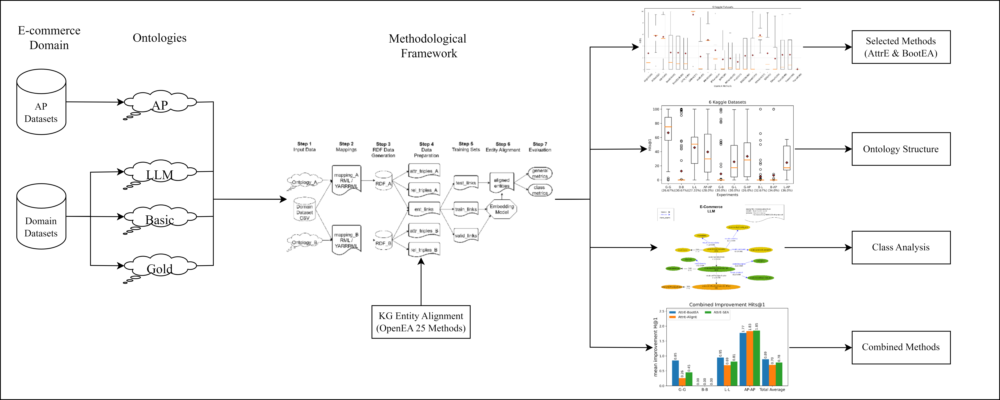
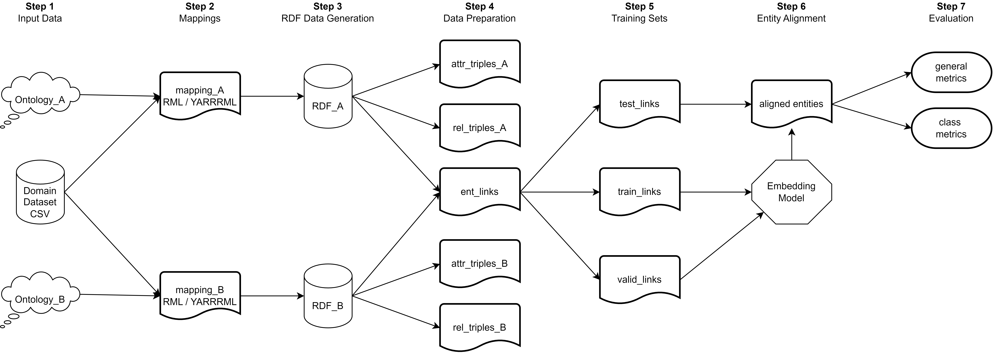

# OntologyTesting

## Overview

## Pipeline OpenEA

## Tables

### Table of alignments

A total of 49 alignment experiments were carried out using 25 different methods. Alignments were carried out whenever the schemas had compatible entities to align.

| Approach       |   AirlinesCustomerSatisfaction |   AmazonRatings |   BigBasketProducts |   BrazilianE-commerce |   E-CommerceData | Customer Satisfaction |
|:---------------|-------------------------------:|----------------:|--------------------:|----------------------:|-----------------:|----------------------:|
| Basic-Basic | X | X | X | X | X | X |
| Basic-Gold | X | X | X | X | X | X |
| Basic-LLM | X | X | X | X | X | X |
| Basic-AP |  | X | X |  |  |  |
| Gold-Gold | X | X | X | X | X | X |
| Gold-LLM | X | X | X | X | X | X |
| Gold-AP |  | X | X | X | X |  |
| LLM-LLM | X | X | X | X | X | X |
| LLM-AP |  | X | X | X | X |  |
| AP-AP |  | X | X | X | X |  |

### Table mean Hits@1 ([0,100]) for each module
|    | Approach       |   AirlinesCustomerSatisfaction |   AmazonRatings |   BigBasketProducts |   BrazilianE-commerce |   E-CommerceData |   CustomerComplaintDatabase |    meanH@1 |
|---:|:---------------|-------------------------------:|----------------:|--------------------:|----------------------:|-----------------:|----------------------------:|-----------:|
|  0 | AlignE(0.0)    |                     15.1167    |         35.397  |             29.568  |              24.1625  |          31.8589 |                  22.8033    |  26.4844   |
|  1 | AliNet(0.57)   |                     68.34      |         59.0583 |             55.52   |              70.28    |          60.0125 |                  40.7633    |  58.9957   |
|  2 | AttrE(0.0)     |                     41.495     |         68.017  |             60.927  |              59.01    |          42.6556 |                  58.8867    |  55.1652   |
|  3 | BootEA(0.0)    |                     16.2817    |         37.884  |             30.609  |              26.3525  |          31.8378 |                  23.24      |  27.7008   |
|  4 | BootEA-R(0.0)  |                     16.115     |         37.049  |             29.894  |              25.7637  |          32.1722 |                  22.7267    |  27.2868   |
|  5 | BootEA-T(1.0)  |                    nan         |        nan      |            nan      |             nan       |         nan      |                 nan         | nan        |
|  6 | Conve(1.0)     |                    nan         |        nan      |            nan      |             nan       |         nan      |                 nan         | nan        |
|  7 | GCN_Align(0.0) |                     12.6167    |         37.839  |             28.626  |              25.1512  |          29.7511 |                  21.9283    |  25.9854   |
|  8 | GMNN(0.69)     |                    nan         |        nan      |             86.41   |             100       |          99.7783 |                 nan         |  95.3961   |
|  9 | HolE(0.0)      |                      9.565     |         31.424  |             21.849  |              19.115   |          25.9356 |                  17.4533    |  20.8903   |
| 10 | IMUSE(0.16)    |                     26.5817    |         56.8243 |             44.3389 |              89.925   |          57.0533 |                  31.1383    |  50.9769   |
| 11 | IPTransE(0.93) |                    nan         |        nan      |            nan      |             nan       |          33.035  |                 nan         |  33.035    |
| 12 | JAPE(0.21)     |                      0.473333  |         26.9567 |             23.4478 |              22.1033  |          16.0225 |                  14.3017    |  17.2175   |
| 13 | KDCoE(1.0)     |                    nan         |        nan      |            nan      |             nan       |         nan      |                 nan         | nan        |
| 14 | MTransE(0.0)   |                      1.955     |         31.3    |             24.849  |              19.7     |          13.96   |                  12.3517    |  17.3526   |
| 15 | MultiKE(1.0)   |                    nan         |        nan      |            nan      |             nan       |         nan      |                 nan         | nan        |
| 16 | ProjE(0.04)    |                      5.36667   |         15.732  |             12.722  |               6.85125 |          24.5429 |                  11.12      |  12.7225   |
| 17 | RDGCN(0.07)    |                      0.005     |          0.009  |             72.8244 |              34.8486  |          19.6678 |                   0.034     |  21.2315   |
| 18 | RotatE(0.16)   |                      0.0166667 |         30.48   |             28.801  |              24.3987  |          31.4356 |                   2.0275    |  19.5266   |
| 19 | RSN4EA(0.7)    |                    nan         |         56.1    |             58.0875 |              63.4267  |          61.2425 |                 nan         |  59.7142   |
| 20 | SEA(0.0)       |                     16.2483    |         35.707  |             29.059  |              24.575   |          32.2056 |                  21.8917    |  26.6144   |
| 21 | SimplE(0.0)    |                      0.0916667 |         27.732  |             22.209  |              20.775   |          23.4344 |                   5.025     |  16.5445   |
| 22 | TransD(0.02)   |                     13.1267    |         33.621  |             26.36   |              19.73    |          29.6863 |                  21.16      |  23.9473   |
| 23 | TransH(0.0)    |                     13.3217    |         33.702  |             26.211  |              21.3675  |          29.2789 |                  21.4       |  24.2135   |
| 24 | TransR(0.0)    |                      0.015     |          0.036  |              0.08   |               0.03875 |           0.39   |                   0.0466667 |   0.101069 |

### Table mean Runtime ([0,1]) for each module
|    | Approach   |   AirlinesCustomerSatisfaction |   AmazonRatings |   BigBasketProducts |   BrazilianE-commerce |   E-CommerceData |   CustomerComplaintDatabase |    meanTime |
|---:|:-----------|-------------------------------:|----------------:|--------------------:|----------------------:|-----------------:|----------------------------:|------------:|
|  0 | AlignE     |                     0.383452   |       0.398477  |          0.140399   |            0.217742   |       0.308854   |                  0.420449   |   0.311562  |
|  1 | AliNet     |                     0.29239    |       0.413501  |          0.128083   |            0.70534    |       0.176202   |                  0.503721   |   0.369873  |
|  2 | AttrE      |                     0.586099   |       0.329858  |          0.175498   |            0.334752   |       0.166925   |                  0.625912   |   0.369841  |
|  3 | BootEA     |                     0.434692   |       0.570226  |          0.148005   |            0.312151   |       0.297753   |                  0.420206   |   0.363839  |
|  4 | BootEA-R   |                     0.68202    |       0.85052   |          0.319472   |            0.575235   |       0.539029   |                  0.747011   |   0.618881  |
|  5 | BootEA-T   |                   nan          |     nan         |        nan          |          nan          |     nan          |                nan          | nan         |
|  6 | Conve      |                   nan          |     nan         |        nan          |          nan          |     nan          |                nan          | nan         |
|  7 | GCN_Align  |                     0.058169   |       0.0232482 |          0.00354892 |            0.00614488 |       0.00766333 |                  0.0205908  |   0.0198942 |
|  8 | GMNN       |                   nan          |     nan         |          1          |            1          |       0.853034   |                nan          |   0.951011  |
|  9 | HolE       |                     0.476202   |       0.6037    |          0.350937   |            0.388389   |       0.505976   |                  0.604757   |   0.488327  |
| 10 | IMUSE      |                     0.168226   |       0.0723632 |          0.017393   |            0.0208482  |       0.0119694  |                  0.09483    |   0.0642716 |
| 11 | IPTransE   |                   nan          |     nan         |        nan          |          nan          |       0.0682923  |                nan          |   0.0682923 |
| 12 | JAPE       |                     0.346894   |       0.0985859 |          0.0333028  |            0.0554822  |       0.0379448  |                  0.250169   |   0.137063  |
| 13 | KDCoE      |                   nan          |     nan         |        nan          |          nan          |     nan          |                nan          | nan         |
| 14 | MTransE    |                     0.0652884  |       0.0196702 |          0.00771234 |            0.0231861  |       0.0155308  |                  0.0644053  |   0.0326322 |
| 15 | MultiKE    |                   nan          |     nan         |        nan          |          nan          |     nan          |                nan          | nan         |
| 16 | ProjE      |                     0.42183    |       0.284093  |          0.13603    |            0.225391   |       0.322763   |                  0.400854   |   0.298493  |
| 17 | RDGCN      |                     0.331012   |       0.109752  |          0.337565   |            0.468765   |       0.510758   |                  0.916327   |   0.445697  |
| 18 | RotatE     |                     0.415271   |       0.317508  |          0.146911   |            0.196299   |       0.257131   |                  0.452141   |   0.297543  |
| 19 | RSN4EA     |                   nan          |       0.804311  |          0.275658   |            0.778985   |       0.88147    |                nan          |   0.685106  |
| 20 | SEA        |                     0.0729613  |       0.031018  |          0.00693881 |            0.0286398  |       0.0295775  |                  0.0288212  |   0.0329928 |
| 21 | SimplE     |                     0.00655595 |       0.0134017 |          0.0136943  |            0.0152445  |       0.0206047  |                  0.00147042 |   0.0118286 |
| 22 | TransD     |                     0.143617   |       0.103602  |          0.0398369  |            0.0595628  |       0.0886751  |                  0.205873   |   0.106861  |
| 23 | TransH     |                     0.11547    |       0.0678725 |          0.0253032  |            0.0604899  |       0.0898547  |                  0.151213   |   0.0850337 |
| 24 | TransR     |                     0.182317   |       0.122178  |          0.066497   |            0.0796253  |       0.126292   |                  0.144497   |   0.120235  |

### Table mean Error ([0,1]) for each module
|   | Approach   |   AirlinesCustomerSatisfaction |   AmazonRatings |   BigBasketProducts |   BrazilianE-commerce |   E-CommerceData |   CustomerComplaintDatabase |   meanError |
|---:|:-----------|-------------------------------:|----------------:|--------------------:|----------------------:|-----------------:|----------------------------:|------------:|
|  0 | AlignE     |                       0        |             0   |                 0   |                 0     |         0        |                    0        |        0    |
|  1 | AliNet     |                       0.833333 |             0.4 |                 0.5 |                 0.625 |         0.555556 |                    0.5      |        0.57 |
|  2 | AttrE      |                       0        |             0   |                 0   |                 0     |         0        |                    0        |        0    |
|  3 | BootEA     |                       0        |             0   |                 0   |                 0     |         0        |                    0        |        0    |
|  4 | BootEA-R   |                       0        |             0   |                 0   |                 0     |         0        |                    0        |        0    |
|  5 | BootEA-T   |                       1        |             1   |                 1   |                 1     |         1        |                    1        |        1    |
|  6 | Conve      |                       1        |             1   |                 1   |                 1     |         1        |                    1        |        1    |
|  7 | GCN_Align  |                       0        |             0   |                 0   |                 0     |         0        |                    0        |        0    |
|  8 | GMNN       |                       1        |             1   |                 0.3 |                 0.5   |         0.333333 |                    1        |        0.69 |
|  9 | HolE       |                       0        |             0   |                 0   |                 0     |         0        |                    0        |        0    |
| 10 | IMUSE      |                       0        |             0.3 |                 0.1 |                 0.25  |         0.333333 |                    0        |        0.16 |
| 11 | IPTransE   |                       1        |             1   |                 1   |                 1     |         0.555556 |                    1        |        0.93 |
| 12 | JAPE       |                       0        |             0.4 |                 0.1 |                 0.625 |         0.111111 |                    0        |        0.21 |
| 13 | KDCoE      |                       1        |             1   |                 1   |                 1     |         1        |                    1        |        1    |
| 14 | MTransE    |                       0        |             0   |                 0   |                 0     |         0        |                    0        |        0    |
| 15 | MultiKE    |                       1        |             1   |                 1   |                 1     |         1        |                    1        |        1    |
| 16 | ProjE      |                       0        |             0   |                 0   |                 0     |         0.222222 |                    0        |        0.04 |
| 17 | RDGCN      |                       0        |             0   |                 0.1 |                 0.125 |         0        |                    0.166667 |        0.07 |
| 18 | RotatE     |                       0.5      |             0.1 |                 0   |                 0     |         0        |                    0.333333 |        0.16 |
| 19 | RSN4EA     |                       1        |             0.4 |                 0.6 |                 0.625 |         0.555556 |                    1        |        0.7  |
| 20 | SEA        |                       0        |             0   |                 0   |                 0     |         0        |                    0        |        0    |
| 21 | SimplE     |                       0        |             0   |                 0   |                 0     |         0        |                    0        |        0    |
| 22 | TransD     |                       0        |             0   |                 0   |                 0     |         0.111111 |                    0        |        0.02 |
| 23 | TransH     |                       0        |             0   |                 0   |                 0     |         0        |                    0        |        0    |
| 24 | TransR     |                       0        |             0   |                 0   |                 0     |         0        |                    0        |        0    |

## Scripts

[Scripts](./Scripts)

## [AirlinesCustomerSatisfaction](./AirlinesCustomerSatisfaction/)

## [AmazonRatings](./AmazonRatings/)

## [BigBasketProducts](./BigBasketProducts/)

## [BrazilianE-commerce](./BrazilianE-Commerce/)

## [CustomerComplaintDatabase](./CustomerComplaintDatabase/)

## [E-Commerce Data](./E-CommerceData/)

## [Materials](./Materials/)
